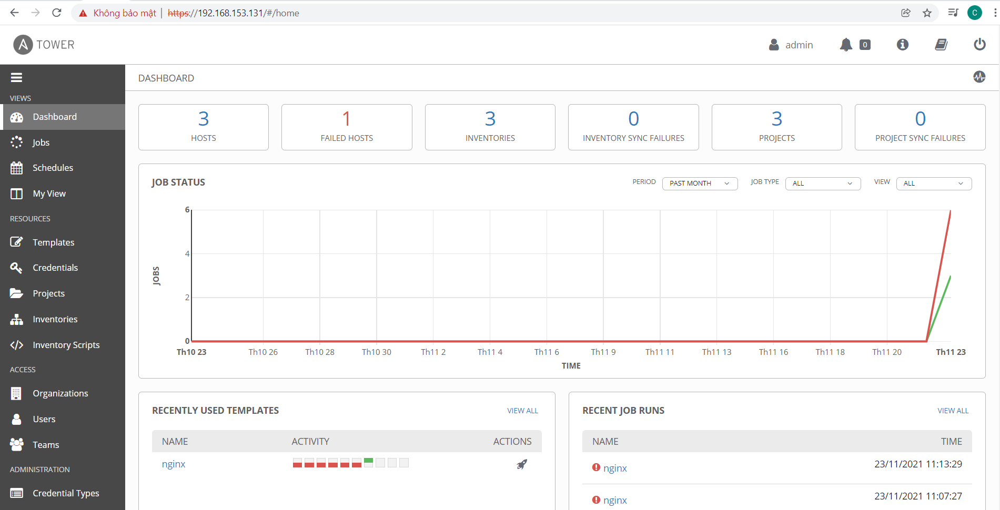

# Hướng dẫn cài đặt ansible tower

- Dowload và giải nen ansible tower

    ` curl -sqL https://releases.ansible.com/ansible-tower/setup-bundle/ansible-tower-setup-bundle-3.8.3-1.tar.gz | tar zxvf - `

- Backup file inventory ở tỏng thư mục vừa giải nén:

    'cp /root/ansible-tower-setup-bundle-3.8.3-1/inventory /root/ansible-tower-setup-bundle-3.8.3-1/inventory-bak'

- Truy cập thư mục ansible tower vừa giải nén và chỉnh sửa lại file inventory theo nội dung sau:

```
[tower]
localhost ansible_connection=local

[automationhub]

[database]

[all:vars]
admin_password='password'

pg_host=''
pg_port=''

pg_database='awx'
pg_username='awx'
pg_password='awx'
pg_sslmode='prefer'  # set to 'verify-full' for client-side enforced SSL

# Automation Hub Configuration
#

automationhub_admin_password='awx'

automationhub_pg_host=''
automationhub_pg_port=''

automationhub_pg_database='automationhub'
automationhub_pg_username='automationhub'
automationhub_pg_password='awx'
automationhub_pg_sslmode='prefer'

```

- Chạy file steup để cài đặt ansbile tower

    ` bash /root/ansible-tower-setup-bundle-3.8.3-1/setup.sh `

- Lưu ý: khi cài đặt ansible cần có internet để hệ thống có thể tự động tải và cài đặt các pakage nhé.

- Sau khi cài xong sẽ truy cập theo đường link: http://IP (admin/password)

Do ansible tower là phiên bản trả phí, chúng ta cần sử có lincense để truy cập. Tôi có tham khảo và hướng dẫn các bạn cách crack license để truy cập ansible tower nhé.

- Copy file license của ansible tower

    ` cp /var/lib/awx/venv/awx/lib/python3.6/site-packages/awx/main/utils/licensing.py{,.bak} `

- Ở phần def validate(self): của file /var/lib/awx/venv/awx/lib/python3.6/site-packages/awx/main/utils/licensing.py chúng ta sẽ xóa hàm đó đi, và bổ sung vào cuối filde nội dung sau:

```

def validate(self):
    # Return license attributes with additional validation info.
    attrs = copy.deepcopy(self._attrs)

    attrs['license_type'] = 'enterprise'
    attrs['instance_count'] = MAX_INSTANCES 
    attrs['license_date'] = '2567433600' 
    attrs['subscription_name'] = 'mxd' 

    type = attrs.get('license_type', 'none')

    #if (type == 'UNLICENSED' or False):
        #attrs.update(dict(valid_key=False, compliant=False))
        #return attrs
    attrs['valid_key'] = True # 直接将 valid_key 设为 true
    if Host:
        current_instances = Host.objects.active_count()
    else:
        current_instances = 0
    available_instances = int(attrs.get('instance_count', None) or 0)
    attrs['current_instances'] = current_instances
    attrs['available_instances'] = available_instances
    free_instances = (available_instances - current_instances)
    attrs['free_instances'] = max(0, free_instances)

    license_date = int(attrs.get('license_date', 0) or 0)
    current_date = int(time.time())
    time_remaining = license_date - current_date
    attrs['time_remaining'] = time_remaining
    if attrs.setdefault('trial', False):
        attrs['grace_period_remaining'] = time_remaining
    else:
        attrs['grace_period_remaining'] = (license_date + 2592000) - current_date
    attrs['compliant'] = bool(time_remaining > 0 and free_instances >= 0)
    attrs['date_warning'] = bool(time_remaining < self.SUBSCRIPTION_TIMEOUT)
    attrs['date_expired'] = bool(time_remaining <= 0)
    return attrs

```

- Sau đó restart lại service ansible tower

    ` ansible-tower-service restart `

- Truy cập lại link http://IP (admin/password) sẽ bỏ qua phần nhập license và hiển thị màn hình dashboard

    <h3 align="center"></h3>


