# Hướng dẫn sử dụng AWX để thực thi Ansible-playbook

### 1. Khởi tạo Inventory

#### Bước 1: Vào mục Inventories, click vào dấu + và chọn inventory :

<h3 align="center">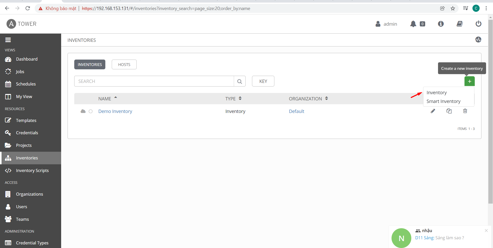</h3>

#### Bước 2: Khai báo tên cho Inventory

Mục Variables bên dưới được hiểu như các biến được khai báo trong file inventory dưới dạng ini hoặc các biến trong file group_vars/all.yml.

<h3 align="center">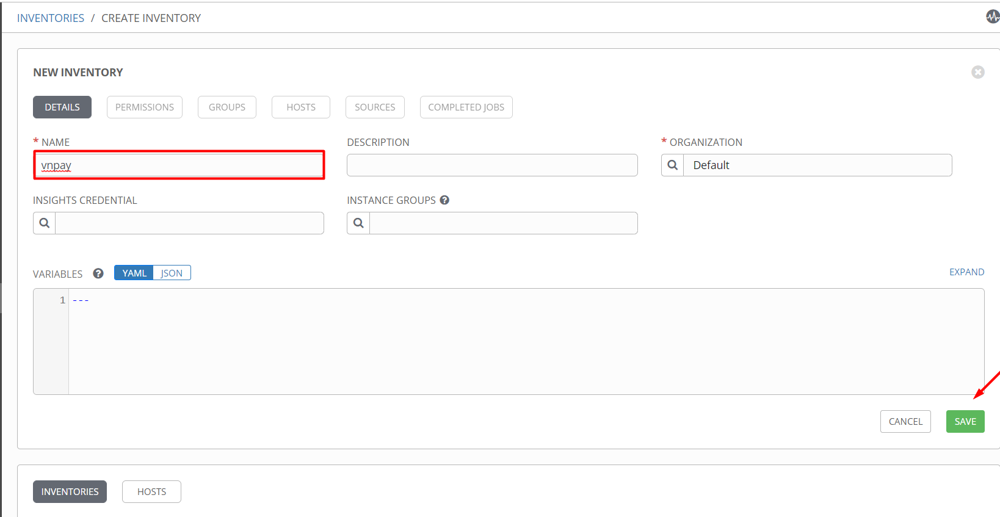</h3>

- Ta có thể kiểm tra lại inventori vừa tạo

<h3 align="center">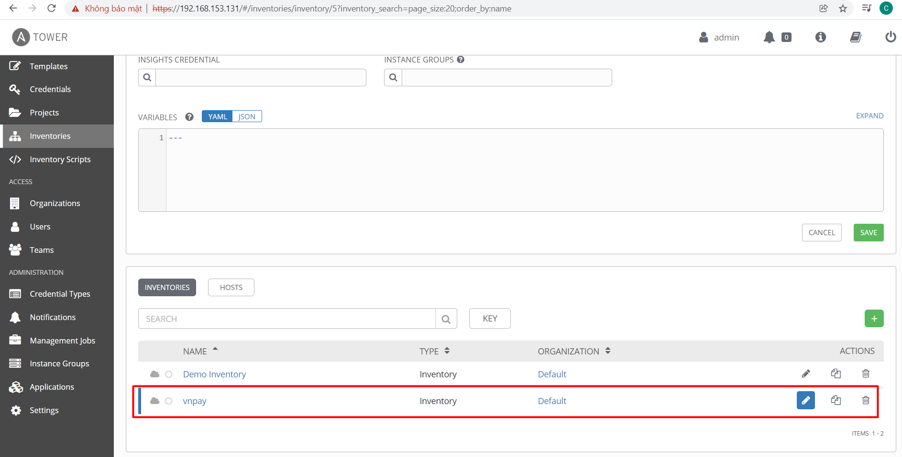</h3>

#### Bước 3: Tạo group mới

<h3 align="center">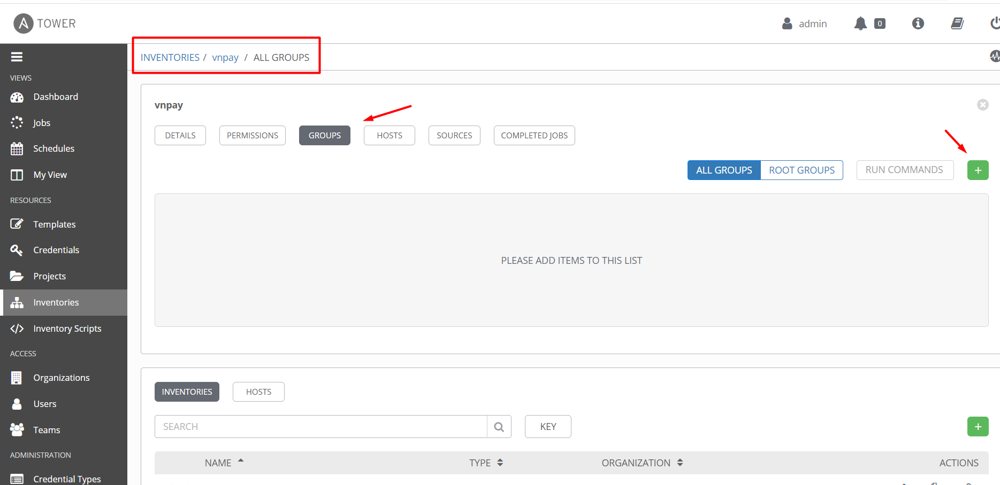</h3>

#### Bước 4: Khai báo tên cho group

Mục Variables phía dưới là nơi chứa các biến được khai báo cho riêng group đó.

<h3 align="center">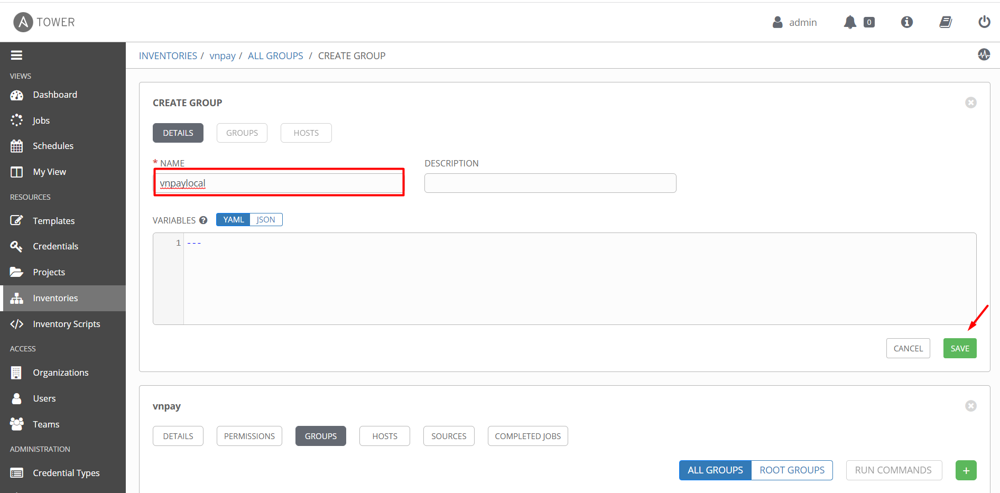</h3>

- Kiểm tra lại group vừa tạo

<h3 align="center">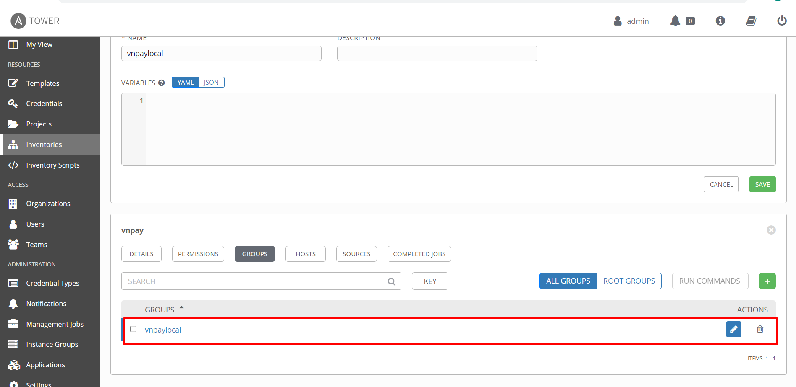</h3>

#### Bước 5: Tạo host

<h3 align="center">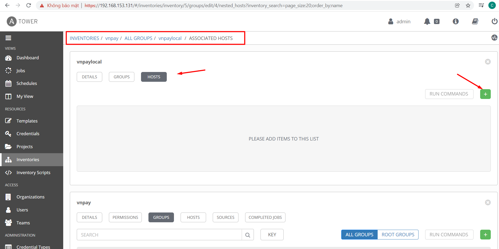</h3>

#### Bước 6: Khai báo Name được hiểu như inventory_hostname

Mục Variables khai báo biến ansible_host với giá trị là IP của host đó, ansible_port với giá trị là port ssh đến host đó.

<h3 align="center">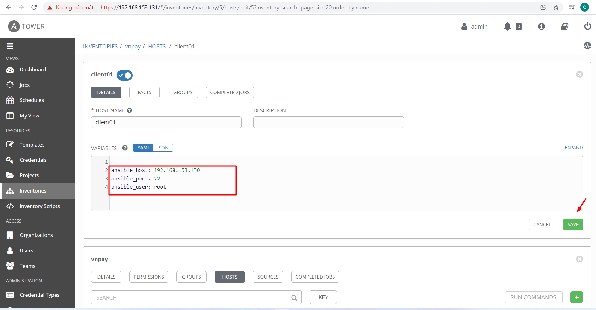</h3>

- Kiểm tra lại host vừa add

<h3 align="center">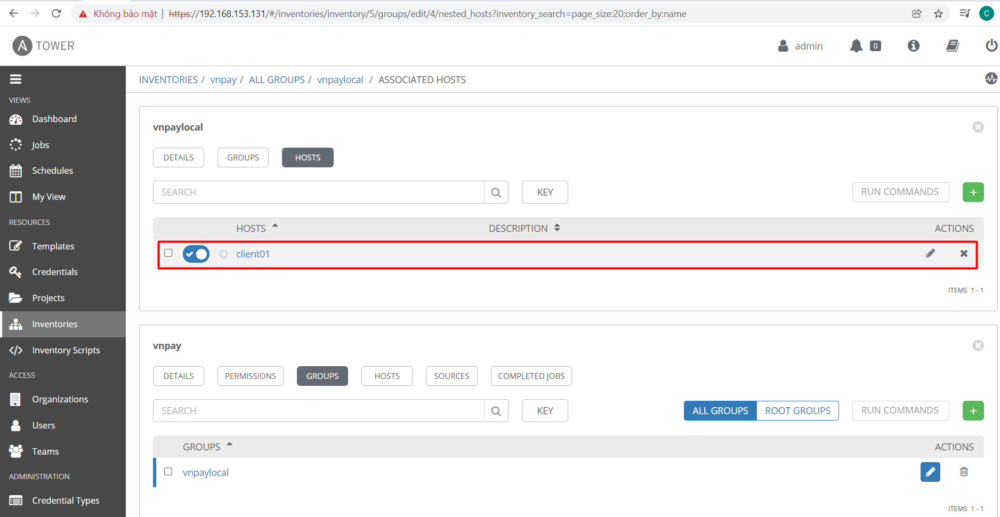</h3>

### 2. Khởi tạo Credentials

Credentials là nơi lưu trữ các thông tin bảo mật của AWX. Ví dụ: private key để ssh đến các host, tài khoản mật khẩu Github,…

#### Bước 1: Tạo Credential mới

<h3 align="center">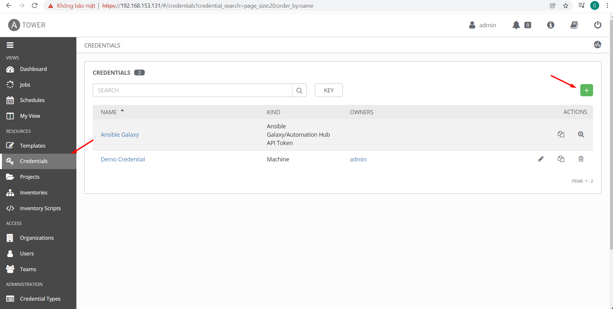</h3>

#### Bước 2: Khai báo tên cho Credential

Chọn Type là Machine ( Credential này sẽ sử dụng để SSH đến các host)

Sao chép Private Key của máy chủ cài đặt AWX tại /root/.ssh/id_rsa ( nếu chưa có hãy dùng lệnh ssh-keygen trên server AWX để tạo key) rồi điền vào mục SSH Private Key và lưu lại.

<h3 align="center">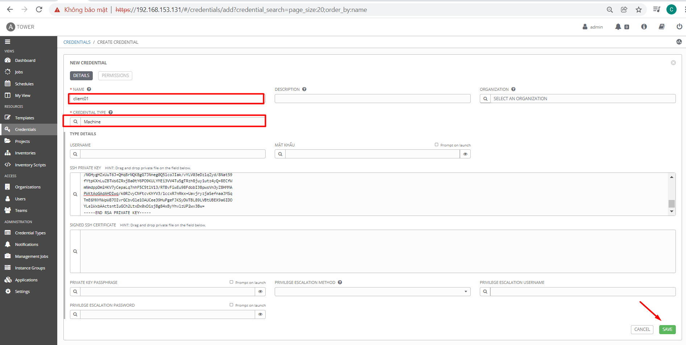</h3>

- Kiểm tra lại credential vừa tạo

<h3 align="center">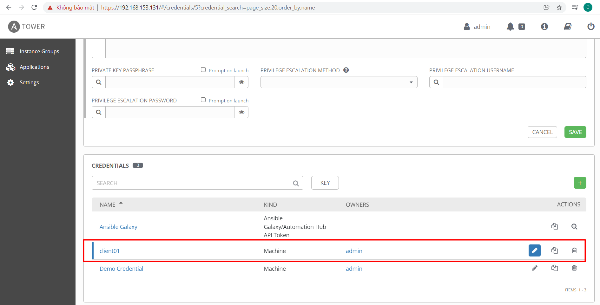</h3>

#### Bước 3: SSH vào server AWX thực hiện copy key sang các host

    ` ssh-copy-id root@192.168.153.130 `

### 3. Kiểm tra kết nối

#### Ta sẽ kiểm tra kết nối đến các host trước khi khởi tạo Playbook.

- Bước 1: Truy cập vào giao diện danh sách các Groups

Rồi chọn Run Command

Khi thao tác với Run Command sẽ giống như việc bạn sử dụng Ansible Ad-hoc Commands

<h3 align="center">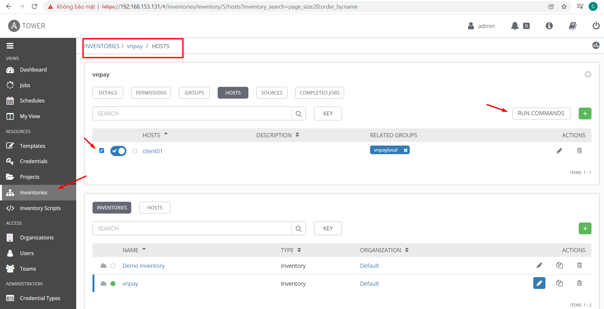</h3>

- Bước 2: Khai báo Module , machine credential sẽ sử dụng

<h3 align="center">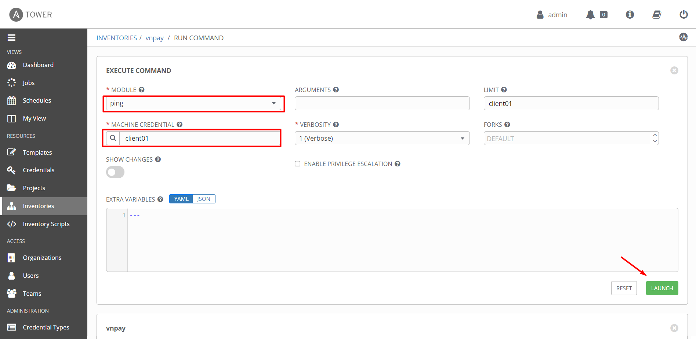</h3>

- Kết quả trả về successfully , chúc mừng bạn đã kết nối từ ansible server đến cliento1

<h3 align="center">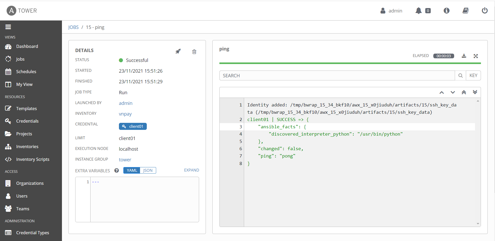</h3>