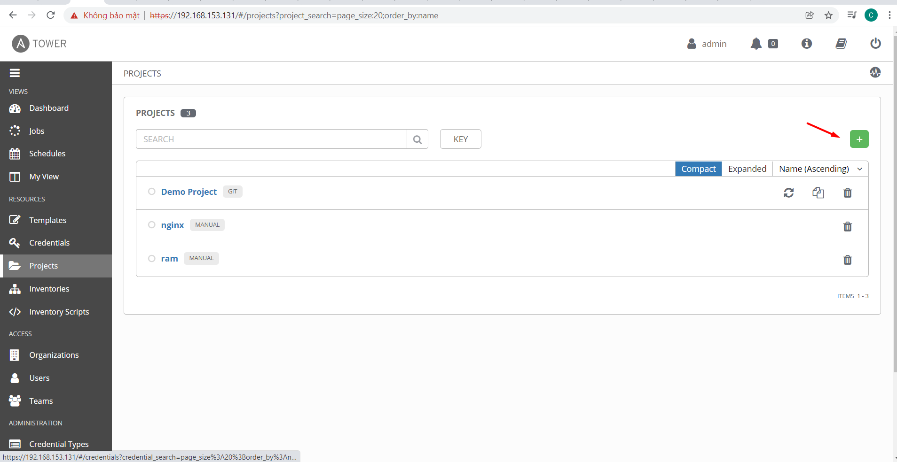
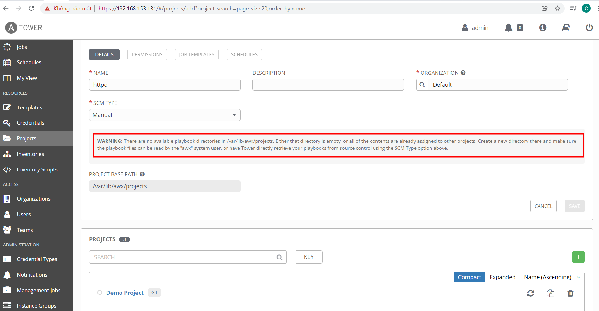
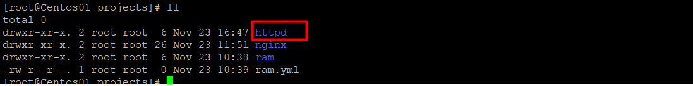
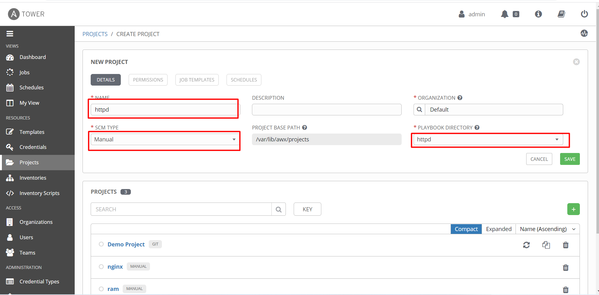
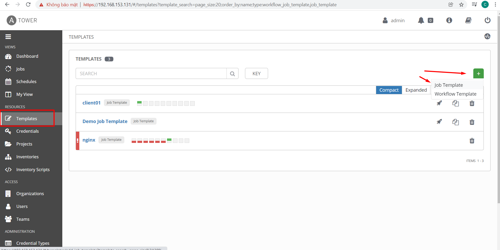
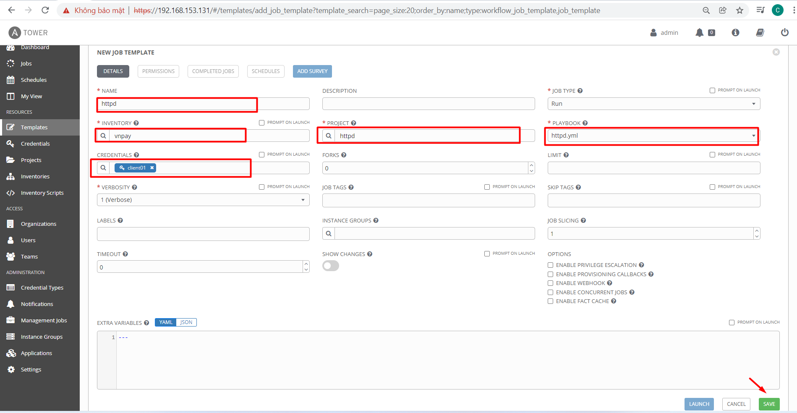
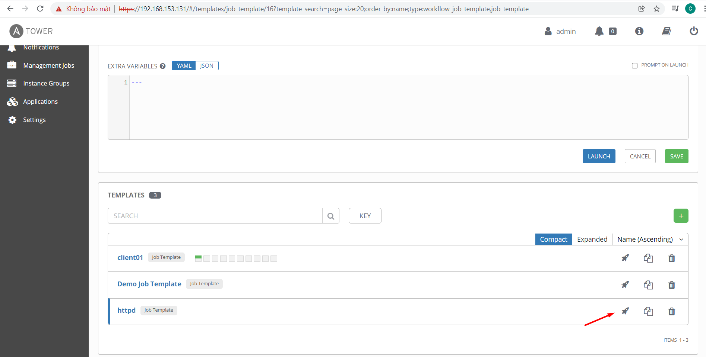
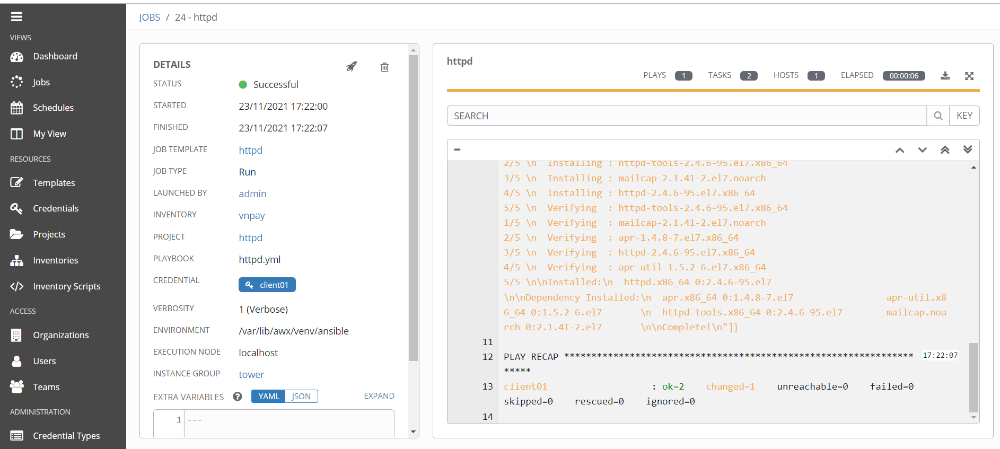

# Hướng dẫn khởi tạo project

Khái niệm Project trong AWX đơn giản là repository lưu trữ các tài nguyên của Ansible-Playbook (Roles, Playbooks).
Một Project có thể lưu một hoặc nhiều các playbook sử dụng cho một mục đích hoặc đối tượng.

- Bước 1: Tạo Project mới.

<h3 align="center"></h3>

- Bước 2: Khai báo tên cho Project

Chọn Source Control Credential Type

Nếu chọn type Manual ta sẽ thực hiện copy thư mục chứa playbook (ở đây là test-playbook1) lab vào thư mục /var/lib/awx/projects phía dưới server AWX.

Nếu chọn type Git, sẽ thực hiện clone repository chứa playbook trên Github về, việc này sẽ tiện lợi hơn vì dễ dàng thay đổi nội dung playbook mà không cần vào server chỉnh sửa.

<h3 align="center"></h3>

Theo như thông báo thì ta cần tạo folder ở trong thư mục /var/lib/awx/projects để chọn nơi lưu trữ project

<h3 align="center"></h3>

Kết quả như sau khi tạo thư mục để lưu trữ project, ở đây ta tạo thư mục httpd

<h3 align="center"></h3>

- Truy cập thư mục httpd vừa tạo ở /var/lib/awx/projects để tạo một file playbook như sau:

    ` vi /var/lib/awx/projects/httpd/httpd.yml  `

```
- hosts: vnpay
  tasks:
  - name: install httpd
    yum:
      name: httpd
      state: latest

```

#### 5. Khởi Tạo Template

- Bước 1: Chọn tạo một Template

Template trong AWX là nơi khai báo bạn sẽ thực thi Playbook như thế nào

<h3 align="center"></h3>

- Bước 2: Khai báo các tham số cho Template

    - ame: Khai báo tên cho Template

    - Inventory: Khai báo Inventory sẽ sử dụng

    - Credentials: Khai báo Credential sẽ sử dụng để xác thực tới các node trong Inventory

    - Project: Chọn Project đã tạo

    - Playbook: Sau khi chọn Project, mục này sẽ hiển thị các file playbook định dạng YAML trong thư mục. Chọn Playbook sẽ sử dụng cho Template này

    - Job Type: Chọn Run để thực thi. (còn 1 option nữa có thể lựa chọn là Check, việc này sẽ giống như chạy lệnh ansible-playbook có option –check, sẽ không làm thay đổi khi thực thi module, mà chỉ dự đoán các module nào khi thực thi sẽ khiến thay đổi cho hệ thống).

    - Variables: nơi khai báo các biến level Extra variables.

<h3 align="center"></h3>

- Bước 3: Save lại và chọn Launch để thực thi

Việc thực thi này sẽ giống như bạn thưc hiện lệnh: ansible-playbook -i <inventory> <playbook-file> -e <extra_vars> , hoặc có thể chọn click vào nút như bên dưới:

<h3 align="center"></h3>

- Đợi kết quả trả về,

<h3 align="center"></h3>

Nếu failed màn hình sẽ hiển thị lỗi, bạn cần kiểm tra thông báo lỗi cũng như file playbook bạn viết ra nhé.


