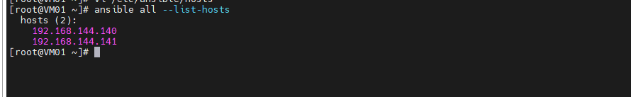

# Hướng dẫn cài đặt ansible

- Mô hình triển khai như sau:

    - centos01: 192.168.144.139 đóng vai trò ansible server

    - centos02: 192.168.144.140 đóng vao trò là clinet

    - centos03: 192.168.144.141 đóng vao trò là clinet

<h3 align="center"></h3>

#### Cài đặt ansible trên node Ansible Server

- Việc cài đặt ansible khác đơn giản, chỉ thông qua lệnh bên dưới là có thể cài xong Ansible.

Lưu ý: Bước này thực hiện trên node AnsibleServer – node 192.168.144.139

- Login với tài khoản root và thực hiện các lệnh dưới (lưu ý lúc nếu bạn có IP Planning khác, nên đặt IP tĩnh theo phân hoạch của bạn trước).

    ```

    yum install -y epel-release 
    yum update -y
    yum install -y ansible

    ```
- Kiểm tra lại phiên bản ansible sau khi cài bằng lệnh anssible --version. Ta có kết quả phiên bản ở dưới.

    ` ansible --version `

    <h3 align="center"></h3>

#### Cấu hình SSH Key và khai báo file inventory

- Ansible hoạt động theo cơ chế agentless, có nghĩa là không cần cài agent vào các máy client để điều khiển, thay vào đó ansible sẽ sử dụng việc điều khiển các client thông qua SSH. Do vậy, tới bước này ta có thể dùng 2 cách để ansible có thể điều khiển được các máy client.

    - Cách 1: Sử dụng usename, port của ssh để khai báo trong inventory. Các này không được khuyến cáo khi dùng trong thực tế vì việc password dạng clear text sẽ hiện thị, hoặc nếu dùng cách này thì cần phải secure cho file inventory này bằng ansible-vault
    
    - Cách 2: Sử dụng ssh keypair. Có nghĩa là ta sẽ tạo ra private key và public key trên node AnisbleServer và copy chúng sang các node client (hay còn gọi là các host).

Trong hướng dẫn này sẽ sử dụng cách 2, còn cách 1 sẽ được hướng dẫn ở các phần sau.

- Tạo SSH key cho các node

    - Đứng tại node AnsibleServer tạo SSH Key, sau đó copy các sang node còn lại. Mục tiêu là sử dụng keypair để không phải nhập password mỗi khi đăng nhập vào các client.

    - Đứng tại user root của node AnsibleServer và thực hiện bước tạo key

    ` ssh-keygen `

    - Thực hiện copy file key sang các node còn lại

    ```

    ssh-copy-id root@192.168.144.140
    ssh-copy-id root@192.168.144.141

    ```

    - Sau đó đứng từ node AnsibleServer, thử ssh sang các node client1 & client2, nếu không bị hỏi mật khẩu thì ta đã sử dụng ssh key thành công.

Lưu ý nhớ dùng lệnh exit sau khi đăng nhập ở từng node. Tiếp tục chuyển sang bước khai báo file inventory để chứa danh sách các host cần thiết.

- Khai báo file inventory

    - Thực hiện việc này trên node AnsibleServer

    - Mặc định thì danh sách các host mà AnsibleServer điều khiển sẽ nằm ở file /etc/ansible/host. File mặc định này sẽ chứa các khai báo mẫu, ta sẽ thực hiện sao lưu lại và khai báo file theo bài LAB này.

    ` mv /etc/ansible/hosts /etc/ansible/hosts-bak `

    - Tạo file mới để khai báo các host

    ` vi /etc/ansible/hosts `

    Nội dung của file sẽ có dạng như sau

    ```
    [centos7]
    192.168.80.122
    192.168.80.123
    ```

- Sau khi thêm các dòng trên, ta lưu file trên lại. Chú ý rằng ta có thể sử dụng cặp thẻ [ ] để khai báo các group. Các group này sẽ do ta quy hoạch sao cho phù hợp với hệ thống, với ứng dụng của chúng ta. Ở đây tôi tạm tạo group là [centos6]

- Thực hiện kiểm tra danh sách host đã đươc khai báo trong file inventory ở trên bằng lệnh ansible all --list-hosts. Trong đó all là một tùy chọn của lệnh trên, mục tiêu là liệt kê tất cả các hosts nằm trong file inventory, bất kể các host đó nằm ở group nào.

` ansible all --list-hosts `

- Kết quả:

<h3 align="center"></h3>

- Nếu chúng ta chỉ muốn kiểm tra các host trong group [centos] ta thực hiện với tùy chọn lệnh như sau ansible centos7 --list-host, kết quả sẽ như bên dưới.

<h3 align="center"></h3>

- Tới bước này chúng ta mới dừng lại việc khai báo danh sách các host. Trong thực tế các ta cần khai báo thêm các tùy chọn về mật khẩu, về port thậm chí cả về user mà AnsibleServer được phép sử dụng để điều khiển các host.

- Một file inventory tương đối hoàn chỉnh sẽ có định đạng như sau. Đây cũng là cú pháp của file inventory từ bản Ansible 2.0 trở lên. Hãy sửa lại file inventory của bạn để có định dạng như bên dưới, sẽ bổ sung thêm các tùy chọn

- Sửa file /etc/ansible/host với nội dung như bên dưới

    ```
    [centos7]
    centos02 ansible_host=192.168.144.140 ansible_port=22 ansible_user=root
    centos03 ansible_host=192.168.144.141 ansible_port=22 ansible_user=root

    ```

    - centos02, centos03: Tương ứng là các hostname của các node
    
    - ansible_host: Địa chỉ IP của node client tương ứng
    
    - ansible_port: Port của SSH phía client, nếu ta thay đổi thì sẽ chỉnh lại cho đúng.
    
    - ansible_user: Là username của client mà AnsibleServer sẽ dùng để tương tác, trong bước trên tôi sử dụng là user root và thông qua SSH Key.

### Sử dụng một số lệnh kiểm tra cơ bản

- Để kiểm tra xem việc khai báo này đã đúng và bắt đầu tiếp các bài lab tiếp theo hay chưa, hãy sử dụng tùy chọn -m trong lệnh dưới, đây là dấu hiệu nhận biết về việc sẽ sử dụng module có tên là ping (-m là viết tắt của module). Trong bài này sẽ giới thiệu thêm một số moudle khác ngoài module ping này.

    ` ansible all -m ping `

    <h3 align="center"></h3>

#### Sử dụng module command

- Cấu trúc của câu lệnh

    ` ansible all -m command -a "ten_cau_lenh_module_command_ho_tro `

- Ví dụ:

    ` ansible centos7 -m command -a "uptime" `

    <h3 align="center"></h3>

    ` ansible centos7 -m command -a "free -m" `

    <h3 align="center"></h3>

    