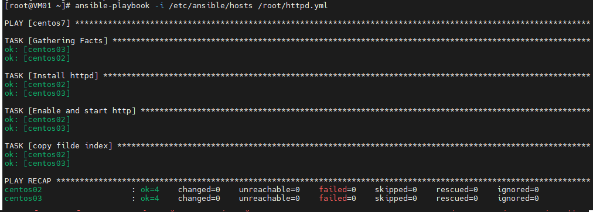

# Ansible playbook

- Ansible rất linh hoạt khi hỗ trợ playbook bằng ngôn ngữ YAML (file .yml)

- Từ đó, khi admin cần setup server/service nào. Chỉ cần gọi file yml này ra, tất cả sẽ được thực thi một cách tự động. Playbook đơn giản có mẫu như sau (check ping và cài đặt trên ubuntu client)

#### Thuật ngữ

Dưới đây là danh sách một số thuật ngữ được Ansible sử dụng:

- Control Node/Management Control : server cài đặt Ansible, chịu trách nhiệm cho việc “đưa các công việc bạn cung cấp đến các server từ xa mà bạn quản lý và chạy chúng” .Nói một cách dễ hiểu hơn thì đây là server mà bạn đứng trên đó và lệnh cho các server khác thực hiện các việc bạn muốn mà không cần trực tiếp đăng nhập vào chúng.

- Inventory : Một file INI chứa các thông tin về các server từ xa mà bạn quản lý.
Playbook : Một file YAML chứa một tập các công việc cần tự động hóa.

- Task : một task sẽ xác định một công việc đơn lẻ sẽ được thực hiện.

- Module : Một Module sẽ trừu tượng hóa một tác vụ hệ thống. Ansible cũng cấp rất nhiều Module tích hợp để ta sử dụng nhưng nếu muốn bạn cũng có thể tự tạo Module. Nói cách khác, ta giao tiếp với Ansible thông qua các Module.

- Role : Một tập hợp các Playbook, các template và các file khác, được tổ chức theo cách được xác định trước để tạo điều kiện tái sử dụng và chia sẻ.

- Play : Một lần thực thi suôn sẻ từ đầu tới cuối được gọi là một play.

- Facts : Các biến toàn cục chứa các thông tin về hệ thống, như các network interface hay operating system.
Handlers : Sử dụng để kích hoạt thay đổi trạng thái các service, như việc ta restart hay reload một service

#### Định dạng của Playbook

- Các Playbook là các file định dạng YAML chứa một loạt các mô tả chỉ thị nhằm mục đích tự động hóa chúng trên server từ xa.

- YAML dựa vào việc thụt đầu dòng để sắp xếp cấu trúc dữ liệu. Bạn cần cẩn thận điều này khi viết Playbook và đặc biệt là khi sao chép nội dung của chúng.

- Dưới đây là một ví dụ về sử dụng ansible để cài đặt http, tạo file index và start dịch vụ từ ansible server

```
- hosts: centos7
  vars:
   - index_html: "index.html"
  tasks:
  - name: Install httpd
    yum:
      name: httpd
      state: latest
  - name: Enable and start http
    service:
      name: httpd
      state: started
      enabled: yes
  - name: copy filde index
    template:
      src: /root/{{ index_html }}
      dest: /var/www/html/index.html
    notify: restart web

  handlers:
  - name: restart web
    service:
      name: httpd
      state: running     
```

- Ta sẽ được kết quả như sau:

<h3 align="center"></h3>

- Ta có thể truy cập các client để kiểm tra lại status của httpd và truy cập IP để kiểm tra nhé.