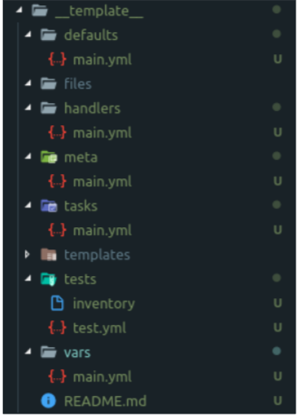

# Tổng quan về role trong ansible

### Role là gì?

- Trong Ansible, Role là một cơ chế để tách 1 playbook ra thành nhiều file. Việc này nhằm đơn giản hoá việc viết các playbook phức tạp và 
có thể tái sử dụng lại nhiều lần 

- Role không phải là playbook. Role là một bộ khung (framework) để chia nhỏ playbook thành nhiều files khác nhau. Mỗi role là một thành phần độc lập, bao gồm nhiều variables, tasks, files, templates, và modules bên dưới.

- Việc tổ chức playbook theo role cũng giúp người dùng dễ chia sẻ và tái sử dụng lại playbook với người khác. Đặc biệt trong môi trường doanh nghiệp khi có từ vài trăm tới vài ngàn playbook thì Role chính là cách quản lý các playbook này.

- Ở cấu trúc thư mục như trên thì các roles phân tách các thông tin gồm các task, vars, …

    - group_vars: chúng ta chứa thông tin các biến toàn cục, mà có thể sử dụng ở toàn bộ cấu hình

    -  roles: Là thư mục chứa thông tin cấu hình phân tách của từng role. Ở đây gồm các roles: apache, common, mariadb, nginx, php và wordpress. Trong mỗi role đó thì gồm các thông tin cấu hình về tasks, var, .. hoặc templates của riêng mỗi role đó.

    -  inventory: là tệp tin chứa thông tin ansible host mà chúng ta sẽ khai báo, thay vì sử dụng tệp tin cấu hình mặc định tại đường dẫn “/etc/ansible/hosts”

    -  playbook.yml: là tệp tin playbook chứa thông tin các play. Nếu không tổ chức playbook theo cấu trúc thư mục thì tất cả thông tin về tasks, templates, vars, … mà chạy của mỗi play sẽ được liệt kê trong một tệp playbook. Với cấu trúc thư mục, chúng ta chỉ cần khai báo thông tin về play mà có các roles sẽ chạy, khi đó nó sẽ có nhiệm vụ gọi đến tasks được khai báo trong các tệp tin cấu hình ở thư mục roles ở trên.

### Ansible-Roles

Các tác vụ liên quan đến nhau có thể được tập hợp lại thành role, sau đó áp dụng cho một nhóm các máy khi cần thiết.

- Role Directory Structure

    Không nhất thiết phải sử dụng tất cả các thư mục ở trên khi tạo một role.

    - Task: Chứa các file yaml định nghĩa các nhiệm vụ chính khi triển khai.

    - Handles: Chứa các handler được sử dụng trong role
    
    - Files: chứa các file dc sử dụng bởi role, ví dụ như các file ảnh.
    
    - Templates: chứa các template file được sử dụng trong role, ví dụ như các file configuration... Các file này có đuôi *.j2, sử dụng jinja2 syntax
    
    - Vars: định nghĩa các variable được sử dụng ở trong roles
    
    - Defaults: Định nghĩa các giá trị default của các variable được sử dụng trong roles. Nếu variable không được định nghiã trong thư mục vars, các giá trị default này sẽ được gọi.
    
    - Meta: thư mục này chứa meta data của roles

- Bạn có thể làm quen với cấu trúc thư mục role bằng cách sử dụng command sau:

    ` ansible-galaxy init __template__ `

    <h3 align="center"></h3>

- Chú ý bên trong thư mục phải tuân thủ việc khai báo tên file , tên folder cho role

    - roles/x/tasks/main.yml

    - roles/x/handlers/main.yml

    - roles/x/vars/main.yml

    - roles/x/defaults/main.yml

    - roles/x/meta/main.yml

- -Using Roles

Bạn có thể sử dụng role theo cách sau .

    ```
    ---
    - hosts: vnpay
      roles:
        - nginx
    ```

- Theo quan điểm cá nhân của mình, khi viết role sẽ dễ quản lí hơn và sẽ dễ dàng tạo các playbook và gọi tới các role dễ dàng hơn, thay vì bạn phải viết một playbook dài cả trăm dòng, và những lần khác khi cần viết playbook cho các tác vụ khác ta có thể gọi các role đã được viết sẵn từ trước. 


