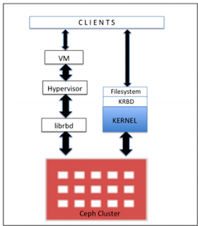
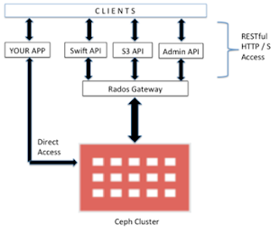

# Tổng Quan Về Ceph

### Giới Thiệu

- Ceph là dự án mã nguồn mở, cung cấp giải pháp lưu trữ dữ liệu. Ceph cung cấp giải pháp lưu trữ phân tán mạnh mẽ, đáp ứng các yêu cầu về khả năng mở rộng, hiệu năng, khả năng chịu lỗi cao. Xuất phát từ mục tiêu ban đầu, Ceph được thiết kết với khả năng mở rộng không giới hạn, hỗ trợ lưu trữ tới mức exabyte, cùng với khả năng tương thích cao với các phần cứng có sẵn. Và từ đó, Ceph trở nên nổi bật trong ngành công nghiệp lưu trữ đang phát triển và mở rộng. Hiện nay, các nền tảng hạ tầng đám mây công cộng, riêng và tương lai dần trở nên phổ biến và to lớn. Bên cạnh đó, phần cứng - thành phần quyết định hạ tầng đám mây đang dần gặp các vấn đề về hiệu năng, khả năng mở rộng. Ceph đã và đang giải quyết được các vấn đề doanh nghiệp đang gặp phải, cung cấp hệ thống, hạ tầng lưu trữ mạnh mẽ, độ tin cậy cao.

- Nguyên tắc cơ bản của Ceph:

    - Khả năng mở rộng tất cả thành phần;
    
    - Khả năng chịu lỗi cao;
    
    - Giải pháp dựa trên phần mềm, hoàn toàn mở, tính thích nghi cao;
    
    - Chạy tương thích với mọi phần cứng;

- Ceph xây dựng kiến trúc mạnh mẽ, khả năng mở rộng không giới hạn, hiệu năng cao, cung cấp giải pháp thống nhất, nền tảng mạnh mẽ cho doanh nghiệp, giảm bớt sự phụ thuộc vào phần cứng đắt tiền. Hệ sinh thái Ceph cung cấp giải pháp lưu trữ dựa trên block, file, object, và cho phép tùy chỉnh theo ý muốn. Nền tảng Ceph xây dựng dựa trên các object, tổ chức trên các block. Tất cả các kiểu dữ liệu, block, file đều được lưu dưới dạng object, quản trị bởi Ceph cluster. Object storage hiện đã trở thành giải pháp cho hệ thống lưu trữ truyền thống, cho phép xây dựng kiến trúc hạ tầng độc lập với phần cứng.

Ceph xây dựng giải pháp dựa trên Object, Các object được tổ chức, nhân bản trên toàn cluster, nâng cao tính bảo đảm dữ liệu. Tại Ceph, Object sẽ không tồn tại đường dẫn vật lý, toàn bộ Object được quản trị dưới dạng Key Object, tạo nền tảng mở với khả năng lưu trữ tới hàng petabyte-exabyte.

<h3 align="center"></h3>

#### Ceph – Giải Pháp Cloud Storage

Thành phần quan trọng để phát triển Cloud chính là hạ tầng lưu trữ hay còn gọi là Storage. Cloud cần storage để phát triển, đáp ứng nhu cấp lưu trữ, tổ chức lượng dữ liệu cực lớn. Hiện nay, các giải pháp lưu trữ truyền thống đã dần tới giới hạn như gặp phải các vấn đề về chí phí, kiến trúc, tính mở rộng v.v. Ceph đã giải quyết được các vấn để đang gặp phải, đáp ứng nhu cầu lưu trữ của Cloud. Ceph hỗ trợ tốt các nền tảng Cloud nổi bật như OpenStack, CloudStack, OpenNebula. Đội ngũ phát triển và cộng tác của Ceph bao gồm các nhà cung cấp nền tảng lớn nhất (Canonical, Red Hat, SUSE), với nhiều năm kinh nghiệp cũng như nắm bắt được xu hướng phát triển, khiến Ceph luôn đi trước, bắt kịp thời đại, tương thích cao với Linux, thành một trong những hệ thống tốt nhất khi đánh giá xây dựng hạ tầng lưu trữ.

#### Ceph – Giải Pháp Software-Defined

Để tiết kiệm chi phí, Ceph xây dựng giải pháp dựa trên phần mềm Software-defined Storage (SDS). Cung cấp giải pháp đáp ứng các khách hàng đã có sẵn hạ tầng lớn, không mong muốn đầu tư thêm nhiều chi phí. SDS hỗ trợ tốt trên nhiều phấn cứng từ bất kỳ nhà cung cấp. Mang đến các lợi thế về giá thành, tính bảo đảm, và khả năng mở rộng.

#### Ceph – Giải Pháp Lưu Trữ Thống Nhất

Ceph mang đến giải pháp lưu trữ thống nhất bao gồm file-based và block-based access truy cập thống nhất qua nền tảng, giải pháp Ceph. Đáp ứng nhu cầu tăng trưởng dữ liệu hiện tại và cả trong tương lai. Ceph xây dựng giải pháp lưu trữ thống nhất (true unified storage solution) bao gồm object, block, file storage và đồng bộ qua nền tảng dựa trên phần mềm , hỗ trợ lưu trữ các luồng dữ liệu lớn, không có cấu trúc. Lợi dụng điểm mạnh của ceph, toàn bộ block hay file storage đều được lưu trữ dưới dạng đối tượng quản trị bởi Ceph Cluster. Ceph quản lý các object dưới kiến trúc riêng của mình. Object trong ceph được quản trị, tổ chức riêng biệt, và hỗ trợ mở rộng không giới hạn bằng cách lược bỏ các metadata, bỏ qua đường dẫn vật lý. Để làm được điều này, ceph sử dụng thuật toán động để tính toán, lưu trữ, tìm kiếm dữ liệu.

<h3 align="center"></h3>

## Ceph block storage

- Block storage là 1 phương thức sử dụng trong storage area network (SAN). Tại đây, data lưu trữ dạng volumes, dạng block, đưa vào các node. Cung cấp khẳ năng lưu trữ lớn, với sự đảm bảo cao, hiệu năng cao. Với các block, volumes sẽ được map tới OS, được kiểm soát bới filesystem layout.

- Ceph giới thiệu giao thức mới RBD - Ceph Block Device. RBD cung cấp sự bảo đảm, tính phân phối, hiệu năng cao trên block storage disk tới client. RBD blocks chia thành nhiều obj, phân tán toàn Ceph cluser, cung cấp tính bảo đảm, hiệu năng cao. RBD hỗ trợ Linux kernel, và được tích hợp với Linux kernel, cung cấp tính năng snapshot tốc độ cao, nhẹ, copy-on-write cloning, and several others. Hỗ trợ in-memory caching, nâng cao hiệu năng.

- Ceph RBD hỗ trợ image size tới 16EB. Image có thể là disk vật lý, máy cảo, … Các công nghệ KVM, Zen hỗ trợ đầy đẩy RBD, tăng tốc máy ảo. Ceph block hỗ trợ đầy đủ nền tảng ảo hóa mới OpenStack, CloudStack,..

<h3 align="center"></h3>

## Ceph filesystem

- Ceph filesystem hay CephFS, là POSIX-compliant filesystem, được sử dụng trong Ceph storage cluster sử dụng để lưu trữ user data. CephFS hỗ trợ tốt Linux kernel driver, kiến CephFS tương thích tốt với các nền tảng Linux OS. CephFS lưu data và medata riêng biệt, cung cấp hiệu năng, tính bảo đảm cho app host nằm trên nó

- Trong Ceph cluster, Ceph fs lib (libcephfs) chạy trên Rados library (librados) – giao thức thuộc Ceph storage - file, block, and object storage. Để sử dụng CephFS, cần ít nhất 1 Ceph metadata server (MDS) để chạy cluster nodes. Tuy nhiên, sẽ không tốt khi chỉ có 1 MDS server nó sẽ ảnh hưởng tính chịu lỗi Ceph. Khi cấu hình MDS, client có thể sử dụng CephFS theo nhiều cách. Để mount Cephfs, client cần sử dụng Linux kernel hoặc ceph-fuse (filesystem in user space) drivers provided by the Ceph community.

- Bên cạnh, Client có thể sử dụng phần mềm thứ 3 như Ganesha for NFS and Samba for SMB/CIFS. Phần mềm cho phép tương tác với "libcephfs", bảo đảm lưu trữ user data phân tán trong Ceph storage cluster. CephFS có thể sử dụng cho Apache Hadoop File System (HDFS). Sử dụng libcephfs component to store data to the Ceph cluster. Để thực hiện, Ceph community cung cấp CephFS Java interface for Hadoop and Hadoop plugins. The libcephfs và librados components rất linh hoạt và ta có thể xây dựng phiên bản tùy chỉnh, tương tác với nó, xây dựng data bên dưới Ceph storage cluster.

<h3 align="center"></h3>

## Ceph object storage

- Phương pháp lưu trữ data dạng object thay vì file, blocks truyền thống. Object-based storage nhận được nhiều sự chú ý trong storage industry.

- Các tổ chức mong muốn giải pháp lưu trữ toàn diện cho lượng data khổng lồ, Ceph là giải pháp nổi bật vì nó là true object-based storage system. Ceph phân phối obj storage system, cung cấp object storage interface thông qua Ceph's object gateway, được biệt là RADOS gateway (radosgw).

- RADOS gateway (radosgw) sử dụng librgw (the RADOS gateway library) và librados, cho phép app thiết lập kết nối với Ceph object storage. Ceph cung cấp giải pháp lưu trữ ổn định, và có thể truy cập thông qua RESTful API.

- The RADOS gateway cung cấp RESTful interface để sử dụng cho application lưu trữ data trên Ceph storage cluster. RADOS gateway interfaces gồm:
    
    - Swift compatibility: This is an object storage functionality for the OpenStack Swift API
    
    - S3 compatibility: This is an object storage functionality for the Amazon S3 API
    
    - Admin API: This is also known as the management API or native API,which can be used directly in the application to gain access to the storage system for management purposes

- Để truy câp Ceph object storage system, ta có thể sử dụng RADOS gateway layer. librados software libraries cho phép user app truy tập trực tiếp đến Ceph = C, C++, Java, Python, and PHP. Ceph object storage has multisite capabilities, nó cung cấp giải pháp khi gặp sự cố. Các object storage configuration có thể thực hiện bởi Rados hoặc federated gateways.

<h3 align="center"></h3>

### Tổng kết

Ceph gần như dẫn dầu trong các công nghệ storage mới. Được thiết kế để vượt qua giới hạn mà storage gặp phải hiện nay. Là giải pháp mở, software-defined storage, tương thích nhiều phân cứng. Cung cấp nhiều giao diện với người dùng, tăng tính linh hoạt. Ceph mạnh mẹ hơn công nghệ Raid hiện tại, vượt qua các giới hạn của RAID. Mỗi thành phần trong Ceph đều bảo đảm và hỗ trợ HA. Điểm mạnh nhất của Ceph là tính thống nhất, cung cấp giải pháp toàn diện block, file, and object storage. Phù hợp lưu trữ cho cả small file và bigfile mà không có bất cứ trục trặc về hiệu suất. Ceph là hệ thống lưu trữ phân tán. Client có thể nhanh trong tiếp cận Ceph. Nó không tuần theo phương pháp truyền thống, ứng dụng kỹ thuật mới, cho phép client tinh toán động. Tăng tốc nâng cao hiệu năng cho client. Hơn thế, dữ liệu được lưu trong Ceph Cluster được tổ chức rõ ràng, tự động. Cả client và admin đều không phải lo lằng về sự cố, Ceph's intelligent system sẽ chịu trách nhiệm xứ lý. Ceph được thiết kế để tự quản trị, tự sửa lỗi. Khi xảy ra sự cố, Ceph vượt qua với sự đảm bảo tốt nhất. Ceph phát hiện và sửa lỗi tất cả sự cố trên disk, node, network, rack, data center row, data center, and even different geographies.

