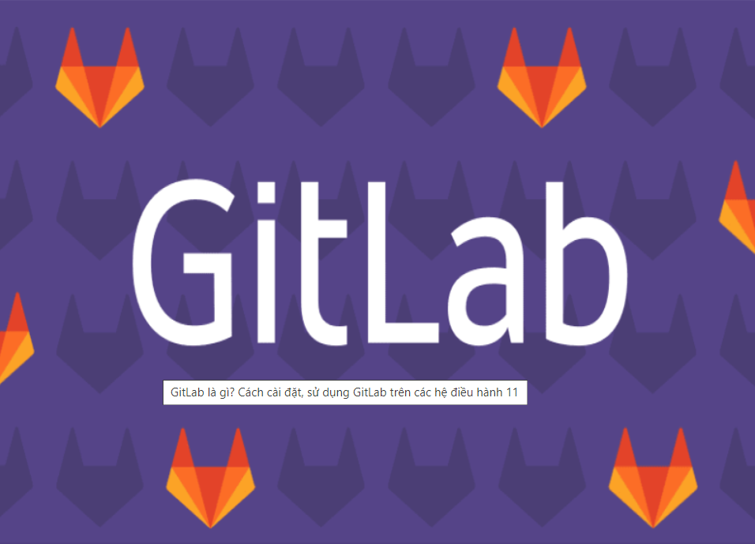
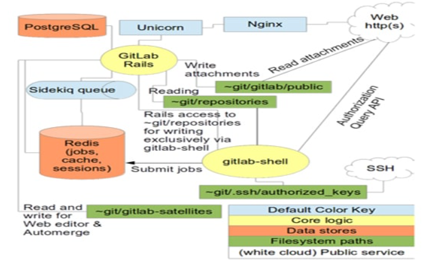

<h3 align="center"></h3>

### 1. GitLab là gì?

Trước khi đến với giải thích GitLab là gì, bạn cần tìm hiểu khái niệm về Git trước. Đây là hệ thống quản lý phiên bản phân tán, được người dùng ưa chuộng. Nhờ việc ứng dụng giúp máy tính lưu trữ được các version khác nhau của mã nguồn.

Dựa trên cơ sở đó, bạn dễ dàng trả lời được câu hỏi GitLab là gì. Thuật ngữ đề cập tới chương trình Self - Hosted mã nguồn mở dựa trên hệ thống máy chủ Git. Mục đích sử dụng là quản lý mã nguồn của bạn.

### 2. Đặc điểm của GitLab

- Phiên bản GitLab

    Các phiên bản của GitLab là gì? Hiện nay, GitLab hỗ trợ 3 phiên bản là:

    - Gitlab community edition (CE) là phiên bản cộng đồng, mã nguồn mở, cung cấp qua Git từ kho lưu trữ chứa GitLab. Bản mới nhất của GitLab được các nhà phát triển release tại các nhánh stable và nhánh master.

    - GitLab enterprise edition (EE) là Gitlab phiên bản doanh nghiệp, có sẵn không lâu sau khi phát hành bản CE, được cung cấp từ kho lưu trữ của gitlab.com. Khi một doanh nghiệp đăng ký GitLab sẽ nhận được sự support của GitLab BV khi gặp khó khăn trong quá trình cài đặt và sử dụng.
    
    - Gitlab continuous integration (CI) là một giải pháp tích hợp được thực hiện bởi nhóm phát triển Gitlab.

- Protected branches

    Cho phép đọc hoặc ghi vào repository và các branches. Protected branches cấp quyền cho những người được phép commit và pushing code. Một protected branch gồm 3 điều cơ bản sau:

    - Ngăn chặn việc push từ tất cả mọi người trừ user và master.

    - Ngăn chặn việc push code lên branch từ những người không có quyền truy cập.
    
    - Ngăn chặn bất kỳ ai thực hiện xóa branch.

    Master branch được mặc định là protected branch. User cần được cấp ít nhất một quyền từ master branch để bảo mật branch.

- Tầng vật lý của GitLab

    - Kho lưu trữ: là nơi xử lý các dự án trong GitLab, các dự án hoặc sản phẩm có thể được lưu tại warehouse.
    
    - Nginx có cách thức hoạt động giống như front-desk, người dùng đến Nginx và yêu cầu hành động được thực hiện bởi worker trong văn phòng.
    
    - Cơ sở dữ liệu là các file của các metal file cabinets chứa các thông tin:
    
        - Sản phẩm trong warehouse (siêu dữ liệu, issuse, các yêu cầu merge …).

        - Người sử dụng đến front-desk (permissions).

        - Redis là phần giao tiếp một broad với cubby holes nơi chứa các nhiệm vụ, yêu cầu cho worker.
    
        - Sidekiq là một worker, công việc chủ yếu là xử lý việc gửi email, nhận nhiệm vụ từ Redis.

        - A Unicorn worker là một nhân viên xử lý các nhiệm vụ nhanh chóng và dễ dàng, làm việc cùng với Redis, bao gồm:
        
        - Kiểm tra quyền truy cập bằng cách kiểm tra các session của người dùng được lưu trữ trong Redis cubby hole.
    
        - Làm nhiệm vụ cho Sidekiq.
    
        - Lấy công cụ từ warehouse hoặc di chuyển mọi thứ xung quanh.
    - GitLab-shell: là loại thứ ba của worker, thực hiện nhiệm vụ tạo các đơn đặt hàng từ một máy fax (SSH) thay vì front-desk (HTTP). GitLab-shell giao tiếp với Sidekiq qua Redis và hỏi những câu hỏi nhanh của Unicorn worker hoặc trực tiếp hoặc qua front-desk.
    
    - GitLab enterprise edition là tập hợp các quy trình và hoạt động kinh doanh được điều hành bởi office.

- System Layout

    Khi nói đến Git trong hình ảnh có thể hiểu thư mục home của người dùng Git là /home/git.

    Repositories bare trong đường dẫn /home/git/repositories. Gitlab là một ứng dụng được viết bằng ngôn ngữ ruby on rails. Do đó, để biết rõ các hoạt động bên trong bạn có thể tìm hiểu về hoạt động của ruby on rails.

    Ứng dụng GitLab-shell được cài đặt tại thư mục: /home/git/gitlab-shell cho phép sử dụng kho dữ liệu qua SSH.

- Components
    
    Dưới đây là sơ đồ kiến trúc Components được đơn giản hóa để có thể hiểu kiến trúc của GitLab.

    <h3 align="center"></h3>

### 3. Tại sao nên dùng GitLab?

<h3 align="center"></h3>

Những lý do khiến bạn cần sử dụng GitLab là gì?

    - Mang lại sự tiện lợi cho các lập trình viên khi cần lưu trữ, tải lên, tải xuống code.
    
    - Kiểm soát các thay đổi trong code nhanh chóng, chính xác.
    
    - Hỗ trợ việc quản lý, phân phối công việc trong các dự án lập trình hiệu quả hơn.

