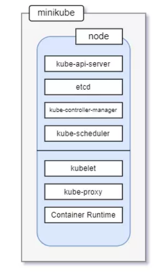

# Tổng quan về Kubernetes

### I. Kubernetes là cái gì

### 1.1. Khái niệm cơ bản

Kubernetes là một nền tảng mã nguồn mở, có thể mở rộng để quản lý các ứng dụng được đóng gói trên container, giúp thuận lợi trong việc cấu hình và tự động hoá việc triển khai ứng dụng mà không cần phải triển khai thủ công các ứng dụng trên mỗi máy chủ.

Hoặc Kubernetes cho phép chạy các ứng dụng phần mềm của mình trên hàng nghìn nút máy tính như thể tất cả các nút đó là một máy tính khổng lồ. Nó loại bỏ cơ sở hạ tầng cơ bản và bằng cách đó, đơn giản hóa việc phát triển, triển khai và quản lý cho cả nhóm phát triển và hoạt động. Việc triển khai các ứng dụng thông qua Kubernetes luôn đơn giản, cho dù cluster của bạn chỉ chứa một vài hoặc hàng nghìn nút trong số đó, kích thước của Cluster ảnh hưởng gì cả.

Kubernetes là một hệ sinh thái lớn và phát triển nhanh chóng. Các dịch vụ, sự hỗ trợ và công cụ có sẵn rộng rãi.

### 1.2. Lợi ích

- Kubernetes đơn giản hóa rất nhiều vấn đề phức tạp trong công tác quản lý container. Và nó thực sự đem lại rất nhiều lợi ích to lớn đối với các quản trị viên như:

    - Đơn giản hóa khai thác ứng dụng: Vì Kubernetes hiển thị tất cả các nút worker của mình như một nền tảng triển khai duy nhất, các nhà phát triển ứng dụng có thể bắt đầutriển khai các ứng dụng của riêng họ và không cần quan tâm nhiều về các thông số phần cứng phức tạp trên các máy chủ tạo nên cluster.

    - Tối ưu hóa phần cứng: Kubernetes sẽ tự động chọn nút thích hợp nhất để chạy ứng dụng của bạn dựa trên mô tả về các yêu cầu tài nguyên của ứng dụng với các tài nguyên cósẵn trên mỗi nút. Nếu triển khai thủ công bạn sẽ chủ động triển khai ứng dụng trên một máy cố định nào đó, điều này không tối ưu hóa được phần cứng trong suốt quá trìnhphát triển ứng dụng. Nhưng Kubernetes sẽ tự động phân tích mức độ yêu cầu tài nguyên của mỗi giai đoạn và cho ứng dụng chạy trên máy có lượng tài nguyên đáp ứng, vì vậy ởcác thời điểm phát triển khác nhau ứng dụng có thể chạy trên các nút khác nhau.

    - Kiểm tra hóa và khắc phục lỗi: Kubernetes giám sát các thành phần ứng dụng và các nút chạy ứng dụng trên đó và tự động xử lý cho phép ứng dụng chạy trên một nút khác nếunút đó bị lỗi. Trong thực tế để di chuyển một ứng dụng từ máy này sang máy khác là rất vất vả và mất rất nhiều thời gian. Nhưng Kubernetes thực hiện điều này một cách tựđộng và cực kỳ nhanh chóng. Thời gian downtime của ứng dụng gần như bằng 0.
    
    - Tự động hóa mở rộng: Kubernetes giám sát lưu lượng truy cập vào ứng dụng. Và có thể điều chỉnh số lượng phiên bản đang chạy của mỗi ứng dụng. Kubernetes có thể tự độngđiều chỉnh kích thước toàn bộ cluster lên hoặc xuống dựa trên nhu cầu của các ứng dụng đã triển khai. Đây là một điểm mạnh về khả năng mở rộng của Kubernetes so với Dockerswarm.
    
    - Đơn giản hóa phát triển ứng dụng: Kubernetes hỗ trợ phát hiện lỗi của ứng dụng. Điều này đồng nghĩa với việc giảm rủi ro khi đưa ra ứng dụng và giảm thời khắc phục lỗigiúp việc phát triển ứng dụng giảm bớt công việc áp lực của nhà phát triển ứng dụng, tăng độ tin tưởng của người dùng với ứng dụng và nhà phát triển. Thông thường, ứng dụngchỉ tra cứu một số biến môi trường nhất định hoặc thực hiện tra cứu DNS nhưng Kubernetes hỗ trợ ứng dụng có thể truy vấn trực tiếp máy chủ Kubernetes API để lấy một sốthông tin khác.

### II. Kiến trúc Kubernetes

- Kiến trúc cluster cơ bản

<h3 align="center"></h3>

Kubernetes gom nhiều node lại thành một cluster, tối thiểu sẽ có một node cùng một control plane. Hoặc có thể hiểu là worker node và master node.
Control plane có: APIserver, control manager, etcd, scheduler, cloud control manager (tùy chọn).
Node có: kubelet, kube proxy, container runtime.

Control plane chịu trách nhiệm đưa ra hầu hết các quyết định và hoạt động như một bộ não của một cluster. Node chịu trách nhiệm về việc thực thi, chạy các ứng dụng. Chúng được quản lý bởi Control plane.

Một cluster có thể bao gồm nhiều worker node và một control plane. Một worker node có thể bao gồm nhiều service. Một service có thể bao gồm nhiều pod. Một pod có thể bao gồm nhiều container runtime. Và một control plane có thể bao gồm nhiều master node.

Ngoài ra, các Cloud provider phổ biến như AWS, Azure, Digital Ocean, Google Cloud,...

- Kiến trúc cluster đặc biệt minikube

<h3 align="center"></h3>

Kiến trúc của minikube khá đặc biệt khi toàn bộ control plane và node đều nằm trên cùng một node. Lúc này node vừa đóng vai trò làm worker node vừa đóng vai trò làm master node. Minikube chỉ chạy trên môi trường local.

Trong series này mình sẽ dùng minikube để làm có zú vị trong các phần sau.

### 2.2. Các thành phần trong cluster cơ bản

- Các thành phần Master node

    - kube apiserver: kuber apiserver hoạt động như một trung tâm giao tiếp. Giao tiếp với các node bên ngoài thông qua CLI hoặc giao diện người dùng UI. Đồng thời các thành phần trong control plane giao tiếp với nhau cũng sẽ đều thông qua apiserver.

    - etcd: etcd là một kho lưu trữ key-value phân tán hoạt động như một nguồn đáng tin cậy duy nhất về cluster. Nó lưu trữ dữ liệu về cấu hình và các thông tin về trạng thái cluster. Thông tin trong etcd thường được định dạng bằng YAML mà con người có thể đọc được.
    
    - kube controller manager: kube controller manager chịu trách nhiệm kiểm soát trạng thái của cluster như: thông báo và phản hồi khi các nút gặp sự cố, tạo tài khoản và API kết nối, giám sát các đối tượng,...
    
    - kube scheduler: kube scheduler giám sát tài nguyên của cluster và quyết định sẽ tạo pod trên worker node nào khi bắt đầu khởi tạo dựa trên các yêu cầu được đưa ra. Để đảm bảo không có node nào bị quá tải.
    
    - cloud controller manager: cloud controller manage cho phép kết nối cluster với API của nhà cung cấp dịch vụ đám mây như GKE/EKS. Bằng cách này có thể thực hiện các thao tác quản lý trên môi trường cloud.

- Các thành phần Worker node

    - kuberlet: kuberlet hoạt động trên worker node thực hiện giao tiếp với control plane qua apiserver để nhận các chỉ thị. Nó cũng tương tác thêm với etcd để cập nhật trạng thái. Ngoài ra kuberlet cũng tương tác với các pod trong cùng worker node.
    
    - kube proxy: kube proxy xử lý các yêu cầu về mạng như định tuyến, forwarding, load balancer
    
    - container runtime: là các container dùng để chạy các ứng dụng. Container này có thể là containerd (Docker cung cấp), rkt (CoreOS cung cấp), cri-o

Trong cluster cơ bản bao gồm các thành phần tiêu chuẩn. Với mỗi kiến trức sẽ có nhưng thành phần bắt buộc và thành phần tùy chọn khác nhau.