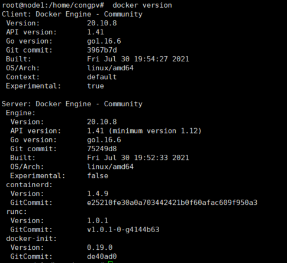
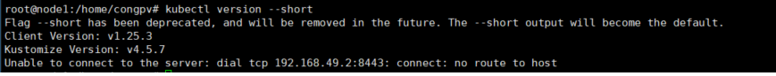

# Hướng dẫn cài đặt minikube

### I. Tổng quan:

Minikube là một công cụ cho phép bạn xây dụng một Kubernetes cục bộ. Minikube sẽ chạy một cụm Kubernetes bao gồm một node trên server hoặc máy tính cá nhân.

Minikube là một công cụ hoàn hảo để người dùng có thể học, làm quen và phát triển trên môi trường Kubernetes.

Trong hướng dẫn này, Long Vân sẽ cài đặt minikuber trên hệ điều hành Ubuntu 22.04

### II. Hướng dẫn cài đặt

- Bước 1: Thiết lập hostname:

    Sử dụng lệnh sau đây để đặt hostname cho server
    
    ` hostnamectl set-hostname node1.vnpay `

    Hostname nên được thiết lập đầy đủ bao gồm cả hostname và domain name, như trong hướng dẫn này là mini.demo.io

    Cấu hình hostname trong file /etc/hosts
    
        ```

        192.168.88.175 node1.vnpay

        ```

- Bước 2: Cài đặt docker

    - Thực hiện lệnh cài đặt:

    ` sudo apt install -y docker.io `

    - Kiểm tra phiên bản docker bằng lệnh
    
    ` docker version `

    <h3 align="center"></h3>

- Bước 3: Cài đặt kubeclt

    - Download về phiên bản kubeclt mới nhất với lệnh
    
    ` curl -LO "https://dl.k8s.io/release/$(curl -L -s https://dl.k8s.io/release/stable.txt)/bin/linux/amd64/kubectl" `

    - Cài đặt kubeclt với lệnh sau:
    
    ` sudo install -o root -g root -m 0755 kubectl /usr/local/bin/kubectl `

    - Kiểm tra cài đặt bằng lệnh:
    
    ` kubectl version --short `

    <h3 align="center"></h3>

- Bước 4: Cài đặt Conntrack với lệnh sau

    ` sudo apt-get install -y conntrack `

- Bước 5: Cài đặt minikube

    - Download file cài đặt và cấp quyền thực thi bằng lệnh
    
    ```
    curl -Lo minikube https://storage.googleapis.com/minikube/releases/latest/minikube-linux-amd64
    
    chmod +x minikube
    
    ```
    - Tiến hành cài đặt minikube
    
    ```
    mkdir -p /usr/local/bin/
    
    sudo install minikube /usr/local/bin/

    ```

    - Chạy minikube trên server với lệnh
    
    ` minikube start --network-plugin=cni --vm-driver=docker  --force `

    <h3 align="center"></h3>

- Kiểm tra cài đặt bằng lệnh
    
    ` minikube status `

    <h3 align="center"></h3>

    hoặc

    ` kubectl get pods -A `

    <h3 align="center"></h3>

- Kiểm tra :

    - Kiểm tra trạng thái minikube
    
    ` minikube status `

    - Kiểm tra thông tin kubenertes cluster
    
    ` kubectl cluster-info `

    - Kiểm tra các node trong cluster

    ` kubectl get nodes -A `

    - Để kiểm tra log quá trình cài đặt:
    
    ` minikube logs `