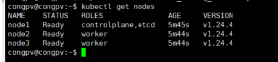
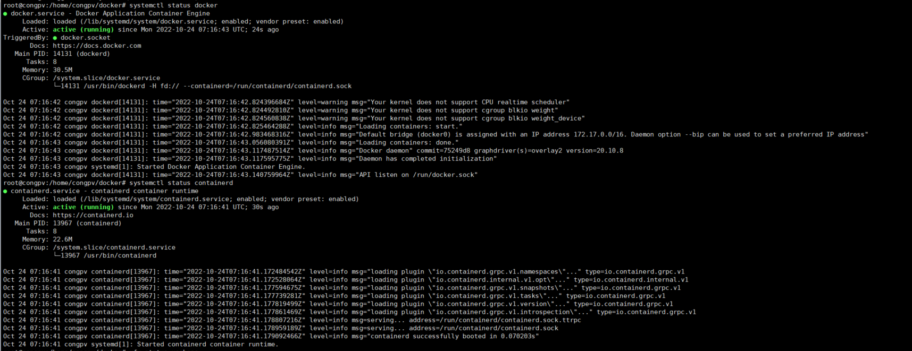
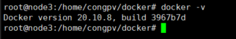

# Tự động cài đặt Kubernetes cluster với RKE

RKE viết tắt của cụm danh từ Rancher Kubernetes Engine. Bài viết này sẽ thực hiện setup Kubernetes cluster với RKE CLI - tự động hóa và đơn giản hóa việc setup Kubernetes cluster.

Việc cài đặt sẽ được thực hiện trên 3 máy chủ có IP lần lượt là:

    ```
    192.168.88.176	node1       role: master, etcd
    
    192.168.88.178	node2       role: worker
    
    192.168.88.181	node3       role: woker

    192.168.88.175  rke         cài đặt rke

    ```

    <h3 align="center"></h3>

### Tắt swap trên các node

```
sudo swapoff -a \
    && sudo cp -f /etc/fstab /etc/fstab.bak \
    && sudo sed -e '/swap/ s/^#*/#/' -i /etc/fstab

```

### Tiến hành tạo user userdeploy

    adduser congpv

    usermod -aG docker congpv

### Cài đặt Docker trên các node

Thực hiện giải nén file docker_Ubuntu_20_04.zip

    ```

    cd docker
    
    dpkg -i *.deb
    
    systemctl status docker
    
    systemctl status containerd

    <h3 align="center"></h3>

    docker -v

    <h3 align="center"></h3>

    ```

### Chuẩn bị file cấu hình RKE Cluster

- Chúng ta sẽ thực hiện cài đặt rke tại server rke . Từ server có thể truy cập tới các bản release của RKE để có thể download binary tại link https://github.com/rancher/rke/releases

- Copy binary vừa download được và chỉnh sửa tên của nó thành rke

    ```

    mv rke_linux-amd64 rke && chmod +x rke

    mv rke /usr/local/bin/

    rke version

    <h3 align="center"></h3>

    ```

- Sử dụng RKE CLI với lệnh sau để bắt đầu tạo file cấu hình cho RKE Cluster. RKE CLI sẽ tạo ra một file có cluster.yml với các options để cấu hình K8s node: Cấu hình đăng nhập qua SSH, k8s network plugin gì, vai trò của các node là gì...

- RKE sẽ dùng file này để SSH vào các node rồi tự động setup Kubernetes cluster cho chúng ta. Bạn không cần phải lên server cài kubectl, kubeadm... nữa.


- Lệnh tạo file cluster

    ` rke config --name mycluster.yml `

- Sau đó bạn trả lời các câu hỏi để hoàn tất việc cấu hình. Dưới đâu là mẫu mà mình dùng cho bài viết này.    

    ```

    [+] Cluster Level SSH Private Key Path [~/.ssh/id_rsa]: 
    [+] Number of Hosts [1]: 3
    [+] SSH Address of host (1) [none]: 192.168.88.176
    [+] SSH Port of host (1) [22]: 22
    [+] SSH Private Key Path of host (192.168.88.176) [none]: 
    [-] You have entered empty SSH key path, trying fetch from SSH key parameter
    [+] SSH Private Key of host (192.168.88.176) [none]: 
    [-] You have entered empty SSH key, defaulting to cluster level SSH key: ~/.ssh/id_rsa
    [+] SSH User of host (192.168.88.176) [ubuntu]: congpv
    [+] Is host (192.168.88.176) a Control Plane host (y/n)? [y]: y
    [+] Is host (192.168.88.176) a Worker host (y/n)? [n]: n
    [+] Is host (192.168.88.176) an etcd host (y/n)? [n]: y
    [+] Override Hostname of host (192.168.88.176) [none]: node1
    [+] Internal IP of host (192.168.88.176) [none]:   
    [+] Docker socket path on host (192.168.88.176) [/var/run/docker.sock]: 
    [+] SSH Address of host (2) [none]: 192.168.88.178
    [+] SSH Port of host (2) [22]: 22
    [+] SSH Private Key Path of host (192.168.88.178) [none]: 
    [-] You have entered empty SSH key path, trying fetch from SSH key parameter
    [+] SSH Private Key of host (192.168.88.178) [none]: 
    [-] You have entered empty SSH key, defaulting to cluster level SSH key: ~/.ssh/id_rsa
    [+] SSH User of host (192.168.88.178) [ubuntu]: congpv
    [+] Is host (192.168.88.178) a Control Plane host (y/n)? [y]: n
    [+] Is host (192.168.88.178) a Worker host (y/n)? [n]: y
    [+] Is host (192.168.88.178) an etcd host (y/n)? [n]: n
    [+] Override Hostname of host (192.168.88.178) [none]: node2
    [+] Internal IP of host (192.168.88.178) [none]: 
    [+] Docker socket path on host (192.168.88.178) [/var/run/docker.sock]: 
    [+] SSH Address of host (3) [none]: 192.168.88.181
    [+] SSH Port of host (3) [22]: 22
    [+] SSH Private Key Path of host (192.168.88.181) [none]: 
    [-] You have entered empty SSH key path, trying fetch from SSH key parameter
    [+] SSH Private Key of host (192.168.88.181) [none]: 
    [-] You have entered empty SSH key, defaulting to cluster level SSH key: ~/.ssh/id_rsa
    [+] SSH User of host (192.168.88.181) [ubuntu]: congpv
    [+] Is host (192.168.88.181) a Control Plane host (y/n)? [y]: n
    [+] Is host (192.168.88.181) a Worker host (y/n)? [n]: y
    [+] Is host (192.168.88.181) an etcd host (y/n)? [n]: n
    [+] Override Hostname of host (192.168.88.181) [none]: 
    [+] Internal IP of host (192.168.88.181) [none]: 
    [+] Docker socket path on host (192.168.88.181) [/var/run/docker.sock]: 
    [+] Network Plugin Type (flannel, calico, weave, canal, aci) [canal]: calico
    [+] Authentication Strategy [x509]: 
    [+] Authorization Mode (rbac, none) [rbac]: 
    [+] Kubernetes Docker image [rancher/hyperkube:v1.24.4-rancher1]: 
    [+] Cluster domain [cluster.local]: 
    [+] Service Cluster IP Range [10.43.0.0/16]: 
    [+] Enable PodSecurityPolicy [n]: 
    [+] Cluster Network CIDR [10.42.0.0/16]: 
    [+] Cluster DNS Service IP [10.43.0.10]: 
    [+] Add addon manifest URLs or YAML files [no]: 

    ```

- Sau khi có file mycluster.yml ở phần trên, chúng ta sẽ tiếp tục dùng RKE CLI để quá trình cài đặt chính thức bắt đầu.

    ` rke up --config mycluster.yml `

    ```
    INFO[0000] Running RKE version: v1.3.15                 
    INFO[0000] Initiating Kubernetes cluster                
    INFO[0000] [certificates] GenerateServingCertificate is disabled, checking if there are unused kubelet certificates 
    INFO[0000] [certificates] Generating admin certificates and kubeconfig 
    INFO[0000] Successfully Deployed state file at [./cluster.rkestate] 
    INFO[0000] Building Kubernetes cluster                  
    INFO[0000] [dialer] Setup tunnel for host [192.168.88.181] 
    INFO[0000] [dialer] Setup tunnel for host [192.168.88.176] 
    INFO[0000] [dialer] Setup tunnel for host [192.168.88.178] 
    INFO[0000] [network] Deploying port listener containers 
    INFO[0000] Image [rancher/rke-tools:v0.1.87] exists on host [192.168.88.176] 
    INFO[0000] Starting container [rke-etcd-port-listener] on host [192.168.88.176], try #1 
    INFO[0001] [network] Successfully started [rke-etcd-port-listener] container on host [192.168.88.176] 
    INFO[0001] Image [rancher/rke-tools:v0.1.87] exists on host [192.168.88.176] 
    INFO[0001] Starting container [rke-cp-port-listener] on host [192.168.88.176], try #1 
    INFO[0001] [network] Successfully started [rke-cp-port-listener] container on host [192.168.88.176] 
    INFO[0001] Image [rancher/rke-tools:v0.1.87] exists on host [192.168.88.181] 
    INFO[0001] Image [rancher/rke-tools:v0.1.87] exists on host [192.168.88.178] 
    INFO[0001] Starting container [rke-worker-port-listener] on host [192.168.88.181], try #1 
    INFO[0001] Starting container [rke-worker-port-listener] on host [192.168.88.178], try #1 
    INFO[0002] [network] Successfully started [rke-worker-port-listener] container on host [192.168.88.181] 
    INFO[0002] [network] Successfully started [rke-worker-port-listener] container on host [192.168.88.178] 
    INFO[0002] [network] Port listener containers deployed successfully 
    INFO[0002] [network] Running control plane -> etcd port checks 
    INFO[0002] [network] Checking if host [192.168.88.176] can connect to host(s) [192.168.88.176] on port(s) [2379], try #1 
    INFO[0002] Image [rancher/rke-tools:v0.1.87] exists on host [192.168.88.176] 
    INFO[0002] Starting container [rke-port-checker] on host [192.168.88.176], try #1 
    INFO[0002] [network] Successfully started [rke-port-checker] container on host [192.168.88.176] 
    INFO[0002] Removing container [rke-port-checker] on host [192.168.88.176], try #1 
    INFO[0002] [network] Running control plane -> worker port checks 
    INFO[0002] [network] Checking if host [192.168.88.176] can connect to host(s) [192.168.88.178 192.168.88.181] on port(s) [10250], try #1 
    INFO[0002] Image [rancher/rke-tools:v0.1.87] exists on host [192.168.88.176] 
    INFO[0002] Starting container [rke-port-checker] on host [192.168.88.176], try #1 
    INFO[0002] [network] Successfully started [rke-port-checker] container on host [192.168.88.176] 
    INFO[0002] Removing container [rke-port-checker] on host [192.168.88.176], try #1 
    INFO[0002] [network] Running workers -> control plane port checks 
    INFO[0002] [network] Checking if host [192.168.88.178] can connect to host(s) [192.168.88.176] on port(s) [6443], try #1 
    INFO[0002] [network] Checking if host [192.168.88.181] can connect to host(s) [192.168.88.176] on port(s) [6443], try #1 
    INFO[0002] Image [rancher/rke-tools:v0.1.87] exists on host [192.168.88.181] 
    INFO[0002] Image [rancher/rke-tools:v0.1.87] exists on host [192.168.88.178] 
    INFO[0003] Starting container [rke-port-checker] on host [192.168.88.181], try #1 
    INFO[0003] Starting container [rke-port-checker] on host [192.168.88.178], try #1 
    INFO[0003] [network] Successfully started [rke-port-checker] container on host [192.168.88.181] 
    INFO[0003] [network] Successfully started [rke-port-checker] container on host [192.168.88.178] 
    INFO[0003] Removing container [rke-port-checker] on host [192.168.88.178], try #1 
    INFO[0003] Removing container [rke-port-checker] on host [192.168.88.181], try #1 
    INFO[0003] [network] Checking KubeAPI port Control Plane hosts 
    INFO[0003] [network] Removing port listener containers  
    INFO[0003] Removing container [rke-etcd-port-listener] on host [192.168.88.176], try #1 
    INFO[0003] [remove/rke-etcd-port-listener] Successfully removed container on host [192.168.88.176] 
    INFO[0003] Removing container [rke-cp-port-listener] on host [192.168.88.176], try #1 
    INFO[0003] [remove/rke-cp-port-listener] Successfully removed container on host [192.168.88.176] 
    INFO[0003] Removing container [rke-worker-port-listener] on host [192.168.88.181], try #1 
    INFO[0003] Removing container [rke-worker-port-listener] on host [192.168.88.178], try #1 
    INFO[0003] [remove/rke-worker-port-listener] Successfully removed container on host [192.168.88.178] 
    INFO[0003] [remove/rke-worker-port-listener] Successfully removed container on host [192.168.88.181] 
    INFO[0003] [network] Port listener containers removed successfully 
    INFO[0003] [certificates] Deploying kubernetes certificates to Cluster nodes 
    INFO[0003] Finding container [cert-deployer] on host [192.168.88.181], try #1 
    INFO[0003] Finding container [cert-deployer] on host [192.168.88.178], try #1 
    INFO[0003] Finding container [cert-deployer] on host [192.168.88.176], try #1 
    INFO[0003] Image [rancher/rke-tools:v0.1.87] exists on host [192.168.88.178] 
    INFO[0003] Image [rancher/rke-tools:v0.1.87] exists on host [192.168.88.176] 
    INFO[0003] Image [rancher/rke-tools:v0.1.87] exists on host [192.168.88.181] 
    INFO[0004] Starting container [cert-deployer] on host [192.168.88.178], try #1 
    INFO[0004] Starting container [cert-deployer] on host [192.168.88.181], try #1 
    INFO[0004] Starting container [cert-deployer] on host [192.168.88.176], try #1 
    INFO[0004] Finding container [cert-deployer] on host [192.168.88.176], try #1 
    INFO[0004] Finding container [cert-deployer] on host [192.168.88.178], try #1 
    INFO[0004] Finding container [cert-deployer] on host [192.168.88.181], try #1 
    INFO[0009] Finding container [cert-deployer] on host [192.168.88.176], try #1 
    INFO[0009] Removing container [cert-deployer] on host [192.168.88.176], try #1 
    INFO[0009] Finding container [cert-deployer] on host [192.168.88.178], try #1 
    INFO[0009] Removing container [cert-deployer] on host [192.168.88.178], try #1 
    INFO[0009] Finding container [cert-deployer] on host [192.168.88.181], try #1 
    INFO[0009] Removing container [cert-deployer] on host [192.168.88.181], try #1 
    INFO[0009] [reconcile] Rebuilding and updating local kube config 
    INFO[0009] Successfully Deployed local admin kubeconfig at [./kube_config_cluster.yml] 
    WARN[0009] [reconcile] host [192.168.88.176] is a control plane node without reachable Kubernetes API endpoint in the cluster 
    WARN[0009] [reconcile] no control plane node with reachable Kubernetes API endpoint in the cluster found 
    INFO[0009] [certificates] Successfully deployed kubernetes certificates to Cluster nodes 
    INFO[0009] [file-deploy] Deploying file [/etc/kubernetes/audit-policy.yaml] to node [192.168.88.176] 
    INFO[0009] Image [rancher/rke-tools:v0.1.87] exists on host [192.168.88.176] 
    INFO[0009] Starting container [file-deployer] on host [192.168.88.176], try #1 
    INFO[0009] Successfully started [file-deployer] container on host [192.168.88.176] 
    INFO[0009] Waiting for [file-deployer] container to exit on host [192.168.88.176] 
    INFO[0009] Waiting for [file-deployer] container to exit on host [192.168.88.176] 
    INFO[0009] Container [file-deployer] is still running on host [192.168.88.176]: stderr: [], stdout: [] 
    INFO[0010] Removing container [file-deployer] on host [192.168.88.176], try #1 
    INFO[0010] [remove/file-deployer] Successfully removed container on host [192.168.88.176] 
    INFO[0010] [/etc/kubernetes/audit-policy.yaml] Successfully deployed audit policy file to Cluster control nodes 
    INFO[0010] [reconcile] Reconciling cluster state        
    INFO[0010] [reconcile] This is newly generated cluster  
    INFO[0010] Pre-pulling kubernetes images                
    INFO[0010] Pulling image [rancher/hyperkube:v1.24.4-rancher1] on host [192.168.88.176], try #1 
    INFO[0010] Image [rancher/hyperkube:v1.24.4-rancher1] exists on host [192.168.88.178] 
    INFO[0010] Image [rancher/hyperkube:v1.24.4-rancher1] exists on host [192.168.88.181] 
    INFO[0081] Image [rancher/hyperkube:v1.24.4-rancher1] exists on host [192.168.88.176] 
    INFO[0081] Kubernetes images pulled successfully        
    INFO[0081] [etcd] Building up etcd plane..              
    INFO[0081] Image [rancher/rke-tools:v0.1.87] exists on host [192.168.88.176] 
    INFO[0081] Starting container [etcd-fix-perm] on host [192.168.88.176], try #1 
    INFO[0081] Successfully started [etcd-fix-perm] container on host [192.168.88.176] 
    INFO[0081] Waiting for [etcd-fix-perm] container to exit on host [192.168.88.176] 
    INFO[0081] Waiting for [etcd-fix-perm] container to exit on host [192.168.88.176] 
    INFO[0081] Container [etcd-fix-perm] is still running on host [192.168.88.176]: stderr: [], stdout: [] 
    INFO[0082] Removing container [etcd-fix-perm] on host [192.168.88.176], try #1 
    INFO[0082] [remove/etcd-fix-perm] Successfully removed container on host [192.168.88.176] 
    INFO[0082] Pulling image [rancher/mirrored-coreos-etcd:v3.5.4] on host [192.168.88.176], try #1 
    INFO[0157] Image [rancher/mirrored-coreos-etcd:v3.5.4] exists on host [192.168.88.176] 
    INFO[0157] Starting container [etcd] on host [192.168.88.176], try #1 
    INFO[0158] [etcd] Successfully started [etcd] container on host [192.168.88.176] 
    INFO[0158] [etcd] Running rolling snapshot container [etcd-snapshot-once] on host [192.168.88.176] 
    INFO[0158] Image [rancher/rke-tools:v0.1.87] exists on host [192.168.88.176] 
    INFO[0158] Starting container [etcd-rolling-snapshots] on host [192.168.88.176], try #1 
    INFO[0158] [etcd] Successfully started [etcd-rolling-snapshots] container on host [192.168.88.176] 
    INFO[0163] Image [rancher/rke-tools:v0.1.87] exists on host [192.168.88.176] 
    INFO[0163] Starting container [rke-bundle-cert] on host [192.168.88.176], try #1 
    INFO[0163] [certificates] Successfully started [rke-bundle-cert] container on host [192.168.88.176] 
    INFO[0163] Waiting for [rke-bundle-cert] container to exit on host [192.168.88.176] 
    INFO[0163] Container [rke-bundle-cert] is still running on host [192.168.88.176]: stderr: [], stdout: [] 
    INFO[0164] [certificates] successfully saved certificate bundle [/opt/rke/etcd-snapshots//pki.bundle.tar.gz] on host [192.168.88.176] 
    INFO[0164] Removing container [rke-bundle-cert] on host [192.168.88.176], try #1 
    INFO[0164] Image [rancher/rke-tools:v0.1.87] exists on host [192.168.88.176] 
    INFO[0164] Starting container [rke-log-linker] on host [192.168.88.176], try #1 
    INFO[0165] [etcd] Successfully started [rke-log-linker] container on host [192.168.88.176] 
    INFO[0165] Removing container [rke-log-linker] on host [192.168.88.176], try #1 
    INFO[0165] [remove/rke-log-linker] Successfully removed container on host [192.168.88.176] 
    INFO[0165] Image [rancher/rke-tools:v0.1.87] exists on host [192.168.88.176] 
    INFO[0165] Starting container [rke-log-linker] on host [192.168.88.176], try #1 
    INFO[0165] [etcd] Successfully started [rke-log-linker] container on host [192.168.88.176] 
    INFO[0165] Removing container [rke-log-linker] on host [192.168.88.176], try #1 
    INFO[0165] [remove/rke-log-linker] Successfully removed container on host [192.168.88.176] 
    INFO[0165] [etcd] Successfully started etcd plane.. Checking etcd cluster health 
    INFO[0166] [etcd] etcd host [192.168.88.176] reported healthy=true 
    INFO[0166] [controlplane] Building up Controller Plane.. 
    INFO[0166] Finding container [service-sidekick] on host [192.168.88.176], try #1 
    INFO[0166] Image [rancher/rke-tools:v0.1.87] exists on host [192.168.88.176] 
    INFO[0166] Image [rancher/hyperkube:v1.24.4-rancher1] exists on host [192.168.88.176] 
    INFO[0166] Starting container [kube-apiserver] on host [192.168.88.176], try #1 
    INFO[0166] [controlplane] Successfully started [kube-apiserver] container on host [192.168.88.176] 
    INFO[0166] [healthcheck] Start Healthcheck on service [kube-apiserver] on host [192.168.88.176] 
    INFO[0173] [healthcheck] service [kube-apiserver] on host [192.168.88.176] is healthy 
    INFO[0173] Image [rancher/rke-tools:v0.1.87] exists on host [192.168.88.176] 
    INFO[0173] Starting container [rke-log-linker] on host [192.168.88.176], try #1 
    INFO[0174] [controlplane] Successfully started [rke-log-linker] container on host [192.168.88.176] 
    INFO[0174] Removing container [rke-log-linker] on host [192.168.88.176], try #1 
    INFO[0174] [remove/rke-log-linker] Successfully removed container on host [192.168.88.176] 
    INFO[0174] Image [rancher/hyperkube:v1.24.4-rancher1] exists on host [192.168.88.176] 
    INFO[0174] Starting container [kube-controller-manager] on host [192.168.88.176], try #1 
    INFO[0174] [controlplane] Successfully started [kube-controller-manager] container on host [192.168.88.176] 
    INFO[0174] [healthcheck] Start Healthcheck on service [kube-controller-manager] on host [192.168.88.176] 
    INFO[0180] [healthcheck] service [kube-controller-manager] on host [192.168.88.176] is healthy 
    INFO[0180] Image [rancher/rke-tools:v0.1.87] exists on host [192.168.88.176] 
    INFO[0180] Starting container [rke-log-linker] on host [192.168.88.176], try #1 
    INFO[0180] [controlplane] Successfully started [rke-log-linker] container on host [192.168.88.176] 
    INFO[0180] Removing container [rke-log-linker] on host [192.168.88.176], try #1 
    INFO[0180] [remove/rke-log-linker] Successfully removed container on host [192.168.88.176] 
    INFO[0180] Image [rancher/hyperkube:v1.24.4-rancher1] exists on host [192.168.88.176] 
    INFO[0180] Starting container [kube-scheduler] on host [192.168.88.176], try #1 
    INFO[0180] [controlplane] Successfully started [kube-scheduler] container on host [192.168.88.176] 
    INFO[0180] [healthcheck] Start Healthcheck on service [kube-scheduler] on host [192.168.88.176] 
    INFO[0186] [healthcheck] service [kube-scheduler] on host [192.168.88.176] is healthy 
    INFO[0186] Image [rancher/rke-tools:v0.1.87] exists on host [192.168.88.176] 
    INFO[0186] Starting container [rke-log-linker] on host [192.168.88.176], try #1 
    INFO[0187] [controlplane] Successfully started [rke-log-linker] container on host [192.168.88.176] 
    INFO[0187] Removing container [rke-log-linker] on host [192.168.88.176], try #1 
    INFO[0187] [remove/rke-log-linker] Successfully removed container on host [192.168.88.176] 
    INFO[0187] [controlplane] Successfully started Controller Plane.. 
    INFO[0187] [authz] Creating rke-job-deployer ServiceAccount 
    INFO[0187] [authz] rke-job-deployer ServiceAccount created successfully 
    INFO[0187] [authz] Creating system:node ClusterRoleBinding 
    INFO[0187] [authz] system:node ClusterRoleBinding created successfully 
    INFO[0187] [authz] Creating kube-apiserver proxy ClusterRole and ClusterRoleBinding 
    INFO[0187] [authz] kube-apiserver proxy ClusterRole and ClusterRoleBinding created successfully 
    INFO[0187] Successfully Deployed state file at [./cluster.rkestate] 
    INFO[0187] [state] Saving full cluster state to Kubernetes 
    INFO[0187] [state] Successfully Saved full cluster state to Kubernetes ConfigMap: full-cluster-state 
    INFO[0187] [worker] Building up Worker Plane..          
    INFO[0187] Finding container [service-sidekick] on host [192.168.88.176], try #1 
    INFO[0187] [sidekick] Sidekick container already created on host [192.168.88.176] 
    INFO[0187] Image [rancher/hyperkube:v1.24.4-rancher1] exists on host [192.168.88.176] 
    INFO[0187] Starting container [kubelet] on host [192.168.88.176], try #1 
    INFO[0187] [worker] Successfully started [kubelet] container on host [192.168.88.176] 
    INFO[0187] [healthcheck] Start Healthcheck on service [kubelet] on host [192.168.88.176] 
    INFO[0187] Image [rancher/rke-tools:v0.1.87] exists on host [192.168.88.181] 
    INFO[0187] Image [rancher/rke-tools:v0.1.87] exists on host [192.168.88.178] 
    INFO[0187] Starting container [nginx-proxy] on host [192.168.88.181], try #1 
    INFO[0187] Starting container [nginx-proxy] on host [192.168.88.178], try #1 
    INFO[0187] [worker] Successfully started [nginx-proxy] container on host [192.168.88.181] 
    INFO[0188] Image [rancher/rke-tools:v0.1.87] exists on host [192.168.88.181] 
    INFO[0188] [worker] Successfully started [nginx-proxy] container on host [192.168.88.178] 
    INFO[0188] Image [rancher/rke-tools:v0.1.87] exists on host [192.168.88.178] 
    INFO[0188] Starting container [rke-log-linker] on host [192.168.88.181], try #1 
    INFO[0188] Starting container [rke-log-linker] on host [192.168.88.178], try #1 
    INFO[0188] [worker] Successfully started [rke-log-linker] container on host [192.168.88.181] 
    INFO[0188] Removing container [rke-log-linker] on host [192.168.88.181], try #1 
    INFO[0188] [worker] Successfully started [rke-log-linker] container on host [192.168.88.178] 
    INFO[0188] Removing container [rke-log-linker] on host [192.168.88.178], try #1 
    INFO[0188] [remove/rke-log-linker] Successfully removed container on host [192.168.88.181] 
    INFO[0188] Finding container [service-sidekick] on host [192.168.88.181], try #1 
    INFO[0188] Image [rancher/rke-tools:v0.1.87] exists on host [192.168.88.181] 
    INFO[0188] [remove/rke-log-linker] Successfully removed container on host [192.168.88.178] 
    INFO[0188] Finding container [service-sidekick] on host [192.168.88.178], try #1 
    INFO[0188] Image [rancher/rke-tools:v0.1.87] exists on host [192.168.88.178] 
    INFO[0188] Image [rancher/hyperkube:v1.24.4-rancher1] exists on host [192.168.88.181] 
    INFO[0188] Starting container [kubelet] on host [192.168.88.181], try #1 
    INFO[0188] Image [rancher/hyperkube:v1.24.4-rancher1] exists on host [192.168.88.178] 
    INFO[0188] Starting container [kubelet] on host [192.168.88.178], try #1 
    INFO[0188] [worker] Successfully started [kubelet] container on host [192.168.88.181] 
    INFO[0188] [healthcheck] Start Healthcheck on service [kubelet] on host [192.168.88.181] 
    INFO[0189] [worker] Successfully started [kubelet] container on host [192.168.88.178] 
    INFO[0189] [healthcheck] Start Healthcheck on service [kubelet] on host [192.168.88.178] 
    INFO[0199] [healthcheck] service [kubelet] on host [192.168.88.176] is healthy 
    INFO[0199] Image [rancher/rke-tools:v0.1.87] exists on host [192.168.88.176] 
    INFO[0199] Starting container [rke-log-linker] on host [192.168.88.176], try #1 
    INFO[0199] [worker] Successfully started [rke-log-linker] container on host [192.168.88.176] 
    INFO[0199] Removing container [rke-log-linker] on host [192.168.88.176], try #1 
    INFO[0199] [remove/rke-log-linker] Successfully removed container on host [192.168.88.176] 
    INFO[0199] Image [rancher/hyperkube:v1.24.4-rancher1] exists on host [192.168.88.176] 
    INFO[0199] Starting container [kube-proxy] on host [192.168.88.176], try #1 
    INFO[0199] [worker] Successfully started [kube-proxy] container on host [192.168.88.176] 
    INFO[0199] [healthcheck] Start Healthcheck on service [kube-proxy] on host [192.168.88.176] 
    INFO[0200] [healthcheck] service [kubelet] on host [192.168.88.181] is healthy 
    INFO[0200] Image [rancher/rke-tools:v0.1.87] exists on host [192.168.88.181] 
    INFO[0200] [healthcheck] service [kube-proxy] on host [192.168.88.176] is healthy 
    INFO[0200] Image [rancher/rke-tools:v0.1.87] exists on host [192.168.88.176] 
    INFO[0200] Starting container [rke-log-linker] on host [192.168.88.176], try #1 
    INFO[0200] [healthcheck] service [kubelet] on host [192.168.88.178] is healthy 
    INFO[0200] Image [rancher/rke-tools:v0.1.87] exists on host [192.168.88.178] 
    INFO[0200] Starting container [rke-log-linker] on host [192.168.88.181], try #1 
    INFO[0200] Starting container [rke-log-linker] on host [192.168.88.178], try #1 
    INFO[0200] [worker] Successfully started [rke-log-linker] container on host [192.168.88.176] 
    INFO[0200] Removing container [rke-log-linker] on host [192.168.88.176], try #1 
    INFO[0200] [worker] Successfully started [rke-log-linker] container on host [192.168.88.181] 
    INFO[0200] Removing container [rke-log-linker] on host [192.168.88.181], try #1 
    INFO[0200] [remove/rke-log-linker] Successfully removed container on host [192.168.88.176] 
    INFO[0201] [remove/rke-log-linker] Successfully removed container on host [192.168.88.181] 
    INFO[0201] Image [rancher/hyperkube:v1.24.4-rancher1] exists on host [192.168.88.181] 
    INFO[0201] Starting container [kube-proxy] on host [192.168.88.181], try #1 
    INFO[0201] [worker] Successfully started [rke-log-linker] container on host [192.168.88.178] 
    INFO[0201] Removing container [rke-log-linker] on host [192.168.88.178], try #1 
    INFO[0201] [worker] Successfully started [kube-proxy] container on host [192.168.88.181] 
    INFO[0201] [healthcheck] Start Healthcheck on service [kube-proxy] on host [192.168.88.181] 
    INFO[0201] [remove/rke-log-linker] Successfully removed container on host [192.168.88.178] 
    INFO[0201] Image [rancher/hyperkube:v1.24.4-rancher1] exists on host [192.168.88.178] 
    INFO[0201] Starting container [kube-proxy] on host [192.168.88.178], try #1 
    INFO[0201] [worker] Successfully started [kube-proxy] container on host [192.168.88.178] 
    INFO[0201] [healthcheck] Start Healthcheck on service [kube-proxy] on host [192.168.88.178] 
    INFO[0201] [healthcheck] service [kube-proxy] on host [192.168.88.181] is healthy 
    INFO[0201] Image [rancher/rke-tools:v0.1.87] exists on host [192.168.88.181] 
    INFO[0201] [healthcheck] service [kube-proxy] on host [192.168.88.178] is healthy 
    INFO[0201] Image [rancher/rke-tools:v0.1.87] exists on host [192.168.88.178] 
    INFO[0201] Starting container [rke-log-linker] on host [192.168.88.181], try #1 
    INFO[0202] Starting container [rke-log-linker] on host [192.168.88.178], try #1 
    INFO[0202] [worker] Successfully started [rke-log-linker] container on host [192.168.88.181] 
    INFO[0202] Removing container [rke-log-linker] on host [192.168.88.181], try #1 
    INFO[0202] [remove/rke-log-linker] Successfully removed container on host [192.168.88.181] 
    INFO[0202] [worker] Successfully started [rke-log-linker] container on host [192.168.88.178] 
    INFO[0202] Removing container [rke-log-linker] on host [192.168.88.178], try #1 
    INFO[0202] [remove/rke-log-linker] Successfully removed container on host [192.168.88.178] 
    INFO[0202] [worker] Successfully started Worker Plane.. 
    INFO[0202] Image [rancher/rke-tools:v0.1.87] exists on host [192.168.88.176] 
    INFO[0202] Image [rancher/rke-tools:v0.1.87] exists on host [192.168.88.178] 
    INFO[0202] Image [rancher/rke-tools:v0.1.87] exists on host [192.168.88.181] 
    INFO[0202] Starting container [rke-log-cleaner] on host [192.168.88.176], try #1 
    INFO[0202] Starting container [rke-log-cleaner] on host [192.168.88.181], try #1 
    INFO[0202] Starting container [rke-log-cleaner] on host [192.168.88.178], try #1 
    INFO[0202] [cleanup] Successfully started [rke-log-cleaner] container on host [192.168.88.181] 
    INFO[0202] Removing container [rke-log-cleaner] on host [192.168.88.181], try #1 
    INFO[0202] [cleanup] Successfully started [rke-log-cleaner] container on host [192.168.88.176] 
    INFO[0202] [cleanup] Successfully started [rke-log-cleaner] container on host [192.168.88.178] 
    INFO[0202] Removing container [rke-log-cleaner] on host [192.168.88.176], try #1 
    INFO[0202] Removing container [rke-log-cleaner] on host [192.168.88.178], try #1 
    INFO[0203] [remove/rke-log-cleaner] Successfully removed container on host [192.168.88.181] 
    INFO[0203] [remove/rke-log-cleaner] Successfully removed container on host [192.168.88.176] 
    INFO[0203] [remove/rke-log-cleaner] Successfully removed container on host [192.168.88.178] 
    INFO[0203] [sync] Syncing nodes Labels and Taints       
    INFO[0203] [sync] Successfully synced nodes Labels and Taints 
    INFO[0203] [network] Setting up network plugin: calico  
    INFO[0203] [addons] Saving ConfigMap for addon rke-network-plugin to Kubernetes 
    INFO[0203] [addons] Successfully saved ConfigMap for addon rke-network-plugin to Kubernetes 
    INFO[0203] [addons] Executing deploy job rke-network-plugin 
    INFO[0218] [addons] Setting up coredns                  
    INFO[0218] [addons] Saving ConfigMap for addon rke-coredns-addon to Kubernetes 
    INFO[0218] [addons] Successfully saved ConfigMap for addon rke-coredns-addon to Kubernetes 
    INFO[0218] [addons] Executing deploy job rke-coredns-addon 
    INFO[0223] [addons] CoreDNS deployed successfully       
    INFO[0223] [dns] DNS provider coredns deployed successfully 
    INFO[0223] [addons] Setting up Metrics Server           
    INFO[0223] [addons] Saving ConfigMap for addon rke-metrics-addon to Kubernetes 
    INFO[0223] [addons] Successfully saved ConfigMap for addon rke-metrics-addon to Kubernetes 
    INFO[0223] [addons] Executing deploy job rke-metrics-addon 
    INFO[0228] [addons] Metrics Server deployed successfully 
    INFO[0228] [ingress] Setting up nginx ingress controller 
    INFO[0228] [ingress] removing admission batch jobs if they exist 
    INFO[0228] [addons] Saving ConfigMap for addon rke-ingress-controller to Kubernetes 
    INFO[0228] [addons] Successfully saved ConfigMap for addon rke-ingress-controller to Kubernetes 
    INFO[0228] [addons] Executing deploy job rke-ingress-controller 
    INFO[0238] [ingress] removing default backend service and deployment if they exist 
    INFO[0238] [ingress] ingress controller nginx deployed successfully 
    INFO[0238] [addons] Setting up user addons              
    INFO[0238] [addons] no user addons defined              
    INFO[0238] Finished building Kubernetes cluster successfully 

    ```

- Sau khi đã hoàn tất sẽ có 1 file kubeconfig được tạo ra dùng để access tới hệ thống Kubernetes là kube_config_cluster-kubernetes.yml.

- Thực hiện lệnh export sau:

    ` export KUBECONFIG=kube_config_cluster-kubernetes.yml `

- Kiểm tra danh sách các node bằng lệnh:

    ` kubectl get nodes `

    - Kết quả chúng ta thấy 3 node đang ở trạng thái sẵn sàng.

    <h3 align="center"></h3>

Lưu ý ta chỉ thực hiện các câu lệnh trên server cài đặt rke.

