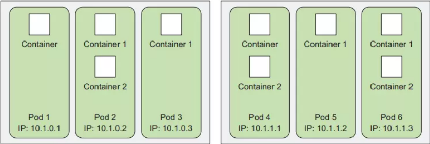
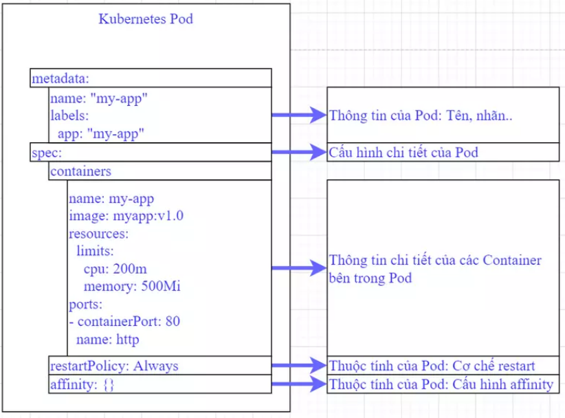

# Tìm hiểu và thao tác với Pods trong k8s

### 1. Pods trong kubernetes

Để bắt đầu với kubernetes chắc chắn các bạn sẽ phải làm quen với khái niệm Pod đầu tiên. Vậy nó là gì?

Pod là thành phần đơn vị (nhỏ nhất) để Kubernetes thực hiện việc nhân bản (replication). Kubernetes có thể thực hiện nhân bản ra nhiều pod có chức năng giống nhau để tránh quá tải hoặc để đảm bảo tính sẵn sàng (high availability).

Pod có thể có nhiều container, tùy vào chức năng của nó được thiết kế. Pod chạy nhiều container trong đó thường là đóng gọi một ứng dụng xây dựng với sự phối hợp chặt chẽ từ nhiều container, chúng chia sẻ tài nguyên ổ đĩa, mạng cho nhau.

<h3 align="center"></h3>

### 2. Thành phần cơ bản của Pod

Pod có thể được tạo trực tiếp bằng lệnh kubect gọi tới api của k8s, hoặc có thể định nghĩa dưới dạng file yaml và được apply vào k8s.

Cấu trúc của Pods:

<h3 align="center"></h3>

Ta sẽ cùng xem một ví dụ mẫu thông tin khai báo Pod dưới dạng yaml như sau:

```
apiVersion: v1
kind: Pod
metadata:
  name: "MYAPP"
  namespace: default
  labels:
    app: "MYAPP"
spec:
  hostAliases:
    - ip: "127.0.0.1"
      hostnames:
        - "mylocalhost"
  
  initContainers:
    - name: init-container-init-container
      image: busybox
      command: ['sh', '-c', "some-command-here"]
  containers:
  - name: MYAPP
    image: "busybox:latest"
    resources:
      limits:
        cpu: 200m
        memory: 500Mi
      requests:
        cpu: 100m
        memory: 200Mi
    env:
    - name: DB_HOST
      valueFrom:
        configMapKeyRef:
          name: MYAPP
          key: DB_HOST
    ports:
    - containerPort:  80
      name:  http
    volumeMounts:
    - name: localtime
      mountPath: /etc/localtime
  volumes:
    - name: localtime
      hostPath:
        path: /usr/share/zoneinfo/Asia/Ho_Chi_Minh
  restartPolicy: Always  
  affinity:
    nodeAffinity:
      requiredDuringSchedulingIgnoredDuringExecution:
        nodeSelectorTerms:
          - matchExpressions:
              - key: kubernetes.io/hostname
                operator: Exists


```

- Cơ bản nó gồm 4 thành phần chính, ở root level (tức là tham số không có khoảng trắng nào):

    ```
    apiVersion: v1
    kind: Pod
    metadata:
    
    spec:

    ```

    - Trong đó:

        - "kind": Để phân loại loại tài nguyên, như chúng ta biết ngoài Pod thì có Deployment, Service...

        - metadata: Chứa thông tin metadata của Pod, có thể kể tới một số tham số chính như tên pod, label...

        - spec: Đây là phần quan trọng nhất, nơi chứa các thông tin khai báo cho Pod và cho các Container trong Pod. Chúng ta điểm qua một số tham số chính của phần spec như sau:

        ```
        spec:
        hostAliases:
        initContainers:
        containers:
        volumes:
        restartPolicy:
        affinity:

        ```
        - Ta sẽ điểm qua các tham số này:

            - hostAliases: Giống như ta khai báo host trong file /etc/hosts của máy chủ vậy. Nhưng ở đây ta khai báo cho Pod

            - initContainers: Khai báo thông tin của initContainer (nếu có)

            - container: Định nghĩa thông tin chi tiết cho các container của Pod.

            - volumes: Khai báo Volume cho Pod. Volume có thể lấy từ configmap, từ PVC.. Các phần này sẽ được đề cập sau khi ta làm quen với PV/PVC

            - restartPolicy: Có 3 giá trị là Always, OnFailure, và Never.

            - affinity: Là đối tượng khai báo các thuộc tính liên quan tới schedule Pod. Ta sẽ tìm hiểu kỹ hơn khi tới bài về Scheduling.

            - NodeAffinity/NodeAntiaffinity: Định nghĩa việc lựa chọn/không lựa chọn triển khai Pod trên một Node theo tiêu chí nào đó.

            - PodAffinity/PodAntiaffinity: Định nghĩa việc lựa chọn/không lựa chọn triển khai Pod trên một Node phụ thuộc vào một Pod nào đó.

            - Lưu ý rằng thông tin container name, image là bắt buộc còn lại là optional.

- Tiếp đến ta sẽ đi sâu vào phần quan trọng nhất của Pod là khai báo Container, nó sẽ có cấu trúc như sau:

    ```

    spec:
      containers:
      - name: container1
        image: busybox:latest
        env:
        - name: DB_HOST
          valueFrom:
            configMapKeyRef:
              name: MYAPP
              key: DB_HOST
        ports:
        - containerPort: 80
          name: http
        volumeMounts:
        - name: localtime
          mountPath: /etc/localtime

    ```

    - Khai báo container có tên là container1 từ image là busybox:latest

    - Khai báo biến môi trường tên là DB_HOST cho container được lấy giá trị từ một configmap tên là MYAPP và ở key có tên là DB_HOST

    - Khai báo port của container là 80, port này được đặt tên là http

    - Khai báo một phân vùng mount từ phân vùng localtime vào thư mục trong container là /etc/localtime

### 3. Tạo Pod bằng lệnh kubectl

- Giờ thì ta đã có hình dung về Pod có những gì rồi. Ta sẽ tạo một Pod thật đơn giản bằng lệnh kubectl như sau:

    ` kubectl run nginx-pod --image=nginx --port=80 `

- Câu lệnh trên mục đích để tạo một Pod có tên "nginx-pod" từ image là "nginx" và listen ở port 80.

- Nhưng trước khi chạy nó, ta có thể xem được từ câu lệnh trên nó sẽ gen ra yaml file như thế nào trước khi apply vào hệ thống.

- Thêm cấu hình "--dry-run=client -oyaml" để xem trước cấu hình được gen ra chứ không apply vào hệ thống ngay:

    ` kubectl run nginx-pod --image=nginx --port=80 --dry-run=client -oyaml `

    ```

    apiVersion: v1
    kind: Pod
    metadata:
      creationTimestamp: null
      labels:
        run: nginx-pod
      name: nginx-pod
    spec:
      containers:
      - image: nginx
        name: nginx-pod
        ports:
        - containerPort: 80
        resources: {}
      dnsPolicy: ClusterFirst
      restartPolicy: Always
    status: {}

    ```

- Với cách này ta có thể thử câu lệnh để kiểm tra cú pháp, có thể thêm các tham số mới thoải mái. Mỗi lần chạy lệnh sẽ gen ra file yaml, tới khi nào ta thấy ok rồi thì mới tạo lên hệ thống bằng cú pháp:

    ` kubect apply -f [pod-yaml-file] `
