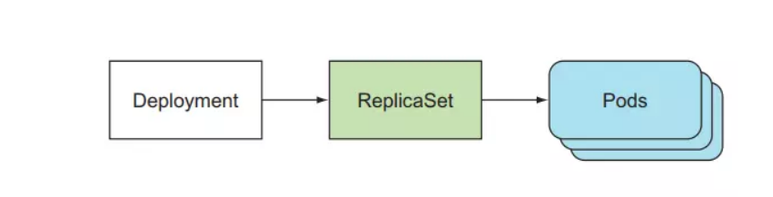
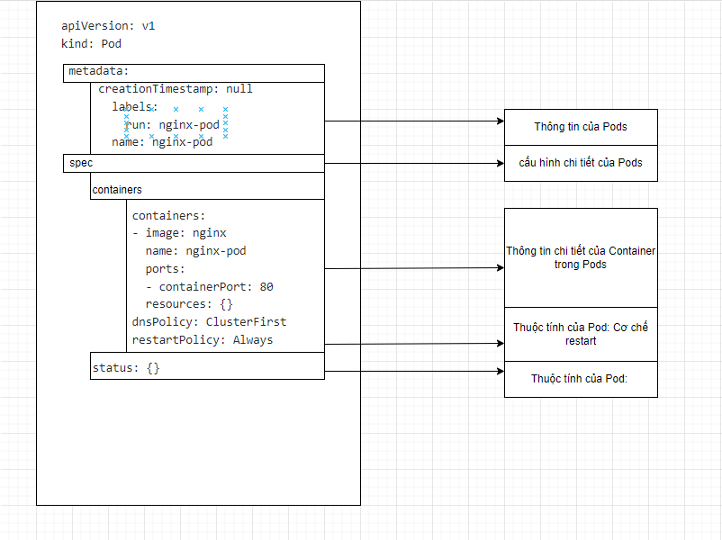
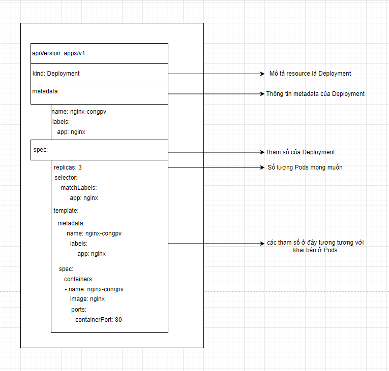
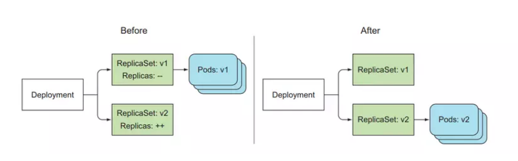

# Deployments and ReplicaSet

### Deployment là gì

- Trong phần trước chúng ta đã tìm hiểu về thành phần Pod trên kubernetes và các tạo/quản lý nó. Tuy nhiên trong thực tế thì ít khi chúng ta triển khai ứng dụng cách cách tạo Pod trực tiếp như vậy mà các ứng dụng sẽ được triển khai dưới một trong các dạng triển khai như Deployment, StatefulSet, DaemonSet hay Job/Cronjob.

- Deployment là một tài nguyên trên K8S giúp ta quản lý các Pod và ReplicaSet. Vậy tại sao phải dùng Deployment mà không phải là Pod? Bởi deloyment giúp chúng ta quản lý nhiều bản sao của Pod, nâng cấp phiên bản phần mềm bên trong Pod và đảm bảo số lượng Pod theo số lượng mà chúng ta mong muốn.

- Deployment là một resource của kubernetes giúp ta trong việc cập nhật một version mới của úng dụng một cách dễ dàng, nó cung cấp sẵn 2 strategy để deploy là Recreate và RollingUpdate, tất cả đều được thực hiện tự động bên dưới, và các version được deploy sẽ có một histroy ở đằng sau, ta có thể rollback and rollout giữa các phiên bản bất cứ lúc nào mà không cần chạy lại CI/CD.

- Khi ta tạo một Deployment, nó sẽ tạo ra một ReplicaSet bên dưới, và ReplicaSet sẽ tạo Pod. Luồn như sau Deployment tạo và quản lý ReplicaSet -> ReplicaSet tạo và quản lý Pod -> Pod run container.

<h3 align="center"></h3>

- Ta xem lại cấu trúc của một Pod như sau:

<h3 align="center"></h3>

- Trong cấu trúc của Pod thì nó sẽ chứa 1 hoặc nhiều container. Như trong ví dụ ở hình trên, nó chứa 1 container là nginx sử dụng image là nginx sử dụng port 80.

- Bây giờ ta muốn triển khai ứng dụng này dưới dạng Deployment để đảm bảo rằng ta sẽ luôn có 3 Pod cùng chạy ứng dụng nginx thì ta khai báo Deployment như sau:

<h3 align="center"></h3>

- Các bạn có thể nhận thấy phần khai báo Pod đã “nằm gọn” trong tham số “template” của cấu hình Deployment.

- Về mặt ý tưởng, khi ta tạo mới deployment như trên, thì kubernetes sẽ tạo ra 1 replicaset và replicaset này sẽ tạo ra 03 Pod (tương ứng với tham số replicas: 3) với cấu hình như khai báo trong phần template.

### Cách Deploymnet update Pod

- Nếu ta update cấu hình của Deployment, ví dụ như thay đổi thông tin image từ nginx:v1.0 thành nginx:v2.0 thì lúc này hệ thống sẽ sinh ra 1 replicaset mới, nó cũng sẽ tạo ra 03 Pod mới (tương ứng với tham số replicas: 3) với cấu hình như khai báo trong phần template nhưng lúc này tham số image đã thay đổi thành nginx:v2.0.

- Khi ta thay đổi image của Deployment, nó sẽ tạo ra một ReplicaSet khác, và ReplicaSet đó sẽ giữ template Pod mới, và các Pod mới sẽ được tạo ra bởi ReplicaSet.

<h3 align="center"></h3>

