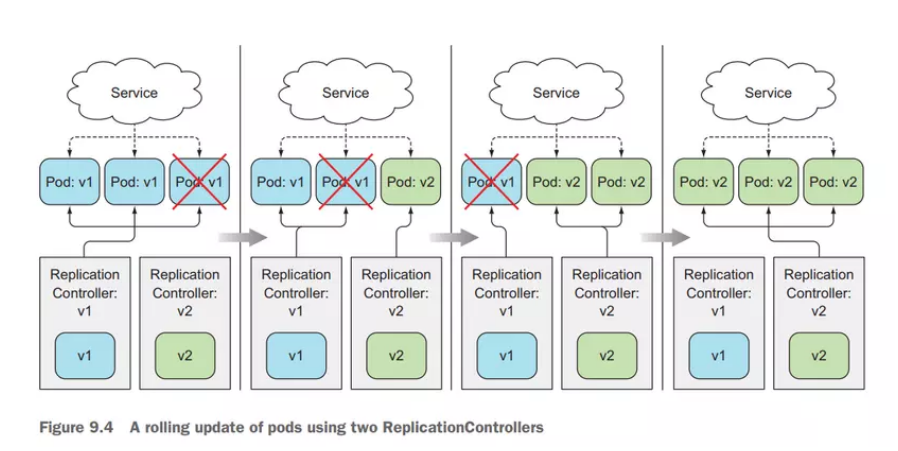
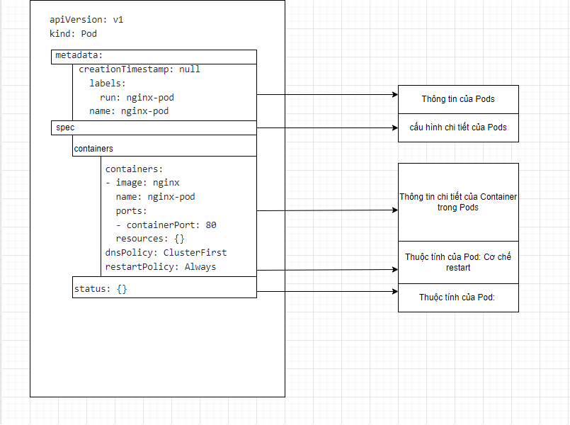

# Deployments and ReplicaSet

### Cập nhật một ứng dụng đang chạy trong pods

Bắt đầu với một ví dụ là ta đang có một ứng dụng đang chạy, ta deploy nó bằng ReplicaSet, với replicas = 3, nó sẽ chạy 3 Pod đằng sau, và ta deploy một Service để expose traffic của nó ra cho client bên ngoài.

<h3 align="center"></h3>

Bây giờ các dev trong team đã viết xong tính năng mới, ta build lại image với code mới, và ta muốn update lại các Pod đang chạy này với image mới. Ta sẽ làm như thế nào? Thì trong quá trình deploy, sẽ có rất nhiều chiến lược để làm, nhưng có 2 cách thông dụng nhất là: Recreate and RollingUpdate.

- Recreate

Ở cách deploy này, đầu tiên là sẽ xóa toàn bộ phiên bản (version) cũ của ứng dụng trước, sau đó ta sẽ deploy một version mới lên. Đối với kubernes thì đầu tiên ta sẽ cập nhật Pod template của ReplicaSet, sau đó ta xóa toàn bộ Pod hiện tại, để ReplicaSet tạo ra Pod với image mới.

<h3 align="center"></h3>

Với cách deploy này thì quá trình deploy quá dễ dàng, nhưng ta sẽ gặp một vấn đề rất lớn, đó là ứng dụng của chúng ta sẽ downtime với client, client không thể request tới ứng dụng của ta trong quá trình version mới được deploy lên.

Với những hệ thống ít client thì dù bạn downtime 1 phút 2 phút hoặc 1 tiếng cũng không ảnh hưởng nhiều lắm, nhưng với những hệ thống với số lượng request lớn tầm 1000-3000 request trên giây, đặt biệt là với hệ thống ngân hàng thì quá trình downtime dù chỉ 1s thì cũng không được. Nên mới sinh ra cách deploy thứ hai là RollingUpdate

- RollingUpdate

Ở cách này, ta sẽ deploy từng version mới của ứng dụng lên, chắc chắn rằng nó đã chạy, ta dẫn request tới version mới của ứng dụng này, lặp lại quá trình này cho tới khi toàn bộ version mới của ứng dụng được deploy và version cũ đã bị xóa. Đối với kubernetes, ta sẽ lần lượt xóa từng Pod và ReplicaSet sẽ tạo Pod mới cho ta.

<h3 align="center"></h3>

Thì ở cách deploy này, điểm mạnh là ta sẽ giảm thời gian downtime của ứng dụng đối với client, còn điểm yếu là ta sẽ có version mới và version cũ của ứng dụng chạy chung một lúc. Và khó nhất là ta phải viết script để thực hiện quá trình này, test script này chạy đúng không, rất mất thời gian và công sức. Với các hệ thống lớn thì để viết một cái script test được quá trình deploy này thì không dễ chút nào.

Để chọn cách deploy nào cho ứng dụng thì còn tùy vào tình huống và nhu cầu, nếu ứng dụng ta có thể chạy nhiều version của ứng dụng cùng lúc không ảnh hưởng thì ta sẽ chọn RollingUpdate. Còn nếu ứng dụng chúng ta downtime không ảnh hưởng gì, thì ta sẽ cách Recreate để deploy. Còn cách một cách nữa là không có downtime và không có nhiều version của ứng dụng chạy cùng một lúc nữa là Bule-Green update. Thì ở đây mình không nói về cách deploy này. Các bạn có thể đọc thêm ở đây.

Nếu ta chỉ dùng những resource bình thường, thì vấn đề đầu tiên ta gặp phải là quá trình cập nhật version mới của ứng dụng và cần phải script để thực hiện một số thao tác như xóa Pod cũ. Vấn đề thứ hai ta sẽ gặp là ta phát hiện version mới của chúng ta chạy sai hoặc có bug, ta muốn lùi lại phiên bản trước đó thì làm sao?

### Deployment là gì

- Trong phần trước chúng ta đã tìm hiểu về thành phần Pod trên kubernetes và các tạo/quản lý nó. Tuy nhiên trong thực tế thì ít khi chúng ta triển khai ứng dụng cách cách tạo Pod trực tiếp như vậy mà các ứng dụng sẽ được triển khai dưới một trong các dạng triển khai như Deployment, StatefulSet, DaemonSet hay Job/Cronjob.

- Deployment là một tài nguyên trên K8S giúp ta quản lý các Pod và ReplicaSet. Vậy tại sao phải dùng Deployment mà không phải là Pod? Bởi deloyment giúp chúng ta quản lý nhiều bản sao của Pod, nâng cấp phiên bản phần mềm bên trong Pod và đảm bảo số lượng Pod theo số lượng mà chúng ta mong muốn.

- Deployment là một resource của kubernetes giúp ta trong việc cập nhật một version mới của úng dụng một cách dễ dàng, nó cung cấp sẵn 2 strategy để deploy là Recreate và RollingUpdate, tất cả đều được thực hiện tự động bên dưới, và các version được deploy sẽ có một histroy ở đằng sau, ta có thể rollback and rollout giữa các phiên bản bất cứ lúc nào mà không cần chạy lại CI/CD.

- Khi ta tạo một Deployment, nó sẽ tạo ra một ReplicaSet bên dưới, và ReplicaSet sẽ tạo Pod. Luồn như sau Deployment tạo và quản lý ReplicaSet -> ReplicaSet tạo và quản lý Pod -> Pod run container.

<h3 align="center"></h3>


- Ta xem lại cấu trúc của một Pod như sau:


<h3 align="center"></h3>

- Trong cấu trúc của Pod thì nó sẽ chứa 1 hoặc nhiều container. Như trong ví dụ ở hình trên, nó chứa 1 container là nginx sử dụng image là nginx sử dụng port 80.

- Bây giờ ta muốn triển khai ứng dụng này dưới dạng Deployment để đảm bảo rằng ta sẽ luôn có 3 Pod cùng chạy ứng dụng nginx thì ta khai báo Deployment như sau:

<h3 align="center"></h3>

- Các bạn có thể nhận thấy phần khai báo Pod đã “nằm gọn” trong tham số “template” của cấu hình Deployment.

- Về mặt ý tưởng, khi ta tạo mới deployment như trên, thì kubernetes sẽ tạo ra 1 replicaset và replicaset này sẽ tạo ra 03 Pod (tương ứng với tham số replicas: 3) với cấu hình như khai báo trong phần template.

### Cách Deployment update Pod

- Nếu ta update cấu hình của Deployment, ví dụ như thay đổi thông tin image từ nginx:v1.0 thành nginx:v2.0 thì lúc này hệ thống sẽ sinh ra 1 replicaset mới, nó cũng sẽ tạo ra 03 Pod mới (tương ứng với tham số replicas: 3) với cấu hình như khai báo trong phần template nhưng lúc này tham số image đã thay đổi thành nginx:v2.0.

- Khi ta thay đổi image của Deployment, nó sẽ tạo ra một ReplicaSet khác, và ReplicaSet đó sẽ giữ template Pod mới, và các Pod mới sẽ được tạo ra bởi ReplicaSet.

<h3 align="center"></h3>

### ReplicaSet là gì

ReplicaSet cũng là một tài nguyên trên K8S có mục đích là để duy trì một trạng thái ổn định của một bộ các Pod ở một thời điểm nhất định. ReplicaSet có 2 thành phần quan trọng là “thông tin cấu hình của Pod” (tương ứng với thông tin trong mục template) và “số lượng Pod” mong muốn (tương ứng với tham số replicas). ReplicaSet Controller sẽ làm nhiệm vụ đảm bảo số lượng Pod được khai báo trong ReplicaSet này luôn đảm bảo đúng bằng số lượng Pod mong muốn.

ReplicaSet có thể được tạo thủ công bằng cách khai báo các file yaml. Nó cũng được tự động tạo ra khi ta tạo hay update Deployment.

### Các trường hợp ứng dụng của Deployment

- Một số trường hợp thường dùng tới deployment:

    - Tạo Deployment để triển khai một ReplicaSet
    
    - Khai báo trạng thái mới của Pod.
    
    - Scale up/down số lượng Pod của một ứng dụng
    
    - Rollout/rollback một ứng dụng..

### Cơ chế quản lý ReplicaSet và Pod của Deployment

- Khi tạo một Deployment, ta sẽ phải định nghĩa các ReplicaSet/Pod được quản lý bởi Deployment như thế nào.

- Như trong ví dụ đang nêu trong bài, thì tất cả các resource được gán nhãn “app=my-app” đều được hiểu là được quản lý bởi Deployment này. Việc này được khai báo trong tham số selector:

```
selector:
  matchLabels:
    app: nginx

```

- Đồng thời, với các ReplicaSet/Pod được sinh ra, chúng cũng sẽ được gán một nhãn theo khai báo trong phần template của Pod:

```
template:
  metadata:
    name: nginx-congpv
    labels:
      app: nginx

```
Như vậy phải luôn lưu ý 2 config này phải match với nhau.

Tiếp theo sau khi Deployment tạo ra ReplicaSet, thì ReplicaSet sẽ làm nhiệm vụ tạo Pod. Lúc này cơ chế mà ReplicaSet quản lý Pod cũng giống như cách Deployment quản lý ReplicaSet.

