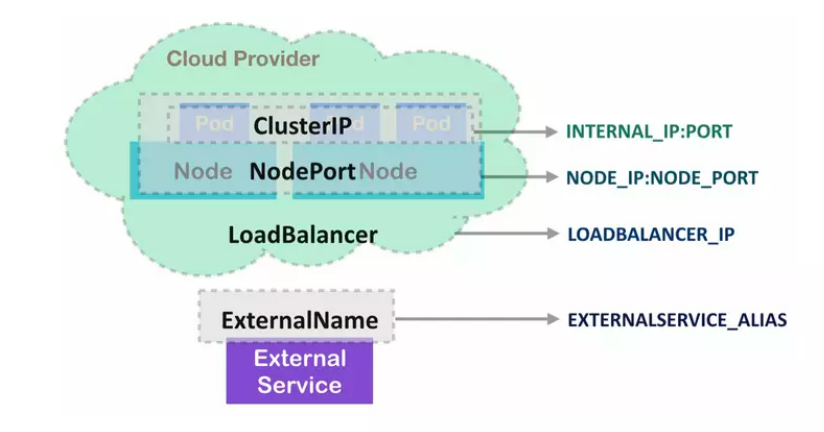
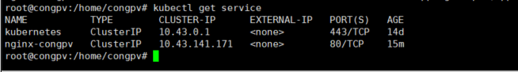
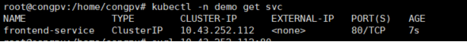
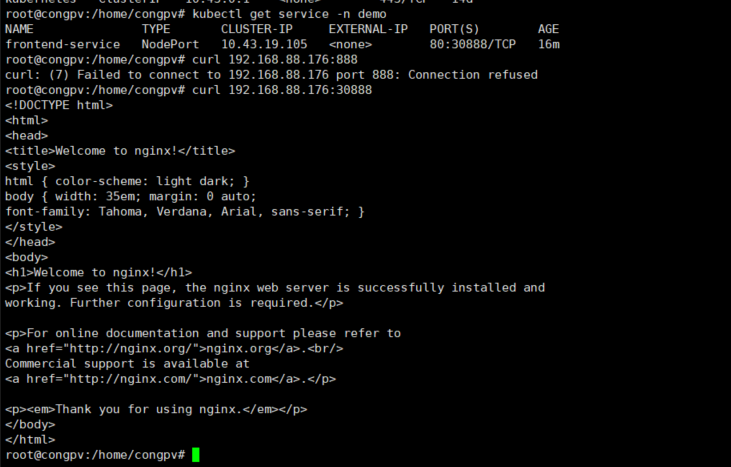
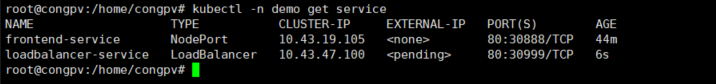

# Tìm hiểu về Kubernetes service types

### Kubernetes Service

- Khi triển khai ứng dụng, có thể sử dụng Deployment, StatefulSet hay DaemonSet thì khi đó bạn sẽ đều có một bộ các Pod chạy một ứng dụng. Các Pod này có vai trò như nhau và đều được cấp 1 IP dùng trong K8S. Nghĩa là IP này sẽ chỉ được truy cập từ trong K8S. Tuy nhiên các Pod này có thể được tạo hoặc xóa một cách biến động.

- Vậy làm sao để chúng ta có thể sử dụng được dịch vụ từ bên ngoài k8s cũng như xử lý câu chuyện Pod bị thay đổi IP liên tục? Câu trả lời là sử dụng service, sẽ giúp chúng ta giải quyết các vấn đề sau:

    - Expose dịch vụ ra bên ngoài k8s. Client có thể kết nối trực tiếp tới service qua NodePort hoặc qua cấu hình ingress

    - Service sẽ đóng vai trò LoadBalancer cho các Pod ứng dụng mà service quản lý. Khi các Pod có thay đổi (thêm/bớt hoặc Pod bị xóa và tạo lại) thì ở phía client không cần quan tâm tới IP của Pod. Nó chỉ cần quan tới tới duy nhất đối tượng Service.

- Service là một cách định nghĩa một bộ các Pod và cách thức truy cập vào Pod, thường thông qua cấu hình selector của Service. Nó giống như cách ReplicaSet quản lý Pod của nó như ở bài trước vậy.

- Service là một trong những khái niệm cốt lõi của Kubernetes. Kubernetes service là một tài nguyên xác định ra một pod hoặc một nhóm các pod cung cấp cùng một dịch vụ và chính sách truy cập đến các pod đó. Đối với service, Kubernetes cũng cung cấp cho chúng ta nhiều kiểu service khác nhau để phù hợp với nhiều yêu cầu khác nhau. Vì vậy, trong phạm vi bài viết này, mình sẽ cùng các bạn tìm hiểu chi tiết về các loại service khác nhau được cung cấp trong Kubernetes, sự khác biệt giữa chúng cũng như những lưu ý khi sử dụng chúng nhé.

- Hiện tại, Kubernetes cung cấp cho chúng ta 4 loại Kubernetes service, đó là:

    - ClusterIP
    
    - NodePort

    - Load Balancer

    - ExternalName

<h3 align="center"></h3>

### ClusterIP

ClusterIP service là loại service mặc định trong Kubernetes. Service loại ClusterIP này sẽ có thể được truy cập bởi các ứng dụng khác chỉ khi các ứng dụng đó cũng nằm trong cụm của bạn. Các ứng dụng bên ngoài cụm sẽ không thể truy cập đến service.

Bây giờ chúng ta sẽ cùng xem xét một ví dụ. Trước khi tạo một service, chúng ta sẽ tạo một pod đơn giản với manifest file nginx.yaml như sau:

```
apiVersion: v1
kind: Pod
metadata:
  name: nginx-pod
  labels:
    app: nginx-pod
    apptype: front-end
spec:
  containers:
  - name: nginx-container
    image: nginx
    ports:
    - containerPort: 80
      name: http

```

- Sau đó tạo một pod với lệnh: 
    
    - ` kubectl create ns demo`
    - ` kubectl -n demo apply -f nginx.yaml `
    
Chúng ta sẽ thấy một pod được tạo ra chỉ đơn giản với 1 container là Nginx web server. Pod cũng được thêm các label là app: nginx-pod và type: front-end.

Tiếp đến chúng ta sẽ tạo một service loại ClusterIP với manifest file nginx-clusterip.yaml như sau:

```
apiVersion: v1
kind: Service
metadata:
  name: frontend-service
spec:
  type: ClusterIP       #Loại service: ClusterIP
  selector:             #Khai báo rule để lọc các Pod mà service sẽ forward connection tới
    app: nginx-pod
    apptype: front-end
  ports:
    - targetPort: 80    #Là port của Pod, service sẽ chuyển tiếp kết nối vào đây
      port: 80          #Là port được mở của Service. Client sẽ kết nối với Service qua port này

```

- Service cũng sử dụng selector để liên kết service với pod vừa được tạo thông qua các label. Ngoài ra, ta còn có targetPort và port:

    - targetPort: là cổng trên pod, nơi máy chủ web thực đang chạy, service sẽ chuyển tiếp lưu lượng truy cập đến cổng này. Nếu không có cổng nào được chỉ định, nó sẽ mặc định là 80.

    - port: là port được mở của chính service. cũng giống như tất cả các đối tượng Kubernetes khác, service cũng là một máy chủ ảo trong node, nó cũng sẽ có địa chỉ ip riêng và port là nơi tiếp nhận kết nối đến dịch vụ. Giá trị này là bắt buộc.

- Bây giờ, sau khi tạo service qua lệnh: 

    ` kubectl -n demo aplly -f nginx-clusterip.yml ` 

Chúng ta có thể kiểm tra service vừa được tạo.

<h3 align="center"></h3>

Chúng ta có thể thấy rằng ngoài service Kubernetes mặc định, một service ClusterIP mới tên front-end-service được tạo với một địa chỉ IP. Tên của service có thể được các pod khác trong cụm sử dụng để truy cập nó. Ngoài ra thì bạn cũng không thể truy cập đến pod từ bên ngoài cụm.

ClusterIP service thường được dùng cho các service mà chỉ dùng cho nội bộ K8S. Còn muốn expose những service này ra bên ngoài k8s thì có thể sử dụng ingress, ta sẽ đề cập ở các nội dung sau.

Ta có thể kết nối từ trong k8s (từ bất cứ node nào trong k8s) tới IP của service nhưng không thể kết nối từ bên ngoài được. Mình sẽ đứng từ một master node để kết nối tới service:

<h3 align="center"></h3>

<h3 align="center"></h3>

### NodePort

Service kiểu NodePort là một cách đơn giản nhất để có thể truy cập đến service của bạn từ phía bên ngoài cụm. Mình cũng hay sử dụng nó cho mục đích gỡ lỗi, khi mình muốn có thể dễ dàng kiểm tra dịch vụ của mình từ phía bên ngoài cụm. Service NodePort, giống như tên của nó, nó sẽ mở một port cụ thể trên tất cả các node trong cụm và lưu lượng truy cập được gửi đến bất kì node nào trong cụm thông qua port được mở sẽ được chuyển tiếp đến dịch vụ bên trong cụm.

Phạm vi của các port được mở cho service NodePort nằm trong khoảng 30000-32767. Bạn có thể trực tiếp chỉ định port này trong file yaml của mình hoặc để Kubernetes tự động chỉ định. Tiếp tục với ví dụ ở trên, mình sẽ tạo một service NodePort để có thể truy cập đến pod đã tạo.

Ta có file nginx-nodeport.yml như sau:

```
apiVersion: v1
kind: Service
metadata:
  name: nodepor-service
spec:
  type: NodePort
  selector:
    app: nginx-pod
    apptype: front-end
  ports:
    - targetPort: 80
      port: 80
      nodePort: 30888

```
Ở đây bên cạnh targetPort và port tương tự service ClusterIP, ta có thêm giá trị nodePort. Đây chính là cổng được mở trên node và tiếp nhận các lưu lượng truy cập đến từ bên ngoài cụm và chuyển tiếp đến service bên trong cụm. Trong nội bộ service NodePort vẫn hoạt động như service ClusterIP.

<h3 align="center"></h3>

- Một vài lưu ý nho nhỏ khi sử dụng service NodePort

    Loại service này tuy là một cách rất thuận tiện để bạn có thể dễ dàng truy cập ứng dụng bên trong cụm của bạn từ mạng bên ngoài, thế nhưng có một số điểm cần lưu ý như là: bạn chỉ có thể sử dụng một dịch vụ cho mỗi cổng, số cổng cũng phải nằm trong phạm vi 30000–32767, địa chỉ ip node cụm của bạn cũng có thể thay đổi và bạn có thể sẽ cần có cách giải quyết cho những vấn đề này khi sử dụng. Bởi vậy, theo mình thì các bạn chỉ nên sử dụng service NodePort trong những trường hợp thử nghiệm tạm thời, gỡ lỗi dịch vụ mà không nên sử dụng trên môi trường production.

### LoadBalancer

Service LoadBalancer được sử dụng khi chúng ta muốn có một địa chỉ Ip duy nhất sẽ chuyển tiếp tất cả các yêu cầu truy cập đến dịch vụ của bạn (cân bằng tải). Để thực hiện được điều này, tất cả những gì service LoadBalancer làm là nó sẽ tạo ra service NodePort. Cùng với đó, nó sẽ gửi một thông báo tới nhà cung cấp lưu trữ cụm Kubernetes yêu cầu loadbalancer được thiết lập trỏ đến tất cả các node IP bên ngoài và nodePort cụ thể. Điều này cũng có nghĩa là, service LoadBalancer sẽ khả dụng khi nhà cung cấp lưu trữ cụm Kubernetes của bạn có hỗ trợ thiết lập bộ cân bằng tải bên ngoài (external load balancers), nếu không thì không có gì xảy ra và LoadBalancer sẽ tương tự như NodePort.

Để xác định một service LoadBalancer, ta có một file nginx-loadbalancer.yml đơn giản như sau:

```
apiVersion: v1
kind: Service
metadata:
  name: loadbalancer-service
spec:
  type: LoadBalancer
  ports:
    - targetPort: 80
      port: 80
      nodePort: 30999
  selector:
    app: nginx-pod
    apptype: front-end

```

- Sau khi bạn tạo một service LoadBalancer, bạn có thể sẽ thấy:

<h3 align="center"></h3>

Bạn có thể thấy, bởi vì mình đang thực hiện ví dụ này trên một cụm K3s single node và không có hỗ trợ thiết lập bộ cân bằng tải bên ngoài, nên EXTERNAL-IP luôn ở trạng thái <pending> . Tuy nhiên, trong thực tế, địa chỉ IP sẽ được tạo và chúng ta có thể dử dụng để truy cập dịch vụ. Còn ở đây, địa chỉ IP không được tạo thì bạn vẫn có thể truy cập đến service tương tự như là servicer NodePort ở trên mà thôi.

Service LoadBalancer là một cách tiêu chuẩn để truy cập rộng rãi dịch vụ của bạn trên internet. Tất cả traffic trên port bạn chỉ định sẽ được chuyển tiếp đến service trong kuberentes, không có filtering, không có routing,... Điều này có nghĩa là bạn có thể gửi hầu hết mọi loại lưu lượng đến nó, như HTTP, TCP, UDP, Websockets, gRPC,... hoặc bất cứ thứ gì. Tuy nhiên, nhược điểm lớn nhất của service này là nó gần như chỉ khả dụng với các nhà cung cấp lưu trữ cụm Kubernetes là các nền tảng Cloud. Trên các nền tảng này, bạn phải trả phí cho việc sử dụng load blancer cho các dịch vụ của mình, bạn chỉ có một ip cho mỗi dịch vụ và nó sẽ có chi phí không hề rẻ chút nào.

### ExternalName

ExternalName là loại service có cơ chế tách biệt một chút so với 3 loại service phía trên. Loại service này không sử dụng selectors mà thay vào đó lại sử dụng tên DNS. Nó ánh xạ một service với một tên DNS là nội dung của trường externalName (Ví dụ: app.test.com). Khi bạn muốn truy cập vào tên service đó, thay vì trả về cluster-ip của service này, nó sẽ trả về bản ghi CNAME với giá trị được đề cập trong externalName