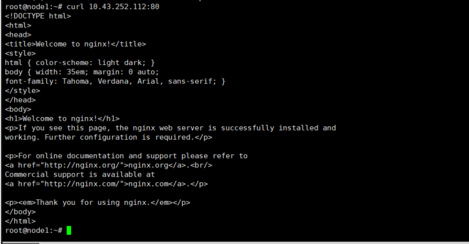

# Tìm hiểu về Kubernetes service types

### Kubernetes Service

- Khi triển khai ứng dụng, có thể sử dụng Deployment, StatefulSet hay DaemonSet thì khi đó bạn sẽ đều có một bộ các Pod chạy một ứng dụng. Các Pod này có vai trò như nhau và đều được cấp 1 IP dùng trong K8S. Nghĩa là IP này sẽ chỉ được truy cập từ trong K8S. Tuy nhiên các Pod này có thể được tạo hoặc xóa một cách biến động.

- Vậy làm sao để chúng ta có thể sử dụng được dịch vụ từ bên ngoài k8s cũng như xử lý câu chuyện Pod bị thay đổi IP liên tục? Câu trả lời là sử dụng service, sẽ giúp chúng ta giải quyết các vấn đề sau:

    - Expose dịch vụ ra bên ngoài k8s. Client có thể kết nối trực tiếp tới service qua NodePort hoặc qua cấu hình ingress

    - Service sẽ đóng vai trò LoadBalancer cho các Pod ứng dụng mà service quản lý. Khi các Pod có thay đổi (thêm/bớt hoặc Pod bị xóa và tạo lại) thì ở phía client không cần quan tâm tới IP của Pod. Nó chỉ cần quan tới tới duy nhất đối tượng Service.

- Service là một cách định nghĩa một bộ các Pod và cách thức truy cập vào Pod, thường thông qua cấu hình selector của Service. Nó giống như cách ReplicaSet quản lý Pod của nó như ở bài trước vậy.

- Service là một trong những khái niệm cốt lõi của Kubernetes. Kubernetes service là một tài nguyên xác định ra một pod hoặc một nhóm các pod cung cấp cùng một dịch vụ và chính sách truy cập đến các pod đó. Đối với service, Kubernetes cũng cung cấp cho chúng ta nhiều kiểu service khác nhau để phù hợp với nhiều yêu cầu khác nhau. Vì vậy, trong phạm vi bài viết này, mình sẽ cùng các bạn tìm hiểu chi tiết về các loại service khác nhau được cung cấp trong Kubernetes, sự khác biệt giữa chúng cũng như những lưu ý khi sử dụng chúng nhé.

- Hiện tại, Kubernetes cung cấp cho chúng ta 4 loại Kubernetes service, đó là:

    - ClusterIP
    
    - NodePort

    - Load Balancer

    - ExternalName

<h3 align="center"></h3>

### ClusterIP

ClusterIP service là loại service mặc định trong Kubernetes. Service loại ClusterIP này sẽ có thể được truy cập bởi các ứng dụng khác chỉ khi các ứng dụng đó cũng nằm trong cụm của bạn. Các ứng dụng bên ngoài cụm sẽ không thể truy cập đến service.

Bây giờ chúng ta sẽ cùng xem xét một ví dụ. Trước khi tạo một service, chúng ta sẽ tạo một pod đơn giản với manifest file nginx.yaml như sau:

```
apiVersion: v1
kind: Pod
metadata:
  name: nginx-pod
  labels:
    app: nginx-pod
    apptype: front-end
spec:
  containers:
  - name: nginx-container
    image: nginx
    ports:
    - containerPort: 80
      name: http

```

- Sau đó tạo một pod với lệnh: 
    
    - ` kubectl create ns demo`
    - ` kubectl -n demo apply -f nginx.yaml `
    
Chúng ta sẽ thấy một pod được tạo ra chỉ đơn giản với 1 container là Nginx web server. Pod cũng được thêm các label là app: nginx-pod và type: front-end.

Tiếp đến chúng ta sẽ tạo một service loại ClusterIP với manifest file nginx-clusterip.yaml như sau:

```
apiVersion: v1
kind: Service
metadata:
  name: frontend-service
spec:
  type: ClusterIP
  selector:
    app: nginx-pod
    apptype: front-end
  ports:
    - targetPort: 80
      port: 80

```

- Service cũng sử dụng selector để liên kết service với pod vừa được tạo thông qua các label. Ngoài ra, ta còn có targetPort và port:

    - targetPort: là cổng trên pod, nơi máy chủ web thực đang chạy, service sẽ chuyển tiếp lưu lượng truy cập đến cổng này. Nếu không có cổng nào được chỉ định, nó sẽ mặc định là 80.

    - port: là port được mở của chính service. cũng giống như tất cả các đối tượng Kubernetes khác, service cũng là một máy chủ ảo trong node, nó cũng sẽ có địa chỉ ip riêng và port là nơi tiếp nhận kết nối đến dịch vụ. Giá trị này là bắt buộc.

- Bây giờ, sau khi tạo service qua lệnh: 

    ` kubectl -n demo aplly -f nginx-clusterip.yml ` 

Chúng ta có thể kiểm tra service vừa được tạo.

<h3 align="center"></h3>

Chúng ta có thể thấy rằng ngoài service Kubernetes mặc định, một service ClusterIP mới tên front-end-service được tạo với một địa chỉ IP. Tên của service có thể được các pod khác trong cụm sử dụng để truy cập nó. Ngoài ra thì bạn cũng không thể truy cập đến pod từ bên ngoài cụm.

ClusterIP service thường được dùng cho các service mà chỉ dùng cho nội bộ K8S. Còn muốn expose những service này ra bên ngoài k8s thì có thể sử dụng ingress, ta sẽ đề cập ở các nội dung sau.

Ta có thể kết nối từ trong k8s (từ bất cứ node nào trong k8s) tới IP của service nhưng không thể kết nối từ bên ngoài được. Mình sẽ đứng từ một master node để kết nối tới service:

<h3 align="center"></h3>

<h3 align="center"></h3>

