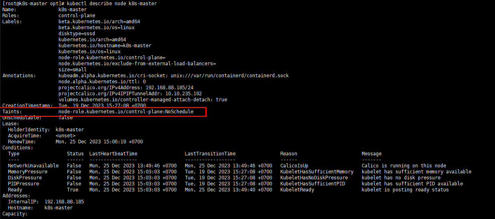

# Advanced scheduling: Taints and tolerations

- Khi ta chạy một cluster mà ta muốn triển khai nhiều môi trường trên đó, ví dụ như dev, testing, staging, production. Thì ta sẽ muốn server production của chúng ta sẽ là server mạnh với nhiều tài nguyên nhất, server dev thì chỉ ít tài nguyên thôi. Nên khi deploy thì ta sẽ phát hiện ra rằng ta có nhu cầu là ta không muốn những pod dev có thể được deploy lên worker node production và ngược lại.

- Thì bên cạnh việc scheduler tự động chọn worker node nào để deploy pod tới đó, thì ta cũng có thể control được công việc đó. Những thao tác này được gọi là advanced scheduling, trong bài này chúng ta sẽ nói qua những kỹ thuật mà ta có thể chỉ định pod tới đúng worker node mà ta muốn. Phần đầu tiên đã xem qua hai thuộc tính sẽ giúp ta trong việc restrict pod được deploy tới node.

### Taints và tolerations

- Hai đặc tính đầu tiên của advanced scheduling mà ta sẽ xem qua là taints và tolerations.

- Taints được dùng để cấm một thằng pod được deploy tới worker node mà có taints. Ta sẽ dùng câu lệnh để đánh taints vào một worker node. Ví dụ ta có cụm worker node chạy môi trường production, ta sẽ đánh taints lên cụm worker node đó, và pod sẽ không thể được deploy lên cụm worker node này nữa. Cơ mà nếu vậy thì không có thằng pod nào có thể được deploy lên cụm này hết, vậy thì chẳng những worker node ta đánh taints sẽ thành thừa sao? Câu trả lời sẽ là không.

- Tolerations được dùng để gán vào pod, và những pod nào mà được gán tolerations thỏa mãn với điều kiện taints thì sẽ được deploy lên những worker node mà có gán taints. Ví dụ như cụm worker node production ở trên ta gán taints cho nó, sau đó, ta sẽ chỉ định tolerations lên những pod production, thì bây giờ chỉ có những pod production có tolerations phù hợp mới có thể được deploy lên cụm worker node production, còn pod dev thì không.

- Để dễ hiểu hơn thì ta sẽ xem qua một số taints và tolerations mặc định của kubernetes.

    - Node's Taints

    Trong kubernetes cluster, nếu các bạn để ý thì sẽ thấy là mặc định những pod của chúng ta sẽ không thể được deploy lên master node, mà chỉ có những system pod khi chúng ta khởi tạo một kubernetes cluster mới có thể được deploy tới master node. Lý do là vì master node đã được đánh taints, và những system pod được gán với những tolerations phù hợp với taints của master node, nên chỉ những system pod mới được deploy tới master node.

    Ví dụ mình có một môi trường được triển khai bằng tool kubeadm.

    Ta có thể kiểm tra taints của master node như sau:

    <h3 align="center"></h3>

    Ở trường Taints, bạn sẽ thấy nó có giá trị là node-role.kubernetes.io/control-plane:NoSchedule, đây là taints mặc định được đánh vào master node. Taints sẽ có format như sau <key>=<value>:<effect>, với ví giá trị ở trên ta sẽ có key là role.kubernetes.io/master, value là null, và effect là NoSchedule.

    Giá trị taints này sẽ cấm những pod thông thường không thể deploy tới nó, và chỉ có system pod với giá trị tolerations là role.kubernetes.io/master=:NoSchedule mới có thể deploy lên nó được.

    - Pod's tolerations

    Bạn liệt kê những pod nằm ở namespace là kube-system, và xem kiểm tra xem tolerations của nó có đúng như ta đã nói hay không

    <h3 align="center"></h3>

    Đây là những system pod được tạo ra khi mình dùng tool kubeadm, ta describe pod kube-apiserver-kube-master để xem thử tolerations của nó:

    <h3 align="center"></h3>

    - Taint effect
    
    Trong taints và tolerations thì giá trị của key và value thì khá dễ hiểu, chúng chỉ là string mà thôi. Nhưng giá trị effect thì khác, ta sẽ có những giá trị effect sau đây:

        - NoSchedule: khi giá trị này được gán vào taints, nó sẽ không cho phép pod được deploy lên nó.
    
        - PreferNoSchedule: giá trị này cũng có tác dụng giống như NoSchedule, nhưng khác biệt một điểm là nếu Pod không thể được deploy tới bất kì node nào, mà node với effect là PreferNoSchedule có đủ tài nguyên để chạy pod, thì pod có thể được deploy lên nó.
        
        - NoExecute: không giống như NoSchedule và PreferNoSchedule chỉ có tác dụng khi pod được scheduling, thì giá trị effect này sẽ ảnh hưởng lên cả pod mà đang chạy trên node, nếu pod không có tolerations phù hợp với taints thì nó cũng sẽ bị gỡ khỏi node đó. Ví dụ ta có pod đang chạy trên một woker node, sau đó ta đánh taints node đó với effect là NoExecute, thì những pod nào đang chạy trên node đó mà không có tolerations phù hợp sẽ bị gỡ khỏi pod.

    - Thêm Taints vào node
    
    Như đã nói ở trên thì ta có thêm đánh taints vào một node, lấy ví dụ môi trường dev và production ở trên, cụm worker node production ta sẽ đánh taints cho nó như sau:

    kubectl taint node production-node node-type=production:NoSchedule

    Để deploy pod tới production node, ta thêm tolerations vào nó, tạo một file tên là production-deployment.yaml với config như sau:

    ```
    
    apiVersion: v1
    kind: Pod
    metadata:
      name: mynginx
    spec:
      containers:
      - name: nginx
        image: nginx
      tolerations:
      - key: "node-type"
        operator: "Equal"
        value: "production"
        effect: "NoSchedule"
   
    ```

    Ta tạo pod này và liệt kê pod của nó, ta sẽ thấy có pod sẽ được deploy lên k8s-node01

    <h3 align="center"></h3>


### Hiều về cách sử dụng Taints và tolerations

- Một node có thể có nhiều taints và một pod cũng có thể khai báo nhiều giá trị tolerations. Taints thì có giá trị key và effect là bắt buộc, còn value là optional. Ta chỉ định tolerations cho pod với Operator là Equal (mặc định) hoặc Exists.

- Cách thứ nhất ta sử dụng taints và tolerations là ví dụ một kubernetes cluster có nhiều môi trường ở trên.

- Cách thứ hai ta có thể sử dụng taints và tolerations là cấu hình khi một node bị chết, thì bao lâu pod trên node đó sẽ được reschedule lại và được deploy ở một node khác, bằng cách dùng NoExecute effect. Ví dụ, khi ta describe một pod, ta có thể thấy nó có một số tolerations mặc định như sau:

    ` Tolerations: node.kubernetes.io/not-ready:NoExecute op=Exists for 300s `

- Giá trị này có nghĩa khi kubernetes Control Plane phát hiện một node bị chết, nó sẽ đánh taints cho node đó là node.kubernetes.io/not-ready:NoExecute, và sau đó tolerations của pod trên node bị chết này chỉ có giá trị trong vòng 300s, sau thời gian này tolerations sẽ bị xóa khỏi pod hiện tại, và do đó nó bị gỡ khỏi node vì không còn tolerations phù hợp.

<h3 align="center"></h3>