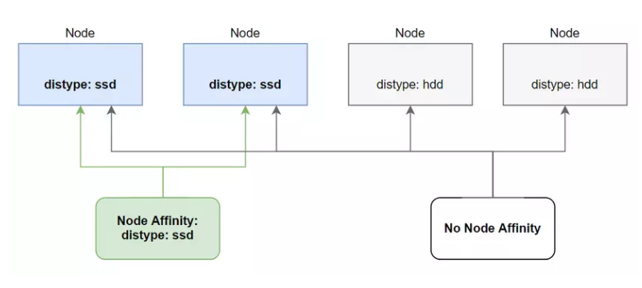
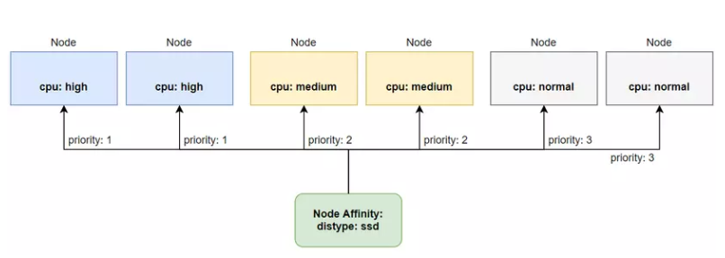
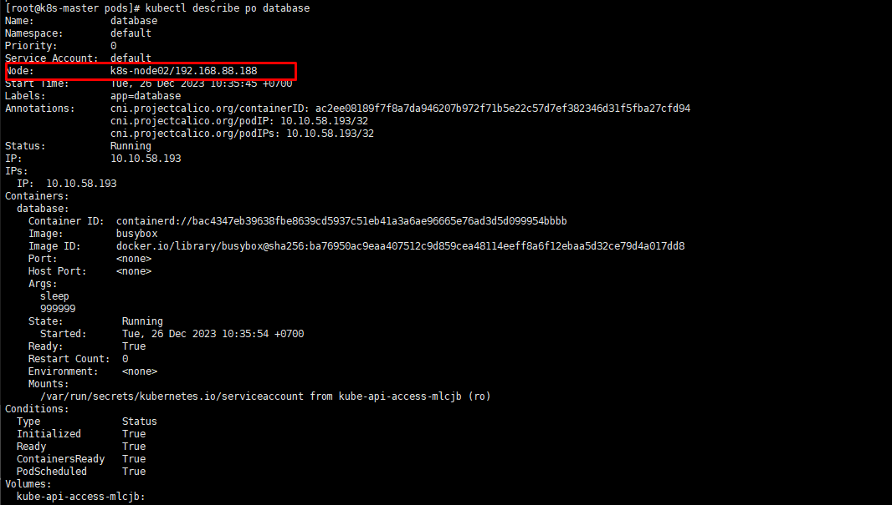
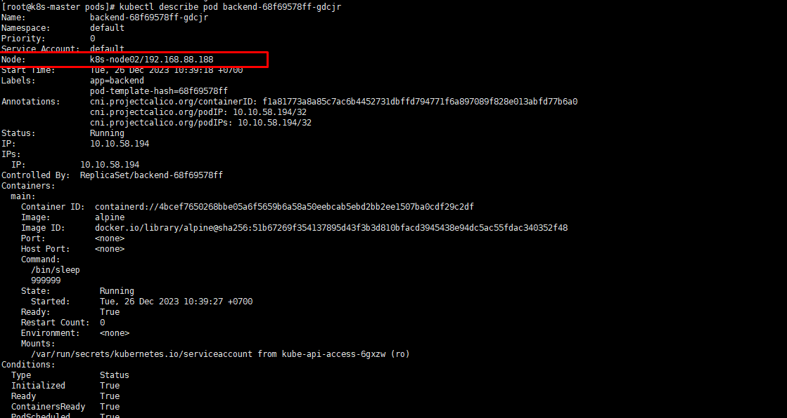
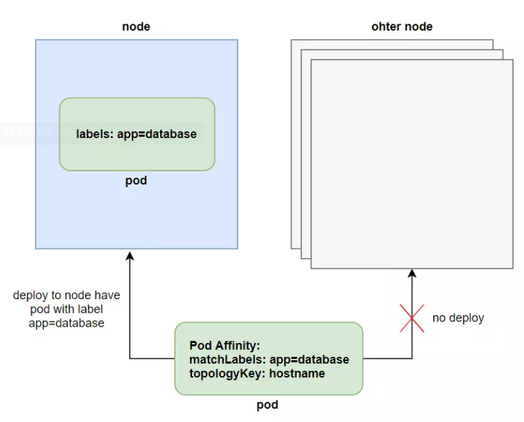

# Advanced scheduling: node affinity and pod affinity

### Giới thiệu

- Ở bài trước chúng ta đã nói về cách dùng của taints and tolerations để ngăn chặn một pod được deploy tới worker node mà ta không mong muốn. Ở bài này mình sẽ nói về cách ngược lại, thay vì ngăn chặn pod thì ta sẽ muốn deploy pod tới đúng worker node mà ta muốn.

- Khi ta chạy một cluster mà trong đó có nhiều cụm node với tài nguyên mạnh yếu khác nhau. Ví dụ là một cụm worker node có tài nguyên là 1CPU 1GB RAM 250GB HDD, một cụm worker node khác có tài nguyên là 2CPU 2GB RAM 500GB SSD, và một cụm worker node có tài nguyên là 4CPU 4GB RAM 500GB HDD. Tùy thuộc vào ứng dụng của ta thì ta sẽ muốn pod được deploy tới đúng worker node với tài nguyên thích hợp nhất.

- Trong advanced scheduling thì ngoài taints and tolerations thì sẽ có các thuộc tính khác để giúp ta làm được việc trên.

#### Node affinity

- Thuộc tính này là phiên bản được nâng cấp hơn so với nodeSelector. Bên cạnh việc sẽ deploy pod tới node mà ta muốn, thì cái mà nó tốt hơn so với nodeSelector là nếu nó không kiếm được node ta chỉ định, thì nó sẽ deploy pod lên node khác nằm trong điều kiện lựa chọn của label, chứ không giống như nodeSelector nếu nó kiếm không được thì pod sẽ không thể được deploy.

- Ngoài ra thì so với nodeSelector chỉ chọn chính xác theo label, nodeAffinity sẽ cho phép ta chọn label theo cách linh động hơn. Ví dụ như sau:

```

apiVersion: v1
kind: Pod
metadata:
  name: pod-ssd
spec:
  affinity:
    nodeAffinity:
      requiredDuringSchedulingIgnoredDuringExecution:
        nodeSelectorTerms:
          - matchExpressions:
            - key: disktype
              operator: In
              values:
                - "ssd"
  containers:
    - name: pod-ssd
      image: nginx

```

Như bạn thấy khi ta chỉ định thuộc nodeAffinity thì nhìn phức tạp hơn nhiều so với nodeSelector, nhưng vì vậy nó mới linh động hơn. Để sử dụng trường nodeAffinity thì ta cần khai báo trường affinity trước, sau đó để chỉ định label của node thì ta dùng trường nodeSelectorTerms là một mảng chứa nhiều matchExpressions, giá trị key với value là giá trị của label node, operator thì có giá trị là In, NotIn, Exists, DoesNotExist, Gt, Lt. Ở file config trên thì pod sẽ được deploy tới node có giá trị key nằm trong mảng values.

Ở trên giá trị key ta chỉ định là disktype, operator là In, values là một mảng với giá trị là ["ssd"] => disktype in ["ssd"].

<h3 align="center"></h3>

- Required During Scheduling and Ignored During Execution

    Bạn có để ý trường dài nhất là requiredDuringSchedulingIgnoredDuringExecution không? Nó sẽ có ý nghĩa như sau:

    - requiredDuringScheduling: có nghĩa là các thuộc tính ở dưới chỉ ảnh hưởng trong quá trình một pod được schedule tới một node mà thôi.
    
    - IgnoredDuringExecution: có nghĩa là sẽ không có tác dụng tới những pod đã chạy ở trên node đó rồi.
    
    - Ví dụ pod của ta đã được deploy tới node có label là disktype: ssd, sau đó ta thì có xóa label của node này đi chăng nữa thì cũng không ảnh hưởng tới pod đang được chạy trên nó, mà chỉ ảnh hưởng tới các pod được deploy sau này mà thôi.

    - Trong tương lai có lẽ kubernetes sẽ thêm vào thuộc tính RequiredDuringExecution, có nghĩa là sẽ ảnh hưởng tới cả những pod đang được chạy trên node đó.

- Prioritizing nodes when scheduling a pod

    - Một điểm thú vị nữa của node affinity là ta có thể ưu tiên deploy pod tới node nào trước hơn so với các node còn lại trong những node ta đã chọn. Ta có thể thực hiện việc đó bằng cách sử dụng thuộc tính preferredDuringSchedulingIgnoredDuringExecution.

    - Ví dụ ta có 3 cụm worker node như sau, một cụm với cpu cực mạnh này cho những pod mà chạy ứng dụng trading, một cụm cpu trung bình này cho những pod chạy ứng dụng sửa lý transaction, một cụm cpu bình thường dành cho các ứng dụng web api thông thường. Thì ta sẽ ưu tiên deploy pod trader tới cụm worker node với cpu cực mạnh trước, nếu mà cụm đó không con đủ tài nguyên thì ok, ta cũng sẽ chấp nhập deploy pod trader tới cụm worker node với cpu trung bình. Ta sẽ có các node như sau:

    ```
    
    $ kubectl get node
    high-cpu-1                    Ready    <none>                 302d   v1.22.3
    high-cpu-2                    Ready    <none>                 302d   v1.20.2
    medium-cpu-1                  Ready    <none>                 302d   v1.20.2
    medium-cpu-2                  Ready    <none>                 302d   v1.20.2
    normal-cpu-1                  Ready    <none>                 302d   v1.20.2
    normal-cpu-2                  Ready    <none>                 302d   v1.20.2
    kube-master                   Ready    control-plane,master   304d   v1.20.1

    ```

    Ta đánh label cho node như sau:

    ```

    $ kubectl label node high-cpu-1 cpu=high
    node "high-cpu-1" labeled

    $ kubectl label node high-cpu-2 cpu=high
    node "high-cpu-2" labeled

    $ kubectl label node medium-cpu-1 cpu=medium
    node "medium-cpu-1" labeled

    $ kubectl label node medium-cpu-2 cpu=medium
    node "medium-cpu-2" labeled

    $ kubectl label node normal-cpu-1 cpu=normal
    node "normal-cpu-1" labeled

    $ kubectl label node normal-cpu-2 cpu=normal
    node "normal-cpu-2" labeled

    ```

    - File cấu hình của Deployment ta sẽ như sau:

    ```
    apiVersion: apps/v1
    kind: Deployment
    metadata:
      name: trader
    spec:
      replicas: 3
      selector:
        matchLabels:
          app: trader
      template:
        metadata:
          labels:
            app: trader
        spec:
          affinity:
            nodeAffinity:
              preferredDuringSchedulingIgnoredDuringExecution:
                - weight: 50
                  preference:
                    matchExpressions:
                    - key: cpu
                      operator: In
                      values:
                        - "high"
                - weight: 30
                  preference:
                    matchExpressions:
                    - key: cpu
                      operator: In
                      values:
                        - "medium"
                - weight: 20
                  preference:
                    matchExpressions:
                    - key: cpu
                      operator: In
                      values:
                        - "normal"
          containers:
            - image: trader
              name: trader


    ```

    - Để chỉ định độ ưu tiên thì ta sử dụng thuộc tính weight và đánh giá trị cho nó, ở file trên ta chỉ định node có label cpu: high có giá trị weight là 50, đây là giá trị cao nhất, nên các pod của ta sẽ ưu tiên deploy tới node có label cpu: high trước tiên, nếu cụm node đó không đủ tài nguyên thì nó sẽ deploy xuống dưới các node còn lại có độ ưu tiên thấp hơn.

    <h3 align="center"></h3>

    - Bạn đã thấy cách hoạt động của node selector và node affinity, chúng sẽ tác động tới pod trong quá trình schedule. Nhưng các rule này chỉ liên quan tới pod và node, giả sử chúng ta không muốn deploy pod tới node nào cả mà chỉ muốn deploy một pod tới gần một pod khác, thì ta sẽ làm thế nào? Kubernetes có cung cấp cách cho ta làm việc đó, gọi là pod affinity.

#### Pod affinity

- Thay vì deploy pod tới những node, thì ta sẽ có một nhu cầu khác nữa là deploy pod gần với một pod khác. Ví dụ dư là ta có pod backend và pod database, ta sẽ muốn hai pod đó được deploy gần với nhau để độ trễ của API là thấp nhất.

- Ta có thể làm việc đó bằng cách bằng node affinity, nhưng ta sẽ cần đánh label cho node và chỉ định rõ những node có thể deploy cho pod, đây không phải là cách tốt cho vấn đề này. Ta sử dụng node affinity để deploy pod tới một cụm node cụ thể, sau đó ta sẽ để những pod liên quan được deploy gần với nhau.

- Ví dụ ta tạo một pod database như sau:

    ` kubectl run database -l app=database --image busybox -- sleep 999999 `

    Ta thấy pod database vừa được tạo trên node k8s-node02

    <h3 align="center"></h3>

- Sau đó, ta sẽ tạo pod backend và chỉ định pod affinity để nó được deploy gần với pod database.

    ```
    apiVersion: apps/v1
    kind: Deployment
    metadata:
      name: backend
    spec:
      replicas: 3
      selector:
        matchLabels:
          app: backend
      template:
        metadata:
          labels:
            app: backend
        spec:
          affinity:
            podAffinity:
              requiredDuringSchedulingIgnoredDuringExecution:
                - topologyKey: kubernetes.io/hostname
                  labelSelector:
                      matchLabels:
                        app: database
          containers:
            - name: main
              image: alpine
              command: ["/bin/sleep", "999999"]

    ```

    Sau khi tạo pod backend, ta thấy pod backend vẫn được tạo trên pod database

    <h3 align="center"></h3>

    Để xài chức năng Pod Affinity thì ta dùng trường podAffinity ở trường affinity. Giá trị requiredDuringSchedulingIgnoredDuringExecution thì cũng có ý nghĩa giống với nodeAffinity, ta sẽ chỉ định scope của pod bằng trường topologyKey, ở file trên thì scope ta chỉ định là chỉ trong một node với thuộc tính kubernetes.io/hostname.

    Khi pod mà ta chỉ định podAffinity được deploy, nó sẽ kiếm những pod nào mà có label trong trường matchLabels, sau đó sẽ deploy pod tới pod đã được chọn cùng trong một node. Ta có thể tăng scope này lên bằng trường topologyKey.

    <h3 align="center"></h3>

    - topologyKey
    
    Đây là thuộc tính giúp ta chỉ scope của pod khi nó đươc deploy gần với một pod khác, thường được quan tâm khi ta dùng cloud, nếu bạn không xài cloud thì có thể bỏ qua không cần tìm hiểu thuộc tính này. Nếu bạn có xài cloud, thì ta sẽ quen thuộc với các từ như là availability zone hoặc region, ta có thể dùng topologyKey để định nghĩa pod sẽ được deploy tới gần một pod khác trong cùng một node, cùng một AZ hoặc cũng một region.

    Ta làm việc này bằng cách đánh label cho node với key là kubernetes.io/zone hoặc kubernetes.io/region, sau đó ta chỉ định trường topologyKey như sau:

    ```
    ...
    - topologyKey: kubernetes.io/zone
    ...
    
    ```
    Ta đã thấy cách hoạt động của pod affinity, sẽ giúp ta deploy những pod gần với nhau như ta muốn. Kubernetes cũng có cung cấp cho ta cách để deploy một pod mà cách xa so với pod còn lại nếu bạn muốn, dùng pod anti-affinity.