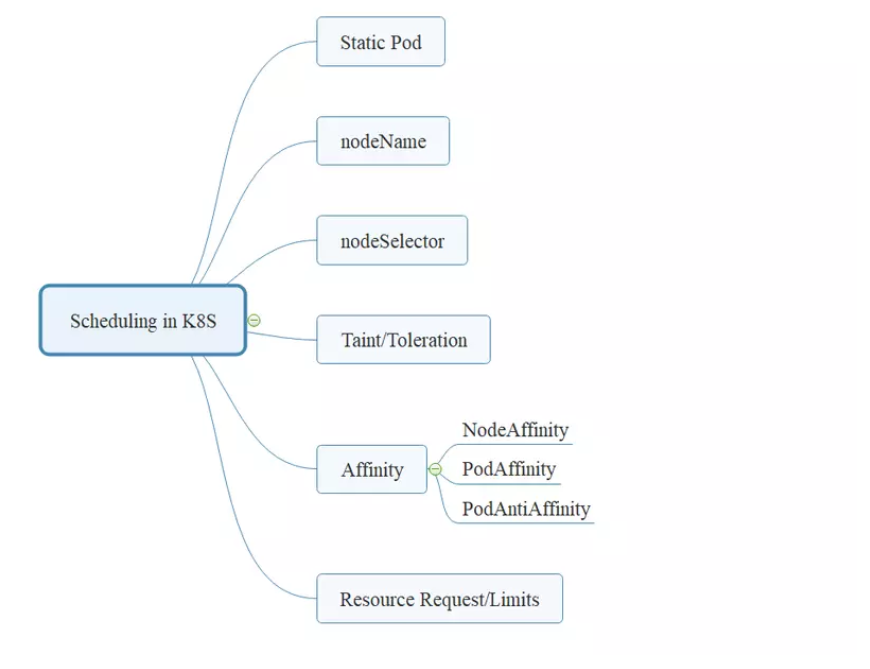

# Lập lịch trên kubernetes

### Các tham số quyết định tới lập lịch (scheduling)

- Khi chúng ta tạo ra một workload thành phần kube-scheduler mặc định của k8s sẽ là đối tượng có nhiệm vụ lập lịch thực thi các workload đó trên các node phù hợp.

- Vậy làm sao để biết được node nào là phù hợp để chạy một workload, thì chúng ta có thể xem xét các tham số ảnh hưởng tới việc chọn node cho workload như sau:

<h3 align="center"></h3>

- Về cơ bản nhiệm vụ của kube-scheduler là tìm ra một node phù hợp nhất để thực thi một Pod. Kết quả cuối cùng là sẽ cập nhật tham số "nodeName" trong thông tin của Pod.

- Các phương thức mà chúng ta có thể sử dụng khi khai báo Pod (mình nói Pod là vì Deployment hay các workload khác thì cuối cùng cũng sẽ là tạo ra các Pod):

    - static pod: Đây là cách chúng ta có thể chạy một Pod trên một node cụ thể mà ta mong muốn.

    - nodeName: Đây là cách chúng ta gán trực tiếp thông tin của Node mà ta mong muốn sẽ chạy Pod của chúng ta. Bản chất của lập lịch sử dụng các phương thức khác thì cũng đưa về kết quả là gán được một node vào trong tham số nodeName này.

    - nodeSelector: Cách này giúp chúng ta lựa chọn Node cho Pod theo một label cụ thể của Node
    
    - Taint/Toleration: Đây là một loại đánh dấu đặc biệt dành cho các Node. Nó có tác dụng chỉ cho phép những Pod có đặc tính tương đương (toleration) được chạy trên các Node có taint tương ứng.
    
    - Affinity: Ý tưởng của nó là cho phép cấu hình Pod trên node với điều kiện node/pod đó có label thỏa mãn một điều kiện cho trước.
    
    - Resource request/limits: Đây không phải là tham số chúng ta sử dùng để lựa Node cho Pod. Tuy nhiên nó là điều kiện cần để Node được chọn. Node sẽ chỉ thích hợp (eligible) để được chọn nếu phần tài nguyên của nó còn đủ đáp ứng tài nguyên yêu cầu (resource requests) của Pod, ví dụ như CPU/RAM..

#### Sử dụng static pod
- static pod được quản lý trực tiếp bởi service kubelet trên các node mà không cần giám sát bởi API-server. Static Pod luôn được gán vào một Kubelet ở một node cụ thể.

- Khi chúng ta tạo ra một static pod thì kubelet cũng sẽ tạo ra một bản sao Pod đó trên kubernetes API server. Điều này để giúp cho việc chúng ta có thể thấy được thông tin của Static Pod thông qua API Server nhưng chúng ta không thể điều khiển được các Pod này (vì nó được quản lý bởi kubelet trên node).

- Tên của các Static Pod sẽ có thêm hậu tố là hostname của node mà nó đang chạy theo format: [pod-name]-[node-hostname]

- Cách tạo static Pod
    
    - Để tạo một static pod trên một node cụ thể thì ta cần tạo file định nghĩa (manifest) cho Pod tại thư mục mặc định /etc/kubernetes/manifests/.

    - Service kubelet trên node đó sẽ định kỳ scan thư mục này và nếu phát hiện có file manifest mới thì nó sẽ tạo ra Pod từ file manifest đó.

    - Trong ví dụ này mình sẽ kết nối vào node là k8s-master và tạo file manifest mynginx.yaml ở đường dẫn /etc/kubernetes/manifests/ có nội dung như sau:

    ```
    
    apiVersion: v1
    kind: Pod
    metadata:
      creationTimestamp: null
      labels:
        run: mynginx
      name: mynginx
    spec:
      containers:
      - image: nginx
        name: mynginx
        resources: {}
      dnsPolicy: ClusterFirst
      restartPolicy: Always
    status: {}
    
    ```
    - Lưu ý 1: Chúng ta chỉ cần tạo file manifest thôi, không cần chạy lệnh kubectl apply nhé! Kubelet sẽ tự động scan thư mục này và tạo Pod cho chúng ta!

    - Kiểm tra kết quả:

    <h3 align="center"></h3>

    - Lưu ý 2: Khi chúng ta tạo các static pod thì nó sẽ không quan tâm tới các giá trị Taint đang có ở node đó.

- Sửa/xóa static Pod

    - Các bạn có thể thấy chúng ta chỉ tạo ra file manifest ở đúng đường dẫn thôi thì kubelet đã tạo Pod cho chúng ta rồi, không cần phải thực hiện tạo bằng kubect apply như mọi khi nữa.

    - Vậy nếu ta muốn stop/start hay delete static pod thì phải làm thế nào? Câu trả lời đơn giản là trạng thái của static pod chính là trạng thái tồn tại file manfinest của nó trong thư mục chứa static pod.

    - Do đó:

        - Để stop/delete static pod: Move file manifest của Pod ra khỏi thư mục static pod (/etc/kubernetes/manifests/)
        
        - Để create/start static pod: Tạo file manifest vào thư mực static pod (/etc/kubernetes/manifests/)

#### Sử dụng nodeName

- Tham số nodeName có thể được sử dụng trong khai báo Pod để chỉ định một node cụ thể mà ta muốn dùng để chạy Pod này. Ví dụ mình muốn chạy một pod nginx trên node có tên k8s-node01 thì sẽ thực hiện tạo file manifest pod-nodename.yaml như sau:

```
apiVersion: v1
kind: Pod
metadata:  
  labels:
    app: be
  name: pod-nodename
spec:
  containers:
  - image: nginx
    imagePullPolicy: IfNotPresent
    name: mynginx
    resources: {}
  nodeName: k8s-node01
  dnsPolicy: ClusterFirst
  restartPolicy: Always
status: {}


```

- Sau đó apply file này vào hệ thống để tạo Pod:

<h3 align="center"></h3>

Như vậy Pod mới tạo ra đã được allocate vào node k8s-node01 đúng như ta mong muốn.

- Để tiếp tục làm rõ ta sẽ thử tạo ra một deploy để sinh ra nhiều Pod có cùng cấu hình nodeName xem sao. Ta sẽ tạo file deployment-nodename.yaml có nội dung như sau:

#### Sử dụng nodeSelector

- Ý tưởng của việc sử dụng tham số nodeSelector này đó là chúng ta mong muốn cấu hình các Pod chỉ chạy trên một tập các node có lable nhất định.

- Ví dụ trên hệ thống của chúng ta có  2 node mà được gán nhãn như sau:

<h3 align="center"></h3>

- Các bạn có thể gán nhãn (label) cho node bằng cú pháp sau:

    ` kubectl label nodes [node-name] [key]=[value] `

- Và ta có một Pod cần chạy trên một node có cấu hình lớn (tương ứng nhãn size=large) thì ta sẽ nghĩ tới ý tưởng sử dụng tham số nodeSelector.

    - Ta sẽ định nghĩa Pod bằng file manifest pod-nodeselector.yaml có nội dung như sau:

    ```
    apiVersion: v1
    kind: Pod
    metadata:  
      labels:
        app: using-nodeselector
      name: pod-nodeselector
    spec:
      nodeSelector:
        size: large
      containers:
      - image: nginx
        imagePullPolicy: IfNotPresent
        name: mynginx
        resources: {}  
      dnsPolicy: ClusterFirst
      restartPolicy: Always

    ```
    
    - Apply file manifest trên vào hệ thống và kiểm tra:

    <h3 align="center"></h3

- Có một lưu ý ở đây là khi chúng ta sử dụng nodeSelector để lựa chọn node phù hợp cho Pod thì ta chỉ có thể lựa chọn theo một label duy nhất.

Trong ví dụ trên có trường hợp ta muốn lựa chọn phải chạy Pod trên các node có cấu hình lớn (theo label size=large). Tuy nhiên với bài toàn ngược lại ta muốn chạy Pod trên các node có cấu hình "không lớn", tương ứng với các node có label là size=small hoặc size=medium thì sao? Sử dụng nodeSelector sẽ không giải quyết được bài toán này cho chúng ta.

Lúc này chúng ta sẽ cần sử dụng tới nodeAffinity và mình sẽ giới thiệu ở phần sau.


