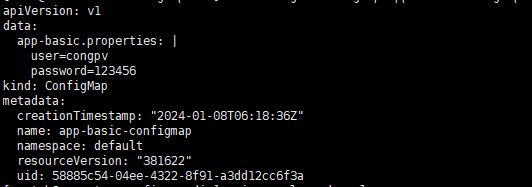

# Kubernetes Configmaps

#### Giới thiệu về configmap

Là một tài nguyên mức namespace trên k8s dùng để lưu trữ các dữ liệu dạng key-value. Pod có thể sử dụng configmaps dưới dạng các biến môi trường, dùng như tham số trong câu lệnh commandline trong pod hoặc sử dụng như một file cấu hình trong một volume. Lưu ý configmap không mã hóa dữ liệu, dữ liệu lưu trong configmap dưới dạng plain text.

Sử dụng configmap giúp cho ứng dụng trở nên linh động hơn. Các tham số của ứng dụng đều được cấu hình từ các biến môi trường hoặc từ file config. Các biến môi trường/file config này khi triển khai ở các môi trường cụ thể sẽ được gán giá trị từ configmap tương ứng.

Lưu ý khi sử dụng configmap cho Pod thì configmap và pod phải ở cùng namespace.

#### Cấu trúc file manifest của configmap

- Một đối tượng configmap có dạng như sau:

```

kind: ConfigMap
apiVersion: v1
metadata:
  name: example-configmap
  namespace: default
data:
  # Configuration Values are stored as key-value pairs
  title: "introduction to k8s"
  auth: "congpv"
  publish_date: "08/01/2024"  

```

- Khác với một số object ta đã tìm hiểu qua như Pod, Service hay Deployment thì sẽ có trường spec, thì configmap sẽ không có trường spec mà thay vào đó là trường data và trong đó là nơi khai báo các bộ giá trị key:value.

#### Các usecase sử dụng configmap

- Các cách tạo configmaps

- Có một số cách phổ biến dùng để tạo configmap từ câu lệnh như sau:

    - Tạo từng giá trị key/value cụ thể

    - Tạo từ config file

    - Tạo từ config folder

    - Tạo từ file và lưu vào khóa mới

    - Tạo từ file env (file enc chứ các thông tin dạng key:value tương tực với configmap)

    <h3 align="center"></h3>

- Các lệnh tạo configmap

    - Tạo configmap từ giá trị cụ thể:

        ` kubectl -n [namespace] create configmap [configmap-name] --from-literal [key1=value1] --from-literal [key2=value2] --from-literal [keyN=valueN] `

        ` kubectl -n cfg create configmap cm-from-literal --from-literal=author=congpv --from-literal=age=18 `

    - Tạo configmap từ filefilename:

        ` kubectl -n [namespace] create configmap [configmap-name] --from-file [filename] `

        ```
        cat <<EOF>> cm-file.conf
        > author=viettq
        > age=18
        > EOF

        ```

        ` kubectl -n cfg create configmap cm-from-file --from-file=cm-file.conf `

    - Tạo configmap từ thư mụcconfig-dir:

        ` kubectl -n [namespace] create configmap [configmap-name] --from-file [config-dir] `

        ```

        [root@k8s-master ~]# mkdir configmap-dir

        [root@k8s-master ~]# cd configmap-dir/

        [root@k8s-master configmap-dir]# cat login-policy.conf 
        lock_after=5
        lock_time=60

        [root@k8s-master configmap-dir]# cat password-policy.conf 
        password_length=8
        expire_day=30
        special_character=true


        ```

        - Như vậy ở thư mục configmap-dir đang có 2 file config có tên login-policy.conf và password-policy.conf.
        
        - Ta sẽ tạo configmap từ thư mục trên để lưu cả 2 file config này vào configmap:

            ` kubectl -n cfg create configmap cm-from-dir --from-file=configmap-dir `
    

    - Tạo configmap từ file biến môi trường có tênenv-file:
        
        ` kubectl -n [namespace] create configmap [configmap-name] --from-env-file [env-file]  `

        ```
        
        cat cm-env.conf
        author=congpv
        age=18

        ```

        ` kubectl -n cfg create configmap cm-from-env-file --from-env-file=cm-env.conf `

    - Kiểm tra nội dung của configmap vừa tạo:

        ` kubectl -n [namespace] get configmap [configmap-name] -oyaml `

#### Sử dụng configmap trong Pod

- Bây giờ chúng ta đã hiểu cơ bản về cách tạo ConfigMaps. Bước tiếp theo là sử dụng ConfigMaps đã tạo để tạo Pod. Trong phần này, chúng ta sẽ tạo một ConfigMap đơn giản và sử dụng nó khi tạo một Pod trong Kubernetes.

- Bước đầu tiên, hãy tạo một tệp có tên app-basic.properties và bao gồm hai cặp key-value.

    ```

    cat app-basic.properties
    user=congpv
    password=123456

    ```
- Chúng ta sẽ tạo một ConfigMap có tên là app-basic-configmap bằng cách sử dụng tệp ở trên và tùy chọn –-from-file.

   ` kubectl create configmap app-basic-configmap --from-file=app-basic.properties `

   ` kubectl get configmap app-basic-configmap -o yaml `

    <h3 align="center"></h3>

- Cuối cùng, hãy tạo một Pod tham chiếu đến ConfigMap mới được tạo. Chúng tôi sẽ sử dụng tệp YAML sau để tạo Pod.

    ```
    apiVersion: v1
    kind: Pod
    metadata:
      name: configmap-example-pod
    spec:
      containers:
        - name: configmap-example-busybox
          image: k8s.gcr.io/busybox
          command: [ "/bin/sh", "-c", "env" ]
          envFrom:
            # Load the Complete ConfigMap
            - configMapRef:
                name: app-basic-configmap
      restartPolicy: Never
    
    ```

- Như bạn có thể thấy từ ví dụ trên, chúng tôi sẽ load ConfigMap hoàn chỉnh mà chúng ta đã tạo vào Kubernetes Pod.

    ```
    kubectl create -f example-pod.yaml
    kubectl get pods

    ```

<h3 align="center"></h3>

Kết quả trên chỉ ra rằng ConfigMap app-basic-configmap đã được tải thành công khi tạo Kubernetes Pod.

#### Mapping keys từ ConfigMaps sang Pods

- Một cách khác mà chúng ta có thể sử dụng ConfigMaps là ánh xạ trực tiếp các giá trị từ ConfigMaps tới các biến môi trường cụ thể trong Pod.

- Trong phần này, chúng tôi sẽ tạo hai tệp configmap đơn giản theo cách thủ công, load và mapping các giá trị trực tiếp đến Kubernetes Pod. Chúng ta sẽ xác định các ConfigMaps dưới dạng tệp YAML và sau đó sử dụng lệnh kubectl create để tạo ConfigMap.

    ```
    cat application-defaults.yaml

    apiVersion: v1
    kind: ConfigMap
    metadata:
      name: application-configs
      namespace: default
    data:
      app.value: "45000"
      app.type: test-application
      app.ui: web
    
    ```

    ```

    cat application-logs.yaml

    apiVersion: v1
    kind: ConfigMap
    metadata:
      name: application-log-configs
      namespace: default
    data:
      log_level: WARNING
      log_type: TEXT

    ```

    ``` 
    kubectl create -f application-defaults.yaml

    kubectl create -f application-logs.yaml

    ```
    <h3 align="center"></h3>

    ```
    cat example-pod.yaml

    apiVersion: v1
    kind: Pod
    metadata:
      name: configmap-example-pod
    spec:
      containers:
        - name: configmap-example-busybox
          image: k8s.gcr.io/busybox
          command: [ "/bin/sh", "-c", "env" ]
          env:
            - name: APPLICATION_TYPE
              valueFrom:
                configMapKeyRef:
                  name: application-configs
                  key: app.type
            - name: APPLICATION_UI_TYPE
              valueFrom:
                configMapKeyRef:
                  name: application-configs
                  key: app.ui
            - name: LOG_LEVEL
              valueFrom:
                configMapKeyRef:
                  name: application-log-configs
                  key: log_level
      restartPolicy: Never

    ```

- Tiếp theo chúng ta sẽ tạo Pod

    ```
    
    kubectl create -f example-pod.yaml
    kubectl get pods
    
    ```
    <h3 align="center"></h3>

- Sau khi tạo Pod thành công, chúng ta có thể khám phá các biến môi trường như hình bên dưới.

    ```

    kubectl logs configmap-example-pod | grep APPLICATION_TYPE

    kubectl logs configmap-example-pod | grep APPLICATION_UI_TYPE

    kubectl logs configmap-example-pod | grep LOG_LEVEL

    ```

    <h3 align="center"></h3>


