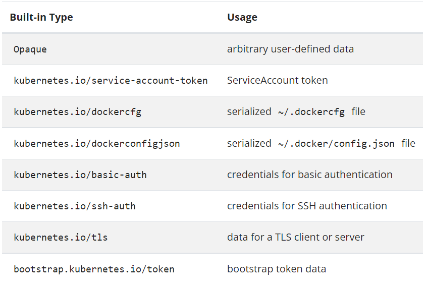
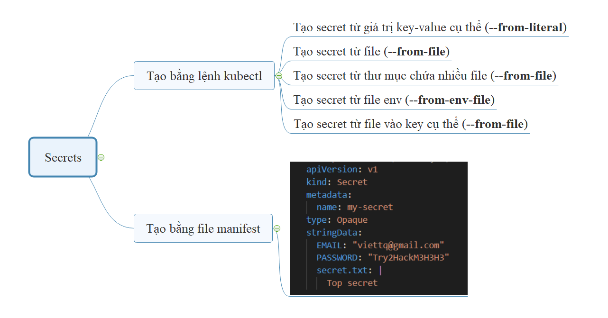

# Kubernetes Secrets

### Giới thiệu về Secret

Secret tương tự với configmap, là một tài nguyên mức namespace trên k8s dùng để lưu trữ các dữ liệu dạng key-value. Điểm khác biệt lớn nhất giữa secret và configmap đó là secret sinh ra để lưu những thông tin nhạy cảm (sensitive data) như username, password, token... và các thông tin này sẽ được mã hóa bằng base64 khi lưu vào hệ thống.

Về cách sử dụng thì gần như không có khác biệt gì so với configmap, chúng ta sẽ vẫn có một số cách sử dụng cơ bản như:

Tạo biến môi trường từ key của secret
Sử dụng secret như một volume chứa các file (ví dụ các file certificate, key..)

#### Cấu trúc file manifest của Secret

- Một đối tượng secret có dạng như sau:

    ```
    apiVersion: v1
    kind: Secret
    metadata:
      name: my-secret
    type: Opaque
    stringData:
      EMAIL: "viettq@gmail.com"
      PASSWORD: "Try2HackM3H3H3"
      secret.txt: |
        My supersecret

    ```

- Cơ bản thì cấu trúc này khá giống với configmap, nhưng nó có thêm một tham số "type".

- Secret có nhiều loại khác nhau cho các mục đích sử dụng khác nhau:

    <h3 align="center"></h3>

### Các usecase sử dụng secret

- Các cách tạo secret
    
- Có một số cách phổ biến dùng để tạo secret từ câu lệnh như sau:

    - Tạo từng giá trị key/value cụ thể

    - Tạo từ file

    - Tạo từ folder

    - Tạo từ file và lưu vào khóa mới

    - Tạo từ file env (file env chứa các thông tin dạng key:value tương tự với configmap)

<h3 align="center"></h3>


### Lệnh tạo secret

- Tạo secret từ giá trị cụ thể:

    ` kubectl -n [namespace] create secret generic [secret-name] --from-literal [key1=value1] --from-literal [key2=value2] --from-literal [keyN=valueN] `

- Tạo secret từ file filename:

    ` kubectl -n [namespace] create secret generic [secret-name] --from-file [filename] `

- Tạo secret từ thư mục config-dir:

    ` kubectl -n [namespace] create secret generic [secret-name] --from-file [secret-dir] `

- Tạo secret từ file biến môi trường có tên env-file:

    ` kubectl -n [namespace] create secret generic [secret-name] --from-env-file [env-file] `

- Kiểm tra nội dung của secret vừa tạo:

    ` kubectl -n [namespace] get secret [secret-name] -oyaml `