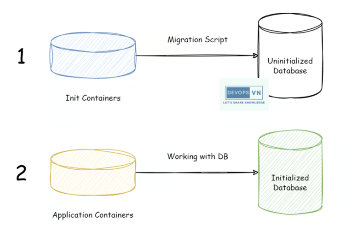
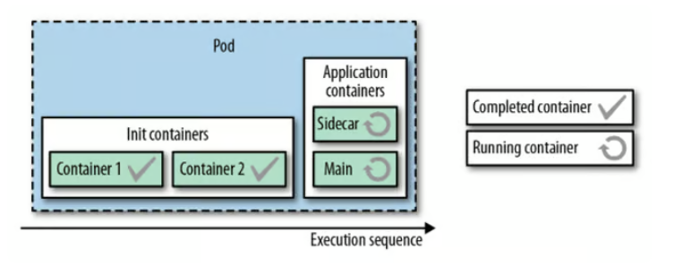

# Kubernetes Structural Patterns: Init Containers

<h3 align="center"></h3>

- Structural Patterns bao gồm:

    - Init Containers.
    
    - Sidecar.
    
    - Adapter.
    
    - Ambassador.

### Init Containers

Init Containers là những Container được thực thi ở quá trình khởi tạo Pod (Initialization Stage), các Container này được thực thi trước khi các Container chứa ứng dụng được tạo. Trong một Pod ta có thể khai báo một hay nhiều Init Containers, và chúng sẽ được thực thi theo thứ tự ta khai báo.

Init Containers được sử dụng để khởi tạo tài nguyên hoặc cấu hình những thứ cần thiết cho Container chứa ứng dụng. Tưởng tượng giống như trong ngôn ngữ JAVA và PHP, khi ta viết một Class và cần cấu hình những giá trị cần thiết cho Class đó khi nó được tạo thì ta sẽ khai báo một Constructors cho nó. Init Containers cũng tượng tự như vậy nhưng sử dụng cho Pod.

<h3 align="center"></h3>

Từ hình trên thì một Pod được tách ra thành hai phần là: Init Containers và Application Containers. Tất cả Init Containers sẽ được chạy theo thứ tự và khi tất cả Init Containers được thực thi xong thì Application Containers mới được chạy.

` Nếu có nhiều Application Containers thì tất cả Application Containers sẽ được thực thi song song với nhau chứ không phải theo thứ tự như Init Containers. `

- Khác biệt so với Container thông thường
    
    - Init container hỗ trợ tất cả các trường và tính năng của app container bao gồm giới hạn tài nguyên, volume và các thiết lập bảo mật. Tuy nhiên, các yêu cầu và giới hạn tài nguyên cho init container được quản lý hơi khác (sẽ mô tả trong phần Tài nguyên)

    - Ngoài ra, init container không hỗ trợ lifecycle, readinessProbe, readinessProbe hay startupProbe bởi vì chúng phải chạy cho đến khi hoàn thành trước khi pod có thể ở trạng thái ready.

    - Nếu ta chỉ định nhiều init container cho 1 pod, kubelet sẽ chạy từng init container theo thứ tự. Mỗi init container phải thành công trước khi init container tiếp theo được chạy. Khi tất cả init container đều hoàn thành, kubelet sẽ khởi chạy các app container cho pod như bình thường.

- Sử dụng init container
    
    - Bởi vì init container có các image tách biệt với các app container nên chúng có vài lợi thế cho các mã khởi động (startup code):

        - Init container có thể chứa các tiện ích (utilities) hoặc mã tùy biến (custom code) để cài đặt. Ví dụ: ta không cần phải tạo 1 image FROM 1 image khác chỉ để sử dụng các tool như sed, awk, python hay dig trong quá trình cài đặt
    
        - Vai trò của người xây dựng (build) image và người triển khai (deployer) ứng dụng có thể hoạt động độc lập mà không cần phải cùng nhau xây dựng 1 image ứng dụng duy nhất.
    
        - Init container có thể chạy với 1 góc nhìn khác đối với hệ thống tập tin (filesystem) so với app container trong cùng 1 pod. Kết quả là chúng có thể được cấp quyền truy cập vào các Secret (lưu trữ thông tin nhạy cảm như password, token, key …) mà app container không thể.
        
        - Bởi vì init container phải chạy cho đến khi hoàn thành trước khi bất kỳ app container nào có thể chạy nên init container cung cấp 1 cơ chế để chặn hoặc trì hoãn việc khởi động app container cho đến khi các điều kiện tiên quyết được thỏa mãn. Khi các điều kiện này được thỏa mãn, tất cả các app container trong pod có thể khởi động song song.
        
        - Init container có thể chạy các tiện ích hoặc mã tùy biến một cách an toàn nếu so với chạy trong app container sẽ kém an toàn hơn. Bằng cách tách riêng các công cụ không cần thiết, ta có thể giới hạn các cuộc tấn công bề mặt lên image của ứng dụng container.

#### Sử dụng init container trong thực tế

- Ví dụ này định nghĩa một Pod đơn giản có 2 init container. Container đầu tiên chờ đợi myservice và container thứ hai chờ đợi mydb. Khi cả hai init container hoàn tất (nghĩa là cả myservice và mydb đã sẵn sàng phục vụ), Pod sẽ chạy app container từ phần spec của nó.

```

apiVersion: v1
kind: Pod
metadata:
  name: myapp-pod
  labels:
    app: myapp
spec:
  containers:
  - name: myapp-container
    image: busybox:1.28
    command: ['sh', '-c', 'echo The app is running! && sleep 3600']
  initContainers:
  - name: init-myservice
    image: busybox:1.28
    command: ['sh', '-c', "until nslookup myservice.$(cat /var/run/secrets/kubernetes.io/serviceaccount/namespace).svc.cluster.local; do echo waiting for myservice; sleep 2; done"]
  - name: init-mydb
    image: busybox:1.28
    command: ['sh', '-c', "until nslookup mydb.$(cat /var/run/secrets/kubernetes.io/serviceaccount/namespace).svc.cluster.local; do echo waiting for mydb; sleep 2; done"]

```

- Ta có thể khởi tạo Pod trên bằng lệnh:  ` kubectl apply -f myapp.yaml `

- Sau đó kiểm tra trạng thái bằng lệnh: ` kubectl get -f myapp.yaml `

<h3 align="center"></h3>

- Tại thời điểm này, các init container sẽ chờ đợi các Service có tên là mydb và myservice.

    - Bên dưới là ví dụ cấu hình cho các service đó:

    ```
    ---
    apiVersion: v1
    kind: Service
    metadata:
      name: myservice
    spec:
      ports:
      - protocol: TCP
        port: 80
        targetPort: 9376
    ---
    apiVersion: v1
    kind: Service
    metadata:
      name: mydb
    spec:
      ports:
      - protocol: TCP
        port: 80
        targetPort: 9377

    ```

- Để tạo ra 2 service myservice và mydb theo đặc tả trên, ta chạy lệnh sau: ` kubectl apply -f services.yaml `

- Sau đó, ta sẽ thấy các init container đó đã hoàn thành nhiệm vụ và Pod myapp-pod chuyển sang trạng thái Running:   ` kubectl get -f myapp.yaml `

<h3 align="center"></h3>

- Giải thích chi tiết hành vi
    
    - Trong quá trình khởi động của pod, kubelet sẽ trì hoãn việc chạy init container cho đến khi kết nối mạng và lưu trữ đã sẵn sàng. Sau đó, kubelet sẽ chạy các init container theo thứ tự chúng xuất hiện trong đặc tả của Pod.

    - Mỗi container phải được thoát (exit) thành công trước khi container tiếp theo được khởi động. Nếu 1 container không thể khởi động bởi vì lỗi runtime hoặc exit với mã lỗi thì nó sẽ được khởi động lại theo restartPolicy của pod. Tuy nhiên, nếu restartPolicy của pod là Always thì init container sẽ sử dụng restartPolicy là OnFailure.

    - Một pod không thể là Ready cho đến khi tất cả các init container là thành công (succeeded). Các port trên 1 init container sẽ không được tổng hợp lại trong 1 service. Một pod đang khởi động nghĩa là đang trong trạng thái Pending nhưng sẽ có trường Initialized của Pod Condition là True

    - Nếu pod đang khởi động lại hoặc đã được khởi động lại thì tất cả các init container phải được thực thi lại.

    - Các thay đổi trong đặc tả của init container sẽ bị giới hạn trong trường initContainers.image (tức là chỉ cho phép thay đổi trường initContainers.image). Việc thay đổi trường image của init container sẽ tương đương với việc khởi động lại pod.

    - Bởi vì các init container có thể được khởi động lại (restarted), thử lại (retried), hoặc thực thi lại (re-execute) nên mã thực thi của init container phải là idempotent (đồng nhất, nhất quán, ổn định, tin cậy). Đặc biệt, các mã liên quan đến việc ghi vào file trong EmptyDirs nên được lường trước khả năng file xuất ra đã tồn tại trước đó.

    - Các init container có tất cả các trường của 1 app container. Tuy nhiên, Kubernetes ngăn cấm sử dụng readinessProbe bởi vì các init container không thể định nghĩa/phân biệt được sự khác nhau gữa sẵn sàng (readiness) và hoàn thành (completion). Ràng buộc này sẽ được thực thi trong quá trình kiểm tra file đặc tả yaml

    - Ta nên sử dụng activeDeadlineSeconds trên pod và livenessProbe trên container để ngăn các init container bị rơi vào trạng thái thất bại (fail) mãi mãi. Thời hạn hoạt động (active deadline) sẽ bao gồm luôn các init container.

    - Tên của mỗi app và init container trong 1 pod phải là duy nhất. Quá trình kiểm tra file yaml sẽ báo lỗi nếu có container trùng tên.

### Lý do khởi động lại Pod

- Một Pod có thể khởi động lại dẫn đến việc thực thi lại (re-execution) các init container vì những lý do sau:

    - Người dùng cập nhật đặc tả của Pod như thay đổi init container image vì bất kỳ thay đổi nào đối với image của intit container sẽ làm cho pod khởi động lại. Đối với app container, việc thay đổi image của app container chỉ khởi động lại app container đó thôi.
    
    - Hạ tầng của pod chạy container bị khởi động lại. Đây là việc không phổ biến và nên được thực hiện với quyền truy cập root vào máy node.

    - Tất cả các container trong pod bị kết thúc (terminated) và restartPolicy được thiết lập là Always sẽ buộc khởi động lại và record (thông tin, biên bản) về sự hoàn thành của init container bị mất đi do trình thu dọn rác (garbage collections) dọn dẹp.
