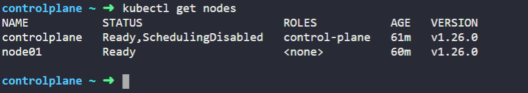

# Nâng cấp Kubernetes Cluster

### 1. Nâng cấp Kubernetes Cluster dùng kubeadm

Đối với các Kubernetes Cluster được khởi tạo bằng kubeadm thì chúng ta có thể dùng kubeadm để nâng cấp lên phiên bản mới một cách đơn giản và dễ dàng.

Lưu ý: Trong ví dụ sau chúng ta sẽ nâng cấp một Kubernetes Cluster từ phiên bản 1.16.8 lên 1.17.4 trên CentOS 7, công cụ kubeadm chỉ cho phép chúng ta nâng cấp lên phiên bản(Version) Minor tiếp theo 1 cấp thôi hoặc lên các bản Patch cùng Minor đó, ví dụ từ 1.16.x thì nâng lên được 1.17.x, tuy nhiên nếu chúng ta có Kubernetes Cluster đang chạy phiên bản 1.14.x cần nâng lên 1.17.x thì đầu tiên chúng ta phải nâng lên 1.15.x sau đó lên 1.16.x và cuối cùng lên 1.17.x

#### Kiểm tra phiên bản

- Đầu tiên chúng ta phải kiểm tra phiên bản hiện tại của Kubernetes Cluster của chúng ta đang dự định nâng cấp:

    ` kubectl version --short `

    <h3 align="center"></h3>

- Kiểm tra chi tiết phiên bản của từng node(bao gồm cả master node):

    ` kubectl get nodes `

<h3 align="center"></h3>

- Chúng ta cũng có thể kiểm tra phiên bản của các thành phần như kubelet hay kube-controller-manager:

    ` kubectl get pods -n kube-system `

    <h3 align="center"></h3>

#### 1.2. Nâng cấp công cụ kubeadm

- Upgrade kubeadm:

    ``` 
    apt-mark unhold kubeadm && \
    apt-get update && apt-get install -y kubeadm='1.27.0-*' && \
    apt-mark hold kubeadm 
    
    ```

- Kiểm tra version kubeadm

    ` kubeadm version `

    <h3 align="center"></h3>

#### 1.3. Nâng cấp Master Node

- Plan upgrade

    ```
    controlplane ~ ➜  kubeadm upgrade plan
    [upgrade/config] Making sure the configuration is correct:
    [upgrade/config] Reading configuration from the cluster...
    [upgrade/config] FYI: You can look at this config file with 'kubectl -n kube-system get cm kubeadm-config -o yaml'
    [preflight] Running pre-flight checks.
    [upgrade] Running cluster health checks
    [upgrade] Fetching available versions to upgrade to
    [upgrade/versions] Cluster version: v1.26.0
    [upgrade/versions] kubeadm version: v1.27.0
    I0109 22:34:34.099711   19391 version.go:256] remote version is much newer: v1.29.0; falling back to: stable-1.27
    [upgrade/versions] Target version: v1.27.9
    [upgrade/versions] Latest version in the v1.26 series: v1.26.12
    W0109 22:34:34.381253   19391 compute.go:307] [upgrade/versions] could not find officially supported version of etcd for    Kubernetes v1.27.9, falling back to the nearest etcd version (3.5.7-0)

    Components that must be upgraded manually after you have upgraded the control plane with 'kubeadm upgrade apply':
    COMPONENT   CURRENT       TARGET
    kubelet     2 x v1.26.0   v1.26.12

    Upgrade to the latest version in the v1.26 series:

    COMPONENT                 CURRENT   TARGET
    kube-apiserver            v1.26.0   v1.26.12
    kube-controller-manager   v1.26.0   v1.26.12
    kube-scheduler            v1.26.0   v1.26.12
    kube-proxy                v1.26.0   v1.26.12
    CoreDNS                   v1.9.3    v1.10.1
    etcd                      3.5.6-0   3.5.7-0

    You can now apply the upgrade by executing the following command:

            kubeadm upgrade apply v1.26.12

    _____________________________________________________________________

    Components that must be upgraded manually after you have upgraded the control plane with 'kubeadm upgrade apply':
    COMPONENT   CURRENT       TARGET
    kubelet     2 x v1.26.0   v1.27.9

    Upgrade to the latest stable version:

    COMPONENT                 CURRENT   TARGET
    kube-apiserver            v1.26.0   v1.27.9
    kube-controller-manager   v1.26.0   v1.27.9
    kube-scheduler            v1.26.0   v1.27.9
    kube-proxy                v1.26.0   v1.27.9
    CoreDNS                   v1.9.3    v1.10.1
    etcd                      3.5.6-0   3.5.7-0

    You can now apply the upgrade by executing the following command:

            kubeadm upgrade apply v1.27.9

    Note: Before you can perform this upgrade, you have to update kubeadm to v1.27.9.

    _____________________________________________________________________


    The table below shows the current state of component configs as understood by this version of kubeadm.
    Configs that have a "yes" mark in the "MANUAL UPGRADE REQUIRED" column require manual config upgrade or
    resetting to kubeadm defaults before a successful upgrade can be performed. The version to manually
    upgrade to is denoted in the "PREFERRED VERSION" column.

    API GROUP                 CURRENT VERSION   PREFERRED VERSION   MANUAL UPGRADE REQUIRED
    kubeproxy.config.k8s.io   v1alpha1          v1alpha1            no
    kubelet.config.k8s.io     v1beta1           v1beta1             no
    _____________________________________________________________________


    ```

- Chọn version và upgrade:

    ` kubeadm upgrade apply v1.27.0 `

- 

    ` kubeadm upgrade node `

- Thực hiện move hết những Pod đang chạy trên node này để giải phóng nó :

    ` kubectl drain controlplane --ignore-daemonsets `

- Upgrade kubelet and kubectl

    ```
    apt-mark unhold kubelet kubectl && \
    apt-get update && apt-get install -y kubelet='1.27.x-*' kubectl='1.27.x-*' && \
    apt-mark hold kubelet kubectl
    
    ```

- Restart the kubelet:

    ```
    systemctl daemon-reload
    systemctl restart kubelet
    
    ```

- Uncordon the node

    kubectl uncordon controlplane

- Check verison

    ` kubectl get nodes  `

    <h3 align="center"></h3>

#### 1.4. Nâng cấp Worker Node

Chúng ta sẽ làm tương tự như Master Nodes

https://kubernetes.io/docs/tasks/administer-cluster/kubeadm/kubeadm-upgrade/
