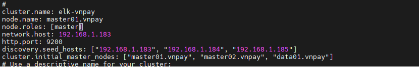
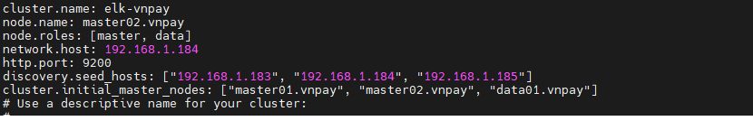
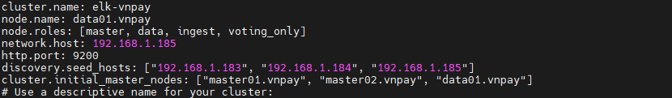

# Hướng dẫn setup cluster Elasticsearch

- Mô hình triển khai sẽ là 3 node, theo khuyến cáo để triển khai mô hình cluster sẽ là 2n + 1

    - Master01: 192.168.1.183 , node.role: master

    - Master02: 192.168.1.184 , node.role: master, data, ingest

    - Data01: 192.168.1.185  , node.role:  data, ingset, voting_only

    - Để hiểu thêm các role nghĩa là gì, bạn có thể xem [ tại đây](https://github.com/phancong0897/Congphan/blob/master/Log/ELK-stack/L%C3%BD%20Thuy%E1%BA%BFt/%5B5%5DElasticsearch-cluster.md)

- Ta sẽ tiến hành cài đặt Elasticsearch theo hướng dẫn ở [ bài trước ](https://github.com/phancong0897/Congphan/blob/master/Log/ELK-stack/LAB/install-config-ELK.md)

- Cấu hình trên node master01

    - Thêm vào file /etc/elasticsearch.yml các dòng sau

    ```
    cluster.name: elk-vnpay
    node.name: master01.vnpay
    node.roles: [master]
    network.host: 192.168.1.183
    http.port: 9200
    discovery.seed_hosts: ["192.168.1.183", "192.168.1.184", "192.168.1.185"]
    cluster.initial_master_nodes: ["master01.vnpay", "master02.vnpay", "data01.vnpay"]

    ```

    <h3 align="center"></h3>

- Cấu hình trên node master01

    - Thêm vào file /etc/elasticsearch.yml các dòng sau

    ```
    cluster.name: elk-vnpay
    node.name: master02.vnpay
    node.roles: [master, data]
    network.host: 192.168.1.184
    http.port: 9200
    discovery.seed_hosts: ["192.168.1.183", "192.168.1.184", "192.168.1.185"]
    cluster.initial_master_nodes: ["master01.vnpay", "master02.vnpay", "data01.vnpay"]

    ```

    <h3 align="center"></h3>

- Cấu hình trên node Data01

    - Thêm vào file /etc/elasticsearch.yml các dòng sau

    ```
    cluster.name: elk-vnpay
    node.name: data01.vnpay
    node.roles: [master, data, ingest, voting_only]
    network.host: 192.168.1.185
    http.port: 9200
    discovery.seed_hosts: ["192.168.1.183", "192.168.1.184", "192.168.1.185"]
    cluster.initial_master_nodes: ["master01.vnpay", "master02.vnpay", "data01.vnpay"]

    ```

    <h3 align="center"></h3>
