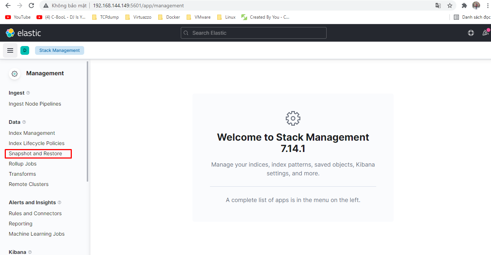
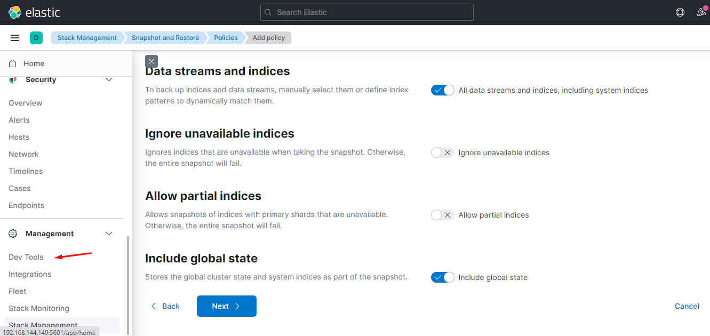
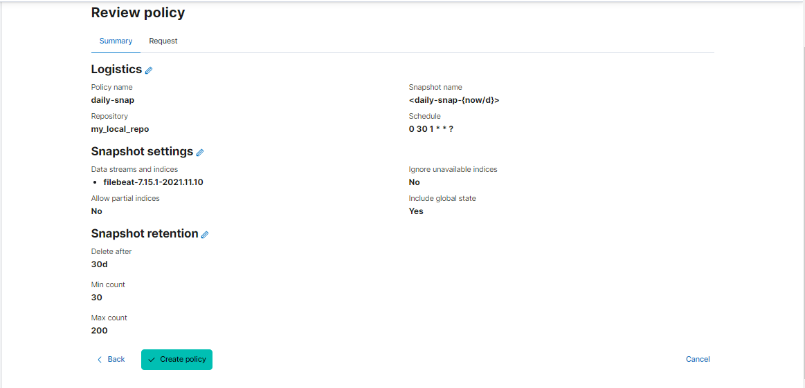

# Elasticsearch: Snapshot and Restore

### 1. Snapshot

- Elasticsearch cung cấp cho chúng ta module snapshot để tạo nhanh các bản snapshot lưu trữ các indices hoặc một phần hoặc toàn bộ các cluster tại một thời điểm nào đó. Snapshot tỏ ra mạnh mẽ và hữu dụng nhưng có một vài khuyết điểm mà chúng ta phải lưu ý như sau:

- A snapshot of an index created in 6.x can be restored to 7.x.

	- Snapshot tạo từ phiên bản 5.x có thể phục hồi trong phiên bản 6.x.
	
	- Snapshot tạo từ phiên bản 2.x có thể phục hồi trong phiên bản 5.x.
	
	- Snapshot tạo từ phiên bản 1.x có thể phục hồi trong phiên bản 2.x.
	
	- Các snapshot không tương thích với các phiên bản thì không thể phục hồi được, hãy lưu ý điều này khi update các version mới cho elaticsearch. 

Bạn không thể sao lưu dữ liêu Elasticsearch chỉ bằng thao tác đơn giản là copy folder. Elasticsearch có thể bị thanh đổi nội dung, cấu trúc dữ liệu khi đang chạy. Việc khôi phục dữ liệu từ folder sao chép có thể bị lỗi 

Vì vậy cách nhanh và duy nhất để sao lưu là snapshot

- ElasticSearch snapshot là một bản sao dự phòng của một cluster Elasticsearch đang chạy. Snapshot này có thể là toàn bộ cluster hoặc các index và luồng dữ liệu cụ thể trong một cluster cụ thể. Trước khi đi sâu vào việc tạo snapshot, chúng ta sẽ cần tạo một Repository với mục đích lưu trữ snapshot vì nhiều dịch vụ của Elasticsearch sử dụng API snapshot để thực hiện các tác vụ này. Một số tác vụ đó bao gồm:

	- Put snapshot repository
	
	- Verify snapshot repository
	
	- Get snapshot repository
	
	- Delete snapshot repository
	
	- Clean up snapshot repository
	
	- Create snapshot
	
	- Clone snapshot
	
	- Get snapshot
	
	- Get snapshot status
	
	- Restore snapshot
	
	- Delete snapshot
	
### Snapshot và Restore

##### Trước tiên mình cần tạo một snapshot repository

- Truy cập server tạo thư mục repository và phân quyền cho thư mục:

	``` 
	mkdir my_local_repo
	chown elasticsearch:elasticsearch my_local_repo/
	```
- Thêm path repo vào file /etc/elasticsearch/elasticsearch.yml vào cuối dòng:   ` path.repo my_local_repo ` , Ở đây tôi lưu các bản snapshot ở my_local_repo

	<h3 align="center"></h3>
	
- Restart service elasticsearch
	
	` systemctl restart elasticsearch `
	
- Truy cập kiban để tạo repository :  home --> stack management
	
	<h3 align="center"></h3>

- Chọn snapshot and restore

	<h3 align="center"></h3>

- Register repository

	<h3 align="center"></h3>
	
- Đặt tên cho repo , chọn type và next

	<h3 align="center"></h3>
	
- Chọn location cho repo, chọn đúng thư  mục chúng ta vừa tạo ở trên hay path.repo trong file config sau đó register

	<h3 align="center"></h3>
	
- Như vậy chũng ta đã tạo xong repository và connect thành công

	<h3 align="center"></h3>
	
#### Tạo policy snapshot

- Truy cập policies ddeert truy cập

	<h3 align="center"></h3>
	
- Đặt tên Policies , repository và thời gian snapshot
	
	<h3 align="center"></h3>
	
- Phần snapshot setting, Data streams and indices, chúng ta có thể snapshot all, hoặc hỉ định file index cần backup.

	- Ta có thể truy cập devtools của elasticsearch sử dụng câu lệnh Get _cat/indices để kiểm tra all indices
	
	<h3 align="center"></h3>
	
	<h3 align="center"></h3>
	
	- Quay về snapshot , phần Data streams and indices chúng ta sẽ snapshot filebeat-7.15.1-20211110 , đây là file index của ngày 10-11-20211110
	
	<h3 align="center"></h3>
	
	- Chọn thời gian xóa file , số lượng file tối thiểu và tối đa
	
	<h3 align="center"></h3>
	
	- Review lại policies và create
	
	<h3 align="center"></h3>
	
- Như vậy chúng ta đã tạo xong polici snapshot, chúng ta có thể click vào hình tam giác để chạy snapshot luôn.

	<h3 align="center"></h3>
	
- Các bản snapshot được lưu ở task snapshot

	<h3 align="center"></h3>
	
#### Restore elasticsearch

Như ở trên, ta đã backup filebeat của ngày 10-11-2021, chúng ta có thể truy cập discover để kiểm tra log của ngày 10-11-2021

<h3 align="center"></h3>

Đặt giả định trường hợp file log của ngày 10-11-2021 bị xóa, và ta sẽ phải restore lại bản snapshot để khôi phục lại filebeat ngà 10-11-2021

- Xóa filebeat-7.15.1-20211110

<h3 align="center"></h3>

- Giờ truy cập ngày 10-11-2021 sẽ không còn log nữa:  

<h3 align="center"></h3>

- Giờ ta sẽ tiến hành restore lại bản snapshot filebeat-7.15.1-20211110

- Truy cập stack management --> snapshot and restore --? snapshot , chọn bản snapshot và click vào restore

<h3 align="center"></h3>

- Phần data streams and indices , ta sẽ chọn đúng filebeat-7.15.1-20211110 để restore, nếu không chọn đúng file thì khi restore sẽ báo lỗi

<h3 align="center"></h3>

- Chọn next

<h3 align="center"></h3>

- Chọn restore để tiến hành restore

<h3 align="center"></h3>

- Thông báo đã restore thành công

<h3 align="center"></h3>

- Ta kiểm tra filebeat-7.15.1-20211110 đã restore

<h3 align="center"></h3>

- Kiểm tra log đã có log của ngày 10-11-2021

<h3 align="center"></h3>

#### Chúc các bạn thành công