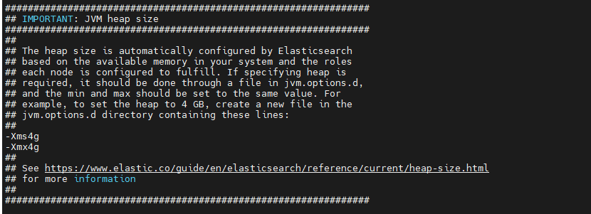
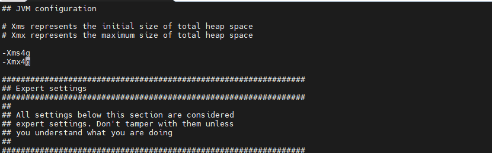
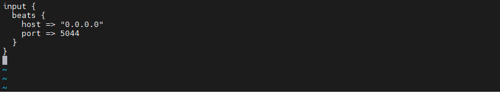
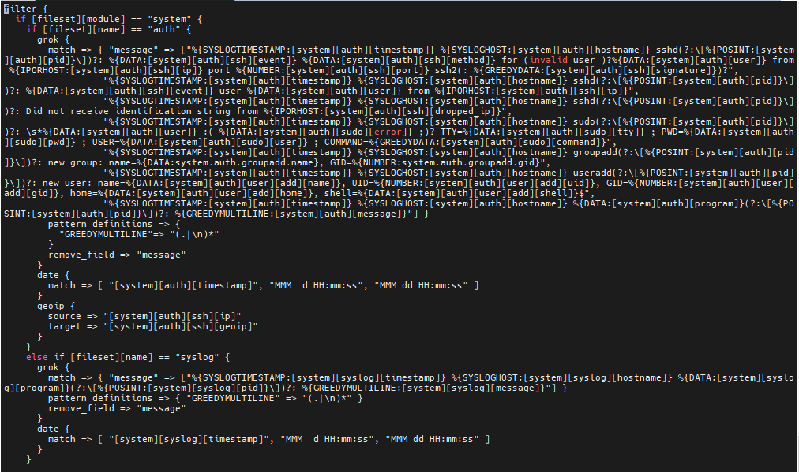
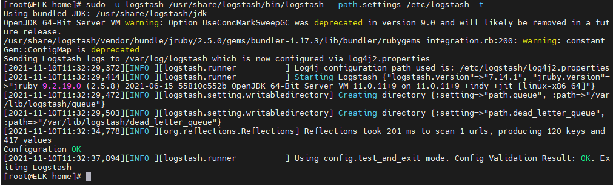

# Hướng dẫn cài đặt hệ thống ELK

# Triển khai ELK

#### Cài đặt Elasticsearch

- Cài đặt java

	` yum install –y java-1.8.0-openjdk-headless.x86_64 `

- Cài đặt elasticsearch
	
	` rpm -ivh elasticsearch-7.14.1-x86_64.rpm `
	
	
- Cấu hình Javaheap cho Elasticsearch

	Lưu ý: Khuyến nghị cấu hình Elasticsearch sử dụng từ 50%-70% tổng dung lượng RAM của máy hiện có

	- Truy cập file jvm.options tại đường dẫn: /etc/elasticsearch/jvm.options bằng câu lệnh:

	` vi /etc/elasticsearch/jvm.options `
	
	- Sửa 2 tham số “-Xms” và “-Xmx” theo thông số mong muốn, 
	
	Xmx <size> - Đặt kích thước heap Java tối đa
	
	Xms <size> - Đặt kích thước heap Java ban đầu
	
	<h3 align="center"></h3>
	
- Cấu hình file config của elasticsearch

	Trong file cấu hình chúng ta cần chú ý các tham số sau để mình cấu hình cluster, trong các bài viết sau tôi sẽ hướng dẫn cấu hình cluster elasticsearch, bài viết này tôi chỉ hướng dẫn các bạn cài đặt cấu hình standlone
	
	```
	cluster.name: vnpay
	
	node.name: node-1
	
	network.host: 0.0.0.0
	
	http.port: 9200
	
	discovery.seed_hosts: ["192.168.144.149"]
	
	cluster.initial_master_nodes: ["node-1"]
	
- Cấu hình firewall

	```
	firewall-cmd --zone=public --add-port=9200/tcp --permanent
	firewall-cmd --reload
	
	```
- Cấu hình Selinux

	`  setsebool -P httpd_can_network_connect on `
	
- Khởi chạy dịch vụ Elasticsearch

	```
	systemctl start elasticsearch.service
	systemctl enable --now elasticsearch.service
	systemctl restart elasticsearch.service
	```
	
### Cài đặt Kibana

- Cài đặt kibana bằng câu lệnh sau:

	` rpm -ivh kibana-7.14.1-x86_64.rpm `

- Cấu hình Kibana truy vấn dữ liệu trên Elasticsearch, Sửa file cấu hình kibana.yml trong thư mục: /etc/kibana/kibana.yml 
	
	- Cấu hình truy cập kibana từ mọi IP:
	
	` echo 'server.host: 0.0.0.0' >> /etc/kibana/kibana.yml `
	
	- Phần elasticsearch.host do mô hình cài đặt các service của elk đều cài đặt trên 1 server nên sẽ để là http://localhost:9200
	
- Khởi chạy dịch vụ Kibana

	```
	systemctl start kibana.service
	systemctl enable --now kibana.service
	systemctl restart kibana.service
	
	```
- Mở port firewall

	```
	firewall-cmd --zone=public --add-port=5601/tcp --permanent
	firewall-cmd --reload
	
	```

### Cài đặt Logstash

- Cài đặt logstash bằng lệnh:

	` rpm -ivh logstash-7.14.1-x86_64.rpm `

- Cấu hình Javaheap cho Elasticsearch

	Lưu ý: Khuyến nghị cấu hình Elasticsearch sử dụng từ 50%-70% tổng dung lượng RAM của máy hiện có

	- Truy cập file jvm.options tại đường dẫn: /etc/logstash/jvm.options bằng câu lệnh:

	` vi /etc/logstash/jvm.options `
	
	- Sửa 2 tham số “-Xms” và “-Xmx” theo thông số mong muốn, 
	
	Xmx <size> - Đặt kích thước heap Java tối đa
	
	Xms <size> - Đặt kích thước heap Java ban đầu
	
	<h3 align="center"></h3>
	
- Cấu hình Logstash lưu trữ dữ liệu vào Elasticsearch

	- Cấu hình input: file cấu hình tại /etc/logstash/conf.d/02-beats-input.conf, phần này sẽ cấu hình để nó nhân đầu vào do Beats gửi đến cổng beats, thực hiện lệnh sau để tạo file 02-beats-input.conf
	
	```
	input {
		beats {
			host => "0.0.0.0"
			port => 5044
		}
	}

	```
	<h3 align="center"></h3>
	
	- Cấu hình đầu ra, file cấu hình tại /etc/logstash/conf.d/30-elasticsearch-output.conf, phần này sẽ cấu hình sau khi Logstash nhận dữ liệu đầu vào từ Beats, nó xử lý rồi gửi đến Elasticsearch (localhost:9200). Thực hiện lệnh để tạo file 30-elasticsearch-output.conf
	
	```
	output {
		elasticsearch {
			hosts => ["localhost:9200"]
			manage_template => false
		index => "%{[@metadata][beat]}-%{[@metadata][version]}-%{+YYYY.MM.dd}"
		}
	}
	
	```
	
	- Ngoài ra nếu muốn lọc các log, định dạng lại các dòng log ở dạng dễ đọc, dễ hiểu hơn thì cấu hình filter tại file /etc/logstash/conf.d/10-syslog-filter.conf, ví dụ sau là cấu hình định dạng lại cấu trúc system log, lấy theo hướng dẫn tại document của Logstash
	
	```
	filter {
		if [fileset][module] == "system" {
			if [fileset][name] == "auth" {
			grok {
				match => { "message" => ["%{SYSLOGTIMESTAMP:[system][auth][timestamp]} %{SYSLOGHOST:[system][auth][hostname]} sshd(?:\[%{POSINT:[system][auth][pid]}\])?: %{DATA:[system][auth][ssh][event]} %{DATA:[system][auth][ssh][method]} for (invalid user )?%{DATA:[system][auth][user]} from %{IPORHOST:[system][auth][ssh][ip]} port %{NUMBER:[system][auth][ssh][port]} ssh2(: %{GREEDYDATA:[system][auth][ssh][signature]})?",
						"%{SYSLOGTIMESTAMP:[system][auth][timestamp]} %{SYSLOGHOST:[system][auth][hostname]} sshd(?:\[%{POSINT:[system][auth][pid]}\])?: %{DATA:[system][auth][ssh][event]} user %{DATA:[system][auth][user]} from %{IPORHOST:[system][auth][ssh][ip]}",
						"%{SYSLOGTIMESTAMP:[system][auth][timestamp]} %{SYSLOGHOST:[system][auth][hostname]} sshd(?:\[%{POSINT:[system][auth][pid]}\])?: Did not receive identification string from %{IPORHOST:[system][auth][ssh][dropped_ip]}",
						"%{SYSLOGTIMESTAMP:[system][auth][timestamp]} %{SYSLOGHOST:[system][auth][hostname]} sudo(?:\[%{POSINT:[system][auth][pid]}\])?: \s*%{DATA:[system][auth][user]} :( %{DATA:[system][auth][sudo][error]} ;)? TTY=%{DATA:[system][auth][sudo][tty]} ; PWD=%{DATA:[system][auth][sudo][pwd]} ; USER=%{DATA:[system][auth][sudo][user]} ; COMMAND=%{GREEDYDATA:[system][auth][sudo][command]}",
						"%{SYSLOGTIMESTAMP:[system][auth][timestamp]} %{SYSLOGHOST:[system][auth][hostname]} groupadd(?:\[%{POSINT:[system][auth][pid]}\])?: new group: name=%{DATA:system.auth.groupadd.name}, GID=%{NUMBER:system.auth.groupadd.gid}",
						"%{SYSLOGTIMESTAMP:[system][auth][timestamp]} %{SYSLOGHOST:[system][auth][hostname]} useradd(?:\[%{POSINT:[system][auth][pid]}\])?: new user: name=%{DATA:[system][auth][user][add][name]}, UID=%{NUMBER:[system][auth][user][add][uid]}, GID=%{NUMBER:[system][auth][user][add][gid]}, home=%{DATA:[system][auth][user][add][home]}, shell=%{DATA:[system][auth][user][add][shell]}$",
						"%{SYSLOGTIMESTAMP:[system][auth][timestamp]} %{SYSLOGHOST:[system][auth][hostname]} %{DATA:[system][auth][program]}(?:\[%{POSINT:[system][auth][pid]}\])?: %{GREEDYMULTILINE:[system][auth][message]}"] }
				pattern_definitions => {
				"GREEDYMULTILINE"=> "(.|\n)*"
				}
				remove_field => "message"
			}
			date {
				match => [ "[system][auth][timestamp]", "MMM  d HH:mm:ss", "MMM dd HH:mm:ss" ]
			}
			geoip {
				source => "[system][auth][ssh][ip]"
				target => "[system][auth][ssh][geoip]"
			}
			}
			else if [fileset][name] == "syslog" {
			grok {
				match => { "message" => ["%{SYSLOGTIMESTAMP:[system][syslog][timestamp]} %{SYSLOGHOST:[system][syslog][hostname]} %{DATA:[system][syslog][program]}(?:\[%{POSINT:[system][syslog][pid]}\])?: %{GREEDYMULTILINE:[system][syslog][message]}"] }
				pattern_definitions => { "GREEDYMULTILINE" => "(.|\n)*" }
				remove_field => "message"
			}
			date {
				match => [ "[system][syslog][timestamp]", "MMM  d HH:mm:ss", "MMM dd HH:mm:ss" ]
			}
			}
		}
	}
	
	```
	
	<h3 align="center"></h3>
	
- Thực hiện lệnh sau để xác định xem cấu hình có lỗi gì không

	` sudo -u logstash /usr/share/logstash/bin/logstash --path.settings /etc/logstash -t `
	
	Có thông báo Config Validation Result: OK. là được
	
	<h3 align="center"></h3>

- Có thể cần mở cổng 5044 ở trên để nó nhận dữ liệu từ Server khác

	```
	firewall-cmd --permanent --add-port=5044/tcp
	firewall-cmd --permanent --add-port=5044/tcp
	firewall-cmd --reload
	```
- Kích hoạt dịch vụ
	
	```
	systemctl enable logstash
	systemctl start logstash
	```
	
##### Đến đây đã có một ELK hệ thống quản lý logs trung tâm. Việc tiếp theo là cài đặt để các logs từ các Server khác nhau gửi đến trung tâm này.