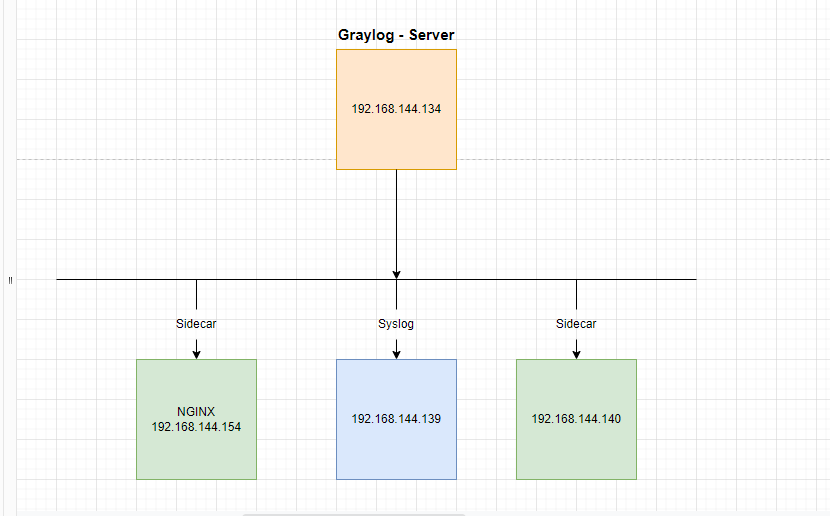

# Thu thập log của Linux thông qua graylog sidecar

Graylog Sidecar là 1 input có khả năng quản lý cấu hình phía client để thu thập log. Graylog Sidecar hỗ trợ cả window lẫn linux. Sidecar nhận chỉ thị từ Graylog server để cấu hình việc đẩy log, còn để có thể đẩy log từ client về server có thể dùng filebeat hoặc nxlog.

### Mô hình

Mô hình lab được triển khai như sau:

<h3 align="center"></h3>

### Cài đặt Sidecar và filebeat

#### Cài đặt File Beats

- Để thu thập log, cần phải kết hợp với thành phần collector là filebeat hoặc NXlog. Trong hướng dẫn này, mình sẽ sử dụng thành phần collector là filebeat.

    - Để cài filebeat, ta vào link sau đây để tìm và tải về phiên bản hệ điều hành thích hợp, ở đây mình sử dụng CentOS 7 nên mình sẽ tải về phiên bản sau :

    ` wget https://artifacts.elastic.co/downloads/beats/filebeat/filebeat-7.4.2-x86_64.rpm `

    - Cài đặt filebeat :
    
    ` rpm -i filebeat-7.4.2-x86_64.rpm `

#### Cài đặt graylog -sidecar

- Đối với graylog 3, ta sẽ dùng bản graylog-sidecar 1.x trở lên. Có thể tham khảo các bản cài graylog-sidecar ở đây , để chọn phiên bản phù hợp với hệ điều hành của máy.

    - Tiến hành tải về phiên bản phù hợp với hệ điều hành :
    
    ` wget https://github.com/Graylog2/collector-sidecar/releases/download/1.0.2/graylog-sidecar-1.0.2-1.x86_64.rpm `

    - Cài đặt file graylog-sidecar :
    
    ```
    rpm -i graylog-sidecar-1.0.2-1.x86_64.rpm
    graylog-sidecar -service install
    ```

- Trước khi cấu hình sidecar, ta cần đăng nhập vào Web interface của graylog-server để tạo và lấy TOKEN :

    - Vào web interface của graylog, truy cập tab System/Sidecars, sau đó chọn Create or reuse a token for the graylog-sidecar user :

    <h3 align="center"></h3>

    - Tiếp theo nhập tên và chọn Create Token để tạo token :

    <h3 align="center"></h3>

    Sau đó chọn đúng token vừa tạo và click copy to clipboard để lấy mã token

    Mã token sẽ có dạng như sau :

    ` 1hk68ojfgkhgnv58hp8su25q9ba5n8tktvjejdsndasq03eebgoo `

- Quay lại máy graylog-sidecar (client01) để chỉnh sửa file config, các thao tác sửa đổi sẽ được thự hiện ở file /etc/graylog/sidecar/sidecar.yml :

    - Khai báo ip của graylog-server :

    ` sed -i 's|#server_url: "http://127.0.0.1:9000/api/"|server_url: "http://192.168.144.134:9000/api/"|' /etc/graylog/sidecar/sidecar.yml `

    - Thay giá trị api_token bằng chuỗi token đã tạo trước đó :
    
    ` sed -i 's|server_api_token: ""|server_api_token: "1hk68ojfgkhgnv58hp8su25q9ba5n8tktvjejdsndasq03eebgoo"|' /etc/graylog/sidecar/sidecar.yml `

    - Sửa đổi và bỏ comment 1 số dòng để graylog-sidecar hoạt động :

    ```
    sed -i 's|#log_path: "/var/log/graylog-sidecar"|log_path: "/var/log/graylog-sidecar"|' /etc/graylog/sidecar/sidecar.yml
    sed -i 's|#tls_skip_verify: false|tls_skip_verify: true|' /etc/graylog/sidecar/sidecar.yml
    sed -i 's|#node_name: ""|node_name: "client01"|' /etc/graylog/sidecar/sidecar.yml

    ```

    - Tiến hành khởi động dịch vụ graylog-sidecar :

    ```
    systemctl start graylog-sidecar.service
    systemctl enable graylog-sidecar.service
    ```

#### Cấu hình sidecar trên Web interface của graylog-server .

- Khai báo input cho sidecar

    - Để graylog-server biết nơi cần nhận log, ta cần khai báo input cho graylog-server :
    
    - Truy cập System/Inputs chọn input là Beats và bấm Launch new input :

    <h3 align="center"></h3>

    - Có thể tham khảo edit input như sau :

    <h3 align="center"></h3>

    - Sau khi chỉnh sửa input, ta bấm save để lưu lại cấu hình . 

    <h3 align="center"></h3>

    - Sau khi tạo, input sẽ có dạng như sau :

    <h3 align="center"></h3>

- Cấu hình sidecars

    - Truy cập vào System/Sidecars chọn Configuration sau đó chọn Create Configuration :

    <h3 align="center"></h3>

    - Khai báo các thông số và sửa địa chỉ ip thành địa chỉ của Graylog-server như sau :

    <h3 align="center"></h3>

    - Chọn tab Overview sau đó chọn Manage sidecar.

    <h3 align="center"></h3>

    - Tích chọn filebeat và chọn cấu hình configuration mới tạo.

    <h3 align="center"></h3>

    - Chọn Confim để tiếp tục 

    <h3 align="center"></h3>

- Kiểm tra kết quả

    - Trên web interface của server, vào tab Search.

    <h3 align="center"></h3>
