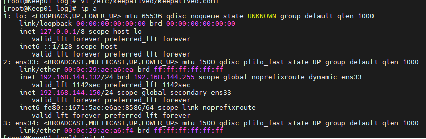
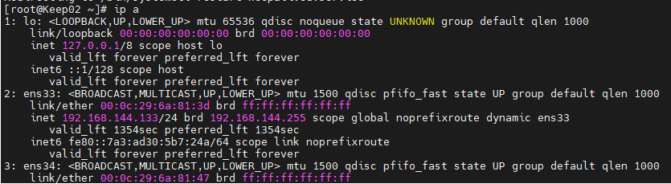
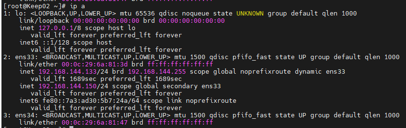

# Cấu hình Keepalive IP Failover cho Webserver sử dụng NginX

# Mô hình Lab Keepalived IP Failover

Trong mô hình lab của bài này, ta sẽ có 2 Nginx Web Server (bạn có thể đổi thành HAProxy tùy ý) phục vụ xử lý request HTTP Web cơ bản. Hai Nginx Keep01 và Keep02 này sẽ được cấu hình dùng chung một VIP là 192.168.144.150. Bình thường thì VIP này sẽ do node Master phụ trách, node Backup sẽ ở trạng thái chờ.

<h3 align="center"></h3>

Khi có sự cố xảy ra với node Master như die server hay dịch vụ die thì node Backup sẽ nhận lấy VIP này và chịu trách nhiệm xử lý tiếp nội dung dịch vụ đang chạy cụ thể ở bài lab này là Nginx Web Server.

<h3 align="center"></h3>

### Cài đặt chương trình Web Server

- Chúng ta sẽ thực hiện cài đặt chương trình Web Server Nginx trên cả 2 server để test chức năng cơ bản của máy chủ web trên cả 2 Web Server sẽ được cấu hình. Gói chương trình “nginx” nằm ở EPEL Repository.

    ```
    
    yum install -y epel-release 
    yum install -y nginx
    systemctl start nginx

    ```

- Webserver 1: Tạo file html cơ bản

    ```

    rm -rf /usr/share/nginx/html/*
    vi /usr/share/nginx/html/index.html
    <h1> BAN DANG TRUY CAP WEB master - 192.168.144.132 </h1>

    ```

- Webserv 2: Tạo file html cơ bản

    ```

    rm -rf /usr/share/nginx/html/*
    vi /usr/share/nginx/html/index.html
    <h1> BAN DANG TRUY CAP WEB backup - 192.168.144.133 </h1>

    ```

- Mở firewall truy cập http

    ```
    
    firewall-cmd --zone=public --add-service=http --permanent
    firewall-cmd --reload

    ```

- Truy cập theo IP của Webserver để kiểm tra dịch vụ web đã hoạt động chưa.

#### Cài đặt chương trình Keepalived

- Hiện tại chương trình Keepalived đã có trên các repository mặc định của CentOS nên bạn dễ dàng cài đặt với lệnh ‘yum‘. Điểm trừ duy nhất là phiên bản Keepalived trên các Repository thường không phải bản mới nhất. Bạn cần thực hiện cài đặt chương trình Keepalived trên cả 2 con WEB1 và WEB2, với các lệnh yum dưới đây sẽ cài đặt chương trình hỗ trợ và cả ‘Keepalived‘.

    ```

    yum groupinstall -y "Development Tools" 
    
    yum install -y gcc kernel-headers kernel-devel curl gcc openssl-devel libnl3-devel net-snmp-devel psmisc ipset-libs
    
    yum install -y keepalived

    ```

#### Cấu hình dịch vụ Keepalived

Cấu hình trên 2 web

- Cấu hình cho phép gắn địa chỉ IP ảo lên card mạng và IP Forward.

    ```
    echo "net.ipv4.ip_nonlocal_bind = 1" >> /etc/sysctl.conf
    echo "net.ipv4.ip_forward = 1" >> /etc/sysctl.conf
    sysctl -p

    ```

- Cú pháp cấu hình Keepalived cơ bản

    ```
    global_defs {
        notification_email {
            admin@cuongquach.com
        }
        notification_email_from keepalived-web1@cuongquach.com
        smtp_server x.x.x.x
        smtp_connect_timeout 30

    }

    vrrp_script chk_haproxy {
            script "command"     
            interval <time>
            weight <n>
        }

    vrrp_instance string {
        state MASTER|BACKUP
        interface string
        mcast_src_ip @IP
        virtual_router_id num
        priority num
        advert_int num
        smtp_alert
        authentication {
            auth_type PASS|AH
            auth_pass string
        }
        virtual_ipaddress { # Block limited to 20 IP addresses
            @IP
            @IP
        }
        notify_master "/path_to_script/script_fault.sh <arg_list>"
        notify_backup "/path_to_script/script_fault.sh <arg_list>"
        notify_fault "/path_to_script/script_fault.sh <arg_list>"
    }

    ```

    - Để cấu hình dịch vụ keepalived, ta cần phải chỉnh sửa file /etc/keepalived/keepalived.conf. Một số block cấu hình đáng chú ý trong file này như sau:

        - global_defs: cấu hình thông tin toàn cục (global) cho keepalived như gởi email thông báo tới đâu, tên của cluster đang cấu hình.

        - vrrp_script: chứa script, lệnh thực thi hoặc đường dẫn tới script kiểm tra dịch vụ (Ví dụ: nếu dịch vụ này down thì keepalived sẽ tự chuyển VIP sang 1 server khác).
        
        - vrrp_instance: thông tin chi tiết về 1 server vật lý trong nhóm dùng chung VRRP. Gồm các thông tin như interface dùng để liên lạc của server này, độ ưu tiên để, virtual IP tương ứng với interface, cách thức chứng thực, script kiểm tra dịch vụ….

    - Chú thích cấu hình block vrrp_instance
        
        - Trong các phần giải thích dưới, router sẽ đồng nghĩa với máy chủ dịch vụ .

        - state (MASTER|BACKUP): chỉ trạng thái MASTER hoặc BACKUP được sử dụng bởi máy chủ. Nếu là MASTER thì máy chủ này có nhiệm vụ nhận và xử lý các gói tin từ host đi lên. Nếu con MASTER tèo, những con BACKUP này sẽ dựa vào 1 cơ chế bầu chọn và nhảy lên làm Master.
        
        - interface: chỉ định cổng mạng nào sẽ sử dụng cho hoạt động IP Failover – VRRP
        
        - mcast_src_ip: địa chỉ IP thực của card mạng Interface của máy chủ tham gia vào VRRP. Các gói tin trao đổi giữa các VRRP Router sử dụng địa chỉ thực này.
        
        - virtual_router_id: định danh cho các router (ở đây là máy chủ dịch vụ) thuộc cùng 1 nhóm VRRP. Hiểu nôm na là 1 router có thể tham gia nhiều nhóm VRRP (các nhóm hoạt động động lập nhau), và VRRP-ID là tên gọi của từng nhóm.
        
        - priority: chỉ định độ ưu tiên của VRRP router (tức độ ưu tiên máy chủ dịch vụ trong quá trình bầu chọn MASTER). Các VRRP Router trong cùng một VRRP Group tiến hành bầu chọn Master sử dụng giá trị priority đã cấu hình cho máy chủ đó. Priority có giá trị từ 0 đến 255. Nguyên tắc có bản: Priority cao nhất thì nó là Master, nếu priority bằng nhau thì IP cao hơn là Master.
        
        - advert_int: thời gian giữa các lần gởi gói tin VRRP advertisement (đơn vị giây).
        
        - smtp_alert: kích hoạt thông báo bằng email SMTP khi trạng thái MASTER có sự thay đổi.
        
        - authentication: chỉ định hình thức chứng thực trong VRRP. ‘auth_type‘, sử dụng hình thức mật khẩu plaintext hay mã hoá AH. ‘auth_pass‘, chuỗi mật khẩu chỉ chấp nhận 8 kí tự.
        
        - virtual_ipaddress: Địa chỉ IP ảo của nhóm VRRP đó (Chính là địa chỉ dùng làm gateway cho các host). Các gói tin trao đổi, làm việc với host đều sử dụng địa chỉ ảo này.
        
        - notify_master: chỉ định chạy shell script nếu có sự kiện thay đổi về trạng thái MASTER.
        
        - notify_backup: chỉ định chạy shell script nếu có sự kiện thay đổi về trạng thái BACKUP.
        
        - notify_fault: chỉ định chạy shell script nếu có sự kiện thay đổi về trạng thái thất bại (fault).

- Cấu hình Keepalived trên Keep01 – MASTER

    ` vi /etc/keepalived/keepalived.conf `

    ```
    vrrp_instance VI_1 {
        interface ens33
        state MASTER
        virtual_router_id 51
        priority 101
        virtual_ipaddress {
            192.168.144.150/24
        }
        track_script {
            chk_haproxy
        }
    }

- Cấu hình Keepalived trên Keep02 – BACKUP

    ` vi /etc/keepalived/keepalived.conf `

    ```
    vrrp_instance VI_1 {
        interface ens33
        state BACKUP
        virtual_router_id 51
        priority 100
        virtual_ipaddress {
            192.168.144.150/24
        }
        track_script {
            chk_haproxy
        }
    }

    ```

- Khởi động Keepalived

    ```

    systemctl start keepalived
    systemctl enable keepalived

    ```
- Kiểm tra hoạt động Keepalived

    - Chúng ta sẽ kiểm tra xem trên server Keep01 đảm nhận vai trò MASTER đã nhận được IP ảo ‘192.168.144.150‘.

    <h3 align="center"></h3>

    <h3 align="center"></h3>

    - Trong trường hợp server MASTER down, thì địa chỉ ảo VIP 192.168.144.150 sẽ được tự động gán cho máy chủ Keep02 BACKUP lên làm MASTER.

    <h3 align="center"></h3>

    <h3 align="center"></h3>


    
