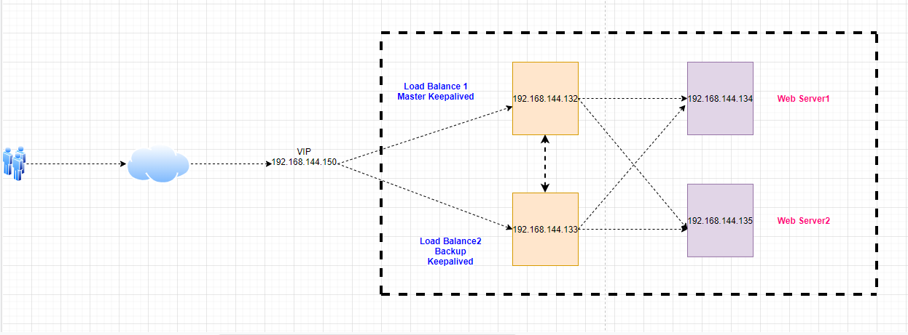

# Cấu hình Load Balancing và High availability Keepalived sử dụng NginX

Nô hình như sau:

<h3 align="center"></h3>

- Mô hình bao gồm:

    -  2 máy chủ vừa làm load balancing và làm HA 

        - LB & HA 01 : 192.168.144.132

        - LB & HA 02 :  192.168.144.133
    
    - 2 máy chủ sử dụng cho dịch vụ Web.

        - Web server 1: 192.168.144.134

        - Web server 2: 192.168.144.135

### Cấu hình load balancing

Thực hiện trên Server LB & HA 01 và LB & HA 02

- Cài đặt các Repo cần thiết:

    ```

    yum install epel-release -y 

    rpm -Uvh http://rpms.famillecollet.com/enterprise/remi-release-7.rpm 
    
    rpm -Uvh http://nginx.org/packages/centos/7/noarch/RPMS/nginx-release-centos-7-0.el7.ngx.noarch.rpm

    ```

- Chạy lệnh sau để cài đặt Nginx:

    ` yum install -y nginx `

- Khởi động Service nginx:

    ` systemctl start nginx.service && systemctl enable nginx.service `

- Tiếp theo cấu hình firewall mở port http/https, mặc định trong centos 7 sử dụng FirewallD.

    ```

    firewall-cmd --permanent --zone=public --add-service=http 
    
    firewall-cmd --permanent --zone=public --add-service=https
    
    firewall-cmd --reload   

    ```

- Thêm vào cuối file /etc/nginx/nginx.conf dòng sau:

    ```

    include /etc/nginx/upstream;

    include /etc/nginx/conf.d/*.conf;

    ```

    Và comment block server lại

    - File đầy đủ như sau:

```

    # For more information on configuration, see:
#   * Official English Documentation: http://nginx.org/en/docs/
#   * Official Russian Documentation: http://nginx.org/ru/docs/

user nginx;
worker_processes auto;
error_log /var/log/nginx/error.log;
pid /run/nginx.pid;

# Load dynamic modules. See /usr/share/doc/nginx/README.dynamic.
include /usr/share/nginx/modules/*.conf;

events {
    worker_connections 1024;
}

http {
    log_format  main  '$remote_addr - $remote_user [$time_local] "$request" '
                      '$status $body_bytes_sent "$http_referer" '
                      '"$http_user_agent" "$http_x_forwarded_for"';

    access_log  /var/log/nginx/access.log  main;

    sendfile            on;
    tcp_nopush          on;
    tcp_nodelay         on;
    keepalive_timeout   65;
    types_hash_max_size 4096;

    include             /etc/nginx/mime.types;
    default_type        application/octet-stream;

    # Load modular configuration files from the /etc/nginx/conf.d directory.
    # See http://nginx.org/en/docs/ngx_core_module.html#include
    # for more information.
    include /etc/nginx/conf.d/*.conf;

    server {
        listen       80;
        listen       [::]:80;
        server_name  _;
       # root         /usr/share/nginx/html;

        # Load configuration files for the default server block.
        #include /etc/nginx/default.d/*.conf;

        #error_page 404 /404.html;
        #location = /404.html {
        #}

        #error_page 500 502 503 504 /50x.html;
        #location = /50x.html {
        #}
    }

# Settings for a TLS enabled server.
#
#    server {
#        listen       443 ssl http2;
#        listen       [::]:443 ssl http2;
#        server_name  _;
#        root         /usr/share/nginx/html;
#
#        ssl_certificate "/etc/pki/nginx/server.crt";
#        ssl_certificate_key "/etc/pki/nginx/private/server.key";
#        ssl_session_cache shared:SSL:1m;
#        ssl_session_timeout  10m;
#        ssl_ciphers HIGH:!aNULL:!MD5;
#        ssl_prefer_server_ciphers on;
#
#        # Load configuration files for the default server block.
#        include /etc/nginx/default.d/*.conf;
#
#        error_page 404 /404.html;
#            location = /40x.html {
#        }
#
#        error_page 500 502 503 504 /50x.html;
#            location = /50x.html {
#        }
#    }
include /etc/nginx/upstream;
include /etc/nginx/conf.d/delaults.conf;
}


```

- Sử dụng thuật toán round robin để load balancing . Tạo một file tương ứng /etc/nginx/upstream. File này sẽ chứa thông tin về các cụm load balancer. Nội dung file này như sau:

    ```

    upstream backend {
    server 192.168.144.134:80 weight=3 max_fails=3 fail_timeout=10s;
    server 192.168.144.135:80 max_fails=3 fail_timeout=10s;
    }

    ```
    - Thêm vào file /etc/nginx/conf.d/vhost.conf như sau: 

    ```

    server{
     listen      80;
     server_name localhost;

     error_log  /var/log/nginx/vhost.example.com_error.log error;
     access_log  /var/log/nginx/vhost.example.com_access.log  main;
     auth_basic           "private site";
     auth_basic_user_file /usr/local/etc/.vhost.example.com.htpasswd;

     location /{
        index index.html index.php;
        proxy_pass http://backend;
        proxy_set_header        Host $host;
        proxy_set_header        X-Real-IP $remote_addr;
        proxy_set_header        X-Forwarded-For $proxy_add_x_forwarded_for;
        proxy_set_header        X-Forwarded-Proto $scheme;
     }
    }


    ```

- Restart service NginX và truy cập IP của LB & HA 01 và LB & HA 02 để kiểm tra

    ` systemctl restart nginx `

- Khi truy cập bằng IP Nginx Load balacing hoặc trỏ file host thì ta sẽ thấy request thứ nhất sẽ forward đến apache webserver 1, request thứ 2 sẽ forward đến apache webserver 2. Như vậy ta đã cấu hình xong NginX load balancing với thuật toán round robin.

### Cài đặt chương trình Keepalived

- Cài đặt các gói cần thiết:

    ```

    yum groupinstall -y "Development Tools" 
    
    yum install -y gcc kernel-headers kernel-devel curl gcc openssl-devel libnl3-devel net-snmp-devel psmisc ipset-libs
    
    yum install -y keepalived

    ```

#### Cấu hình dịch vụ Keepalived

Cấu hình trên LB & HA 01 và LB & HA 02

- Cấu hình cho phép gắn địa chỉ IP ảo lên card mạng và IP Forward.

    ```
    echo "net.ipv4.ip_nonlocal_bind = 1" >> /etc/sysctl.conf
    echo "net.ipv4.ip_forward = 1" >> /etc/sysctl.conf
    sysctl -p

    ```

- Cấu hình Keepalived trên LB & HA 01 – MASTER

    ` vi /etc/keepalived/keepalived.conf `

    ```
    vrrp_instance VI_1 {
        interface ens33
        state MASTER
        virtual_router_id 51
        priority 101
        virtual_ipaddress {
            192.168.144.110/24
        }
        track_script {
            chk_haproxy
        }
    }

- Cấu hình Keepalived trên LB & HA 02 – BACKUP

    ` vi /etc/keepalived/keepalived.conf `

    ```
    vrrp_instance VI_1 {
        interface ens33
        state BACKUP
        virtual_router_id 51
        priority 100
        virtual_ipaddress {
            192.168.144.110/24
        }
        track_script {
            chk_haproxy
        }
    }

    ```

- Khởi động Keepalived

    ```

    systemctl start keepalived
    systemctl enable keepalived

    ```
- Kiểm tra hoạt động Keepalived

- Khi cấu hình hoàn tất,
Trường hợp 1 máy chủ thuộc LB & HA 01 hoặc 02 và 1 máy chủ thuộc Webserver01 hoặc 02 đều down thì dịch vụ vẫn hoạt động bình thường nhé.


    