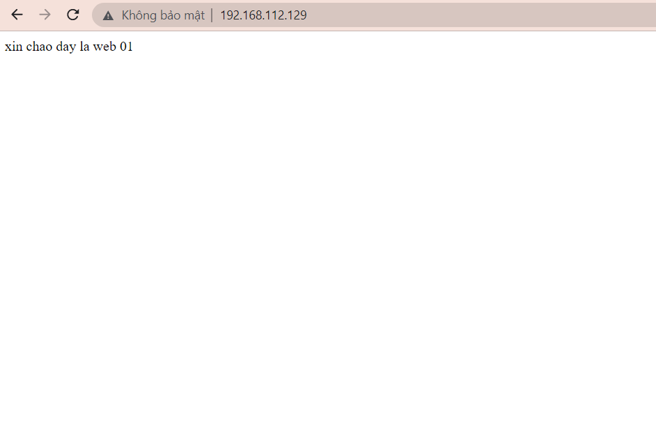
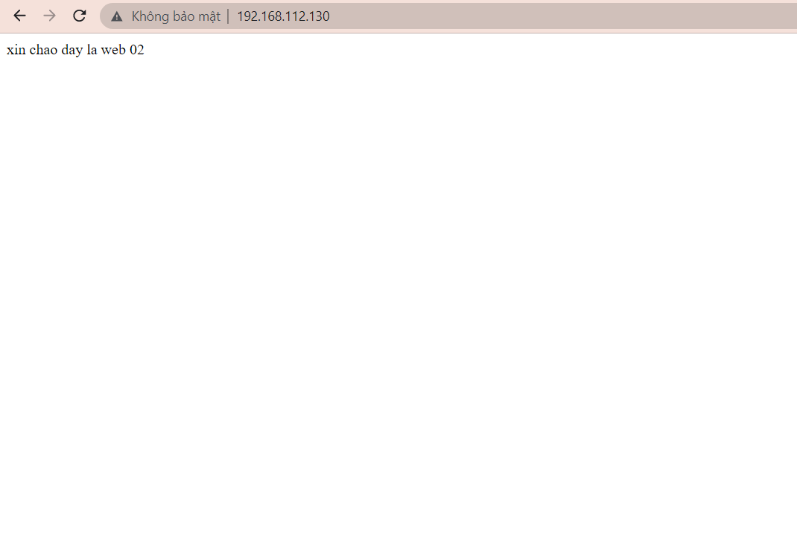
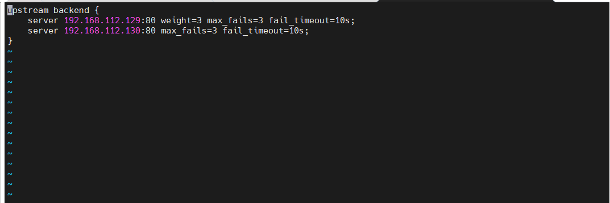

# Cấu hình Nginx làm HTTP Load Balancer cho Apache (CentOS 7)

### 1. Nginx Load Balancer là gì?

Cân bằng tải (Load balancing) là một kỹ thuật thường dùng để tối ưu hóa việc sử dụng tài nguyên, tối đa hóa thông lượng, giảm độ trễ về đảm bảo tính chịu lỗi.

Chúng ta cũng có thể sử dụng nginx như là một bộ cân bằng tải (Load balancer) để phân phối lưu lượng truy cập đến các máy chủ web nhằm mục đích cải thiện hiệu năng, khả năng mở rộng và độ tin cậy của các ứng dụng web.

Có rất nhiều thuật toán được xây dựng cho việc cân bằng tải, mỗi thuật toán đều có những ưu nhược điểm khác nhau, trong mỗi trường hợp sẽ có được tác dụng riêng, chúng ta cũng có thể kết hợp các thuật toán với nhau để giúp cho hệ thống hoạt động được tốt hơn. Tùy vào cơ sở hạ tầng và mục đích sử dụng mà sẽ lựa chọn thuật toán phù hợp với hệ thống.

### Các thuật toán sử dụng trong Nginx Load Balancer

#### Round Robin.

- Round Robin là thuật toán lựa chọn các máy chủ theo trình tự. Theo đó, Load Balancer sẽ bắt đầu đi từ máy chủ số 1 trong danh sách của nó ứng với yêu cầu đầu tiên. Tiếp đó, nó sẽ di chuyển dần xuống trong danh sách theo thứ tự và bắt đầu lại ở đầu trang khi đến máy chủ cuối cùng.

- Nhược điểm thuật toán Load Balancing – Round Robin là gì?

Khi có 2 yêu cầu liên tục từ phía người dùng sẽ có thể được gửi vào 2 server khác nhau. Điều này làm tốn thời gian tạo thêm kết nối với server thứ 2 trong khi đó server thứ nhất cũng có thể trả lời được thông tin mà người dùng đang cần. Để giải quyết điều này, round robin thường được cài đặt cùng với các phương pháp duy trì session như sử dụng cookie.

#### Weighted load balancing

- Đây là một thuật toán quan trọng trong load balancing, khi sử dụng thuật toán này sẽ giúp chúng ta giải quyết đươc bài toán phân chia các server xử lý. Với mặc định của nginx sử dụng thuật toán round-robin thì các request sẽ được chuyển luân phiên đến các server để xử lý, tuy nhiên đối với Weighted load balancing thì chúng ta sẽ phân ra được khối lượng xử lý giữa các server.

- Ví dụ chúng ta có 2 server dùng để load balancing muốn cứ 5 request đến thì 4 dành cho server 1, 1 dành cho server 2 hay các trường hợp tương tự thì weighted load balancing là sự lựa chọn hợp lý.

Nhược điểm thuật toán Load Balancing – Weighted Round Robin là gì?

Weighted Round Robin gây mất cân bằng tải động nếu như tải của các request liên tục thay đổi trong một khoảng thời gian rộng.

#### Least connection

- Đây là thuật toán nâng cấp của round robin và weighted load balancing, thuật toán này sẽ giúp tối ưu hóa cân bằng tải cho hệ thống.

- Đặc điểm của thuật toán này là sẽ chuyển request đến cho server đang xử lý ít hơn làm việc, thích hợp đối với các hệ thống mà có các session duy trì trong thời gian dài, tránh được trường hợp các session duy trì quá lâu mà các request được chuyển luân phiên theo quy tắc định sẵn, dễ bị down 1 server nào đó do xử lý qúa khả năng của nó.

#### Fastest 

Đây là thuật toán dựa trên tính toán thời gian đáp ứng của mỗi server (response time). Thuật toán này sẽ chọn server nào có thời gian đáp ứng nhanh nhất. Thời gian đáp ứng được xác định bởi khoảng thời gian giữa thời điểm gửi một gói tin đến server và thời điểm nhận được gói tin trả lời.

Việc gửi và nhận này sẽ được bộ cân bằng tải đảm nhiệm. Dựa trên thời gian đáp ứng, bộ cân bằng tải sẽ biết chuyển yêu cầu tiếp theo đến server nào.

Thuật toán Fastest thường được dùng khi các server ở các vị trí địa lý khác nhau. Như vậy người dùng ở gần server nào thì thời gian đáp ứng của server đó sẽ nhanh nhất. Cuối cùng server đó sẽ được chọn để phục vụ.

### Cách Load Balancing xử lý trạng thái là gì?

<h3 align="center"></h3>

Trong nhiều trường hợp ứng dụng yêu cầu người truy cập tiếp tục kết nối đến cùng một Backend Server. Một thuật toán mã nguồn sẽ tạo ra một mối quan hệ dựa trên thông tin là IP của khách hàng. Đối với ứng dụng web thông qua sticky sessions, Load Balancer sẽ đặt một cookie. Tất cả các requests từ sessions hướng đến một máy chủ vật lý.

### Cấu hình cơ bản NginX làm Load Balancing

- Mô hình sử dụng trong bài viết :

    + Apache Web server1: 192.168.112.129

    + Apache Web server2: 192.168.112.130

    + NginX Load balacing: 192.168.112.131

#### Cài đặt Apache 

- Thực hiện trên Apache Web Server 01 và 02

    ` yum -y update && yum -y install httpd `

- Sau khi cài đặt xong các bạn chạy lệnh sau để khởi động Apache Service:

    ` systemctl start httpd.service && systemctl enable httpd.service `
 
- Tiếp theo cấu hình firewall mở port http/https, mặc định trong centos 7 sử dụng FirewallD.

    ```
    firewall-cmd --permanent --zone=public --add-service=http 
    firewall-cmd --permanent --zone=public --add-service=https
    firewall-cmd --reload

    ```
- Tạo file html đơn giản trên cả hai Web Server:

    - Apache webser 1: 

    <h3 align="center"></h3>

    - Apache webserver 2:

    <h3 align="center"></h3>

### Cài đặt Nginx Load Balancer

Thực hiện trên Server Nginx Load Balancer 192.168.112.131

- Cài đặt các Repo cần thiết:

    ```

    yum install epel-release -y 

    rpm -Uvh http://rpms.famillecollet.com/enterprise/remi-release-7.rpm 
    
    rpm -Uvh http://nginx.org/packages/centos/7/noarch/RPMS/nginx-release-centos-7-0.el7.ngx.noarch.rpm

    ```

- Chạy lệnh sau để cài đặt Nginx:

    ` yum install -y nginx `

- Khởi động Service nginx:

    ` systemctl start nginx.service && systemctl enable nginx.service `

- Tiếp theo cấu hình firewall mở port http/https, mặc định trong centos 7 sử dụng FirewallD.

    ```

    firewall-cmd --permanent --zone=public --add-service=http 
    
    firewall-cmd --permanent --zone=public --add-service=https
    
    firewall-cmd --reload   

    ```

- Thêm vào cuối file /etc/nginx/nginx.conf dòng sau:

    ```

    include /etc/nginx/upstream;

    include /etc/nginx/conf.d/*.conf;

    ```

    Và comment block server lại

    - File đầy đủ như sau:

```
    # For more information on configuration, see:
#   * Official English Documentation: http://nginx.org/en/docs/
#   * Official Russian Documentation: http://nginx.org/ru/docs/

user nginx;
worker_processes auto;
error_log /var/log/nginx/error.log;
pid /run/nginx.pid;

# Load dynamic modules. See /usr/share/doc/nginx/README.dynamic.
include /usr/share/nginx/modules/*.conf;

events {
    worker_connections 1024;
}

http {
    log_format  main  '$remote_addr - $remote_user [$time_local] "$request" '
                      '$status $body_bytes_sent "$http_referer" '
                      '"$http_user_agent" "$http_x_forwarded_for"';

    access_log  /var/log/nginx/access.log  main;

    sendfile            on;
    tcp_nopush          on;
    tcp_nodelay         on;
    keepalive_timeout   65;
    types_hash_max_size 4096;

    include             /etc/nginx/mime.types;
    default_type        application/octet-stream;

    # Load modular configuration files from the /etc/nginx/conf.d directory.
    # See http://nginx.org/en/docs/ngx_core_module.html#include
    # for more information.
    include /etc/nginx/conf.d/*.conf;

    server {
        listen       80;
        listen       [::]:80;
        server_name  _;
       # root         /usr/share/nginx/html;

        # Load configuration files for the default server block.
        #include /etc/nginx/default.d/*.conf;

        #error_page 404 /404.html;
        #location = /404.html {
        #}

        #error_page 500 502 503 504 /50x.html;
        #location = /50x.html {
        #}
    }

# Settings for a TLS enabled server.
#
#    server {
#        listen       443 ssl http2;
#        listen       [::]:443 ssl http2;
#        server_name  _;
#        root         /usr/share/nginx/html;
#
#        ssl_certificate "/etc/pki/nginx/server.crt";
#        ssl_certificate_key "/etc/pki/nginx/private/server.key";
#        ssl_session_cache shared:SSL:1m;
#        ssl_session_timeout  10m;
#        ssl_ciphers HIGH:!aNULL:!MD5;
#        ssl_prefer_server_ciphers on;
#
#        # Load configuration files for the default server block.
#        include /etc/nginx/default.d/*.conf;
#
#        error_page 404 /404.html;
#            location = /40x.html {
#        }
#
#        error_page 500 502 503 504 /50x.html;
#            location = /50x.html {
#        }
#    }
include /etc/nginx/upstream;
include /etc/nginx/conf.d/delaults.conf;
}


```

- Sử dụng thuật toán round robin để load balancing . Tạo một file tương ứng /etc/nginx/upstream. File này sẽ chứa thông tin về các cụm load balancer. Nội dung file này như sau:

    ```

    upstream backend {
    server 192.168.112.129:80 weight=3 max_fails=3 fail_timeout=10s;
    server 192.168.112.130:80 max_fails=3 fail_timeout=10s;
    }

    ```
<h3 align="center"></h3>

- Trong /etc/nginx/vhost.example.com.conf, tôi bổ sung thêm các dòng sau:

    ```
    proxy_pass http://backend;
    
    proxy_set_header        Host $host;
    
    proxy_set_header        X-Real-IP $remote_addr;
    
    proxy_set_header        X-Forwarded-For $proxy_add_x_forwarded_for;
    
    proxy_set_header        X-Forwarded-Proto $scheme;

    ```
    - Trong đó:

        - proxy_pass http://backend; Các bạn có để ý là giá trị backend cũng được khai báo trong upstream file. Đây là một ánh xạ để load balancer tìm thấy các backend server cho vhost này.
    
        - proxy_set_header Host $host; Dòng này cực kỳ quan trọng. Nếu không có dòng này, request dù được đẩy đi nhưng không thể được backend server nhận diện. Backend server sẽ trả về lỗi 404. Cơ chế mà web server nhận diện một request thuộc về vhost nào tôi có đề cập đến trường Host nằm trong request header. Khi đi qua reverse proxy, mặc định trường Host này sẽ bị thay thế thành tên cụm backend server. Capture bằng tcpdump, tôi thấy request forward đến backend server có giá trị trường Host là Host: backend\r\n Rõ ràng là với trường Host này backend sẽ không biết phải xử lý thế nào. Tôi muốn giá trị Host của request được forward phải là: Host: vhost.example.com\r\n. Dòng cấu hình proxy_set_header Host $host; sẽ đơn giản set lại host header bằng đúng host header của request đến và thế là backend server sẽ biết được phải làm gì với các forwarded request này.
       
        - proxy_set_header X-Real-IP $remote_addr; X-Real-IP là một trường cho biết IP của client đã kết nối đến proxy. Dòng cấu hình trên sẽ đặt IP của client vào trừong X-Real-IP trong request được forward đến backend server
    
        - proxy_set_header X-Forwarded-For $proxy_add_x_forwarded_for; X-Forwarded-For là một trường cho biết danh sách gồm client ip và các proxy ip mà request này đã đi qua. Trường hợp có một proxy thì giá trị trường này cũng giống X-Real-IP. Dòng cấu hình trên sẽ đặt IP của client vào trừong X-Forwarded-For trong request được forward đến backend server
        
        - Một số forward proxy thực hiện chức năng ẩn danh sẽ hoàn toàn không set giá trị nào vào các trường X-Forwarded-For hay X-Real-IP. Do đó server nhận được request sẽ không thể nào biết client nào đang thực hiện request đằng sau proxy ( Đây là một đặc tính che dấu thông tin của proxy )
        
        - proxy_set_header X-Forwarded-Proto $scheme; Dòng cấu hình trên sẽ đặt giao thức mà client dùng để kết nối với proxy. Trong demo đi kèm bài viết này thìgiá trị đó là https.

    - Kết quả cuối cùng file này có nội dung như sau:

    ```

    server{
     listen      80;
     server_name 192.168.112.131;

     error_log  /var/log/nginx/vhost.example.com_error.log error;
     access_log  /var/log/nginx/vhost.example.com_access.log  main;
     auth_basic           "private site";
     auth_basic_user_file /usr/local/etc/.vhost.example.com.htpasswd;

     location /{
        index index.html index.php;
        proxy_pass http://backend;
        proxy_set_header        Host $host;
        proxy_set_header        X-Real-IP $remote_addr;
        proxy_set_header        X-Forwarded-For $proxy_add_x_forwarded_for;
        proxy_set_header        X-Forwarded-Proto $scheme;
     }
    }


    ```

- Restart service NginX và truy cập 192.168.112.131 để kiểm tra

    ` systemctl restart nginx `

- Khi truy cập bằng IP Nginx Load balacing hoặc trỏ file host thì ta sẽ thấy request thứ nhất sẽ forward đến apache webserver 1, request thứ 2 sẽ forward đến apache webserver 2. Như vậy ta đã cấu hình xong NginX load balancing với thuật toán round robin.

### Cấu hình Load Balancing theo thuật toán Round Robin kết hợp Weighted

- Ta thay đổi file /etc/nginx/upstream theo nội dung như sau

    ```
    upstream backend {
    server 192.168.112.129:80 weight=3;
    server 192.168.112.130:80 weight=2;
    }

    ```

- Cấu hình trên có nghĩa là cứ 5 request gửi tới server sẽ có 3 request vào web server 1 và 2 request vào web server 2.

### Cấu hình Load Balancing theo thuật toán Least connection

- Ta thay đổi file /etc/nginx/upstream theo nội dung như sau

    ```
    upstream backend {
    least_conn;
    server 192.168.112.129:80 weight=3;
    server 192.168.112.130:80 weight=2;
    }

    ```
- Cấu hình trên sẽ chuyển request đến cho server đang xử lý ít hơn làm việc.

### Cấu hình Load Balancing theo thuật toán Least connection kết hợp Health Check

- Ta thay đổi file /etc/nginx/upstream theo nội dung như sau

    ```
    upstream backends { 
              least_conn;
              server 192.168.112.129:80 max_fails=1 fail_timeout=10s;
              server 192.168.112.130:80 max_fails=1 fail_timeout=10s;
    }

    ```
- Cấu hình trên sẽ chuyển request đến cho server đang xử lý ít hơn làm việc. Trong đó:

    - max_fails=1 Số lần tối đã thử kết nối đến Server Backend.
    
    - fail_timeout=10s khoảng thời gian mà load balancer sẽ chờ Server Backend trả lời. Sau khoảng thời gian này, Server sẽ bị coi là Down và request sẽ được chuyển đến server tiếp theo.

#### Một số thông số trong file config

- weight: trọng số ưu tiên của server.

- max_fails: Số lần tối đa mà load balancer không liên lạc được với server này (trong khoảng fail_timeout) trước khi server này bị coi là down.

- fail_timeout: khoảng thời gian mà một server phải trả lời load balancer, nếu không trả lời thì server này sẽ bị coi là down. Đây cũng là thời gian downtime của server này.

- backup: những server nào có thông số này sẽ chỉ nhận request từ load balancer một khi tất cả các server khác đều bị down.

- down: chỉ thị này cho biết server này hiện không thể xử lý các request được gởi tới. Load balancer vẫn lưu server này trong danh sách nhưng sẽ không phân tải cho server này cho đến khi chỉ thị này được gỡ bỏ.