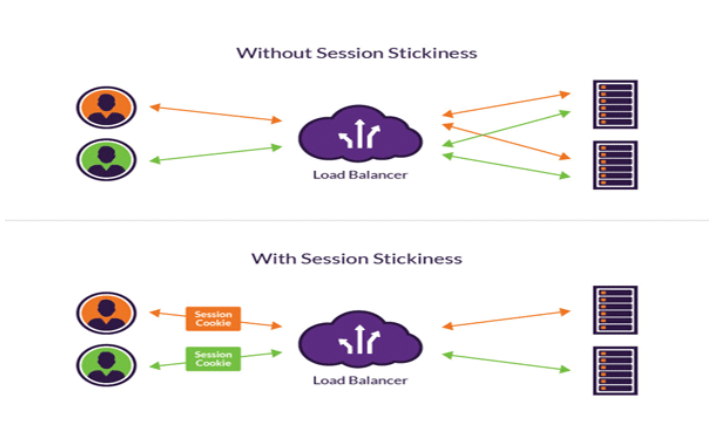

# Cấu hình Nginx làm HTTP Load Balancer cho Apache (CentOS 7)

### 1. Nginx Load Balancer là gì?

Cân bằng tải (Load balancing) là một kỹ thuật thường dùng để tối ưu hóa việc sử dụng tài nguyên, tối đa hóa thông lượng, giảm độ trễ về đảm bảo tính chịu lỗi.

Chúng ta cũng có thể sử dụng nginx như là một bộ cân bằng tải (Load balancer) để phân phối lưu lượng truy cập đến các máy chủ web nhằm mục đích cải thiện hiệu năng, khả năng mở rộng và độ tin cậy của các ứng dụng web.

Có rất nhiều thuật toán được xây dựng cho việc cân bằng tải, mỗi thuật toán đều có những ưu nhược điểm khác nhau, trong mỗi trường hợp sẽ có được tác dụng riêng, chúng ta cũng có thể kết hợp các thuật toán với nhau để giúp cho hệ thống hoạt động được tốt hơn. Tùy vào cơ sở hạ tầng và mục đích sử dụng mà sẽ lựa chọn thuật toán phù hợp với hệ thống.

### Các thuật toán sử dụng trong Nginx Load Balancer

#### Round Robin.

- Round Robin là thuật toán lựa chọn các máy chủ theo trình tự. Theo đó, Load Balancer sẽ bắt đầu đi từ máy chủ số 1 trong danh sách của nó ứng với yêu cầu đầu tiên. Tiếp đó, nó sẽ di chuyển dần xuống trong danh sách theo thứ tự và bắt đầu lại ở đầu trang khi đến máy chủ cuối cùng.

- Nhược điểm thuật toán Load Balancing – Round Robin là gì?

Khi có 2 yêu cầu liên tục từ phía người dùng sẽ có thể được gửi vào 2 server khác nhau. Điều này làm tốn thời gian tạo thêm kết nối với server thứ 2 trong khi đó server thứ nhất cũng có thể trả lời được thông tin mà người dùng đang cần. Để giải quyết điều này, round robin thường được cài đặt cùng với các phương pháp duy trì session như sử dụng cookie.

#### Weighted load balancing

- Đây là một thuật toán quan trọng trong load balancing, khi sử dụng thuật toán này sẽ giúp chúng ta giải quyết đươc bài toán phân chia các server xử lý. Với mặc định của nginx sử dụng thuật toán round-robin thì các request sẽ được chuyển luân phiên đến các server để xử lý, tuy nhiên đối với Weighted load balancing thì chúng ta sẽ phân ra được khối lượng xử lý giữa các server.

- Ví dụ chúng ta có 2 server dùng để load balancing muốn cứ 5 request đến thì 4 dành cho server 1, 1 dành cho server 2 hay các trường hợp tương tự thì weighted load balancing là sự lựa chọn hợp lý.

Nhược điểm thuật toán Load Balancing – Weighted Round Robin là gì?

Weighted Round Robin gây mất cân bằng tải động nếu như tải của các request liên tục thay đổi trong một khoảng thời gian rộng.

#### Least connection

- Đây là thuật toán nâng cấp của round robin và weighted load balancing, thuật toán này sẽ giúp tối ưu hóa cân bằng tải cho hệ thống.

- Đặc điểm của thuật toán này là sẽ chuyển request đến cho server đang xử lý ít hơn làm việc, thích hợp đối với các hệ thống mà có các session duy trì trong thời gian dài, tránh được trường hợp các session duy trì quá lâu mà các request được chuyển luân phiên theo quy tắc định sẵn, dễ bị down 1 server nào đó do xử lý qúa khả năng của nó.

#### Fastest 

Đây là thuật toán dựa trên tính toán thời gian đáp ứng của mỗi server (response time). Thuật toán này sẽ chọn server nào có thời gian đáp ứng nhanh nhất. Thời gian đáp ứng được xác định bởi khoảng thời gian giữa thời điểm gửi một gói tin đến server và thời điểm nhận được gói tin trả lời.

Việc gửi và nhận này sẽ được bộ cân bằng tải đảm nhiệm. Dựa trên thời gian đáp ứng, bộ cân bằng tải sẽ biết chuyển yêu cầu tiếp theo đến server nào.

Thuật toán Fastest thường được dùng khi các server ở các vị trí địa lý khác nhau. Như vậy người dùng ở gần server nào thì thời gian đáp ứng của server đó sẽ nhanh nhất. Cuối cùng server đó sẽ được chọn để phục vụ.

### Cách Load Balancing xử lý trạng thái là gì?

<h3 align="center"></h3>

Trong nhiều trường hợp ứng dụng yêu cầu người truy cập tiếp tục kết nối đến cùng một Backend Server. Một thuật toán mã nguồn sẽ tạo ra một mối quan hệ dựa trên thông tin là IP của khách hàng. Đối với ứng dụng web thông qua sticky sessions, Load Balancer sẽ đặt một cookie. Tất cả các requests từ sessions hướng đến một máy chủ vật lý.

