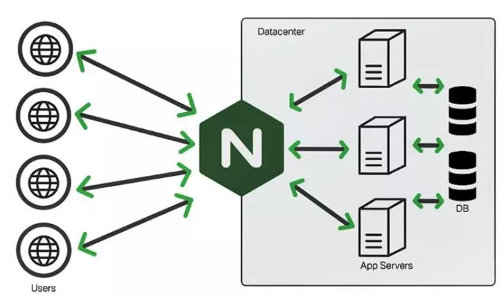

# Tìm hiểu tổng quan về Nginx

### 1. Nginx là gì?

Nginx là một máy chủ Web Server mã nguồn mở. Dự án Nginx được phát hành và sử dụng như một web server được thiết kế hướng đến mục đích cải thiện tối đa hiệu năng và sự ổn định. Bên cạnh đó, nhờ vào các khả năng của máy chủ HTTP mà NGINX còn có thể hoạt dộng như một proxy server cho email (IMAP, POP3, và SMTP), reverse proxy, và trung gian để cân bằng tải cho các máy chủ HTTP, TCP, và UDP.

Với mục tiêu của Nginx là tối ưu hóa hiệu suất, nên nó thường vượt mặt các máy chủ web phổ biến khác trong các bài kiểm tra chất lượng benchmark. Đặc biệt trong các trường hợp cần phục vụ nội dung tĩnh (file hình ảnh, css, js, text,..) và/hoặc các yêu cầu truy vấn đồng thời số lượng lớn (high concurrent request).

Nginx còn là 1 trong số ít những máy chủ được viết để giải quyết vấn đề C10K. Hiểu đơn giản thì do các máy chủ web truyền thống xử lý các yêu cầu dựa trên luồng (thread), tức là mỗi khi máy chủ web nhận được 1 yêu cầu mới thì nó sẽ tạo ra 1 luồng mới để xử lý yêu cầu này, và cứ thế khi số lượng các yêu cầu gửi đến máy chủ web ngày càng nhiều thì số lượng các luồng xử lý này trong máy chủ sẽ ngày càng tăng. Điều này dẫn đến việc thiếu hụt tài nguyên cấp cho các luồng xử lý trên. Còn với Nginx, nó không dựa trên luồng để xử lý yêu cầu mà nó sử dụng 1 kiến trúc bất đồng bộ hướng sự kiện linh hoạt. Kiến trúc này sử dụng ít, nhưng quan trọng hợn, là lượng bộ nhớ có thể dự đoán được khi hoạt động.

### 2. Nginx hoạt động như thế nào?

h3 align="center"></h3>

Về cơ bản, Nginx hoạt động cũng tương tự như những Web Server khác. Thông thường, khi người dùng truy cập trang Web, browser sẽ kết nối với Server chứa trang Web này. Sau đó, Server sẽ tìm đúng file yêu cầu của Website và gửi lại cho người dùng, Đây được gọi là trình tự xử lý Single Thread hay cấu trúc luồng. Nghĩa là các bước chỉ thực hiện đúng theo một quy trình duy nhất. Và mỗi yêu cầu sẽ được tạo cho một Thread riêng biệt.

Tuy nhiên, nguyên lý hoạt động của Nginx có sự khác biệt ở chỗ nó hoạt động theo dạng kiến trúc bất đồng bộ, theo hướng sự kiện nhằm sử dụng ít bộ nhớ và tăng khả năng chạy đồng thời. Cụ thể, Nginx cho phép các Threads tương đồng với nhau cùng được quản lý trong cùng một tiến trình - Process. Tức là, mỗi Process sẽ bao gồm nhiều thực thể nhỏ hơn – và Worker Connections sẽ làm nhiệm vụ xử lý tất cả Threads đó.

Theo đó, các Worker Connections chính là bộ phận gửi yêu cầu cho Worker Process, và Worker Process lại tiếp tục gửi nó cho Master Process. Cuối cùng, Master Process sẽ đáp ứng các yêu cầu về cho người dùng. Đó cũng là lý do vì sao mỗi Worker Connections lại có thể xử lý được hàng ngàn yêu cầu tương tự nhau. Nhờ vậy, Nginx cũng có thể xử lý hàng ngàn yêu cầu khác nhau cùng một lúc.

### 3. Nginx có những tính năng gì?

<h3 align="center"></h3>

- Hiện nay, máy chủ HTTP Nginx sở hữu nhiều tính năng nổi bật như:
    
    - Tạo ra khả năng xử lý hơn đến 10.000 kết nối cùng một lúc với các bộ nhớ thấp.
    
    - Hỗ trợ phục vụ các tập tin tĩnh và lập ra các chỉ mục tập tin phù hợp.
    
    - Có khả năng tăng tốc reverse proxy bằng các bộ nhớ đệm giúp cân bằng tải đơn giản hơn với khả năng chịu lỗi vô cùng cao.
    
    - Nginx có thể hỗ trợ tăng tốc cùng với bộ nhớ FastCGI, uwsgi, SCGI và những máy chủ memcached vô cùng hiệu quả.
    
    - Kiến trúc modular cho phép bạn gia tăng tốc độ nạp trang bằng biện pháp nén gzip một cách tự động.
    
    - Nginx có khả năng hỗ trợ thực hiện mã hóa SSL và TLS.
    
    - Cấu hình của Nginx vô cùng linh hoạt giúp lưu lại nhật ký truy vấn một cách dễ dàng.
    
    - Nginx có khả năng chuyển hướng lỗi 3XX-5XX.
    
    - Rewrite URL có thể sử dụng expression.
    
    - Nginx có thể hạn chế tỷ lệ đáp ứng của truy vấn.
    
    - Nginx giúp giới hạn số kết nối đồng thời cũng như truy vấn từ 1 địa chỉ.
    
    - Nginx có khả năng nhúng mã PERL một cách dễ dàng.
    
    - Nginx có thể hỗ trợ và tương thích hoàn toàn với IPv6.
    
    - Nginx có thể hỗ trợ cho websockets.
    
    - Nginx hỗ trợ truyền tải các file FLV và MP4.

<h3 align="center"></h3>

### 4. Sử dụng nginx thế nào cho tốt?

- Để có thể tận dụng tốt nginx thì đôi khi có nhiều limit ở tầng kernel vốn được setup default mà không phù hợp. Những setting dưới đây được chỉnh ở file /etc/sysctl.conf:

    - net.core.somaxconn: Đây là số lượng connection max mà được nginx queue (buffering) trước khi xử lý. Access càng nhiều -> nginx sẽ không xử lý kịp và phải buffer vào queue, queue càng lớn, buffer càng nhiều, block càng ít, sẽ làm nginx tăng lên tương đối.

    - net.ipv4.iplocalportrange: Khi sử dụng nginx dưới dạng một reverse proxy, thì mỗi một connection đến proxy sẽ sử dụng một ephemeral ports, do đó khi access nhiều sẽ dấn đên nhanh hết port, dấn đến blocking. Tăng chỉ số này sẽ giúp connection đến upstream được nhiều hơn, giúp ít blocking hơn.

    - sys.fs.filemax: Đây là số file descriptor max mà linux server có thể sử dụng được, mà như bạn đã biết socket trên linux là file, do đó chỉ số này càng lớn, nginx mở đc càng nhiều socket, sẽ giúp cho max connection tăng.

    - net.ipv4.tcpwmem và net.ipv4.tcprmem: đây là 2 chỉ số của kernel để buffering cho TCP/IP. Nói chung là càng to càng tốt.

- Dưới đây là bộ config được recommend cho nginx server:

```

net.ipv4.ip_local_port_range='1024 65000'
net.ipv4.tcp_tw_reuse='1'
net.ipv4.tcp_fin_timeout='15'
net.core.netdev_max_backlog='4096'
net.core.rmem_max='16777216'
net.core.somaxconn='4096'
net.core.wmem_max='16777216'
net.ipv4.tcp_max_syn_backlog='20480'
net.ipv4.tcp_max_tw_buckets='400000'
net.ipv4.tcp_no_metrics_save='1'
net.ipv4.tcp_rmem='4096 87380 16777216'
net.ipv4.tcp_syn_retries='2'
net.ipv4.tcp_synack_retries='2'
net.ipv4.tcp_wmem='4096 65536 16777216'
vm.min_free_kbytes='65536'

```