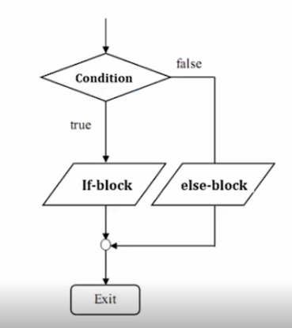

# Biếu thức Boolean IF IF...Else

### Biểu thức boolean

- Biểu thức boolean còn gọi lại predicate. Là một biểu thức rất quan trọng và phổ biến trong các lệnh của python cũng như các ngôn ngữ lâp trình khác.

- Các giá trị là True và False, dựa vào các giá trị này mà ta điều hướng các công việc phần mềm.

<h3 align="center"></h3>

<h3 align="center"></h3>


- Ví dụ nhập vào hai số x và y, so sánh và in ra kết quả:

    ```
    x=int(input("Moi ban nhap gia tri x:"))
    y=int(input("Moi ban nhap gia tri y:"))
    if (x>=y):
        print(x,"so x lon hon y")
    else:
        print("so x be hon y")

    ```

    <h3 align="center"></h3>


### Biểu thức if

- Biểu thức if là một biểu thức điều kiện rất quan trọng và phổ biến trong python. Biểu thức if đứng một mình chỉ quan tâm đến điều kiện đúng(True). Khi điều kiện đúng thì khối lệnh trong if sẽ được thức thi.

- Cú pháp:

    if condition:
        block

    <h3 align="center"></h3>

- Ví dụ:

    <h3 align="center"></h3>

Lưu ý rằng python không dùng ngoặc nhọn để bao bọc các lệnh, mà ta dùng phim TAB hoặc khoảng trắng thụt đầu dòng. 

### Biểu thức if...elif

- Biểu thức if...else là một biểu thức điều kiện rất quan trọng và phổ biến trong python. Biểu thức chỉ này quan tâm đến điều kiện đúng (True) hay sai (False). Nó phổ biến hơn biểu thức if.

- Cú pháp:

    if condition:
        if-block
    else:
        else-block

    <h3 align="center"></h3>

- Ví dụ nhập vào hai số x và y, so sánh và in ra kết quả:

    ```
    x=int(input("Moi ban nhap gia tri x:"))
    y=int(input("Moi ban nhap gia tri y:"))
    if (x>=y):
        print(x,"so x lon hon y")
    else:
        print("so x be hon y")

    ```

    <h3 align="center"></h3>

### Biểu thức if...else lồng nhau

- Với các điều kiện phức tạp, Python hỗ trợ kiểm tra điều kiện if elif lồng nhau

    <h3 align="center"></h3>
