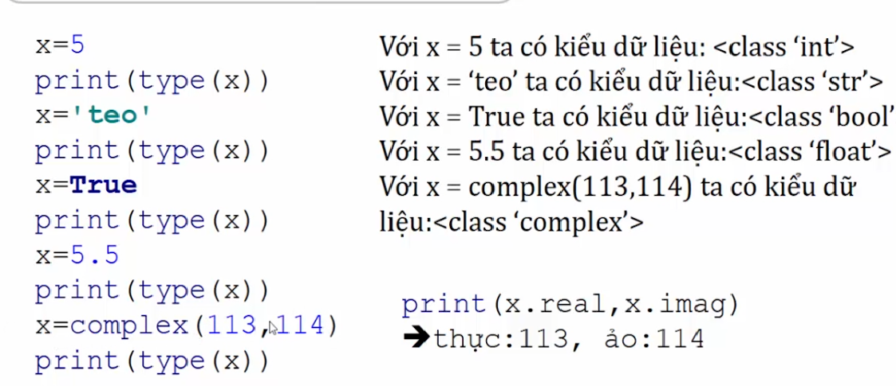
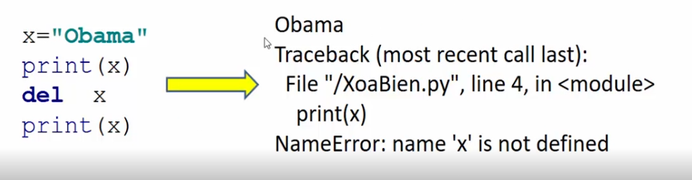

# Kiểu dữ liệu cơ bản và khai báo biến trong python

### 1. Kiểu dữ liệu cơ bản

- int: kiểu sổ nguyên (không chứa số thạp phân), lưu các số nguyên âm ,  nguyên dương.

- float: Kiểu số thực(có chứa dấu thập phân)

- complex: kiểu số phức

    - ví dụ 1 : z= 2 + 3j, thì 2 là phần thực, 3 là phần ảo ( J là từ khóa để đánh dấu phần ảo)
    
    - ví dụ 2 : z= complex(2,3) thì 2 là phần thực, 3 là phần ảo.

    Khi xuất ra kết quả ta có:

        - print("Phần thực=" ,z.real) ==> Phần thực = 2
        
        - print("Phần ảo =", z.imag) ==> Phần ảo = 3

- str: kiểu chuỗi, để trong nháy đôi hoặc trong nháy đơn

- bool: kiểu luận lý, để lưu True hoặc False

    - Ví dụ 1 : t1=True

    - Ví dụ 2: t2=False

### 2. Khai báo biến trong python

Trong python một biến không cần khai báo kiểu dữ liệu, khi ta gán giá trị thì tự động python sẽ nội suy ra kiểu dữ liệu. Như vậy một biến có nhiều kiểu dữ liệu tùy thuộc vào giá trị ta gán. Ta có thể dùng hàm type () để kiểm tra kiểu dữ liệu của biến:

<h3 align="center"></h3>

### 3. Cách xóa biến

Trong python, nếu biến đố đang tồn tại mà ta xóa đi thì biến đó không còn được sử dụng nữa.

<h3 align="center"></h3>

### 4. Cách kiểm tra vùng nhớ dữ liệu

- Ta có thể kiểm tra vùng lưu trữ giá trị của các biến int, float bằng cách import thư viện sys để có thể xem chi tiết: 

    ```
    import sys
    print("Thông tin chi tiết của biến int: ")
    print(sys.int_info)
    print("Thông tin chi tiết của biến float: ")
    print(sys.float_info)

    ```

    Thông tin chi tiết của biến int:

    sys.int_info(bits_per_digit=30, sizeof_digit=4)

    Thông tin chi tiết của biến float:
    
    sys.float_info(max=1.7976931348623157e+308, max_exp=1024, max_10_exp=308, min=2.2250738585072014e-308, min_exp=-1021, min_10_exp=-307, dig=15, mant_dig=53, epsilon=2.220446049250313e-16, radix=2, rounds=1)

    