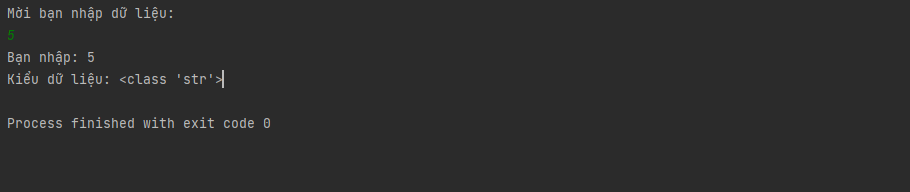
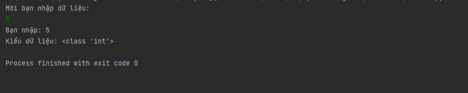
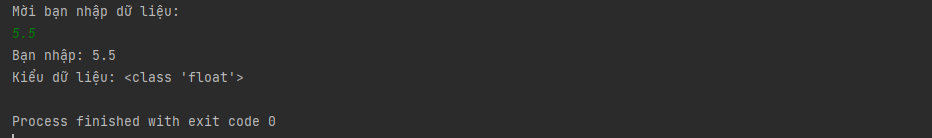
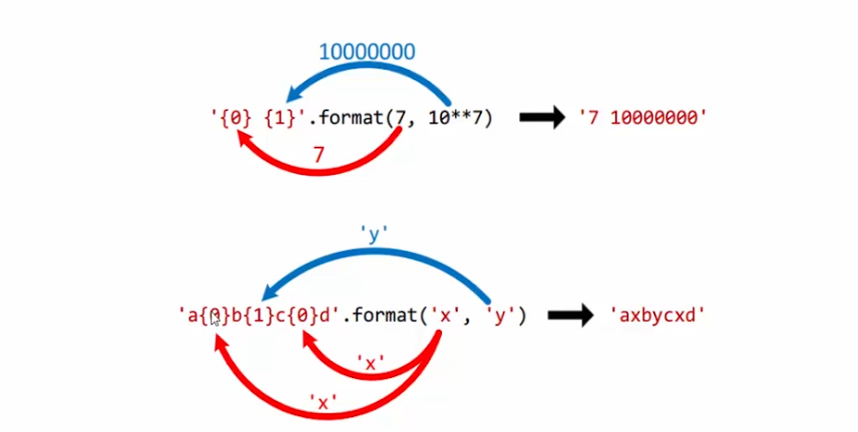
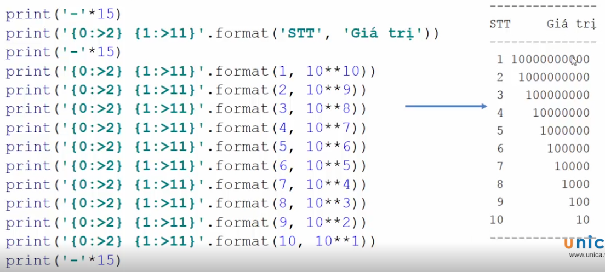

# Cách nhập liệu từ bàn phím và xuất dữ liệu trong python

### Cách nhập dữ liệu từ bàn phím

- Trong python để nhập dữ liệu từ bàn phím ta sử dụng lệnh input(). Giá trị nhập vào của hàm input() thường là kiểu chuỗi, do đó ta cần chuyển kiểu nếu như muốn lưu trữ giá trị nhập vào không phải kiểu chuỗi.

    ```
    print("Mời bạn nhập dữ liệu:")
    s=input()
    print("Bạn nhập:", s)
    print("Kiểu dữ liệu:",type(s))

    ```

- Do hàm input() thường là kiểu chuỗi, nên dù bạn nhập dữ liệu thì thì type sẽ là chuỗi

    <h3 align="center"></h3>

- Để thay đổi kiểu dữ liệu int thì ta thêm int như sau:

    ```
    print("Mời bạn nhập dữ liệu:")
    s=int(input())
    print("Bạn nhập:", s)
    print("Kiểu dữ liệu:",type(s))

    ```

    - Kết quả ta được:

    <h3 align="center"></h3>

- Để thay đổi kiểu dữ liệu int thì ta thêm float như sau:

    ```
    print("Mời bạn nhập dữ liệu:")
    s=float(input())
    print("Bạn nhập:", s)
    print("Kiểu dữ liệu:",type(s))

    ```

    - Kết quả ta được:

    <h3 align="center"></h3>

### Cách xuất dữ liệu

- Để xuất lặp dữ liệu ra màn hình ta làm như sau:

    print('*'*20)

    --> Xuất dấu sao 20 lần

- Dùng hàm format để xuất dữ liệu: 

    - print('{0}{1}'.format(7, 10**7))

    <h3 align="center"></h3>

- Xuất căn phải:

    <h3 align="center"></h3>