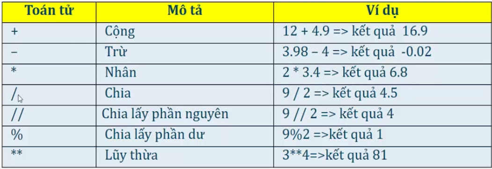
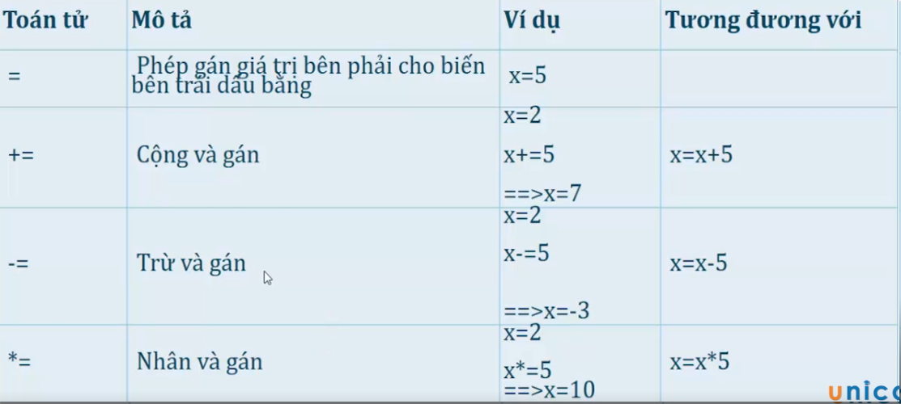
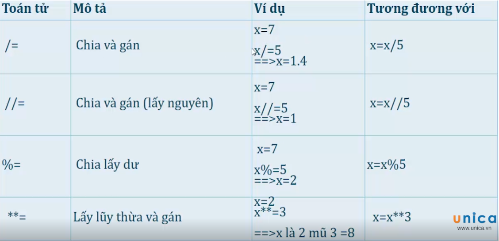
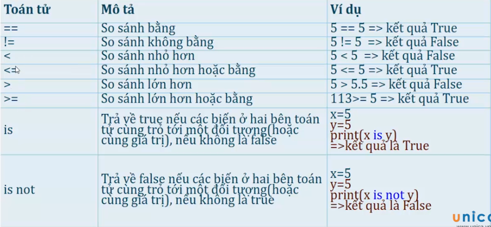
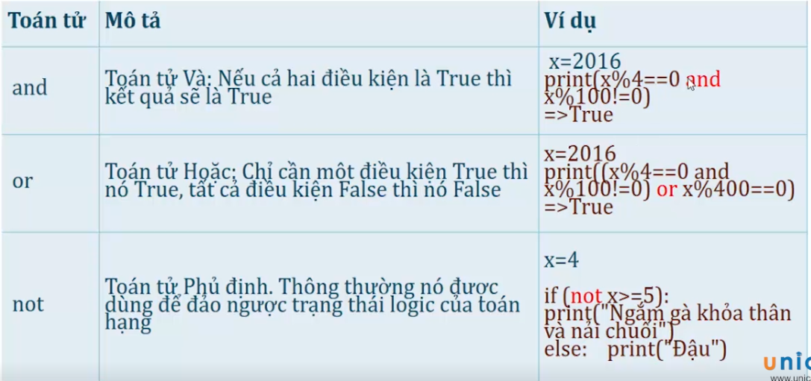
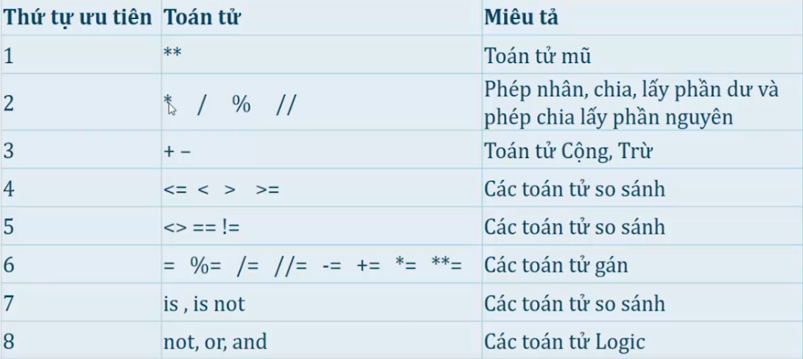

# Các toán tử thường dùng trong python

### 1. Toán tử số học cơ bản

<h3 align="center"></h3>

### 2. Toán tử gán

<h3 align="center"></h3>

<h3 align="center"></h3>

### 3. Toán tử so sánh

<h3 align="center"></h3>

### 4. Toán tử logic

<h3 align="center"></h3>

### 5. Độ ưu tiên toán tử

Python có ràng buộc toán tử . Tuy nhiên các bạn điều khiển nó bằng cách dùng cặp ngoặc tròn () để nó rõ nghĩa hơn. 

Bảng dưới dây mô tả độ ưu tiên toán tử từ cao xuống thấp:

<h3 align="center"></h3>

