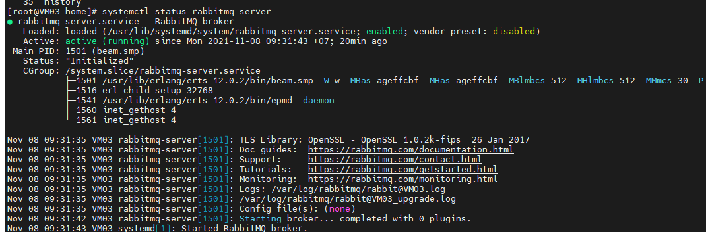
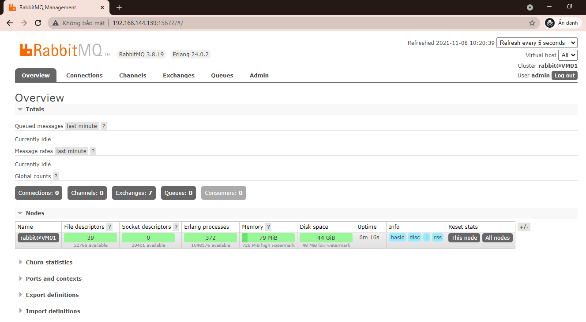

# Cài đặt rabbitmq trên CentOS7

# Install Elang

- RabbitMQ được viết bởi ngôn ngữ lập trình Erlang. Vì vậy trước hết chúng ta cần cài đặt Erlang trước khi cài đặt RabbitMQ.

    ` yum -y install epel-release `

- Tải Erlang 24.0.2

    ` wget https://packages.erlang-solutions.com/erlang/rpm/centos/7/x86_64/esl-erlang_24.0.2-1~centos~7_amd64.rpm `

- Cài đặt gói vừa tải xuông

    ` yum -y install esl-erlang*.rpm `

### Cài đặt RabbitMQ

- Tải xuống phiên bản mới nhất của RabbitMQ, là 3.8.19

    ` wget https://github.com/rabbitmq/rabbitmq-server/releases/download/v3.8.19/rabbitmq-server-3.8.19-1.el7.noarch.rpm `

- Cài đặt gói đã tải xuống:

    ` yum -y install rabbitmq-server*.rpm `

- Mở firewall

    ```
    firewall-cmd --zone=public --permanent --add-port=4369/tcp
    firewall-cmd --zone=public --permanent --add-port=25672/tcp
    firewall-cmd --zone=public --permanent --add-port=5671-5672/tcp
    firewall-cmd --zone=public --permanent --add-port=15672/tcp
    firewall-cmd --zone=public --permanent --add-port=61613-61614/tcp
    firewall-cmd --zone=public --permanent --add-port=1883/tcp
    firewall-cmd --zone=public --permanent --add-port=8883/tcp
    firewall-cmd --reload

    ```
- Set selinux

    ` setsebool -P nis_enabled 1  `

- Enable và start rabbitmq

    ```
    systemctl enable --now rabbitmq-server
    systemctl start rabbitmq-server

    ```
- Kiểm tra lại status của rabbitmq

    ` systemctl status rabbitmq-server `

    <h3 align="center"></h3>

- Kích hoạt plugin rabbit management

    ` rabbitmq-plugins enable rabbitmq_management `

- Phân quyền cho rabbitmq

    ` chown -R rabbitmq:rabbitmq /var/lib/rabbitmq/ `

- Tạo user quản trị, user admin mặc định là guest/guest

    ```
    rabbitmqctl add_user congpv Vnpay@123
    rabbitmqctl set_user_tags congpv administrator

    ```
- Tạo vhost và phân quyền

    ```
    rabbitmqctl add_vhost vnpay
    rabbitmqctl set_permissions -p vnpay congpv "^admin-.*" ".*" ".*"
    rabbitmqctl set_permissions -p vnpay congpv ".*" ".*" ".*"

    ```
-  Truy cập WEB GUI với địa chỉ http://IP:15672

    <h3 align="center"></h3>