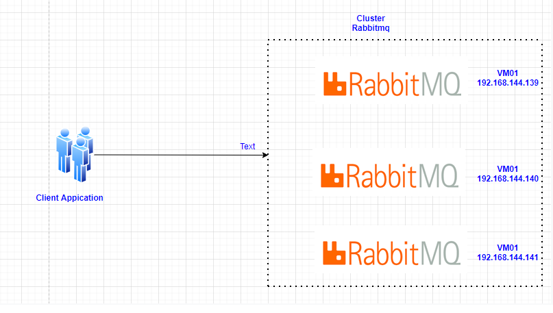
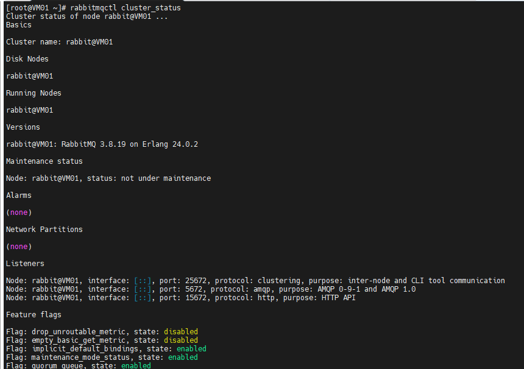
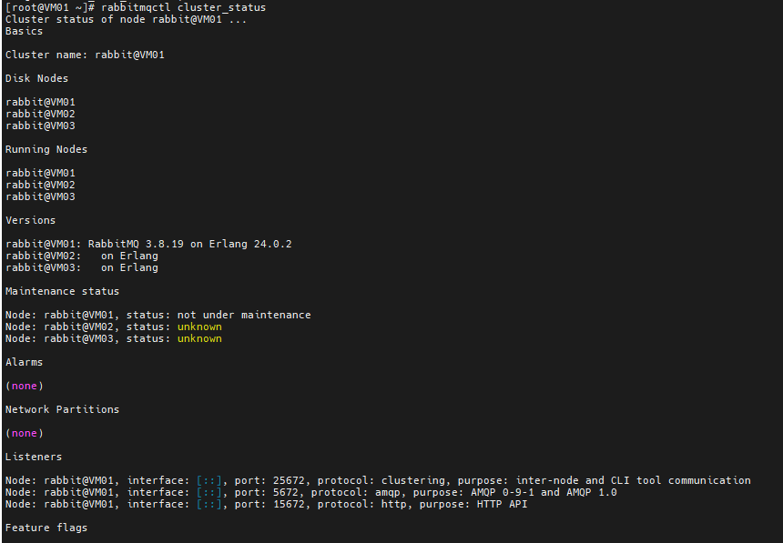
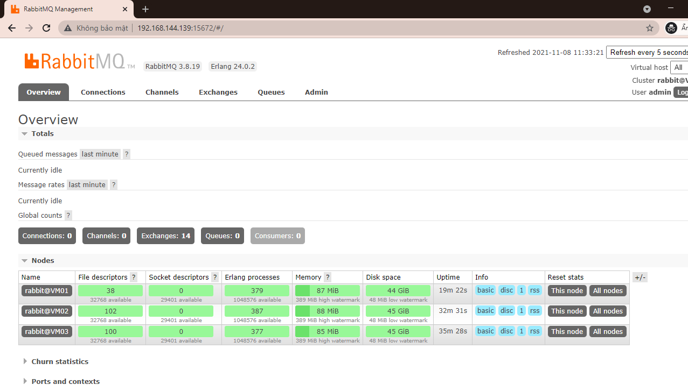

# Cài đặt Rabbitmq Cluster

- Ở bài trước tôi đã hướng dẫn các bạn cài đặt rabbitmq standalone

- Ở phần này tôi sẽ hướng dẫn bạn cài đặt Rabbitmq Cluster

#### Mô hình:

<h3 align="center"></h3>

##### Cài đặt rabbitmq 

- Ta sẽ cài đặt rabbitmq theo hướng dẫn [tại đây](https://github.com/phancong0897/Congphan/blob/master/Rabbitmq/LAB/Install-rabbitmq.md)

Lưu ý ta sẽ cài đặt theo hướng dẫn trên cả 3 node.

#### Cấu hình cluster rabbitmq

- Cấu hình hostname trên cả 3 node

    ```
    192.168.144.139 VM01
    192.168.144.140 VM02
    192.168.144.141 VM03

    ```

    <h3 align="center"></h3>

###### VM01

- Tại VM01, kiểm tra trạng thái rabbitmq, 

    ` rabbitmqctl status|grep rabbit `

    <h3 align="center"></h3>

- Copy file /var/lib/rabbitmq/.erlang.cookie từ VM01 sang các node còn lại. (Có nhập password)

    ```
    scp /var/lib/rabbitmq/.erlang.cookie root@VM02:/var/lib/rabbitmq/.erlang.cookie

    scp /var/lib/rabbitmq/.erlang.cookie root@VM03:/var/lib/rabbitmq/.erlang.cookie

    ```
- Cấu hình policy HA Rabbit Cluster

    ` rabbitmqctl -p Vnpay set_policy ha-all '^(?!amq\.).*' '{"ha-mode": "all"}' `

- Kiểm tra trạng thái cluster

    ` rabbitmqctl cluster_status `

- Khởi chạy App

    ` rabbitmqctl start_app `

- Kiểm tra trạng thái cluster

    ` rabbitmqctl cluster_status `

    <h3 align="center"></h3>

###### VM02 và VM03

- Tại VM02 và VM03 Phân quyền file /var/lib/rabbitmq/.erlang.cookie

    ```
    chown rabbitmq:rabbitmq /var/lib/rabbitmq/.erlang.cookie
    chmod 400 /var/lib/rabbitmq/.erlang.cookie

    ```

- Khởi động lại dịch vụ

    ` systemctl restart rabbitmq-server.service `

- Join cluster VM01

    ```
    rabbitmqctl stop_app
    rabbitmqctl join_cluster rabbit@VM01
    rabbitmqctl start_app

    ```
- Trên VM01 kiểm tra lại tất cả các node

    ` rabbitmqctl cluster_status `

    <h3 align="center"></h3>

- Kiểm tra RabbitMQ Management

<h3 align="center"></h3>
