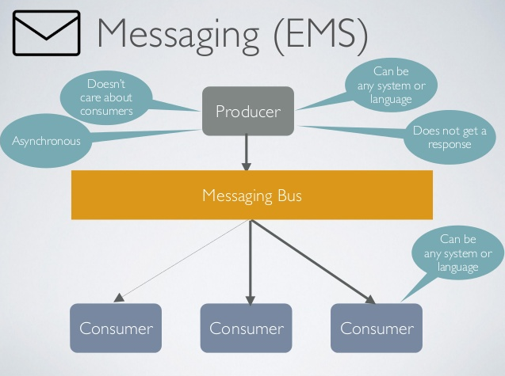
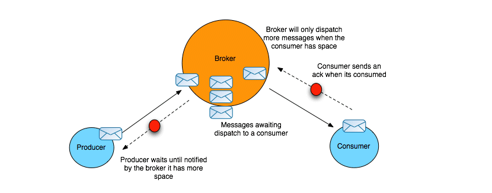
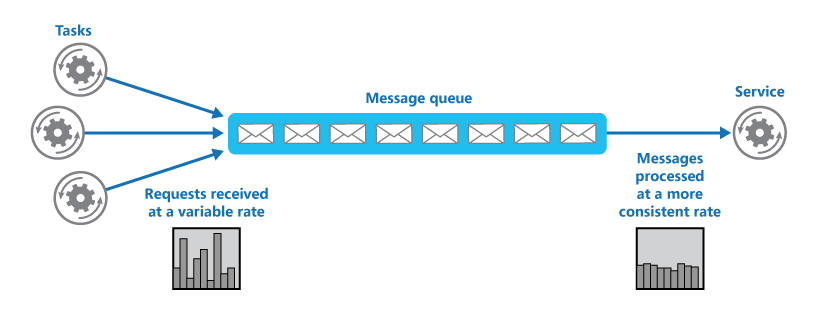
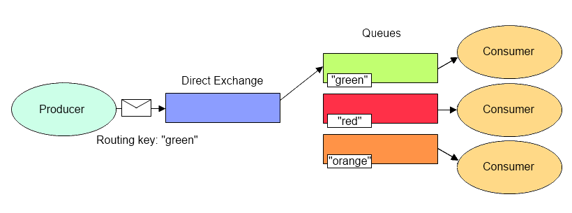
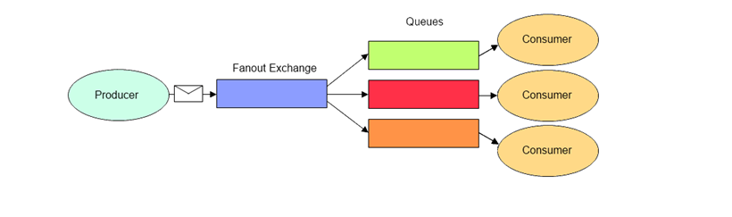
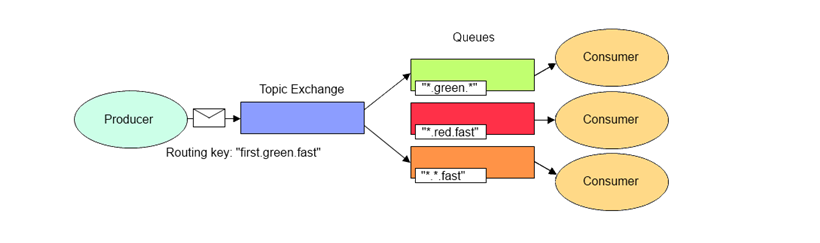
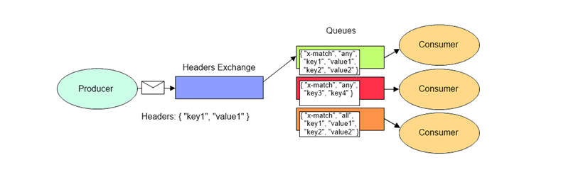

# Tổng Quan Về RabbitMQ

### 1. Hệ Thống Tin Nhắn - Messaging System

Trong hệ thống lớn, chứa nhiều thành phần việc bảo trì, phát triển các tính năng trở nên khó khăn bởi tính bền chặt (Tight Coupling). Giải pháp cho vấn đề là sử dụng Hệ thống tin nhắn - Messaging System.

Mục đích chính của hệ thống tin nhắn là loại bỏ tính bền chặt giữa các thành phần. Khi đó, các thành phần sẽ không nói chuyện với nhau trực tiếp, chúng sẽ giao tiếp thông qua thành phần trung gian có tên gọi là “Message Broker”. Bên cạnh đó, Hệ thống tin nhắn còn là giải pháp cho các vấn đề về xử lý tiến trình đồng bộ, bất đồng bộ, hỗ trợ các giải pháp cần bằng tải, tăng cao khả năng mở rộng các thành phần.

<h3 align="center"></h3>

#### Các Thuật Ngữ Quan Trọng

- Message - Tin Nhắn

Đây là đối tượng trung tâm trong hệ thống tin nhắn. Chúng có thể có nhiều định dạng khác nhau (XML, JSON, Binary data ..)

- Message Broker - Đường Ống Tin Nhắn

Đối tượng trung gian giữa Producer và Consumer, vai trò quản trị, định tuyến các tin nhắn. Thành phần này chịu trách nhiệm bảo đảm tin nhắn sẽ được gửi tới đích mong muốn, hỗ trợ nhận tin nhắn từ nhiều nguồn (Producer) và gửi tin nhắn tới nhiều đích (Consumer). Mục tiêu chính của thành phần là giảm sự ràng buộc giữa các thành phần trong hệ thống, tại đó message broker như trung tâm, chuyển giao, phân phát các tin nhắn.

<h3 align="center"></h3>

- Message Queue - Hàng Đợi Tin Nhắn

Message Queue tương tự như cấu trúc dữ liệu Queue. Chúng là giải pháp cho các tiến trình đồng bộ, bất đồng bộ trong nhưng ứng dụng lớn.

<h3 align="center"></h3>

- Message Producer

Là nơi sản sinh, tạo ra các sự kiện

- Message Consumer

Là nơi nhận các sự kiện, điểm cuối của các tin nhắn. Hỗ trợ xử lý các sự kiện bất đồng bộ hoặc đồng bộ.

### 2. RabbitMQ

RabbitMQ là một message broker (message-oriented middleware) sử dụng giao thức AMQP - Advanced Message Queue Protocol (Đây là giao thức phổ biến, thực tế rabbitmq hỗ trợ nhiều giao thức). RabbitMQ được lập trình bằng ngôn ngữ Erlang. RabbitMQ cung cấp cho lập trình viên một phương tiện trung gian để giao tiếp giữa nhiều thành phần trong một hệ thống lớn ( VD: Openstack RabbitMQ ). RabbitMQ sẽ nhận message đến từ các thành phần khác nhau trong hệ thống, lưu trữ chúng an toàn trước khi đẩy đến đích.

#### Giao Thức AMQP

Advanced Message Queue Protocol - Giao thức Message Queue nâng cao. Mục đích của giao thức là chuẩn hóa việc gửi tin nhắn giữa các hệ thống, tổ chức

- Kiến Trúc AMQ bao gồm 4 thành phần:

    - Message Flow: Luồng xử lý message

    - Exchange: Nơi tiếp nhận message (từ publisher), định tuyến tới các Message Queue

    - Message Queue: Nơi lưu trữ các message, chuyển giao message tới consumers

    - Binding: Định nghĩa quan hệ giữa Exchange và Message Queue, mô tả cách định tuyến message tới chính xác Message Queue

- Message Flow

Message flow bắt đầu khi Producer tạo message, gửi tin nhắn tới exchange. Sau đó exchange định tuyến tới Message Queue bằng Bindings. Cuối cùng Consumer nhận được message.

Tại đó:

    - Message: Tạo ra bởi Publisher, sử dụng giao thức AMQP Client, Message chứa thông tin (Content, Properties, Routing Information)

    - Exchange: Nhận Message được gửi từ Producer, định tuyến tới Queue mong muốn (định tuyến dựa trên thông tin Queue), Message có thể được gửi tới 1 hoặc nhiều queue dựa theo binding

    - Message Queue: Nhận Message, đặt vào hàng chờ. Tới thời điểm, Message Queue sẽ gửi message tới consumer. Nếu quá trình truyền có vấn đề, MQ sẽ lưu thông tin vào disk or ram, lưu trữ phục vụ mục đích tái gửi.

    - Consumer: Nơi message được gửi tới.

- Exchange (EX)

Thành phần chịu trách nhiệm định tuyến message tới đích mong muốn, 0 hoặc 1 hoặc nhiều queue

Các thuộc tính quan trọng trong exchange:

    - Tên định danh: Exchange có định danh độc nhất

    - Tính bền vững (Durable): Nếu thiết lập, EX lưu giữ hàng đợi tin nhắn (tạm thời hoặc luôn luôn)

    - Tính làm sạch (Auto-delete): Nếu thiết lập, EX tự xóa khi hoàn thành tác vụ

- Message Queue (MQ)

Nơi lưu giữ Message (lưu theo cơ chế FIFO). Khác với kiểu dữ liệu Queue, Message Queue có thể được sử dụng với nhiều consumer và publisher.

Các thuộc tính quan trọng:

    - Tên định danh: Message queues có định danh độc nhất (có thể được random)

    - Tính bền vững (Durable): lưu giữ hàng đợi tin nhắn (tạm thời hoặc luôn luôn)

    - Tính chuyển dụng (Exclusive): Nếu thiết lập, MQ sẽ tự động xóa khi ngắt kết nối

    - Tính làm sạch (Auto-delete): Nếu thiết lập, MQ tự xóa khi consumer hủy liên kết

- Binding

Thông số, chỉ số hỗ trợ EX định tuyến message giữ các queue. Các thống số, chỉ số được gọi là routing key AMQ hỗ trợ nhiều loại routing key phục vụ các bài toán khác nhau

#### Các Loại Exchange Cơ Bản

- Bao gồm:

    - Direct Exchange

    - Fanout Exchange

    - Topic Exchange

    - Headers Exchange

- Direct Exchange

<h3 align="center"></h3>

Định tuyến message tới một queue phù hợp bằng routing key. Khi đó routing key có định danh giống với queue chỉ định. Message sẽ được gửi tới queue duy nhất theo khóa định danh

- Fanout Exchange

<h3 align="center"></h3>

Định tuyến message tới tất cả các queue có sẵn.

- Topic Exchange

<h3 align="center"></h3>

Định tuyến message tới nhiều queue phù hợp bằng routing key. Khi đó routing key có định danh giống 0 hoặc 1 hoặc nhiều queue. Khớp routing key bằng phương pháp regex.

- Headers Exchange

<h3 align="center"></h3>

