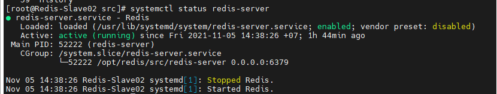

# Hướng dẫn cài đặt redis-5.0.14

- Dowload redis từ [trang chủ](https://redis.io/download)

    ```
    cd /opt

    wget https://download.redis.io/releases/redis-5.0.14.tar.gz

    tar -xvzf redis-5.0.14.tar.gz

    ```

- Đổi tên thư mục redis-5.0.14 thành redis

    ```
    mv redis-5.0.5 redis
    cd redis

    ```
- Kiểm tra trên máy đã cài đặt gcc chưa, nếu không ta phải cài đặt gcc

    ` yum install gcc –y `

- Sau khi đã có gcc, ta thực hiện câu lệnh make để cài đặt Redis.
    
    ` make `

- Sau khi make xong, chúng ta tạo file service mới trong /usr/lib/systemd/system/redis-server.service.

    ` vi /usr/lib/systemd/system/redis-server.service `

    Nội dung file

    ```
    [Unit]
    Description=Redis
    After=syslog.target
    [Service]
    # should be fine as long as you add it under [Service] block
    LimitNOFILE=65536
    ExecStart=/opt/redis/src/redis-server /opt/redis/redis.conf
    RestartSec=5s
    Restart=on-success
    [Install]
    WantedBy=multi-user.target

    ```

- Khởi động dịch vụ redis-server và kiểm tra trạng thái hoạt động. Đặt chế độ tự động bật service khi máy bị khởi động lại, và chế độ chạy ngầm.

    ```
    systemctl enable redis-server
    systemctl daemon-reload
    systemctl start redis-server
    systemctl status redis-server

    ```
    <h3 align="center"></h3>

- Kiểm tra trạng thái listen port.

    ` netstat -tupln `

- Tiếp theo chúng ta mở firewalld 

    ```
    firewall-cmd --zone=public --permanent --add-port=6379/tcp
    firewall-cmd –reload

    ```
- Thêm cấu hình vào cuối file /opt/redis/redis.conf.

- * Lưu ý:

    - Cấu hình pass cho user: redismaster thêm vào cuối file : (Lưu ý phải bind IP của server 0.0.0.0 để export được redis ra ngoài, (hoặc # dòng bind lại)
    
    - khi cài đặt các môi trường production thì mình thêm phần tuning tham số maxmemory <byte>
    
    - Dưới đây là tham số mặc định: 40Mb, ta cần tăng lên 4Gb hoặc 8Gb tùy theo nhu cầu của developer.

    ```
    127.0.0.1:6379> config get maxmemory
    1) "maxmemory"
    2) "41943040"

    ```

    ` vi /opt/redis/redis.conf `

    ```
    #### Thêm các lòng lệnh dưới vào cuối file ####
    loglevel warning
    logfile "/var/log/redis/redis.log"
    masterauth redis@123
    requirepass redis@123

    ```

- Cấu hình log cho Redis

    ` mkdir -p /var/log/redis `

- Khởi động lại Redis trên cả 3 máy chủ.

    `systemctl restart redis-server `
