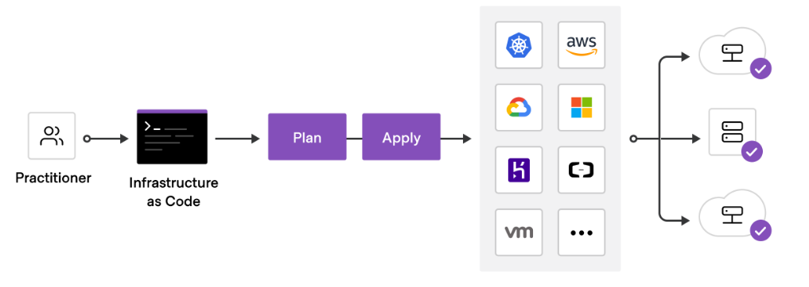

# Giới thiệu cơ bản về Terraform

### Terraform là gì

- Terraform là một open source “Infrastructure as Code (IaC)” tool, được sử dụng bởi các DevOps và SysOps Engineers.

```

Infrastructure as Code nhầm giải quyết bài toán khi setup kiến trúc hạ tầng cho hệ thống sẽ cần trải qua nhiều bước, với nhiều 

môi trường khác nhau. Điều này dẫn tới việc khó quản lý, cũng như khi có sự thay đổi hoặc tạo mới hạ tầng có thể sẽ có những sai 

sót trong quá trình thực hiện. Tính chất của code đó chính là bất biến có thể lưu trữ được, dễ theo dõi, kiểm soát và chia sẻ. 

Khi triển khai kiến trúc hạ tầng trên môi trường mới. Engineer chỉ cần tiến hành apply lại code là có thể triển khai hạ tầng mới.

```

- Terraform là một công cụ mã nguồn mở cho phép bạn định nghĩa Infrastructure as Code - IaC với đa dạng cloud provider ví dụ: Alibaba Cloud, AWS, Azure… Terraform giúp bạn quản lý hệ thống bằng code và tự động hóa việc triển khai hạ tầng của bạn. Bạn có thể sử dụng Terraform để quản lý các tài nguyên như máy chủ, mạng, cơ sở dữ liệu và các tài nguyên khác của các nhà cung cấp đám mây khác nhau.

    - Quản lý tài nguyên đám mây đa nền tảng.

    - Quản lý các phiên bản khác nhau của cơ sở hạ tầng.
    
    - Quản lý các phụ thuộc giữa các tài nguyên.

    - Tự động hóa việc triển khai và cập nhật cơ sở hạ tầng.

Terraform sử dụng ngôn ngữ HCL (HashiCorp Configuration Language) để định nghĩa cấu trúc hạ tầng của bạn và có thể được sử dụng để quản lý hạ tầng trên nhiều nhà cung cấp đám mây khác nhau.

<h3 align="center"></h3>

### Khái niệm

- Terraform file sẽ có định dạng “.tf” được viết bởi ngôn ngữ HCL (Hashicorp Configuration Language).

- Provisioning workflow
    
    - terraform validate

    - terraform plan
    
    - terraform apply
    
    - terraform destroy

- Một RootModule thông thường sẽ có 3 Terraform files chính:
    
    - main.tf: file là file tập trung các config Terraform chính, nằm ở root project.

    - variables.tf: là file tập trung tất cả các khai bao biến, nằm ở root project.
    
    - outputs.tf: dùng để export value sau khi terraform apply đã thực thi hoàn tất, nằm ở root project.
    
    - terraform.tfstate(optional) dùng để quản lý state
    
    - terraform.tfstate.backup (optional) dùng để quản lý backup state

### Terraform - Main file

- main.tf file là file tập trung các config Terraform chính, nằm ở root project.

- Bao gồm các nội dung:
    
    - Resources
    
    - Provider
    
    - Data source

- Ví dụ :

```

//main.tf

resource "aws_instance" "computel"{
	ami = data.aws_ami.ubuntu.id
	instance_type = var.instance_type
	key_name = var.key_name
	subnet_id = var.subnet_id

	tags = {
		Name = "AWSInstance.Computel"
	}
}

```

### Terraform - Variables File

- variables.tf là file tập trung tất cả các khai bao biến, nằm ở root project.

- Có thể set type, default value, overwrite cho variable.

- Ví dụ :

```

//variables.tf

variable "instance_type" {}
variable "asg_desired"{
	type = number
	default = 2 
}

//overwrite asg_desired variable
variable "asg_desired"{
	type =. number
	default =. 3
}

```

### Terraform - Outputs File

- outputs.tf dùng để export value sau khi terraform apply đã thực thi hoàn tất, nằm ở root project.

- Outputs có thể được tham chiếu ở bất kỳ parent Terraform template
Thường được sử dụng khi tạo mới các modules. Cho phép modules value được sử dụng trong parent Terraform template

- Ví dụ:

```

//outputs.tf

output "vpc_id" {
	value = aws_vpc.main.id
}

output "subnet1_id"{
	value = aws_subnet.subnet1.id
}

```

### Terraform - State

- Terraform là một Stateful application

- State dùng để track tất cả các infrastructure provisioned. Tất cả các state sẽ được track và lưu vào terraform state file.

- Khi terraform apply, terraform sẽ tiến hành lưu lại infrastructure state vào 2 files:
    
    - terraform.tfstate
    
    - terraform.tfstate.backup

- Từ state ta có thể biết được những thay đổi trong lần build gần nhất.

- Có thể sử dụng cmd terraform refresh để refresh state.