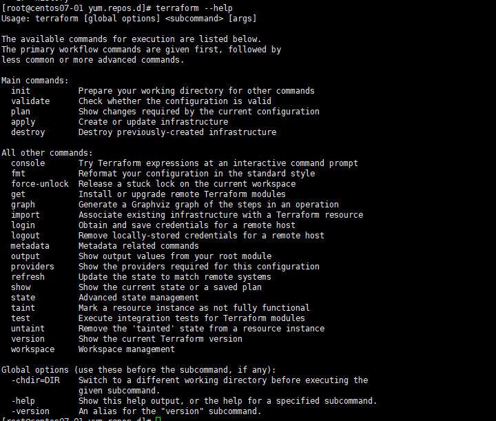

# Cài đặt terraform

### Cài đặt yum-utils

    yum install -y yum-utils

### Cài đặt repo 

    yum-config-manager --add-repo https://rpm.releases.hashicorp.com/RHEL/hashicorp.repo

### Cài đặt terraform

    yum -y install terraform

<h3 align="center"></h3>

### Tạo project

- Tạo folder và tạo file main.tf terraform

    ` mkdir hello-terraform `

    ` cd hello-terraform `

    ```

    cat > main.tf <<EOF
    provider "local" {
      version = "~> 1.4"
    }
    resource "local_file" "hello" {
      content = "Hello, Terraform"
      filename = "hello.txt"
    }
    EOF

    ```

    - Tệp  main.tf chứa hai khối: khai báo trình provider  và định nghĩa resource . Các provider tuyên bố rằng chúng ta sẽ sử dụng các local  cung cấp tại phiên bản 1.4 hoặc một tương thích.

    - Tiếp theo, chúng ta có một định nghĩa resource có tên hello kiểu local_file . Loại resource này , như tên của nó, chỉ là một tệp trên hệ thống tệp cục bộ với nội dung đã cho.

- init, plan, và apply

    Bây giờ, hãy tiếp tục và chạy Terraform trong project này. Vì đây là lần đầu tiên chúng ta chạy dự án này, chúng ta cần khởi tạo nó bằng lệnh init :

    ```

    [root@centos07-01 begin-terraform]# terraform init

    Initializing the backend...

    Initializing provider plugins...
    - Finding hashicorp/local versions matching "~> 1.4"...
    - Installing hashicorp/local v1.4.0...
    - Installed hashicorp/local v1.4.0 (signed by HashiCorp)

    Terraform has created a lock file .terraform.lock.hcl to record the provider
    selections it made above. Include this file in your version control repository
    so that Terraform can guarantee to make the same selections by default when
    you run "terraform init" in the future.

    ╷
    │ Warning: Version constraints inside provider configuration blocks are deprecated
    │ 
    │   on main.tf line 2, in provider "local":
    │    2:   version = "~> 1.4"
    │ 
    │ Terraform 0.13 and earlier allowed provider version constraints inside the provider configuration block, but that is now  deprecated and will be removed in a future version of Terraform. To silence this warning, move the provider version constraint   into the
    │ required_providers block.
    │ 
    │ (and one more similar warning elsewhere)
    ╵

    Terraform has been successfully initialized!

    You may now begin working with Terraform. Try running "terraform plan" to see
    any changes that are required for your infrastructure. All Terraform commands
    should now work.

    If you ever set or change modules or backend configuration for Terraform,
    rerun this command to reinitialize your working directory. If you forget, other
    commands will detect it and remind you to do so if necessary.


    ```

    - Trong bước này, Terraform quét các tệp dự án của chúng ta và tải xuống bất kỳ provider nào được yêu cầu  – provider là local , trong trường hợp của chúng ta.

    - Tiếp theo, chúng ta sử dụng lệnh plan để xác minh những hành động mà Terraform sẽ thực hiện để tạo tài nguyên của chúng ta. Bước này hoạt động khá hiệu quả vì tính năng “dry run” có sẵn trong các hệ thống xây dựng khác, chẳng hạn như công cụ tạo của GNU:

    ```
    [root@centos07-01 begin-terraform]# terraform plan

    Terraform used the selected providers to generate the following execution plan. Resource actions are indicated with the following   symbols:
      + create

    Terraform will perform the following actions:

      # local_file.hello will be created
      + resource "local_file" "hello" {
          + content              = "Hello, Terraform"
          + directory_permission = "0777"
          + file_permission      = "0777"
          + filename             = "hello.txt"
          + id                   = (known after apply)
        }

    Plan: 1 to add, 0 to change, 0 to destroy.
    ╷
    │ Warning: Version constraints inside provider configuration blocks are deprecated
    │ 
    │   on main.tf line 2, in provider "local":
    │    2:   version = "~> 1.4"
    │ 
    │ Terraform 0.13 and earlier allowed provider version constraints inside the provider configuration block, but that is now  deprecated and will be removed in a future version of Terraform. To silence this warning, move the provider version constraint   into the
    │ required_providers block.
    ╵

    ──────────────────────────────────────────────────────────────────────────────────────────────────────────────────────────────────  ──────────────────────────────────────────────────────────────────────────────────────────────────────────────────────────────────    ─────────

    Note: You didn't use the -out option to save this plan, so Terraform can't guarantee to take exactly these actions if you run   "terraform apply" now.

    ```

    - Ở đây, Terraform nói với chúng ta rằng nó cần tạo ra một nguồn tài nguyên mới, dự kiến ​​là nó chưa tồn tại. Chúng ta cũng có thể thấy các giá trị được cung cấp mà chúng ta đã đặt và một cặp thuộc tính về permission. Vì chúng ta chưa cung cấp những giá trị đó trong định nghĩa tài nguyên của mình, trình cung cấp sẽ giả định các giá trị mặc định.

    - Bây giờ chúng ta có thể tiến hành tạo tài nguyên thực tế bằng lệnh apply  :

    ```
    [root@centos07-01 begin-terraform]# terraform apply

    Terraform used the selected providers to generate the following execution plan. Resource actions are indicated with the following      symbols:
      + create
    
    Terraform will perform the following actions:
    
      # local_file.hello will be created
      + resource "local_file" "hello" {
          + content              = "Hello, Terraform"
          + directory_permission = "0777"
          + file_permission      = "0777"
          + filename             = "hello.txt"
          + id                   = (known after apply)
        }
    
    Plan: 1 to add, 0 to change, 0 to destroy.
    ╷
    │ Warning: Version constraints inside provider configuration blocks are deprecated
    │ 
    │   on main.tf line 2, in provider "local":
    │    2:   version = "~> 1.4"
    │ 
    │ Terraform 0.13 and earlier allowed provider version constraints inside the provider configuration block, but that is now     deprecated and will be removed in a future version of Terraform. To silence this warning, move the provider version constraint     into the
    │ required_providers block.
    ╵
    
    Do you want to perform these actions?
      Terraform will perform the actions described above.
      Only 'yes' will be accepted to approve.
    
      Enter a value: yes
    
    local_file.hello: Creating...
    local_file.hello: Creation complete after 0s [id=392b5481eae4ab2178340f62b752297f72695d57]
    
    Apply complete! Resources: 1 added, 0 changed, 0 destroyed.

    ```
    