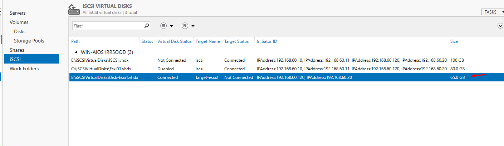

# Công nghệ VMware DRS

- Công nghệ VMware DRS, tên đầy đủ làVMware Schedributed Resource Scheduler, là một ứng dụng rất cần thiết trong công nghệ ảo hóa - phân bổ tài nguyên cho các máy ảo.Khi một máy ảo gặp phải sự gia tăng tải, VMware DRS tự động phân bổ nhiều tài nguyên hơn bằng cách tự động phân phối lại các máy ảo đến các máy chủ vật lý của Resource Pool.

<h3 align="center"></h3>

- Tại sao phải sử dụng VMware DRS cho công nghệ ảo hóa?

    - Ưu tiên tài nguyên với các chương trình có giá trị nhất để phù hợp tài nguyên phần cứng với mục tiêu 
    
    - Tự động tối ưu hóa việc sử dụng phần cứng và liên tục đáp ứng các điều kiện thay đổi.
    
    - Cung cấp tài nguyên chuyên dụng cho các đơn vị kinh doanh và tiếp tục sử dụng phần cứng nhiều hơn thông qua hoạch định tài nguyên.
    
    - Thực hiện bảo trì máy chủ với thời gian ổn định

### VMware DPM là gì?

- VMware Distributed Power Management (DPM), là một tính năng mới trong VMware DRS, liên tục xem xét các tài nguyên cần thiết trong một cụm DRS.Khi các tài nguyên cần thiết cho cụm được giảm trong thời gian tiêu thụ thấp, VMware DPM làm cho WorkLoads giảm mức tiêu thụ điện năng của mỗi cụm.Khi tài nguyên được sử dụng trong khoảng thời gian, VMware DPM reprograms tắt máy chủ trực tuyến theo các quy tắc được chỉ định.

- VMware DPM cho phép

Giảm chi phí điện và làm mát ở trung tâm dữ liệu.Quản lý hiệu quả năng lượng trong trung tâm dữ liệu tự động.

### Nguyên lý làm việc của VMware DRS

<h3 align="center"></h3>

Công nghệ VMware DRS liên tục theo dõi các tài nguyên được phân bổ và, nếu cần thiết, nó sẽ tự phân bổ tài nguyên thông minh cho các máy ảo.VMware DRS hướng dẫn người dùng xác định các cách sắp xếp các tài nguyên được chia sẻ trong các máy ảo và ưu tiên các tài nguyên này trong một số máy ảo quan trọng hơn.Khi một máy ảo tăng tải, VMware DRS kiểm tra ưu tiên của nó dựa trên các quy tắc có sẵn được chỉ định để gán, nếu các đánh giá DRS xem xét nhu cầu cần thêm tài nguyên nó sẽ đưa ra yêu cầu.Tuy nhiên, cần lưu ý rằng DRS có thể chuyển một máy ảo không đủ tài nguyên sang một máy ảo khác, với nhiều tài nguyên hơn;hoặc bằng cách tạo thêm không gian trên cùng Máy chủ thông qua việc chuyển các máy ảo khác sang các máy chủ khác, hoặc phân bổ nhiều tài nguyên hơn cho máy ảo đó để bù đắp cho việc thiếu tài nguyên.VMware DRS có thể được cấu hình để hoạt động ở chế độ tự động hoặc chế độ thủ công.Trong chế độ tự động, VMware DRS xác định khả năng phân phối tốt nhất các máy ảo giữa các máy chủ vật lý khác nhau và tự động chuyển các máy ảo đến máy chủ vật lý thích hợp nhất.Trong chế độ thủ công, VMware DRS đưa ra một gợi ý về vị trí tối ưu của các máy ảo và để người dùng thực hiện các thay đổi.Tổ chức phân cấp linh hoạt của tài nguyên cho phép người dùng điều chỉnh các tài nguyên CNTT hiện có theo nhu cầu.Mỗi đơn vị kinh doanh có thể nhận được các tài nguyên chuyên dụng

