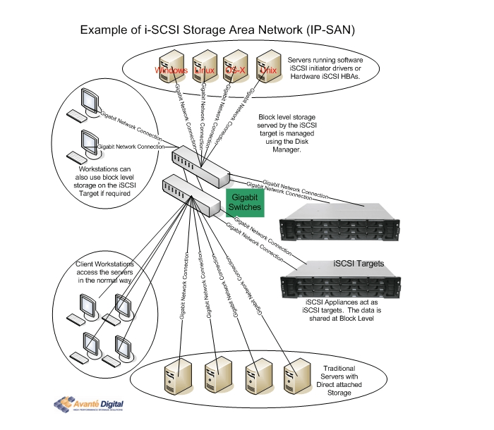

# iSCSI là gì ? Tìm hiểu về hệ thống lưu trữ iSCSI SAN

### 1. iSCSI là gì ?

<h3 align="center"></h3>

iSCSI là Internet SCSI (Small Computer System Interface), được xem như một tiêu chuẩn giao thức phát triển nhằm mục đích truyền tải các lệnh SCSI qua mạng IP bằng giao thức TCP/IP. Từ đó iSCSI cho phép truy cập các khối dữ liệu trên hệ thống lưu trữ SAN qua các lệnh SCSI và truyền tải dữ liệu qua hệ thống mạng Network (LAN/WAN).

Bạn có thể tưởng tượng SCSI lệnh sẽ được đóng gói trong lớp TCP/IP và truyền qua mạng nội bộ (LAN) hoặc cả mạng Internet Public (WAN Internet) mà không cần quan tâm bất kì thiết bị chuyên biệt nào như Fibre Channel, chỉ cần cấu hình hệ thống phần cứng Gigabit Ethernet và iSCSI đúng là được.

iSCSI sử dụng không gian lưu trữ ảo như VHD’s trong Windows Server Storage hay LUN trên Linux , giảm chi phí khi tận dụng hạ tầng LAN sẵn có ( các thiết bị mạng, Swich ,… trên nền IP ). iSCSI chủ yếu cạnh tranh với Fibre Channel, nhưng khác với Fibre Channel truyền thống, thường đòi hỏi cáp chuyên dụng, iSCSI có thể chạy trên các khoảng cách xa bằng cách sử dụng hạ tầng mạng hiện có.

### 2. Các thành phần của iSCSI

- Một giao tiếp kết nối iSCSI sẽ bao gồm 2 thành phần chính sau:

    - iSCSI Initator
    
    - iSCSI Target

<h3 align="center"></h3>

### 2.1 iSCSI Initiator

iSCSI Initiator (iSCSI Initiator Node) là thiết bị client trong kiến trúc hệ thống lưu trữ qua mạng. iSCSI Initiator sẽ kết nối đến máy chủ iSCSI Target và truyền tải các lệnh SCSI thông qua đường truyền mạng TCP/IP . iSCSI Initiator có thể được khởi chạy từ chương trình phần mềm trên OS hoặc phần cứng thiết bị hỗ trợ iSCSI.

### 2.2 iSCSI Target

Server iSCSI Target thường sẽ là một máy chủ lưu trữ (storage) có thể là hệ thống NAS chẳng hạn. Từ máy chủ iSCSI Target sẽ tiếp nhận các request gửi từ iSCSI Initiator gửi đến và gửi trả dữ liệu trở về. Trên iSCSI Target sẽ quản lý các ổ đĩa iSCSI với các tên gọi LUN (Logical Unit Number) được dùng để chia sẻ ổ đĩa lưu trữ iSCSI với phía iSCSI Client.

<h3 align="center"></h3>

Kết luận:

– Máy chủ nào chia sẻ vùng lưu trữ (storage) thì được gọi là iSCSI Target. Máy tính nào yêu cầu sử dụng vùng lưu trữ sẽ được gọi là iSCSI Initiator.

### 3. iSCSI hoạt động như thế nào?

<h3 align="center"></h3>

- Máy tính client sẽ khởi tạo request yêu cầu truy xuất dữ liệu trong hệ thống lưu trữ (storage) ở máy chủ iSCSI Target.

- Lúc này hệ thống iSCSI Initiator sẽ tạo ra một số lệnh SCSI tương ứng với yêu cầu của client.

- Các lệnh SCSI và thông tin liên quan sẽ được đóng gói trong gói tin iSCSI Protocol Data Unit (iSCSI PDU). Thông tin PDU được sử dụng cho kết nối giữa Initiator và Target với các thông tin nhằm xác định node, kết nối, thiết lập session, truyền tải lệnh iSCSI và truyền tải dữ liệu.

- Sau đó PDU  được đóng gói trong mô hình TCP/IP và truyền tải qua mạng network đến máy chủ iSCSI Target.

<h3 align="center"></h3>

- Máy chủ iSCSI Target nhận được gói tin và tiến hành mở gói tin ra kiểm tra phần iSCSI PDU nhằm trích xuất các thông tin lệnh SCSI cùng các nội dung liên quan.

- Sau đó lệnh SCSI sẽ được đưa vào SCSI Controller để thực thi và xử lý theo yêu cầu. Đến cuối cùng iSCSI Target sẽ gửi trả thông tin iSCSI response. Từ đó cho phép block data lưu trữ được truyền tải giữa Inititator và Target.

#### Lưu ý:

- Các kết nối iSCSI giữa Inititator và Target có thể hoạt động của cùng 1 cuộc giao tiếp giữa Initiator và Target. Một cuộc giao tiếp như vậy sẽ được gọi là một iSCSI Session.

<h3 align="center"></h3>

### 4. Lợi ích của iSCSI với hệ thống lưu trữ SAN

- Chi phí rẻ hơn so với việc đầu tư hệ thống lưu trữ Fibre Channel.

- Không tốn nhiều thời gian và chi phí đầu tư đào tạo Quản trị viên quản lý hệ thống lưu trữ iSCSI SAN.

- Với việc sử dụng hệ thống mạng đơn giản với thành phần Gigabit Ethernet chuẩn, các công ty tổ chức có thể đơn giản hoá việc tạo dựng một môi trường lưu trữ qua mạng của họ.

- Các sản phẩm tương thích với iSCSI, môi trường iSCSI SAN có thể dễ dàng triển khai bằng cách tận dụng phần cứng mạng hiện có và các thành phần khác.

- Là một giao thức dựa trên IP, iSCSI tận dụng lợi ích của TCP/IP và Ethernet.

- Đặc biệt hiệu quả khi sử dụng với card mạng Ethernet 10G phổ biến.