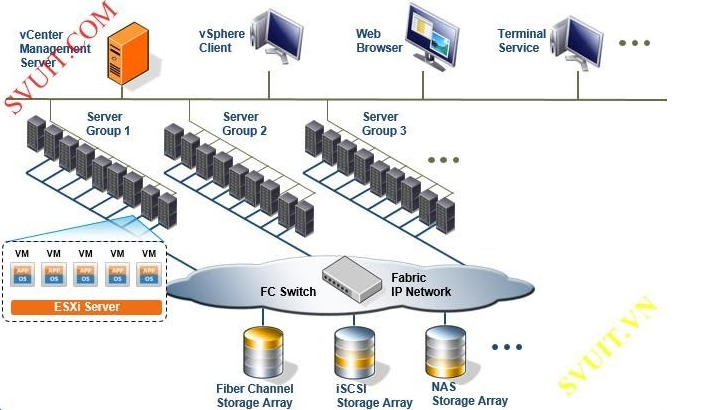
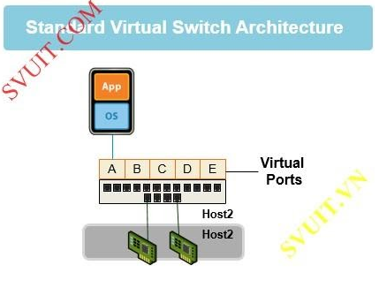
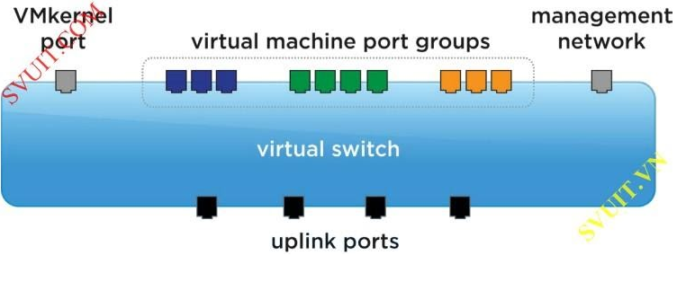

# Tìm hiểu kiến trúc của vSphere Standard Switch

### 1. Overview

- Qua các chapter và bài lab trước chúng ta đã biết cấu hình vCenter và ESXi nhưng chúng ta vẫn chưa biết tại sao vCenter và ESXi lại có thể kết nối được với nhau

<h3 align="center"></h3>

- vSphere không chỉ nổi bật nhờ công nghệ ảo hóa máy chủ, mà nó còn được đánh giá cao nhờ công nghệ ảo hóa hạ tâng Virtual Networking trong vSphere. Virtual Networking sẽ cung cấp các tính năng quan trọng như Load-balanced, HA traffic giữa các VM

- vSphere cung cấp 2 loại kiến trúc Virtual Networking chính. Tùy theo mô hình triển khai mà lựa chọn loại vSwitch nào. Thường thì kết hợp cả 2 để tận dụng các tính năng của chúng

    - Standard virtual switches: quản lý network các VM ở mức độ host. Nó được cài đặt sẵn trên vSphere
    
    - Distributed virtual switch: quản lý network các VM ở mức độ Datacenter, sử dụng để quản lý tập trung hệ thống network. Nó không có sẵn trong các version của vSphere.

<h3 align="center"></h3>  

### 2. Standard virtual switches

### 2.1. vNIC - Virtual Ethernet adapter

- Kiến trúc Virtual network của vSphere cũng giống như kiến trúc network trong môi trường vật lý. Các máy ảo cũng có card mạng, gọi là card mạng ảo (virtual NIC)

<h3 align="center"></h3>  

- Mỗi máy ảo sẽ có một hoặc nhiều card mạng ảo (vNIC), chúng cũng có MAC address, có thể cấu hình nhiều IP và đáp ứng các tiêu chuẩn giao thức Ethernet giống như 1 NIC thật, driver của card mạng ảo sẽ do VMware quyết định.

- Khi giao tiếp với bên ngoài, bạn có thể xác định được bạn đang giao tiếp với 1 VM thông qua việc kiểm tra 6 byte MAC address để nhận dạng nhà sản xuất

- vNic (card mạng ảo) là thiết bị network giao tiếp chính giữa các VMs với hạ tầng network bên dưới (cả virual và physical). Nó giống như mấy cái card Vmware ảo như Vmnet0, Vmnet1, Vmnet2… trong Vmware Workstation mà bạn hay dùng.

- Trong quá trình phát triển của mình VMware cho ra đời nhiều phiên bản, dòng Nic ảo khác nhau cho môi trường ảo như

    - Vlance một dạng card hỗ trợ cho các dòng OS cũ chỉ support 10Mbps

    - Vmxnet card hỗ trợ tối ưu hóa network cho các VMs, yêu cầu phải cài đặt driver trong Vmware Tools
    
    - Flexible là một định nghĩa card khá đặc biệt nếu sử dụng nó thì ban đầu boot và sử dụng network sẽ hoạt động như Vlance khi thiết lập vmware tools và cái đặt các driver vmware thì sẽ hoạt động ở dạng Vmxnet
    
    - E1000: tiếp theo đó là sự ra đời cho dòng Nic E1000 nó là kết quả của quá trình giả lập hoạt động cấu trúc của card Intel 82545EM Gigabit Ethernet NIC. Tuy nhiên driver của thiết bị này không có sẵn trên tất cả OS mà chỉ có trên các phiên bản từ Linux versions 2.4.19, Windows XP Professional x64 Edition và Windows Server 2003 (32-bit) trở lên. E 1000 thì không hỗ trợ jumbo frames những bản trước ESXi/ESX 4.1.
    
    - E1000e: Đây là card NIC ảo mô phổng cấu trúc hoạt động của card intel Gigabit Ethernet NIC (82574). E1000e sử dụng trên vSphere 5. Các Windows 8 và các windows server sử dụng card vNIC E1000e làm vNIC mặc định
    
    - Về sau là sự phát triển của dòng VMxnet là VMxnet2 và VMxnet3 ngoài nâng cao khả năng hiệu suất còn có một số tính năng đặc biệt khác như jumbo frames, hardware offloads… Các VM linux sử dụng vNIC là VMxnet

### 2.2. vSwitch

- Standard virtual switch (vSwitch) hoạt động như 1 switch lớp 2. Nó cũng duy trì bảng MAC và thực hiện port forwarding các packet đến đích.

- Mỗi ESXi có thể tạo tối đa 127 Virtual Switch.

- vSwitch được sử dụng trong ESXi cung cấp 2 loại networking
    
    - Virtual Machine: được sử dụng để cho các VM giao tiếp.
    
    - Vmkernel: được sử dụng cho các kết nối như: ESXi management traffic, vMotion, FT, iSCSI và NFS.

    <h3 align="center"></h3>  

    - Mỗi host sẽ có một bộ vSwitch trong bộ đó sẽ có nhiều switch ảo. Trên mỗi vSwitch sẽ có nhiều port. Ngoài port cho VMkernel dành cho host thì các port còn lại dành cho máy ảo nên còn gọi là VM port.

    - Tuy nhiên trên các vSwitch để có thể plug Nic ảo vào vSwitch chúng ta cần thiết lập nên các nhóm port (Port Group) để có thể tùy nhu cầu mà thiết lập các policy khác nhau cho các nhóm port khác nhau ( I/O, Vlan, failover…) ngoài ra để đi ra được môi trường mạng bên ngoài thì mỗi vSwitch cần có ít nhất một Nic thật hay còn gọi là uplink mỗi vSwitch có thể mang theo nhiều uplink để failover, Load Balancing (tập hợp các uplink lúc này gọi là Nic Teaming) tuy nhiên chú ý là một NC thật chỉ thuộc một vSwitch. Một số tác dụng của vSwitch như sau:
    
        - Kết nối các máy ảo trong cung một host
        
        - Kết nối giữa các máy ảo khác host với sự hỗ trợ của các uplink

        - Kết nối giữa các máy ảo và máy vật lý trong hệ thống mạng

        - Phuc vụ cho các truy cập Service console (chỉ trên ESX)

        - Phục vụ VMkernel phục vụ mục đích VMotion, iSCSI, NFS, hoặc fault tolerance logging và quản lý trên ESXi.

    - Trên mỗi vSwitch có 2 mặt
        
        - Port groups: để kết nối đến các VM với vSwitch.
        
        - Uplink port: kết nối vSwitch với physical Ethernet adpters

        <h3 align="center"></h3>

### 2.2.1 Port Group

- Port Group là một khái niệm mới trong Standard Switch.

- Virtual ports trên 1 vSwitch cung cấp các kết nối logical giữa các thiết bị virtual và physical. Bạn có thể tưởng tượng virtual port giống như các port RJ-45. Mỗi vSwitch có thể có 1016 virtual ports và 4096 ports trên tất cả vSwitch trên 1 Host.

- Port group dùng để nhóm port trong Standard Switch và chỉ có các máy ảo nào trong cùng một port group mới có thể liên lạc được với nhau.

<h3 align="center"></h3>

- Người quản trị có thể dựa trên các nhóm port group này mà cấu hình các chính sách policy, cơ chế bảo mật, quản lý traffic, performance, các tính năng khác của vSphere.

<h3 align="center"></h3>

- Có thể tạo một hoặc nhiều port group. Hình dưới đây mô tả 2 port group lớp mạng C ở 2 ESXi host khác nhau vẫn liên lạc được với nhau

<h3 align="center"></h3>

- Port group gồm

    - Vmkernel: được tạo ra để cung cấp các kết nối cho host như: VMware vMotion, IP storage, and Fault Tolerance.

    <h3 align="center"></h3>

    - Việc di chuyển các VM từ Host này đến host kia được gọi là migration.
    
    - vMotion giúp bạn Migrate VM đang chạy mà không cần phải shutdown nó. Vmkernel phải được thiết lập để đáp ứng vMotion

    <h3 align="center"></h3>

### 2.2.2. Uplink Port

- Để các máy ảo ở các host ESXi khác nhau có thể liên lạc được với nhau, thì trên mỗi ESXi host sẽ có các card vật lý – gọi là Uplink port (Physical NIC). Card này sẽ nối ra ngoài hạ tầng Network vật lý của bạn để giao tiếp với bên ngoài.

- vStandard Switch phải kết nối tới các Uplink port này để đi ra ngoài hạ tầng network vật lý.

<h3 align="center"></h3>
