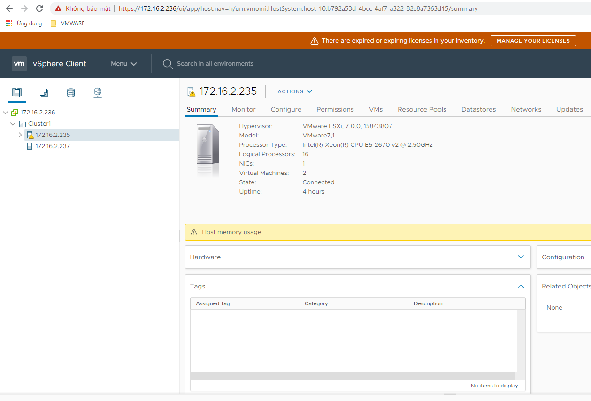
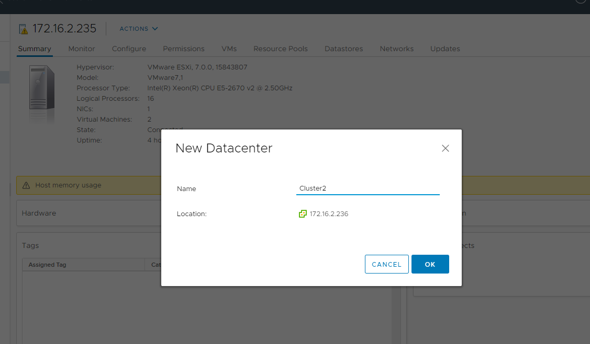
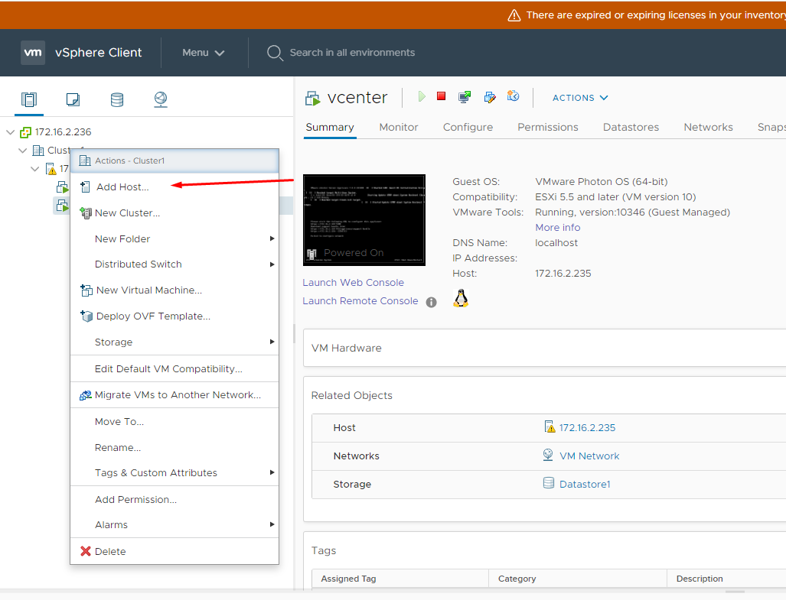
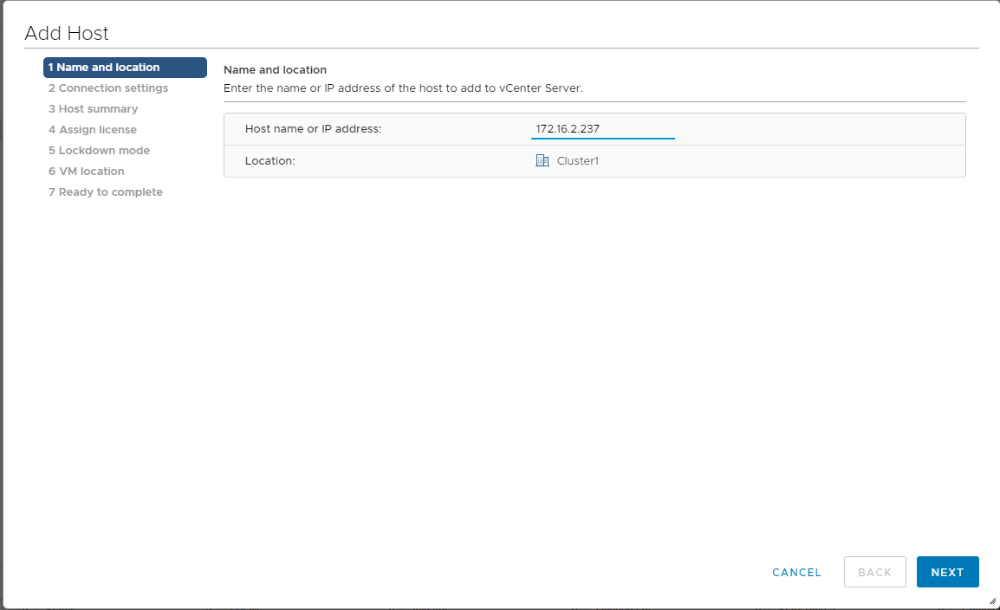
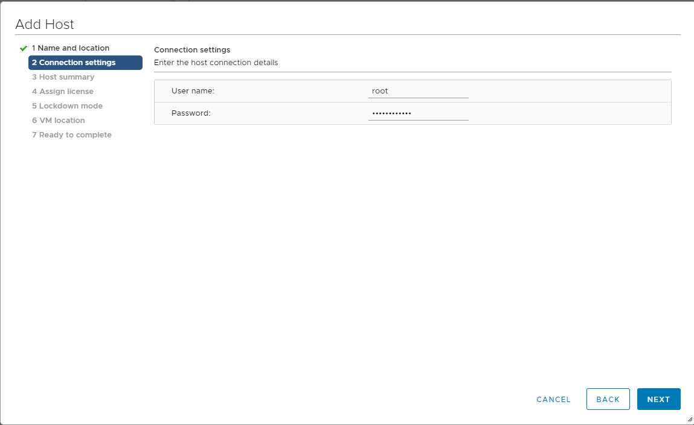
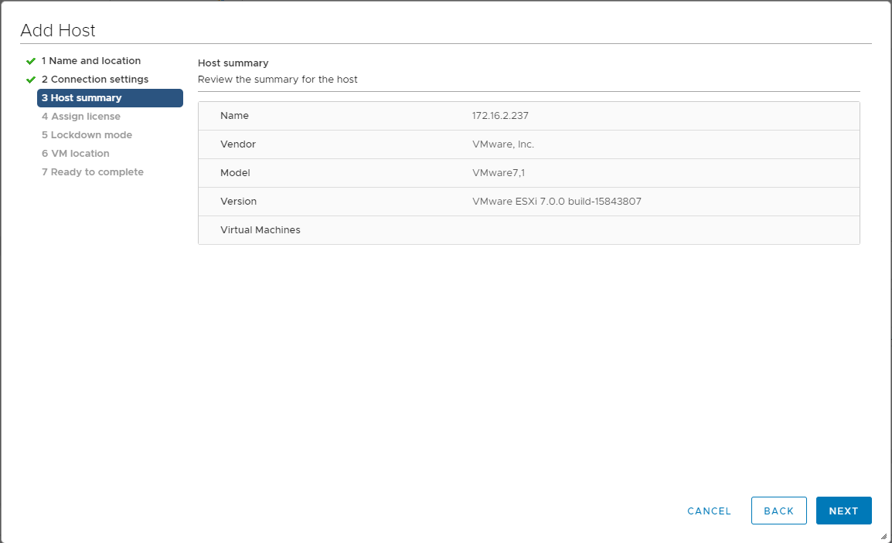
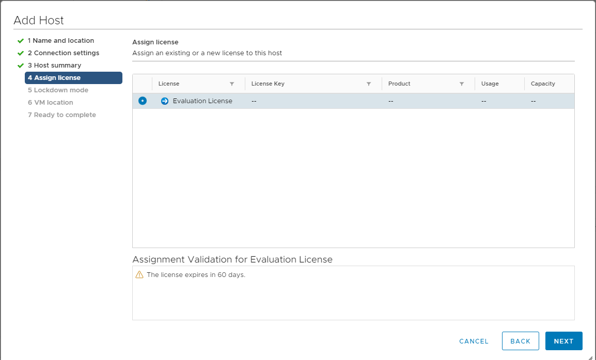
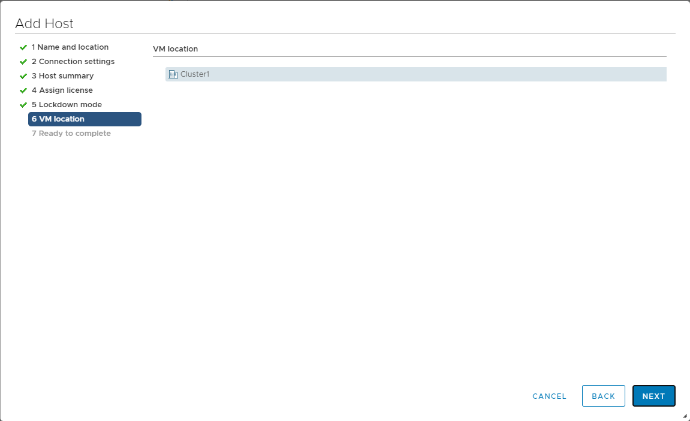
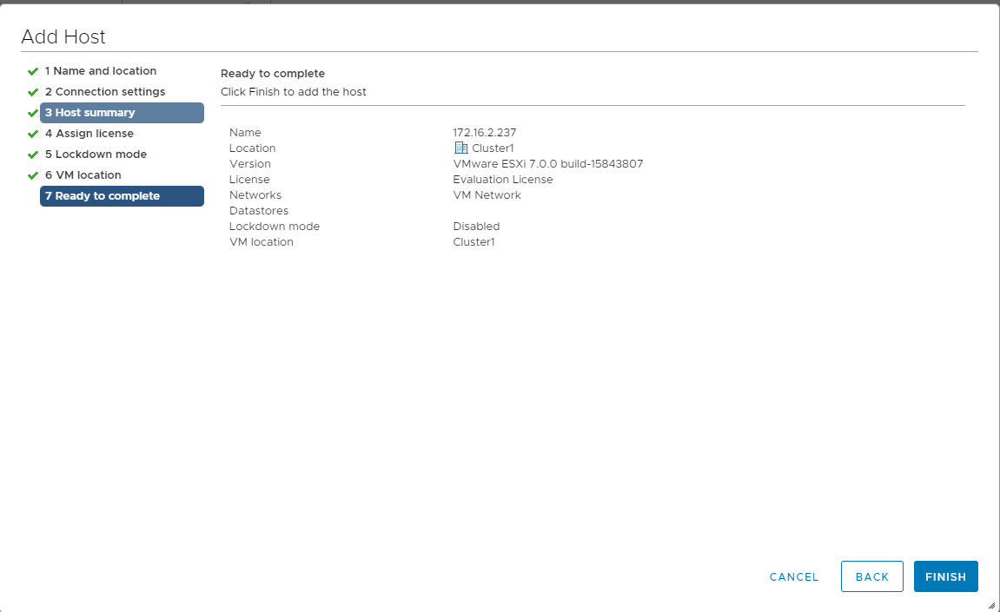
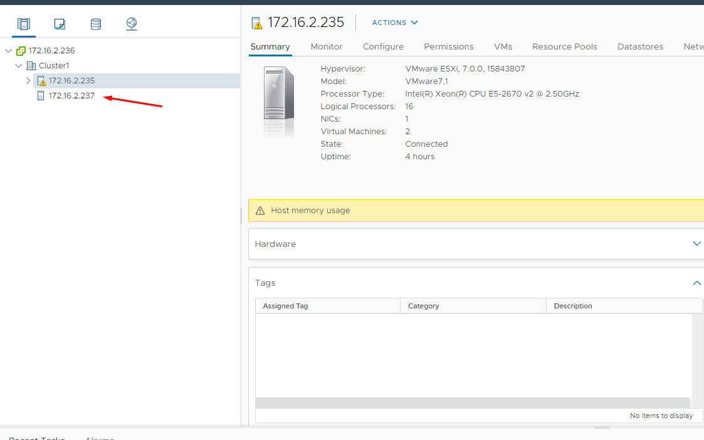

# Hướng dẫn Add các ESXi Hosts vào vCenter server 7.0

- Truy cập IP vcenter để thao tác trên GUI

<h3 align="center"></h3>

- Tạo Datacenter để quản lý các máy chủ ESXi trong cùng 1 site. Các bạn phải chuột lên VCENTER và chọn “New Datacenter”.

<h3 align="center"></h3>

- Thực hiện add host(liên kết các máy chủ vào vCenter) vào Datacenter trên vCenter server 7.0. Các bạn phải chuột lên Datacenter và chọn “Add Host” để add ESXi host vào vCenter server 7.0.

<h3 align="center"></h3>

- Nhập thông tin IP hoặc host name của Esxi1

<h3 align="center"></h3>

- Nhập thông tin user và pasword của Esxi1

<h3 align="center"></h3>

- Review lại thông tin của Esxi1

<h3 align="center"></h3>

- Phần lincense, mình chỉ lab nên phần này bỏ qua

<h3 align="center"></h3>

- Chọn location

<h3 align="center"></h3>

- Kiểm tra lại thông tin và finish

<h3 align="center"></h3>

- Sau khi finish thì chờ và kiểm tra lại host Esxi1 vừa add

<h3 align="center"></h3>
