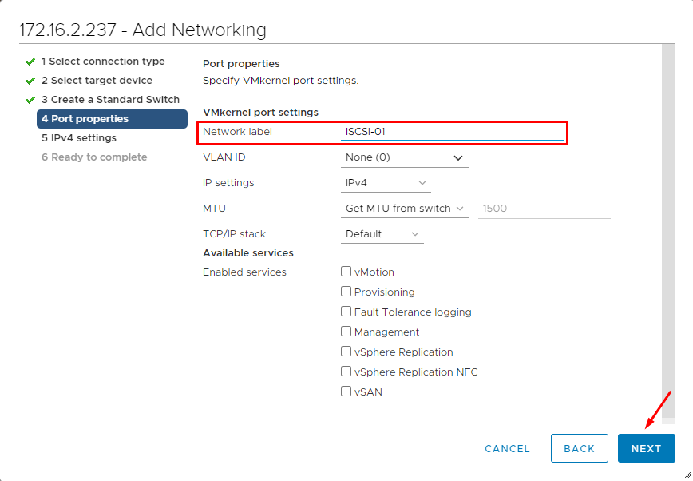
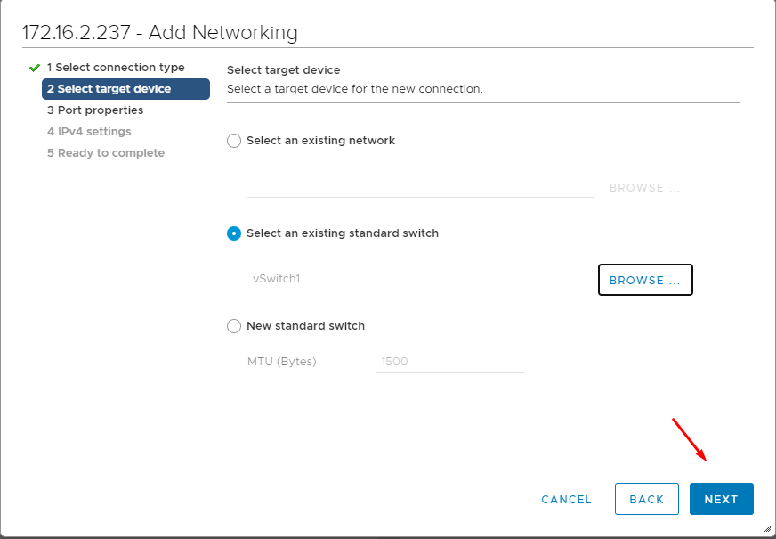
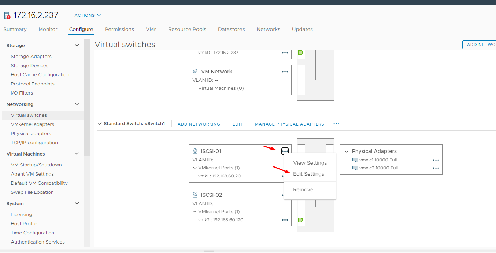
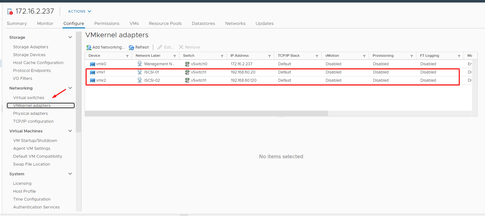
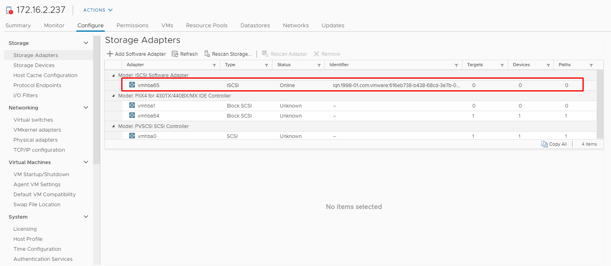
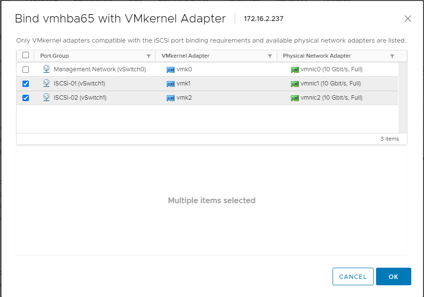
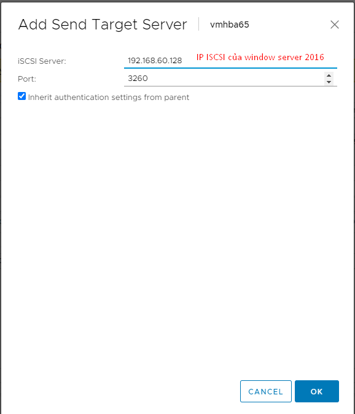
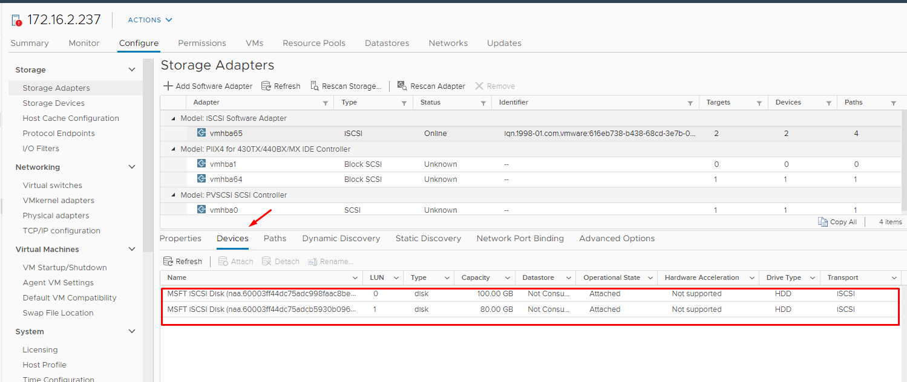

# Cấu hình máy chủ Window ISCSI cho Vcenter

### Chuẩn bị

- Chuẩn bị máy chủ window 2016 cài đặt ISCSI có 2 card mạng
- Chuẩn bị Esxi1 2 card mạng

Mô hình IP như sau:

<h3 align="center"></h3>

### Máy chủ window server 2016

#### Cài đặt iSCSI Target Server:

- Để triển khai dịch vụ, chúng ta tiến hành cài đặt Server roles iSCSI Target Server. Tại Server Roles mở rộng File and Storage Services -> File and iSCSI  Services và chọn iSCSI Target Server.

<h3 align="center"></h3>

<h3 align="center"></h3>

Sau khi cài đặt xong Server Roles, bạn chọn Close.

#### Tạo New iSCSI Virtual Disk…

- Trong Server Manager, chọn lên File and Storage Services, chọn iSCSI. Trong iSCSI Virtual Disks, chọn Tasks -> New iSCSI Virtaul Disk…

<h3 align="center"></h3>

- Tiếp theo, chọn nơi lưu trữ cho iSCSI Virtual Disk , ở đấy mình chọn ổ E

<h3 align="center"></h3>

- Đặt tên cho iSCSI Virtual Disk

<h3 align="center"></h3>

- Tiếp theo, chọn size cho iSCSI Virtual Disk. Ở đây, nếu chọn Dynamically expanding thì dung lượng của fiile ổ cứng iSCSI Virtual Disk sẽ tăng theo dung lượng mà chúng ta sử dụng và cao nhất là bằng với số dung lượng mà bạn đã chọn ở mục Size. Dynamically expanding cho phép tiết kiệm dung lượng của phân vùng chưa file iSCSI Virtual Disk khi file này chưa sử dụng đến dung lượng mà bạn khai báo ở Size.

<h3 align="center"></h3>

- Tiếp theo, tạo New iSCSI target

<h3 align="center"></h3>

- Đặt tên cho iSCSI target

<h3 align="center"></h3>

- Tiếp theo, mục Access Server chúng ta sẽ tiến hành khai báo iSCSI initiator, chọn Add.

<h3 align="center"></h3>

- Tiếp theo nhập IP Esxi dùng để cấu hình ISCSI là: 192.168.60.10, 192.168.60.111

<h3 align="center"></h3>

- Tiếp theo, bạn có thể chọn phương thức chứng thực cho kết nối từ iSCSI Initiator đến iSCSI Target. Ở đây, chúng ta bỏ qua tùy chọn này.

<h3 align="center"></h3>

- Màn hình Confirmation, cho phép bạn có cái nhìn tổng thể về những cấu hình mà bạn đã chọn. Bạn click Create để tiến hành tạo iSCSI Virtual Disk.

<h3 align="center"></h3>

- Sau khi tạo xong iSCSI Virtual Disk, bạn sẽ thấy  ổ đỉa ảo này trong thư iSCSI của Server Manager.

<h3 align="center"></h3>

Vậy là cấu hình ISCSI trên window đã hoàn tất, Tiếp theo ta sẽ cấu hình để ESXi có thể kết nối đến ISCSI,

### Cấu hình VCenter

- Kiểm tra host Esxi1 đã đủ 2 card mạng

<h3 align="center"></h3>

- Click virtual switches --> add networking

<h3 align="center"></h3>

- Chọn VMkernel Network adapter --> next

<h3 align="center"></h3>

- Chọn New standard switch để tạo mới

<h3 align="center"></h3>

- Add card mạng vào switch ảo 

<h3 align="center"></h3>

<h3 align="center"></h3>

- Đặt tên cho card mạng ảo:

<h3 align="center"></h3>

- Đặt IP cho mạng ảo

<h3 align="center"></h3>

- View lại và finish

<h3 align="center"></h3>

- Vậy là ta đã tạo thành công cho card mạng NIC1 có tên là ISCSI-01

<h3 align="center"></h3>

- Làm tương tự với NIC2 với tên là ISCSI-02

Do đã tạo swirch ảo ở NIC1 rồi nên ta chọn select an existing network và chọn vswitch1 vừa tạo

<h3 align="center"></h3>

<h3 align="center"></h3>

<h3 align="center"></h3>

- Tiến hành gán NIC cho từng card mạng ảo vừa tạo

    - NIC1

    <h3 align="center"></h3>

    <h3 align="center"></h3>

    - NIC2

    <h3 align="center"></h3>

- Kiểm tra lại VMkernel adapter các card mạng đã nhận IP

<h3 align="center"></h3>

### Kết nối host với ISCSI

- Chọn storage adapter --> add software adapter

<h3 align="center"></h3>

- Chọn add sofware ISCSI adapter

<h3 align="center"></h3>

- Như vâỵ ta đã tạo xong model ISCSI

<h3 align="center"></h3>

- Click vào model ISCSI vừa tạo và add card mạng ISCSI của Esxi

<h3 align="center"></h3>

<h3 align="center"></h3>

- Chọn dynamic discovery để kết nối đến ISCSI window server 2016

<h3 align="center"></h3>

<h3 align="center"></h3>

- Kiểm t ra lại devices đã kết nối đến ISCSI cua window server 2016

<h3 align="center"></h3>

