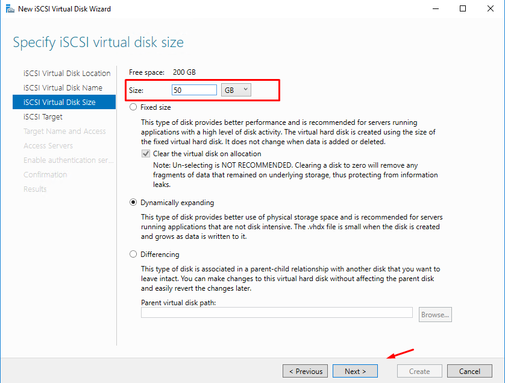
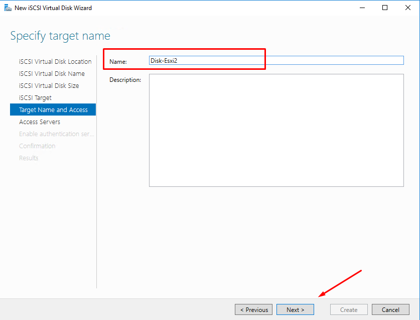
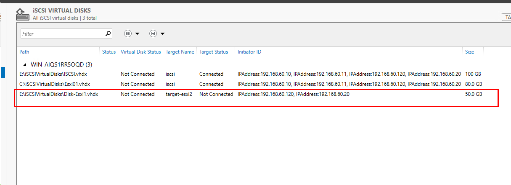

# Mapping Lun and Create Datastore in VCenter

- Ở hai bài trước

[[5]Configure Windows iSCSI Target Server for VMware vCenter or ESXi](https://github.com/phancong0897/Congphan/blob/master/Vmware/LAB/%5B5%5DConfigure%20Windows%20iSCSI%20Target%20Server%20for%20VMware%20vCenter%20or%20ESXi.md)

[[6]Configuring Multi Pathing Network for VMWare ESXi Storage Access](https://github.com/phancong0897/Congphan/blob/master/Vmware/LAB/%5B6%5DConfiguring%20Multi%20Pathing%20Network%20for%20VMWare%20ESXi%20Storage%20Access.md)

Chúng ta đã cấu hình Máy chủ Window làm ISCSI target server và cấu hình nhiều NIC của VMware vCenter kết nối đến ISCSI target, cấu hình 2 NIC để tăng khả năng chịu lỗi đường truyền.

- Giờ chứng ta sẽ tạo ổ đĩa ảo và tạo datastore trên vCenter kết nối ổ đĩa ảo.

### Tạo disk ảo hay LUN  trên ISCSI target server

- Chọn New ISCSI Virtua Disk

<h3 align="center"></h3>

- Chọn phân vùng để tạo Lun

<h3 align="center"></h3>

- Đặt tên cho Lun

<h3 align="center"></h3>

- Size Lun

<h3 align="center"></h3>

- Tạo target cho Lun

<h3 align="center"></h3>

- Đặt tên Lun

<h3 align="center"></h3>

- Add các IP kết nối đến Lun

<h3 align="center"></h3>

<h3 align="center"></h3>

<h3 align="center"></h3>

- Bỏ qua Authentication 

<h3 align="center"></h3>

- Kiểm tra lại các thông tin và Create

<h3 align="center"></h3>

- Sau khi tạo xong sẽ có Disk như hình

<h3 align="center"></h3>

### vCenter

- Truy cập vCenter kiểm tra storage adapter

<h3 align="center"></h3>

- Truy cập storage , chọn new storage

<h3 align="center"></h3>

- Chọn type, ở đây ta chọn VMFS

<h3 align="center"></h3>

- Chọn nên datatore, seletc host tạo Lun và chọn lun đã tạo ở trên

<h3 align="center"></h3>

- Chọn version VMFS 6

<h3 align="center"></h3>

- Cấu hình disk

<h3 align="center"></h3>

- Kiểm tra lại các thông tin và finish

<h3 align="center"></h3>

- Sau khi tạo xong sẽ hiển thị datastore ở mục datastore

<h3 align="center"></h3>

Như vậy chúng ta đã tạo xong datastore trên trên vCenter với disk ảo ISCSI target server.

