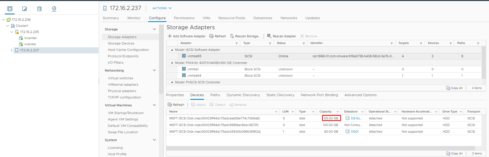
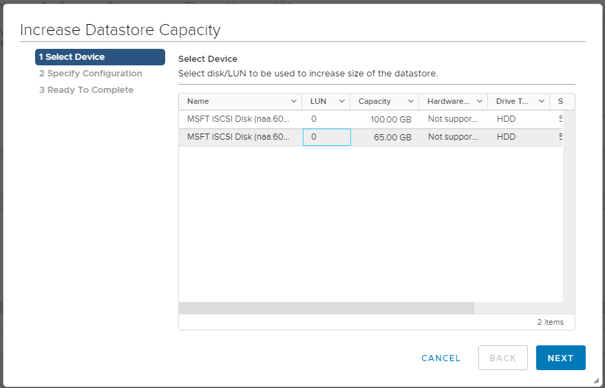
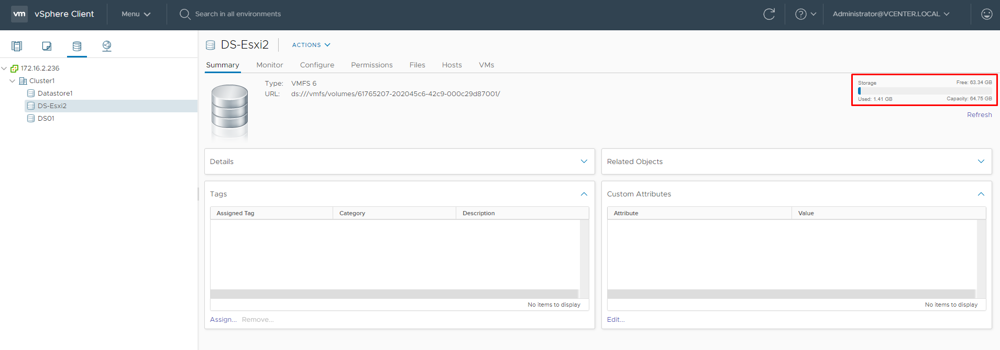

# Mở rộng dung lượng disk ảo hay Lun trên ISCSI target server

- Ở các bài trước chúng ta đã :

[1. Cài đặt ISCSI target trên Windows server 2016](https://github.com/phancong0897/Congphan/blob/master/Vmware/LAB/%5B5%5DConfigure%20Windows%20iSCSI%20Target%20Server%20for%20VMware%20vCenter%20or%20ESXi.md)

[2. Cấu hình NIC vCenter kết nối đến ISCSI target server](https://github.com/phancong0897/Congphan/blob/master/Vmware/LAB/%5B6%5DConfiguring%20Multi%20Pathing%20Network%20for%20VMWare%20ESXi%20Storage%20Access.md)

[3. Tạo disk ảo và kết nối vCenter đến disk ảo](https://github.com/phancong0897/Congphan/blob/master/Vmware/LAB/%5B7%5DMapping%20Lun%20and%20Creare%20Datastore%20in%20vCenter.md)

- Ở phần này chúng ta sẽ thao tác mở rộng dung lượng disk ảo

### Windows server 2016

- Chọn disk ảo và chọn extend ISCSI virtua disk

<h3 align="center"></h3>

- Điền dung lượng disk cần tăng

<h3 align="center"></h3>

Lưu, hiện tại disk ảo hiện có là 50Gb, nếu muốn tăng dung lượng lên là 65Gb thì ta sẽ điền vào ô là 65Gb

- Sau khi extend thành công, thì dung lượng disk ảo sẽ tăng lên

<h3 align="center"></h3>

### vCenter

- Truy cập vCenter --> storage adapter chọn refresh và để kiểm tra lại disk ảo đã cập nhật dung lượng trên vCenter hay chưa

<h3 align="center"></h3>

- Truy cập storage --> increa datastorage capacity

<h3 align="center"></h3>

- Chọn đúng disk ảo

<h3 align="center"></h3>

- Chọn next

<h3 align="center"></h3>

- Review lại và finish

<h3 align="center"></h3>

- Refresh lại và kiểm tra lại dung lượng datasotre

<h3 align="center"></h3>

