# Cách cài đặt VMWARE Esxi 7.0

### Quá trình cài đặt bắt đầu

<h3 align="center">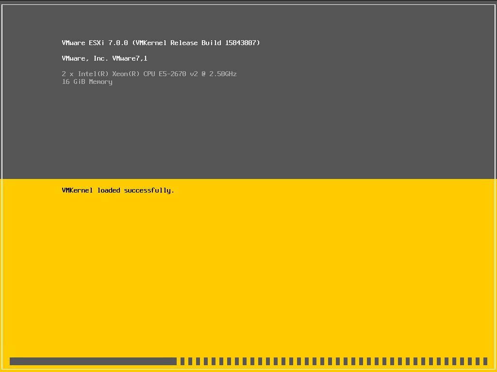</h3>

- Chọn Enter để bắt đầu quá trình cài đặt ở màn hình welcome

<h3 align="center">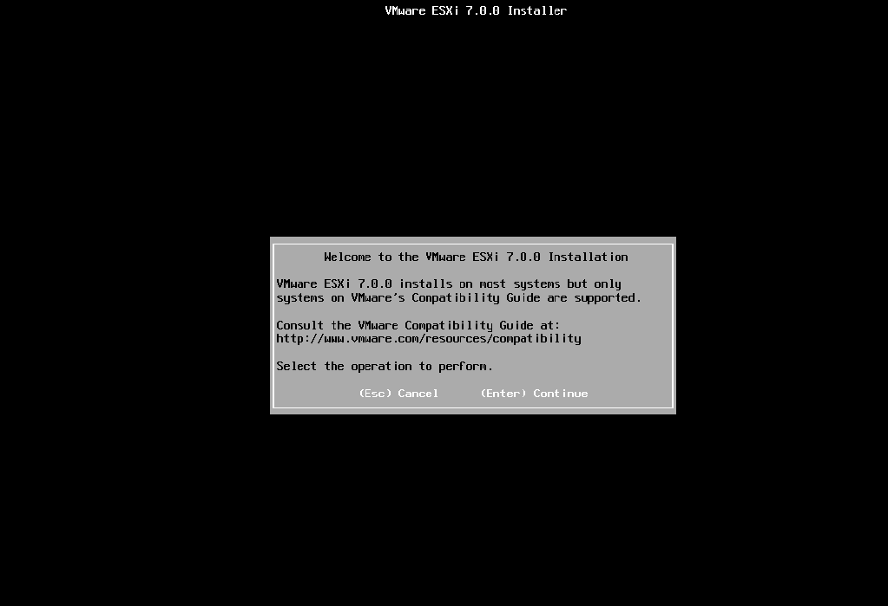</h3>

- Nhấn F11 để đồng ý với thõa thuận cấp phép từ vmware

<h3 align="center">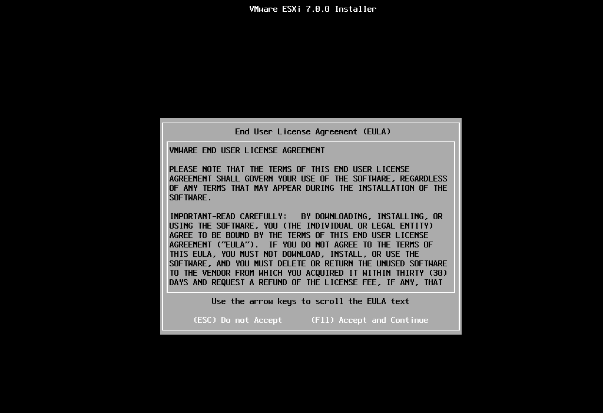</h3>

- Ở bước tiếp theo, chọn ổ đĩa ảo -->  Enter để tiếp tục

<h3 align="center">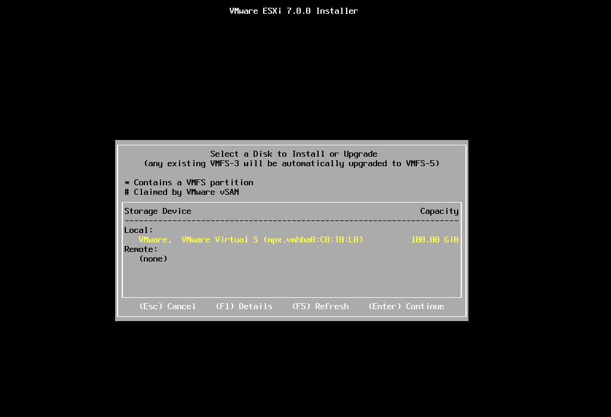</h3>

- Chọn loại bàn phím –> Enter để tiếp tục

<h3 align="center">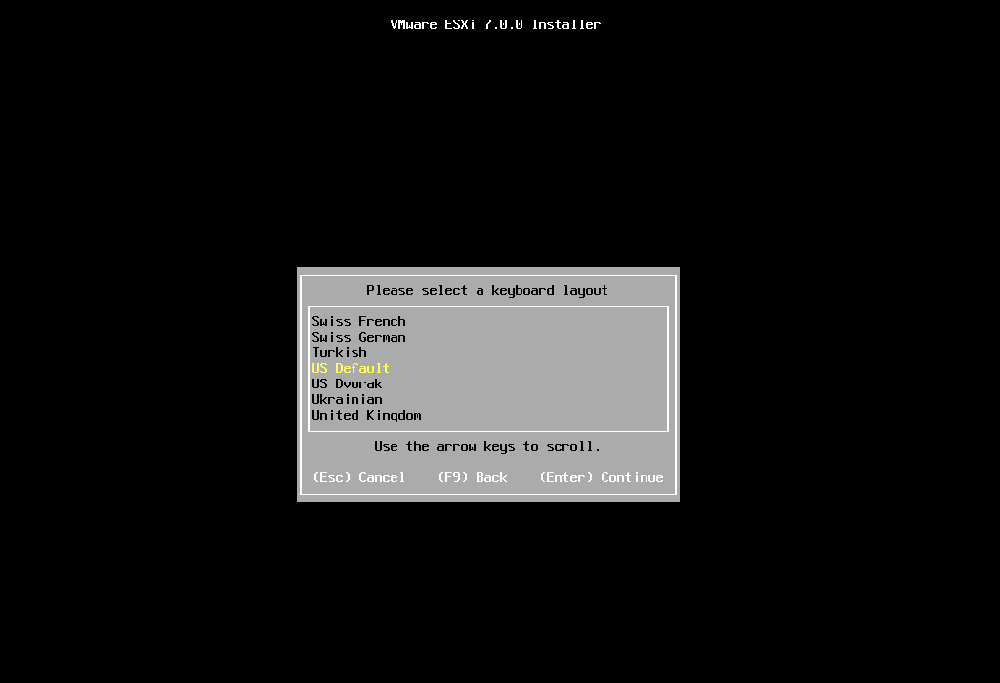</h3>

- Đặt mật khẩu cho tài khoản root –> Enter

<h3 align="center">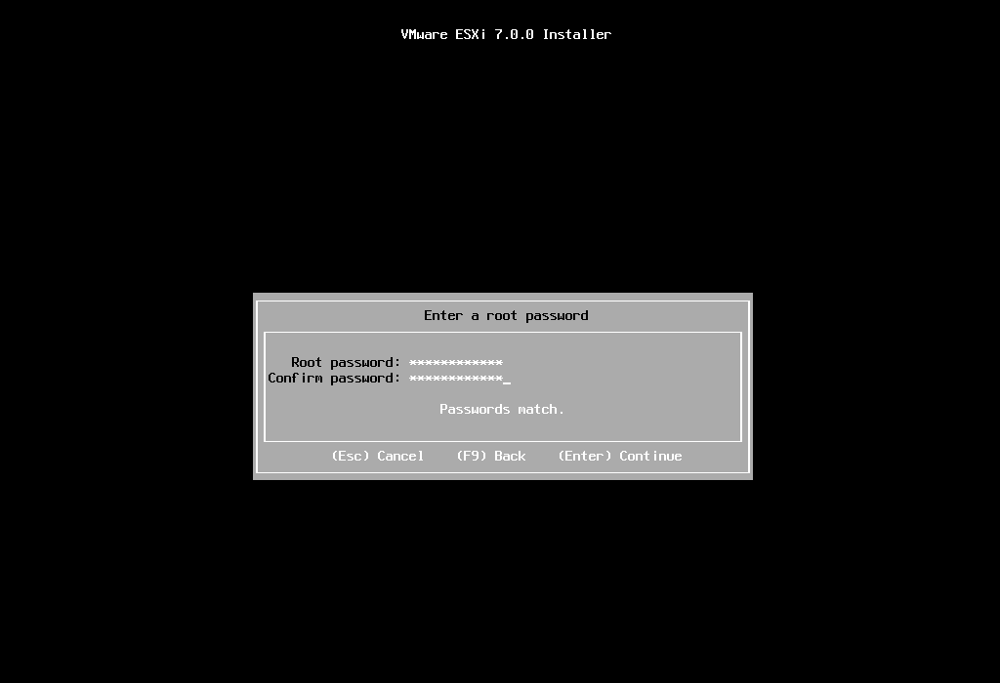</h3>

- Nhấn F11 để bắt đầu quá trình cài đặt

<h3 align="center">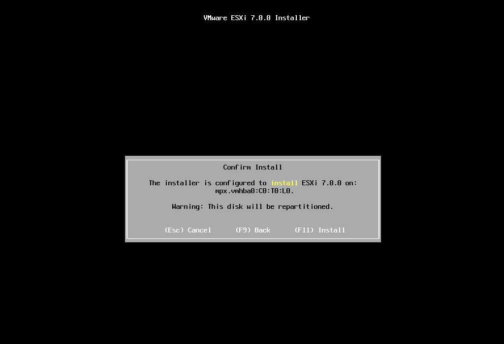</h3>

<h3 align="center">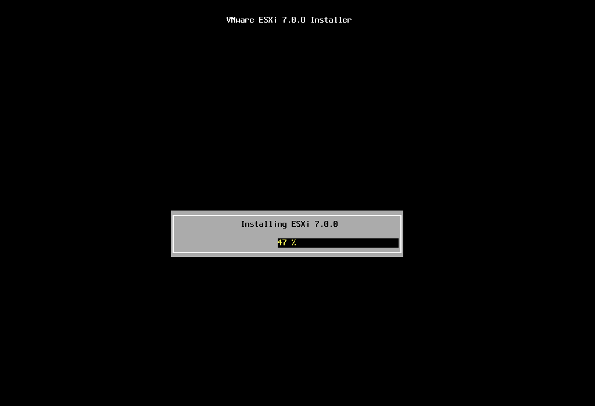</h3>

- Cài đặt thành công, nhấn Enter để reboot lại máy ảo

<h3 align="center">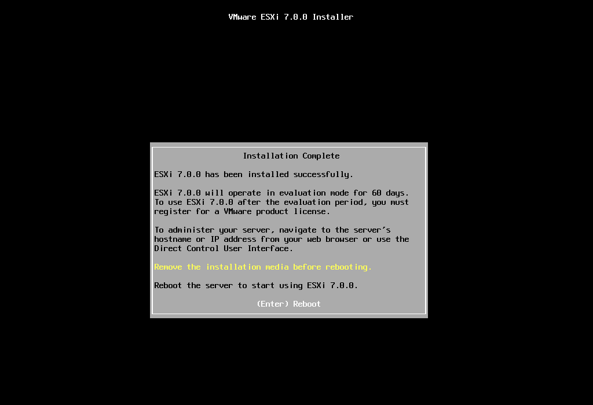</h3>

- Giao diện VMware vSphere sau khi khởi động thành công

<h3 align="center">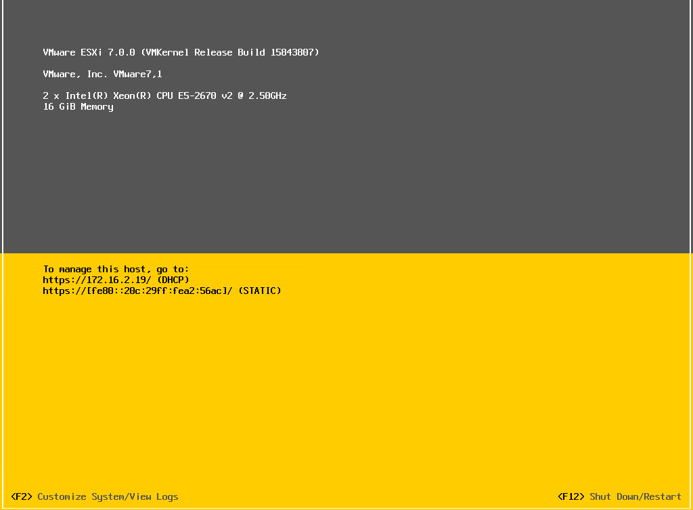</h3>

- Nhấn F2, sau đó nhập password root đã đặt trước đó để truy cập giao diện cấu hình hệ thống

<h3 align="center">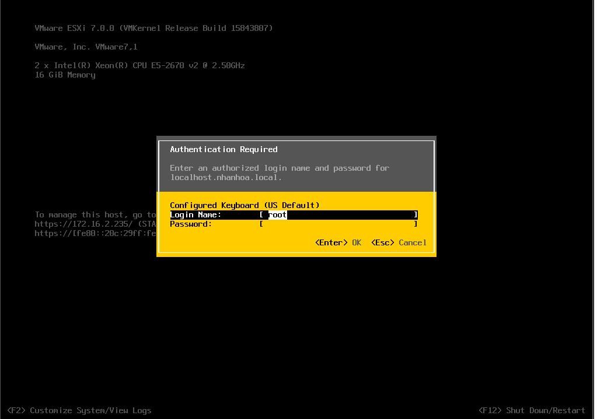</h3>

- Ở đây bạn có thể cấu hình lại network, đổi mật khẩu root và một số tính năng khác.

<h3 align="center">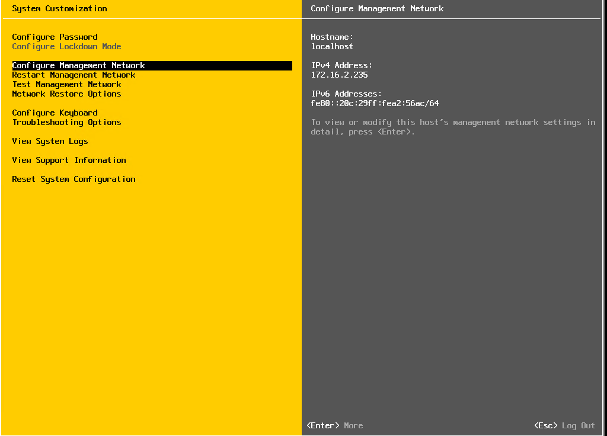</h3>

- Từ trình duyệt trên máy tính, truy cập địa chỉ của ESXi như thông tin bên dưới –> Đăng nhập với tài khoản root

<h3 align="center">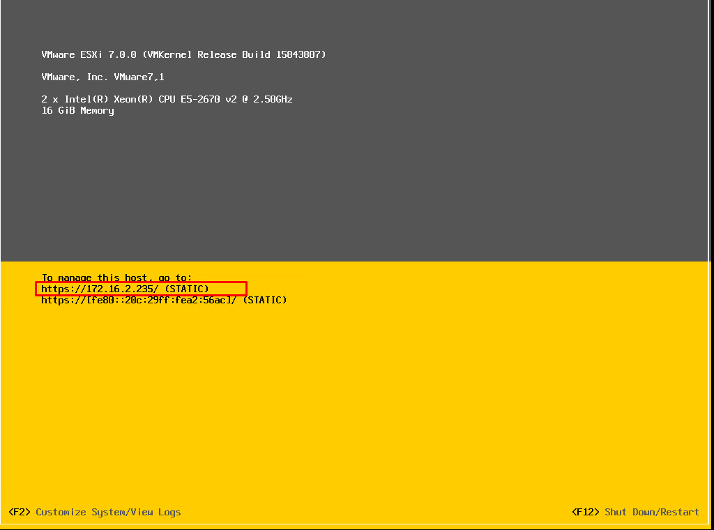</h3>

- Đây là giao diện quản lý chính, giúp người quản trị tạo và quản lý các máy ảo, quản lý network, storage và nhiều tính năng nâng cao khác.

<h3 align="center">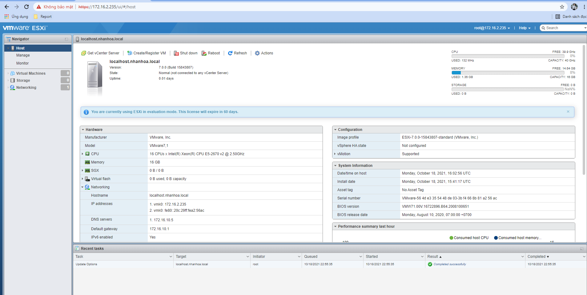</h3>

